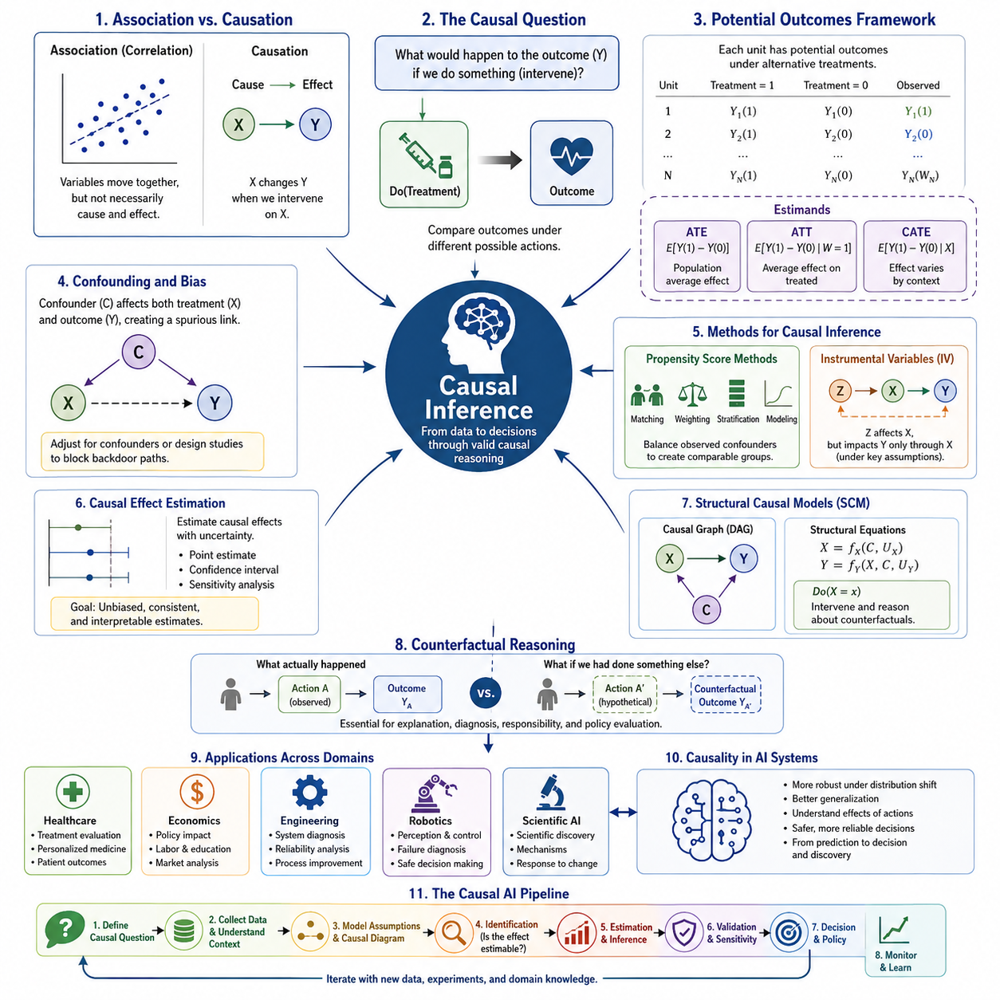
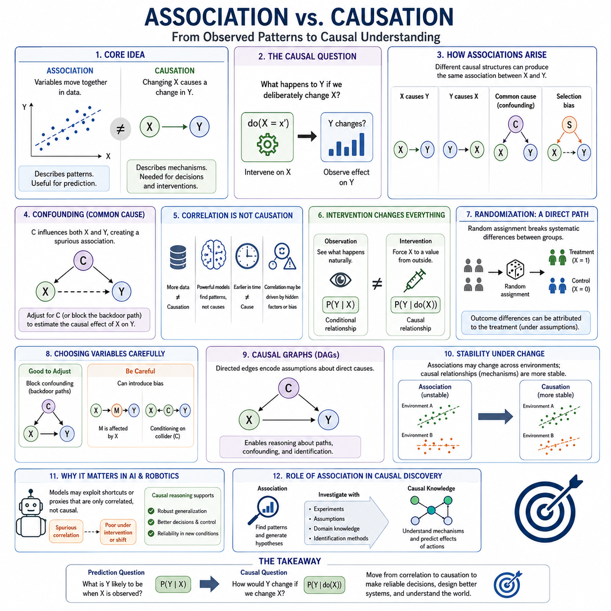
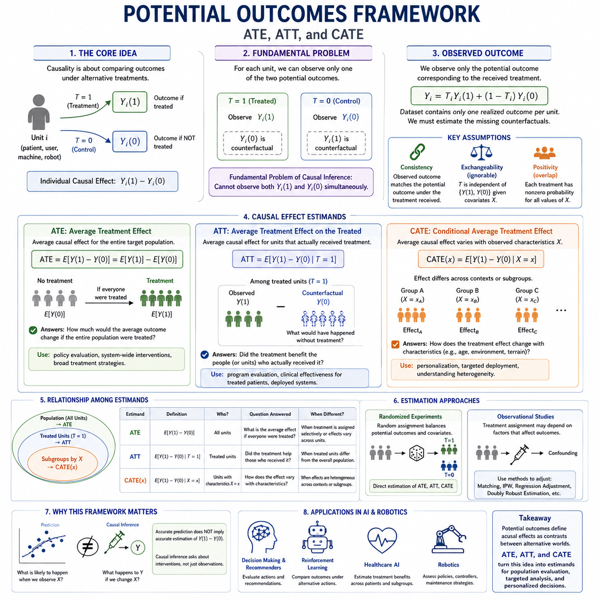
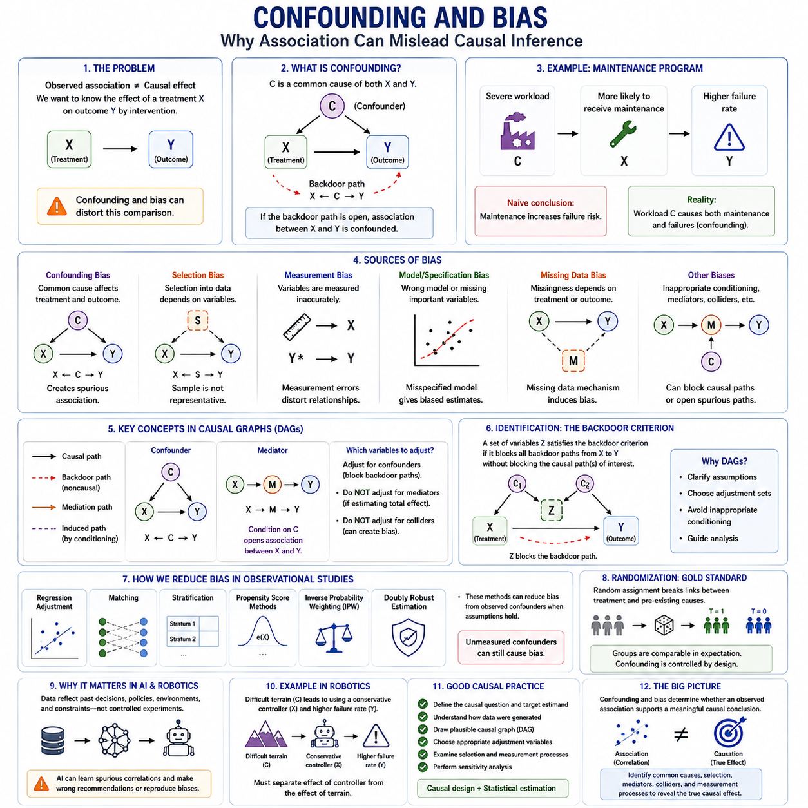
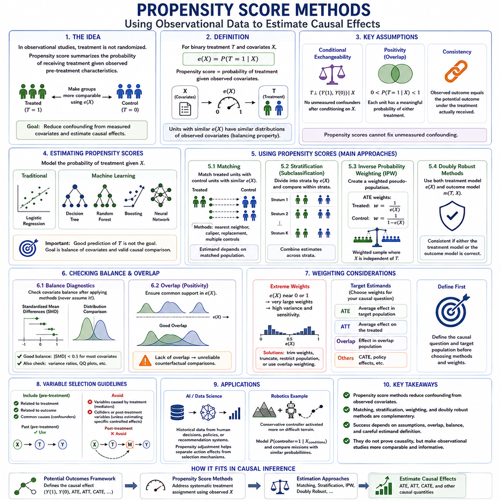
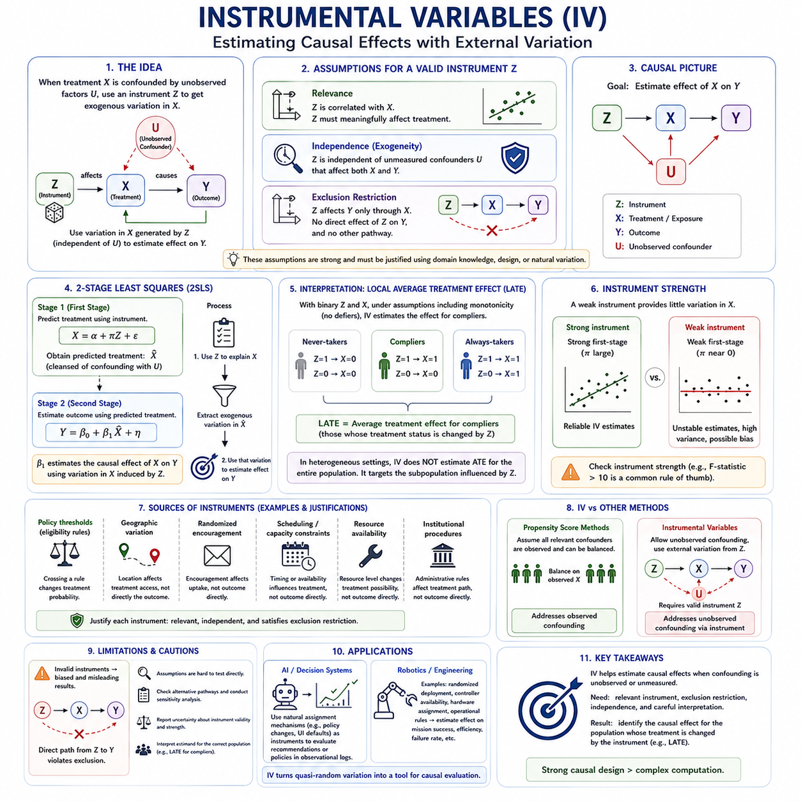
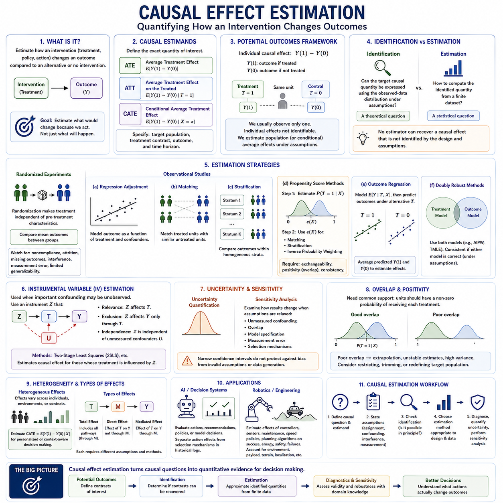
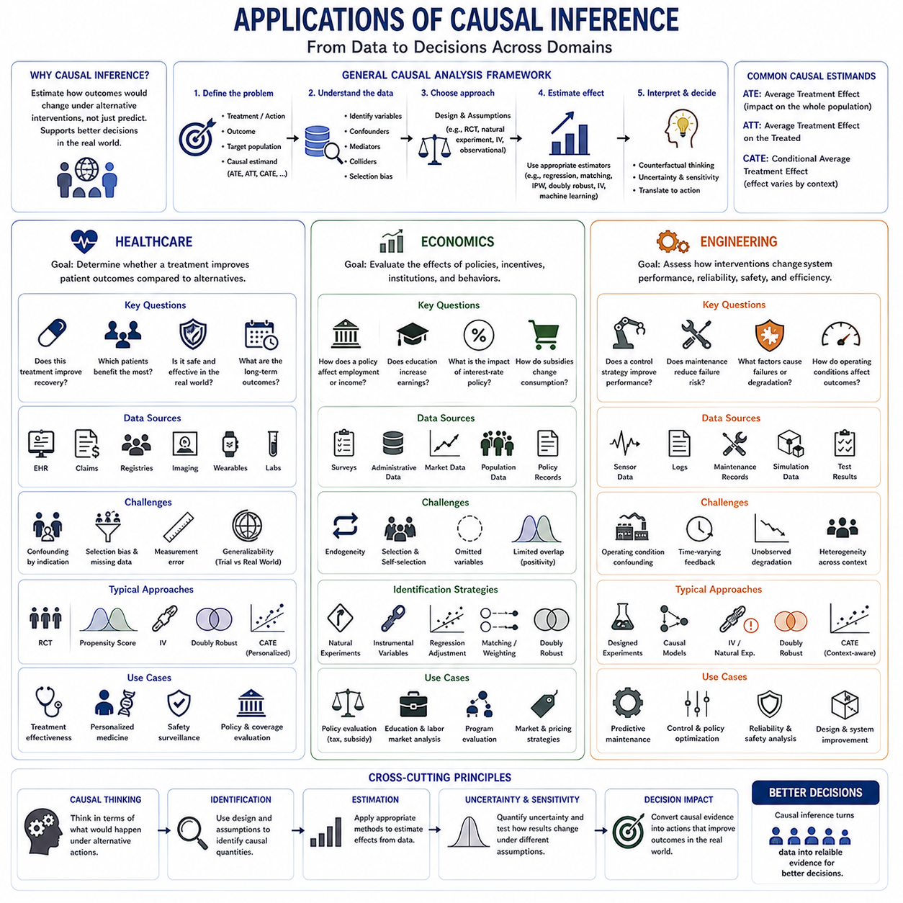
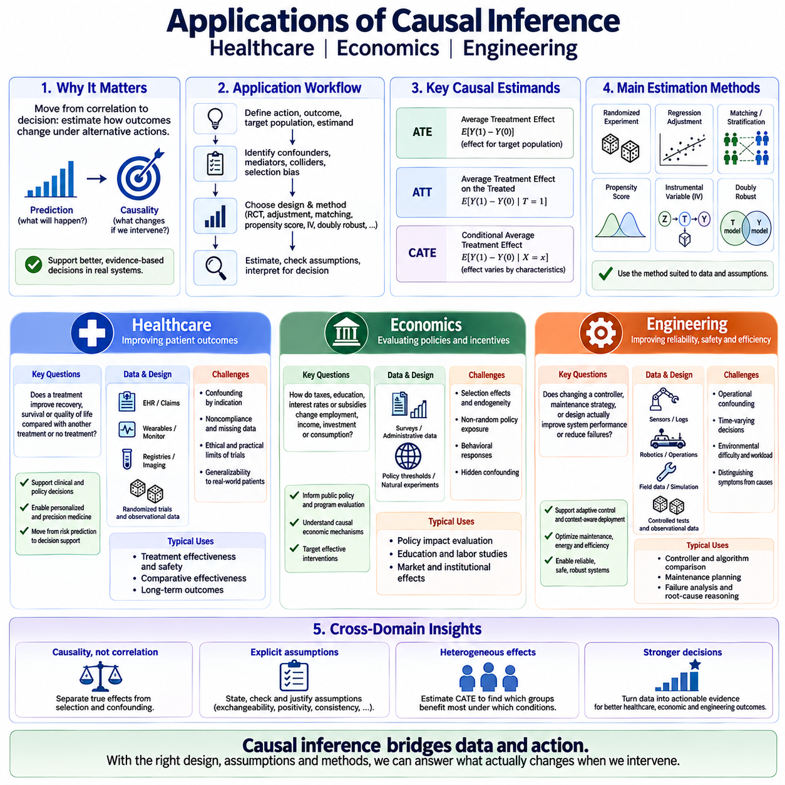

**Volume 46. Causality and Scientific AI**


# Chapter 01. Causal Inference

##  

## 01.00. Overview

{width="7.268055555555556in" height="7.268055555555556in"}

Causal inference is the discipline of reasoning about how changes in one variable produce changes in another. Unlike conventional statistical analysis, which primarily describes patterns of association in observed data, causal inference seeks to answer questions about interventions, mechanisms, and alternative actions. It therefore provides a foundation for moving from prediction toward scientific explanation and decision making.

A central distinction in causal inference is the difference between observing that two variables vary together and establishing that one variable influences the other. Correlation may arise from direct causation, reverse causation, common causes, selection effects, or coincidence. Causal analysis introduces assumptions and formal models that make these possibilities explicit rather than treating predictive association as sufficient evidence.

The fundamental causal question can often be expressed as a comparison between outcomes under different possible conditions. For example, instead of asking whether treatment and recovery are statistically associated, causal inference asks how the outcome for a population would change if treatment were actively assigned rather than withheld. This intervention-oriented perspective separates causal reasoning from ordinary conditional prediction.

One major framework represents causality through potential outcomes. Each unit is conceptually associated with outcomes corresponding to alternative treatments or interventions, although only one of those outcomes can normally be observed. This creates the fundamental problem of causal inference: the causal effect involves a comparison between factual and unobserved counterfactual outcomes that cannot simultaneously be measured for the same unit.

Because individual counterfactual outcomes are unavailable, causal studies commonly estimate effects over populations or meaningful subgroups. Average Treatment Effect (ATE), Average Treatment Effect on the Treated (ATT), and Conditional Average Treatment Effect (CATE) describe different levels of causal effect estimation. These quantities connect formal causal questions with practical evaluation of interventions and heterogeneous responses.

Confounding is one of the principal obstacles to reliable causal estimation. A confounder influences both the variable interpreted as a cause and the outcome being studied, potentially creating a misleading relationship between them. Causal inference therefore requires careful reasoning about which variables should be controlled, which should not be controlled, and whether available observations contain sufficient information for identification.

Randomized experiments provide a powerful mechanism for reducing confounding because treatment assignment can be made independent of many preexisting characteristics. However, experiments may be expensive, unethical, technically impossible, or unavailable in historical datasets. Observational causal inference consequently develops methods for approximating meaningful intervention comparisons when controlled experimentation cannot directly provide the required evidence.

Propensity score methods address observational settings by modeling the probability that a unit receives a treatment given observed characteristics. Matching, weighting, stratification, and related techniques can use this probability to construct more comparable treatment groups. Their usefulness nevertheless depends on assumptions concerning measured confounders, treatment overlap, data quality, and the correctness of the analytical design.

Instrumental variables provide another strategy when important confounding cannot be removed through ordinary adjustment. An instrument affects treatment assignment while influencing the outcome only through the treatment under appropriate assumptions. When a credible instrument exists, it can expose causal variation that would otherwise remain obscured, although finding and validating suitable instruments is often considerably harder than performing the statistical estimation itself.

Causal effect estimation is therefore not simply another prediction problem. A highly accurate predictive model may exploit correlations that disappear when the environment, policy, treatment, or operating condition changes. Causal models instead attempt to represent relationships that remain meaningful under intervention. This distinction becomes especially important when AI systems are expected to recommend actions rather than merely forecast observations.

Structural causal models extend this reasoning by representing variables and causal relationships through structural equations and directed causal graphs. Such representations make assumptions about causal direction visible and support questions involving interventions, identification, and conditional independence. Within the broader volume structure, causal inference therefore serves as the conceptual foundation for later structural causal modeling and do-calculus.

Counterfactual reasoning develops the framework further by asking what would have happened under an action different from the one actually taken. These questions are essential for explanation, responsibility, diagnosis, policy evaluation, and intelligent decision systems. Prediction concerns likely future observations, intervention concerns the consequences of deliberate actions, and counterfactual reasoning compares reality with alternative hypothetical worlds.

For artificial intelligence, causality offers a path beyond systems that primarily learn statistical regularities from large datasets. An AI system capable of distinguishing causes from correlations can potentially reason more robustly about distribution shifts, interventions, failures, and unfamiliar situations. Causal representation learning and causal deep learning seek to combine these objectives with learned representations and modern neural architectures.

Causal reasoning is particularly relevant to reinforcement learning and embodied intelligence because an agent continuously changes its environment through actions. Observations are not merely passive samples; they are partly consequences of previous decisions. Understanding whether an action caused a state transition, rather than merely preceded it, can support more transferable policies, safer exploration, improved credit assignment, and stronger reasoning about alternative actions.

In robotics and engineering, causal inference can connect sensor observations, operating conditions, control actions, component states, failures, and system-level outcomes. A robot may observe that a navigation error occurs together with wheel slip, localization uncertainty, or poor visibility, but reliable diagnosis requires determining which factors actually contribute to the failure. Causal models can organize these relationships around mechanisms and interventions.

Scientific AI extends this principle from prediction toward discovery. Scientific reasoning seeks not only models that reproduce measurements but also explanations of mechanisms, dependencies, and responses to controlled changes. Causal inference therefore forms an important bridge between machine learning and scientific methodology, complementing data-driven pattern recognition with explicit hypotheses about how systems generate observations and respond to intervention.

The broader objective is not to replace statistical learning but to combine prediction, experimentation, domain knowledge, and causal reasoning within a coherent analytical process. Associations help reveal patterns, predictive models estimate likely outcomes, experiments provide intervention evidence, and causal models organize assumptions about mechanisms. Together these capabilities support AI systems that can increasingly reason about why events occur and what actions may change them.

인과 추론(Causal Inference)은 한 변수의 변화가 다른 변수의 변화를 어떻게 발생시키는지를 추론하는 학문 분야입니다. 주로 관측된 데이터(Observed Data)의 연관성 패턴을 기술하는 전통적인 통계 분석(Statistical Analysis)과 달리, 인과 추론은 개입(Intervention), 메커니즘(Mechanism), 대안적 행동(Alternative Actions)에 관한 질문에 답하고자 합니다. 따라서 인과 추론은 예측(Prediction)을 넘어 과학적 설명(Scientific Explanation)과 의사결정(Decision Making)으로 발전하기 위한 기반을 제공합니다.

인과 추론에서 가장 핵심적인 구분 가운데 하나는 두 변수가 함께 변화한다는 사실을 관찰하는 것과 한 변수가 다른 변수에 실제로 영향을 준다는 사실을 규명하는 것의 차이입니다. 상관관계(Correlation)는 직접적인 인과관계(Direct Causation), 역인과관계(Reverse Causation), 공통 원인(Common Causes), 선택 효과(Selection Effects), 또는 우연(Coincidence)에 의해 나타날 수 있습니다. 인과 분석(Causal Analysis)은 예측적 연관성(Predictive Association)만을 충분한 증거로 간주하지 않고 이러한 가능성을 명시적으로 다루기 위한 가정(Assumptions)과 형식적 모델(Formal Models)을 도입합니다.

근본적인 인과 질문(Fundamental Causal Question)은 서로 다른 가능한 조건에서 발생하는 결과를 비교하는 형태로 표현할 수 있습니다. 예를 들어 치료(Treatment)와 회복(Recovery)이 통계적으로 연관되어 있는지를 묻는 대신, 인과 추론은 치료를 하지 않았을 때와 비교하여 치료를 적극적으로 시행했을 때 모집단(Population)의 결과가 어떻게 변화하는지를 질문합니다. 이러한 개입 중심 관점(Intervention-Oriented Perspective)은 인과적 추론을 일반적인 조건부 예측(Conditional Prediction)과 구별합니다.

인과성을 표현하는 주요 체계 가운데 하나가 잠재적 결과 프레임워크(Potential Outcomes Framework)입니다. 각각의 개체(Unit)는 개념적으로 서로 다른 처치(Treatment) 또는 개입에 대응하는 여러 잠재적 결과(Potential Outcomes)를 가지지만, 일반적으로 실제로 관찰할 수 있는 것은 그중 하나뿐입니다. 이것이 인과 추론의 근본적 문제(Fundamental Problem of Causal Inference)를 형성합니다. 즉, 인과 효과(Causal Effect)는 동일한 개체에서 동시에 측정할 수 없는 실제 결과(Factual Outcome)와 관찰되지 않은 반사실적 결과(Counterfactual Outcome)의 비교를 필요로 합니다.

개별적인 반사실적 결과(Counterfactual Outcomes)를 직접 관찰할 수 없기 때문에 인과 연구(Causal Studies)는 일반적으로 모집단 또는 의미 있는 하위 집단(Subgroups)에 대한 효과를 추정합니다. 평균 처치 효과(Average Treatment Effect, ATE), 처치 집단 평균 처치 효과(Average Treatment Effect on the Treated, ATT), 조건부 평균 처치 효과(Conditional Average Treatment Effect, CATE)는 서로 다른 수준에서 인과 효과를 추정하는 개념입니다. 이러한 측정량은 형식적인 인과 질문을 실제 개입 평가(Intervention Evaluation) 및 이질적 반응(Heterogeneous Responses)의 분석과 연결합니다.

교란(Confounding)은 신뢰할 수 있는 인과 효과 추정(Causal Estimation)을 방해하는 가장 중요한 요인 가운데 하나입니다. 교란 변수(Confounder)는 원인으로 해석되는 변수와 연구 대상 결과 모두에 영향을 주어 두 변수 사이에 오해를 불러일으키는 관계를 형성할 수 있습니다. 따라서 인과 추론에서는 어떤 변수를 통제(Control)해야 하는지, 어떤 변수는 통제하지 않아야 하는지, 그리고 이용 가능한 관측 데이터가 인과 효과의 식별(Identification)에 충분한 정보를 포함하고 있는지를 신중하게 판단해야 합니다.

무작위 실험(Randomized Experiments)은 처치 할당(Treatment Assignment)을 기존의 다양한 특성으로부터 독립적으로 만들 수 있기 때문에 교란을 감소시키는 강력한 방법을 제공합니다. 그러나 실험은 비용이 많이 들거나, 윤리적으로 허용되지 않거나, 기술적으로 불가능하거나, 과거 데이터셋(Historical Datasets)에서는 수행할 수 없는 경우가 있습니다. 따라서 관찰적 인과 추론(Observational Causal Inference)은 통제된 실험을 직접 수행할 수 없는 상황에서 의미 있는 개입 비교(Intervention Comparison)를 근사하기 위한 방법을 발전시켜 왔습니다.

성향 점수 방법(Propensity Score Methods)은 관찰 연구(Observational Studies)에서 관측된 특성을 바탕으로 특정 개체가 처치를 받을 확률을 모델링합니다. 매칭(Matching), 가중치 부여(Weighting), 층화(Stratification) 등의 방법은 이러한 확률을 이용하여 서로 비교 가능한 처치 집단(Treatment Groups)을 구성할 수 있습니다. 그러나 이러한 방법의 유효성은 측정된 교란 변수(Measured Confounders), 처치 중첩(Treatment Overlap), 데이터 품질(Data Quality), 그리고 분석 설계(Analytical Design)의 적절성에 관한 가정에 크게 의존합니다.

도구 변수(Instrumental Variables)는 중요한 교란 효과를 일반적인 조정(Adjustment)만으로 제거할 수 없을 때 사용할 수 있는 또 다른 전략입니다. 적절한 가정 아래에서 도구 변수(Instrument)는 처치 할당에는 영향을 미치지만 결과에는 해당 처치를 통해서만 영향을 미칩니다. 신뢰할 수 있는 도구 변수가 존재한다면 다른 방법으로는 확인하기 어려운 인과적 변동(Causal Variation)을 파악할 수 있지만, 적절한 도구 변수를 발견하고 그 타당성을 검증하는 것은 통계적 추정 자체보다 훨씬 어려울 수 있습니다.

따라서 인과 효과 추정(Causal Effect Estimation)은 단순히 또 하나의 예측 문제(Prediction Problem)가 아닙니다. 매우 높은 정확도를 가진 예측 모델(Predictive Model)이라도 환경(Environment), 정책(Policy), 처치(Treatment), 또는 운영 조건(Operating Conditions)이 변화하면 사라지는 상관관계에 의존할 수 있습니다. 반면 인과 모델(Causal Models)은 개입 이후에도 의미를 유지할 수 있는 관계를 표현하려고 합니다. 이러한 차이는 인공지능 시스템(AI Systems)이 단순한 관측 결과의 예측을 넘어 행동을 추천해야 할 때 특히 중요해집니다.

구조적 인과 모델(Structural Causal Models)은 변수와 인과관계를 구조 방정식(Structural Equations)과 방향성 인과 그래프(Directed Causal Graphs)를 통해 표현함으로써 이러한 추론을 확장합니다. 이러한 표현은 인과 방향(Causal Direction)에 관한 가정을 명시적으로 보여주며 개입, 식별, 조건부 독립성(Conditional Independence)에 관한 질문을 다룰 수 있게 합니다. 따라서 전체적인 구성에서 인과 추론은 이후에 다루어지는 구조적 인과 모델링(Structural Causal Modeling)과 두-계산(Do-Calculus)의 개념적 기반을 제공합니다.

반사실적 추론(Counterfactual Reasoning)은 실제로 수행된 행동과 다른 행동을 했다면 어떤 일이 발생했을지를 질문함으로써 이러한 체계를 더욱 확장합니다. 이러한 질문은 설명(Explanation), 책임성(Responsibility), 진단(Diagnosis), 정책 평가(Policy Evaluation), 지능형 의사결정 시스템(Intelligent Decision Systems)에 필수적입니다. 예측은 앞으로 관찰될 가능성이 높은 결과를 다루고, 개입은 의도적인 행동의 결과를 다루며, 반사실적 추론은 현실과 가상의 대안 세계(Alternative Hypothetical Worlds)를 비교합니다.

인공지능(Artificial Intelligence)의 관점에서 인과성(Causality)은 대규모 데이터셋에서 통계적 규칙성(Statistical Regularities)을 학습하는 시스템을 넘어설 수 있는 중요한 경로를 제공합니다. 원인과 상관관계를 구별할 수 있는 인공지능 시스템은 분포 변화(Distribution Shifts), 개입, 실패(Failures), 익숙하지 않은 상황(Unfamiliar Situations)에 대해 더욱 강건하게 추론할 가능성이 있습니다. 인과 표현 학습(Causal Representation Learning)과 인과 딥러닝(Causal Deep Learning)은 이러한 목표를 학습된 표현(Learned Representations) 및 현대적인 신경망 구조(Neural Architectures)와 결합하려고 합니다.

인과적 추론(Causal Reasoning)은 강화학습(Reinforcement Learning)과 체화 지능(Embodied Intelligence)에서 특히 중요합니다. 에이전트(Agent)는 행동(Action)을 통해 지속적으로 환경을 변화시키기 때문입니다. 관측(Observations)은 단순히 수동적으로 수집된 표본이 아니라 이전 의사결정의 결과이기도 합니다. 어떤 행동이 단순히 상태 전이(State Transition)에 앞서 발생한 것인지 아니면 실제로 그 전이를 발생시킨 것인지 이해하면 보다 전이 가능한 정책(Transferable Policies), 안전한 탐색(Safe Exploration), 향상된 신용 할당(Credit Assignment), 대안 행동에 대한 강력한 추론을 지원할 수 있습니다.

로보틱스(Robotics)와 엔지니어링(Engineering)에서 인과 추론은 센서 관측(Sensor Observations), 운영 조건(Operating Conditions), 제어 행동(Control Actions), 구성요소 상태(Component States), 고장(Failures), 시스템 수준 결과(System-Level Outcomes)를 서로 연결할 수 있습니다. 로봇은 주행 오류(Navigation Error)가 휠 슬립(Wheel Slip), 위치추정 불확실성(Localization Uncertainty), 낮은 가시성(Poor Visibility)과 함께 발생하는 것을 관찰할 수 있지만, 신뢰할 수 있는 진단을 위해서는 어떤 요인이 실제로 고장에 기여했는지를 판단해야 합니다. 인과 모델은 이러한 관계를 메커니즘과 개입을 중심으로 구조화할 수 있습니다.

과학적 인공지능(Scientific AI)은 이러한 원리를 예측에서 발견(Discovery)의 영역으로 확장합니다. 과학적 추론(Scientific Reasoning)은 단순히 측정값을 재현하는 모델뿐만 아니라 메커니즘, 의존 관계(Dependencies), 통제된 변화(Controlled Changes)에 대한 반응을 설명하는 것을 목표로 합니다. 따라서 인과 추론은 머신러닝(Machine Learning)과 과학적 방법론(Scientific Methodology)을 연결하는 중요한 다리가 되며, 데이터 기반 패턴 인식(Data-Driven Pattern Recognition)을 시스템이 관측을 생성하고 개입에 반응하는 방식에 대한 명시적인 가설과 결합합니다.

궁극적인 목표는 통계적 학습(Statistical Learning)을 대체하는 것이 아니라 예측, 실험(Experimentation), 도메인 지식(Domain Knowledge), 인과적 추론을 일관된 분석 과정(Analytical Process) 안에서 결합하는 것입니다. 연관성(Association)은 패턴을 발견하는 데 도움을 주고, 예측 모델은 가능한 결과를 추정하며, 실험은 개입에 관한 증거를 제공하고, 인과 모델은 메커니즘에 대한 가정을 체계적으로 구성합니다. 이러한 능력들이 결합될 때 인공지능 시스템은 사건이 왜 발생하는지, 그리고 어떤 행동이 그 결과를 변화시킬 수 있는지를 점차 더 깊이 추론할 수 있습니다.

##  

## 01.01. Association vs Causation

{width="7.268055555555556in" height="7.268055555555556in"}

Association describes a statistical relationship between variables, while causation describes a relationship in which changing one variable produces a change in another. Two variables may be strongly associated without either causing the other. This distinction is fundamental to causal inference because predictive patterns alone cannot determine what would happen if a system deliberately intervened on one of the variables.

Statistical association is commonly expressed through quantities such as correlation, conditional probability, regression coefficients, or mutual information. These measures characterize how observations vary together within available data. They can be extremely useful for prediction, pattern discovery, and exploratory analysis, but they do not by themselves specify the mechanism responsible for the observed relationship between variables.

Suppose a dataset shows that variable X is strongly associated with outcome Y. A predictive model may learn P(Y\|X) and accurately estimate Y when X is observed. A causal question is different: it asks what would happen to Y if X were deliberately changed. The distinction between observing X and intervening on X is therefore one of the conceptual boundaries separating statistical learning from causal inference.

An observed association can arise through several different causal structures. X may cause Y, Y may cause X, or a third variable C may influence both X and Y. Selection mechanisms, measurement procedures, feedback loops, and sampling processes may also generate statistical dependence. Consequently, identical observational correlations can sometimes be compatible with fundamentally different explanations of how the underlying system operates.

Confounding provides a particularly important example. Imagine that C influences both treatment X and outcome Y. Observational data may then show a relationship between X and Y even when part or all of that relationship originates from C. Simply increasing the amount of observational data does not automatically solve this problem, because more samples can estimate the same confounded association with greater statistical precision.

This limitation illustrates why correlation does not become causation merely because the dataset is large or the predictive model is powerful. Deep neural networks, ensemble methods, and foundation models can identify extremely complex dependencies, yet those dependencies remain observational unless additional causal assumptions or experimental information are introduced. Model capacity improves pattern learning but does not independently establish causal direction.

Reverse causation creates another difficulty. If X and Y are associated, analysts may assume that X influences Y when the actual mechanism operates primarily from Y to X. For example, a system condition may cause both a diagnostic response and subsequent corrective behavior, making the behavior appear associated with the condition. Temporal ordering can provide useful evidence, but occurring earlier does not automatically establish causation.

A causal interpretation becomes stronger when the analysis explicitly considers interventions. Instead of asking whether Y differs among naturally occurring values of X, the question becomes whether Y would change if an external action forced X to a particular value while the relevant causal structure remained otherwise intact. This intervention-oriented formulation provides the conceptual basis for the do-operator and structural causal models developed later in causal analysis.

Randomized controlled experiments offer a direct strategy for separating association from causation. Random assignment attempts to break systematic relationships between treatment and preexisting characteristics, making treatment groups comparable before intervention. Differences in outcomes can then be attributed more credibly to treatment, subject to experimental validity, compliance, measurement quality, sampling, and other assumptions concerning the study design.

Many important causal questions, however, cannot be answered through randomized experiments. Experiments may be unethical, prohibitively expensive, operationally disruptive, or physically impossible. Researchers must then work with observational data and domain knowledge, using assumptions and methods such as adjustment, matching, propensity scores, instrumental variables, natural experiments, or structural causal models to estimate causal effects.

The choice of variables to condition on is especially important. In ordinary prediction, adding informative variables can often improve accuracy. In causal inference, indiscriminate conditioning can introduce bias. Adjusting for a genuine confounder may remove a backdoor source of association, while conditioning on variables affected by treatment or on certain common effects can distort the causal relationship being estimated.

Causal graphs provide a useful language for representing these distinctions. Directed edges can encode assumptions about which variables directly influence others, allowing analysts to reason about causal paths rather than relying only on numerical correlations. A graph containing C → X, C → Y, and X → Y, for example, explicitly distinguishes the causal effect of X on Y from the noncausal association transmitted through C.

Association and causation also differ in their behavior under environmental change. Predictive relationships learned in one dataset may fail when policies, populations, operating conditions, or data-generation processes change. A feature that was previously correlated with an outcome may cease to be informative. Causal relationships that correctly represent underlying mechanisms can potentially provide more stable knowledge across such distribution shifts.

This issue is particularly important in artificial intelligence because many machine learning systems are optimized to minimize prediction error rather than discover causal structure. A model may exploit shortcuts, proxies, background features, or historically stable correlations without understanding why they predict the target. Such systems can perform impressively within their training distribution while failing unexpectedly when deployed under interventions or novel conditions.

In robotics, the distinction becomes concrete because the agent acts upon the world. A robot may observe that localization uncertainty is correlated with navigation failure, but this does not establish whether uncertainty caused the failure, whether difficult terrain caused both, or whether another sensor problem produced the observed relationship. Effective diagnosis and control require reasoning about which intervention would actually change the resulting system behavior.

Scientific AI faces the same challenge at a broader level. Discovering that two measured quantities covary may generate a hypothesis, but scientific explanation requires investigating mechanisms and testing how the system responds when relevant factors are manipulated. Association therefore provides evidence and predictive structure, while causal reasoning organizes that evidence into claims about interventions, mechanisms, and consequences.

The practical lesson is not that association is unimportant. Association is often the first signal from which causal hypotheses emerge, and predictive models can reveal structures worthy of investigation. The critical requirement is to avoid silently converting observational dependence into causal claims. Reliable causal inference combines data with experimental design, explicit assumptions, domain knowledge, identification strategies, and sensitivity analysis.

For advanced AI, mastering this distinction marks a transition from learning what tends to occur toward reasoning about why it occurs and what would happen after an action. Prediction asks what Y is likely to be when X is observed; causal inference asks how Y would change if X were changed. That conceptual shift provides the foundation for potential outcomes, confounding analysis, causal effect estimation, structural causal models, and counterfactual reasoning.

연관성(Association)은 변수들 사이의 통계적 관계(Statistical Relationship)를 설명하는 반면, 인과관계(Causation)는 한 변수를 변화시켰을 때 다른 변수의 변화가 발생하는 관계를 의미합니다. 두 변수는 어느 한쪽이 다른 쪽의 원인이 아니더라도 강한 연관성을 나타낼 수 있습니다. 이러한 구분은 예측적 패턴(Predictive Patterns)만으로는 시스템이 특정 변수에 의도적으로 개입했을 때 어떤 일이 발생할지를 판단할 수 없다는 점에서 인과 추론(Causal Inference)의 기본적인 출발점이 됩니다.

통계적 연관성(Statistical Association)은 일반적으로 상관관계(Correlation), 조건부 확률(Conditional Probability), 회귀 계수(Regression Coefficients), 상호 정보량(Mutual Information) 등의 측정값으로 표현됩니다. 이러한 측정값은 이용 가능한 데이터 안에서 관측값들이 어떻게 함께 변화하는지를 나타냅니다. 예측(Prediction), 패턴 발견(Pattern Discovery), 탐색적 분석(Exploratory Analysis)에 매우 유용하지만, 관측된 변수 관계를 발생시키는 메커니즘(Mechanism) 자체를 규정하지는 않습니다.

어떤 데이터셋에서 변수 X가 결과 Y와 강하게 연관되어 있다고 가정해 보겠습니다. 예측 모델(Predictive Model)은 P(Y\|X)를 학습하여 X가 관측되었을 때 Y를 높은 정확도로 추정할 수 있습니다. 그러나 인과적 질문(Causal Question)은 다릅니다. 이는 X를 의도적으로 변화시켰을 때 Y에 어떤 일이 발생할지를 묻습니다. 따라서 X를 관측하는 것과 X에 개입(Intervention)하는 것의 차이는 통계적 학습(Statistical Learning)과 인과 추론을 구분하는 핵심적인 개념적 경계입니다.

관측된 연관성(Observed Association)은 여러 가지 서로 다른 인과 구조(Causal Structures)에서 발생할 수 있습니다. X가 Y의 원인일 수도 있고, Y가 X의 원인일 수도 있으며, 제3의 변수 C가 X와 Y 모두에 영향을 줄 수도 있습니다. 선택 메커니즘(Selection Mechanisms), 측정 절차(Measurement Procedures), 피드백 루프(Feedback Loops), 표본추출 과정(Sampling Processes) 역시 통계적 의존성(Statistical Dependence)을 만들어낼 수 있습니다. 따라서 동일한 관측 상관관계가 근본적으로 서로 다른 시스템 작동 원리와 양립할 수도 있습니다.

교란(Confounding)은 특히 중요한 사례를 제공합니다. C가 처치 X와 결과 Y 모두에 영향을 준다고 가정해 보겠습니다. 이 경우 관측 데이터에서는 X와 Y 사이의 관계가 나타날 수 있지만, 그 관계의 일부 또는 전부가 실제로는 C에서 비롯될 수 있습니다. 단순히 관측 데이터의 양을 증가시키는 것만으로 이러한 문제가 자동으로 해결되지는 않습니다. 더 많은 표본은 동일하게 교란된 연관성을 더 높은 통계적 정밀도(Statistical Precision)로 추정할 뿐일 수도 있기 때문입니다.

이러한 한계는 데이터셋이 매우 크거나 예측 모델이 강력하다는 이유만으로 상관관계(Correlation)가 인과관계(Causation)가 되지 않는다는 사실을 보여줍니다. 심층 신경망(Deep Neural Networks), 앙상블 방법(Ensemble Methods), 파운데이션 모델(Foundation Models)은 매우 복잡한 의존 관계를 발견할 수 있지만, 추가적인 인과적 가정(Causal Assumptions)이나 실험 정보(Experimental Information)가 도입되지 않는다면 이러한 관계는 여전히 관찰적 관계(Observational Relationships)에 머뭅니다. 모델 용량(Model Capacity)의 증가는 패턴 학습 능력을 향상시키지만 그 자체로 인과 방향(Causal Direction)을 확립하지는 못합니다.

역인과관계(Reverse Causation)는 또 다른 어려움을 발생시킵니다. X와 Y가 연관되어 있다면 분석자는 X가 Y에 영향을 준다고 생각할 수 있지만, 실제 메커니즘은 주로 Y에서 X로 작동할 수도 있습니다. 예를 들어 어떤 시스템 상태(System Condition)가 진단 반응(Diagnostic Response)과 이후의 교정 행동(Corrective Behavior)을 모두 유발하여 그 행동이 시스템 상태와 연관된 것처럼 나타날 수 있습니다. 시간적 순서(Temporal Ordering)는 유용한 증거를 제공하지만, 먼저 발생했다는 사실만으로 인과관계가 성립하는 것은 아닙니다.

분석에서 개입(Intervention)을 명시적으로 고려하면 인과적 해석(Causal Interpretation)은 더욱 강해집니다. 자연적으로 발생한 X의 값에 따라 Y가 어떻게 달라지는지를 묻는 대신, 관련된 인과 구조가 다른 측면에서는 그대로 유지되는 상황에서 외부 행동이 X를 특정 값으로 강제한다면 Y가 변화할지를 질문합니다. 이러한 개입 중심의 표현(Intervention-Oriented Formulation)은 이후 인과 분석에서 다루게 될 두-연산자(Do-Operator)와 구조적 인과 모델(Structural Causal Models)의 개념적 기반을 제공합니다.

무작위 대조 실험(Randomized Controlled Experiments)은 연관성과 인과관계를 구분하기 위한 직접적인 전략을 제공합니다. 무작위 할당(Random Assignment)은 처치와 기존 특성 사이의 체계적인 관계를 끊어 개입 이전의 처치 집단들을 비교 가능한 상태로 만들고자 합니다. 이후 결과의 차이는 연구 설계(Study Design)의 실험적 타당성(Experimental Validity), 순응도(Compliance), 측정 품질(Measurement Quality), 표본추출(Sampling) 등에 관한 가정이 충족된다면 처치의 영향으로 보다 신뢰성 있게 해석할 수 있습니다.

그러나 많은 중요한 인과적 질문은 무작위 실험(Randomized Experiments)을 통해 해결할 수 없습니다. 실험이 윤리적으로 허용되지 않거나, 지나치게 많은 비용이 필요하거나, 운영에 심각한 영향을 주거나, 물리적으로 불가능할 수 있기 때문입니다. 따라서 연구자는 관측 데이터(Observational Data)와 도메인 지식(Domain Knowledge)을 이용하면서 조정(Adjustment), 매칭(Matching), 성향 점수(Propensity Scores), 도구 변수(Instrumental Variables), 자연 실험(Natural Experiments), 구조적 인과 모델 등의 가정과 방법을 통해 인과 효과(Causal Effects)를 추정해야 합니다.

어떤 변수를 조건화(Conditioning)할 것인지 선택하는 것은 특히 중요합니다. 일반적인 예측에서는 유용한 변수를 추가하면 정확도가 향상되는 경우가 많습니다. 그러나 인과 추론에서는 무분별한 조건화가 오히려 편향(Bias)을 발생시킬 수 있습니다. 실제 교란 변수(Confounder)를 조정하면 뒷문 경로(Backdoor Path)를 통해 발생하는 연관성을 제거할 수 있지만, 처치의 영향을 받은 변수나 특정 공통 결과(Common Effects)에 조건화하면 추정하려는 인과관계가 왜곡될 수 있습니다.

인과 그래프(Causal Graphs)는 이러한 차이를 표현하는 데 유용한 언어를 제공합니다. 방향성 간선(Directed Edges)을 이용하여 어떤 변수가 다른 변수에 직접 영향을 미치는지에 대한 가정을 표현할 수 있으므로 분석자는 단순한 수치적 상관관계가 아니라 인과 경로(Causal Paths)를 중심으로 추론할 수 있습니다. 예를 들어 C → X, C → Y, X → Y를 포함하는 그래프는 X가 Y에 미치는 인과 효과와 C를 통해 전달되는 비인과적 연관성(Noncausal Association)을 명시적으로 구분합니다.

연관성과 인과관계는 환경 변화(Environmental Change)에 대한 동작에서도 차이를 보입니다. 하나의 데이터셋에서 학습된 예측 관계는 정책(Policies), 모집단(Populations), 운영 조건(Operating Conditions), 데이터 생성 과정(Data-Generation Processes)이 변화하면 더 이상 성립하지 않을 수 있습니다. 이전에 결과와 상관관계를 보였던 특징(Feature)이 새로운 환경에서는 유용한 정보를 제공하지 못할 수도 있습니다. 반면 기반 메커니즘(Underlying Mechanisms)을 올바르게 표현하는 인과관계는 이러한 분포 변화(Distribution Shifts)에서도 보다 안정적인 지식을 제공할 가능성이 있습니다.

이 문제는 많은 머신러닝 시스템(Machine Learning Systems)이 인과 구조(Causal Structure)를 발견하는 것이 아니라 예측 오류(Prediction Error)를 최소화하도록 최적화된다는 점에서 인공지능(Artificial Intelligence)에 특히 중요합니다. 모델은 목표를 예측하는 이유를 이해하지 못하면서 지름길(Shortcuts), 대리 변수(Proxies), 배경 특징(Background Features), 과거에 안정적이었던 상관관계를 활용할 수 있습니다. 이러한 시스템은 훈련 분포(Training Distribution) 안에서는 뛰어난 성능을 보이면서도 개입이나 새로운 조건에서는 예상하지 못한 방식으로 실패할 수 있습니다.

로보틱스(Robotics)에서는 에이전트(Agent)가 실제 세계에 행동을 가하기 때문에 이러한 구분이 더욱 구체적으로 나타납니다. 로봇은 위치추정 불확실성(Localization Uncertainty)이 주행 실패(Navigation Failure)와 상관되어 있음을 관찰할 수 있지만, 이것만으로 불확실성이 실패를 일으켰는지, 어려운 지형(Difficult Terrain)이 두 현상을 모두 발생시켰는지, 또는 다른 센서 문제(Sensor Problem)가 관측된 관계를 만들어냈는지를 알 수 없습니다. 효과적인 진단(Diagnosis)과 제어(Control)를 위해서는 어떤 개입이 실제 시스템 행동을 변화시키는지를 추론해야 합니다.

과학적 인공지능(Scientific AI) 역시 더 넓은 수준에서 동일한 문제에 직면합니다. 측정된 두 물리량이 함께 변화한다는 사실을 발견하면 하나의 가설(Hypothesis)을 만들 수 있지만, 과학적 설명(Scientific Explanation)을 위해서는 메커니즘을 조사하고 관련 요인을 조작했을 때 시스템이 어떻게 반응하는지를 검증해야 합니다. 따라서 연관성은 증거(Evidence)와 예측 구조(Predictive Structure)를 제공하고, 인과적 추론(Causal Reasoning)은 그러한 증거를 개입, 메커니즘, 결과에 관한 주장으로 체계화합니다.

실용적인 교훈은 연관성이 중요하지 않다는 것이 아닙니다. 연관성은 인과적 가설(Causal Hypotheses)이 등장하는 최초의 신호가 되는 경우가 많으며, 예측 모델은 추가적인 조사가 필요한 구조를 발견할 수 있습니다. 중요한 것은 관찰된 의존 관계(Observational Dependence)를 아무런 검증 없이 인과적 주장(Causal Claims)으로 바꾸지 않는 것입니다. 신뢰할 수 있는 인과 추론은 데이터와 함께 실험 설계(Experimental Design), 명시적인 가정(Explicit Assumptions), 도메인 지식, 식별 전략(Identification Strategies), 민감도 분석(Sensitivity Analysis)을 결합합니다.

고도화된 인공지능(Advanced AI)에서 이러한 차이를 이해하는 것은 무엇이 발생하는지를 학습하는 단계에서 왜 그것이 발생하며 행동 이후에는 무엇이 달라지는지를 추론하는 단계로의 전환을 의미합니다. 예측(Prediction)은 X가 관측되었을 때 Y가 무엇일 가능성이 높은지를 질문하지만, 인과 추론은 X를 변화시켰을 때 Y가 어떻게 달라지는지를 질문합니다. 이러한 개념적 전환은 잠재적 결과(Potential Outcomes), 교란 분석(Confounding Analysis), 인과 효과 추정(Causal Effect Estimation), 구조적 인과 모델, 반사실적 추론(Counterfactual Reasoning)의 기반을 제공합니다.

##  

## 01.02. Potential Outcomes Framework

{width="7.268055555555556in" height="7.268055555555556in"}

The Potential Outcomes Framework provides a formal language for defining causal effects by comparing outcomes that could occur under alternative treatments or interventions. For each unit, such as a patient, customer, machine, or robot, the framework considers multiple possible outcomes corresponding to different treatment conditions. Causality is defined through the contrast between these potential outcomes rather than through observed association alone.

For a binary treatment, let T = 1 indicate treatment and T = 0 indicate control. Each unit i is associated with two potential outcomes: Yᵢ(1), the outcome that would occur if the unit received treatment, and Yᵢ(0), the outcome that would occur without treatment. The individual causal effect is therefore Yᵢ(1) − Yᵢ(0), representing how the intervention would change the outcome for that particular unit.

The central difficulty is that only one potential outcome can normally be observed for each unit. If a patient receives treatment, Yᵢ(1) may be observed, but Yᵢ(0) remains counterfactual. If the patient receives no treatment, the opposite occurs. This impossibility of simultaneously observing both outcomes is known as the Fundamental Problem of Causal Inference and motivates statistical estimation over populations.

Observed outcomes can be expressed as Yᵢ = TᵢYᵢ(1) + (1 − Tᵢ)Yᵢ(0). This equation emphasizes that the dataset contains only the potential outcome corresponding to the treatment actually received. Causal inference must therefore reconstruct meaningful comparisons between observed and missing counterfactual outcomes using experimental design, assumptions, matching, weighting, modeling, or other identification strategies.

A key assumption is consistency, which connects the observed outcome to the corresponding potential outcome under the treatment actually received. Another important idea is treatment exchangeability, often expressed as independence between treatment assignment and potential outcomes after conditioning on relevant covariates. Positivity additionally requires that each treatment option has a nonzero probability within the populations for which causal effects are estimated.

The Average Treatment Effect, or ATE, summarizes the expected causal effect of treatment across the overall target population. It is commonly written as ATE = E[Y(1) − Y(0)] = E[Y(1)] − E[Y(0)]. Rather than describing the effect on a specific individual, ATE answers a population-level question: how much would the average outcome change if the entire population were treated instead of untreated?

ATE is especially useful for evaluating broad policies, treatments, operational strategies, and system-wide interventions. A healthcare study may estimate the average benefit of a therapy across an eligible population, while an engineering analysis may estimate the average reduction in component failure under a new maintenance strategy. Its interpretation depends strongly on the population over which the expectation is defined.

The Average Treatment Effect on the Treated, or ATT, focuses specifically on units that actually received treatment. It can be written as ATT = E[Y(1) − Y(0) \| T = 1]. For treated units, Y(1) is observed, while Y(0) must be estimated as the counterfactual outcome that would have occurred had those same units not received treatment.

ATT answers a different question from ATE. Instead of asking what treatment would do across the entire population, it asks whether the treatment benefited the population that actually received it. This distinction matters when treatment assignment is selective. For example, high-risk patients, difficult robotic tasks, or heavily loaded machines may be more likely to receive an intervention than typical members of the overall population.

The Conditional Average Treatment Effect, or CATE, describes how treatment effects vary with observed characteristics. It is commonly defined as CATE(x) = E[Y(1) − Y(0) \| X = x], where X represents covariates such as age, environment, system condition, workload, terrain, or sensor quality. CATE therefore moves beyond a single population average and represents heterogeneous treatment effects across contexts.

CATE is particularly important when interventions are not equally effective for every unit. A medical treatment may benefit some patient groups more than others, while a robotic control strategy may improve performance on slippery terrain but provide little benefit on stable surfaces. Estimating CATE allows causal models to identify where, when, and for whom a particular intervention is most effective.

The relationship among ATE, ATT, and CATE illustrates different levels of causal resolution. ATE provides an overall population effect, ATT focuses on the treated population, and CATE describes effects conditional on specific characteristics. These estimands are not interchangeable because they answer different decision questions and may produce substantially different numerical results when treatment effects vary across individuals or environments.

Randomized experiments make estimation of potential-outcome quantities relatively straightforward because random assignment tends to balance potential outcomes and covariates between treatment groups. In observational settings, however, treatment assignment may depend on characteristics that also influence outcomes. Methods such as propensity score matching, inverse probability weighting, regression adjustment, and doubly robust estimation are therefore used to approximate comparable groups.

The Potential Outcomes Framework also clarifies why prediction and causal estimation are different tasks. A predictive model estimates likely outcomes given observed variables, whereas a causal model estimates how outcomes would change under alternative interventions. Accurate prediction of Y does not guarantee accurate estimation of Y(1) − Y(0), because predictive variables can include associations that do not represent manipulable causal relationships.

In artificial intelligence, potential outcomes provide a useful framework for evaluating actions, policies, recommendations, and adaptive decisions. An AI system can conceptually compare expected outcomes under different actions before choosing one. In reinforcement learning, healthcare AI, economics, recommendation systems, and autonomous robotics, this perspective supports reasoning about the consequences of alternative decisions rather than merely forecasting observations.

For robotics, ATE might estimate the average effect of introducing a new navigation controller across all operating environments, ATT could measure its effect specifically on robots or missions where the controller was actually deployed, and CATE could reveal how effectiveness changes with terrain, speed, payload, weather, or localization uncertainty. These distinctions support context-sensitive deployment and safer control decisions.

The broader significance of the Potential Outcomes Framework is that it defines causal effects through explicit comparisons between alternative worlds. Observed data provide only one realized outcome, while causal reasoning requires estimating what would have happened under another action. ATE, ATT, and CATE transform this counterfactual idea into estimands that support population-level evaluation, targeted analysis, personalized decisions, and causal AI systems.

잠재적 결과 프레임워크(Potential Outcomes Framework)는 서로 다른 처치(Treatment) 또는 개입(Intervention) 아래에서 발생할 수 있는 결과를 비교하여 인과 효과(Causal Effects)를 정의하기 위한 형식적 체계를 제공합니다. 환자, 고객, 기계 또는 로봇과 같은 각각의 개체(Unit)에 대해 서로 다른 처치 조건에 대응하는 여러 가능한 결과를 고려합니다. 따라서 인과성(Causality)은 단순히 관측된 연관성(Observed Association)이 아니라 이러한 잠재적 결과(Potential Outcomes) 사이의 차이를 통해 정의됩니다.

이진 처치(Binary Treatment)에서 T = 1은 처치 집단(Treatment)을, T = 0은 대조 집단(Control)을 나타낸다고 가정합니다. 각각의 개체 i에는 두 개의 잠재적 결과가 존재합니다. Yᵢ(1)은 해당 개체가 처치를 받았을 때 발생하는 결과이고, Yᵢ(0)은 처치를 받지 않았을 때 발생하는 결과입니다. 따라서 개별 인과 효과(Individual Causal Effect)는 Yᵢ(1) − Yᵢ(0)으로 표현되며, 특정 개체에 대한 개입이 결과를 얼마나 변화시키는지를 의미합니다.

핵심적인 어려움은 각각의 개체에서 일반적으로 하나의 잠재적 결과만 관측할 수 있다는 점입니다. 환자가 처치를 받으면 Yᵢ(1)은 관측할 수 있지만 Yᵢ(0)은 반사실적 결과(Counterfactual Outcome)로 남습니다. 처치를 받지 않았다면 반대 상황이 발생합니다. 두 결과를 동시에 관측할 수 없다는 이러한 한계를 인과 추론의 근본적 문제(Fundamental Problem of Causal Inference)라고 하며, 이것이 모집단 수준의 통계적 추정(Statistical Estimation)이 필요한 근본적인 이유입니다.

관측 결과(Observed Outcome)는 Yᵢ = TᵢYᵢ(1) + (1 − Tᵢ)Yᵢ(0)으로 표현할 수 있습니다. 이 식은 데이터셋에 실제로 받은 처치에 대응하는 잠재적 결과만 포함되어 있다는 사실을 강조합니다. 따라서 인과 추론은 실험 설계(Experimental Design), 가정(Assumptions), 매칭(Matching), 가중치 부여(Weighting), 모델링(Modeling), 또는 다른 식별 전략(Identification Strategies)을 이용하여 관측된 결과와 관측되지 않은 반사실적 결과 사이의 의미 있는 비교를 복원해야 합니다.

중요한 가정 가운데 하나인 일관성(Consistency)은 실제로 받은 처치 아래에서 관측된 결과를 그 처치에 대응하는 잠재적 결과와 연결합니다. 또 다른 중요한 개념인 처치 교환가능성(Treatment Exchangeability)은 관련 공변량(Covariates)을 조건으로 했을 때 처치 할당(Treatment Assignment)과 잠재적 결과 사이의 독립성으로 표현되는 경우가 많습니다. 양성성(Positivity)은 인과 효과를 추정하려는 모집단에서 각각의 처치 선택지가 0이 아닌 확률을 가져야 함을 요구합니다.

평균 처치 효과(Average Treatment Effect, ATE)는 전체 목표 모집단(Target Population)에 걸쳐 기대되는 처치의 평균적인 인과 효과를 나타냅니다. 일반적으로 ATE = E[Y(1) − Y(0)] = E[Y(1)] − E[Y(0)]으로 표현합니다. ATE는 특정 개인에 대한 효과를 설명하는 것이 아니라 전체 모집단이 처치를 받았을 때와 받지 않았을 때 평균 결과가 얼마나 변화하는지를 묻는 모집단 수준(Population-Level)의 인과적 질문에 답합니다.

평균 처치 효과(ATE)는 광범위한 정책(Policy), 치료법(Treatment), 운영 전략(Operational Strategy), 시스템 전체의 개입(System-Wide Intervention)을 평가할 때 특히 유용합니다. 의료 연구에서는 적격 모집단 전체에 대한 치료법의 평균적인 효과를 추정할 수 있으며, 엔지니어링 분석에서는 새로운 유지보수 전략(Maintenance Strategy)이 부품 고장(Component Failure)을 평균적으로 얼마나 감소시키는지를 추정할 수 있습니다. 따라서 ATE의 해석은 기대값이 정의되는 모집단에 크게 의존합니다.

처치 집단 평균 처치 효과(Average Treatment Effect on the Treated, ATT)는 실제로 처치를 받은 개체들에 특별히 초점을 맞춥니다. ATT = E[Y(1) − Y(0) \| T = 1]으로 표현할 수 있습니다. 처치를 받은 개체에서는 Y(1)을 관측할 수 있지만, Y(0)은 동일한 개체들이 처치를 받지 않았다면 발생했을 반사실적 결과로 추정해야 합니다.

처치 집단 평균 처치 효과(ATT)는 평균 처치 효과(ATE)와 다른 질문에 답합니다. 전체 모집단에서 처치가 어떤 효과를 나타낼지를 묻는 대신, 실제로 처치를 받은 모집단이 해당 처치로부터 효과를 얻었는지를 질문합니다. 이러한 차이는 처치 할당이 선택적(Selective)일 때 중요합니다. 예를 들어 고위험 환자, 어려운 로봇 작업(Robotic Tasks), 높은 부하 상태의 기계가 일반적인 모집단보다 특정 개입을 받을 가능성이 더 높을 수 있습니다.

조건부 평균 처치 효과(Conditional Average Treatment Effect, CATE)는 관측된 특성에 따라 처치 효과가 어떻게 달라지는지를 설명합니다. 일반적으로 CATE(x) = E[Y(1) − Y(0) \| X = x]로 정의하며, 여기에서 X는 연령, 환경(Environment), 시스템 상태(System Condition), 작업 부하(Workload), 지형(Terrain), 센서 품질(Sensor Quality)과 같은 공변량을 나타냅니다. 따라서 CATE는 하나의 모집단 평균을 넘어 상황에 따라 달라지는 이질적 처치 효과(Heterogeneous Treatment Effects)를 표현합니다.

조건부 평균 처치 효과(CATE)는 개입이 모든 개체에서 동일한 효과를 나타내지 않을 때 특히 중요합니다. 어떤 의료 처치는 특정 환자 집단에서 다른 집단보다 더 큰 효과를 나타낼 수 있으며, 특정 로봇 제어 전략(Robot Control Strategy)은 미끄러운 지형에서는 성능을 크게 향상시키지만 안정적인 노면에서는 효과가 거의 없을 수도 있습니다. CATE를 추정하면 특정 개입이 어디에서, 언제, 누구에게 가장 효과적인지를 인과 모델(Causal Model)이 식별할 수 있습니다.

평균 처치 효과(ATE), 처치 집단 평균 처치 효과(ATT), 조건부 평균 처치 효과(CATE)의 관계는 서로 다른 수준의 인과적 해상도(Causal Resolution)를 보여줍니다. ATE는 전체 모집단의 효과를 제공하고, ATT는 실제 처치 집단에 초점을 맞추며, CATE는 특정 특성을 조건으로 하는 효과를 설명합니다. 이들 추정 대상(Estimands)은 서로 다른 의사결정 질문에 답하기 때문에 상호 교환할 수 없으며, 개인이나 환경에 따라 처치 효과가 달라질 경우 상당히 다른 수치적 결과를 나타낼 수 있습니다.

무작위 실험(Randomized Experiments)은 무작위 할당(Random Assignment)을 통해 처치 집단 사이의 잠재적 결과와 공변량을 균형화하는 경향이 있으므로 잠재적 결과에 기반한 인과량(Causal Quantities)의 추정을 상대적으로 단순하게 만듭니다. 그러나 관찰 연구(Observational Settings)에서는 처치 할당이 결과에도 영향을 주는 특성에 의존할 수 있습니다. 따라서 비교 가능한 집단을 근사적으로 구성하기 위해 성향 점수 매칭(Propensity Score Matching), 역확률 가중치(Inverse Probability Weighting), 회귀 조정(Regression Adjustment), 이중 강건 추정(Doubly Robust Estimation) 등의 방법을 사용합니다.

잠재적 결과 프레임워크는 예측(Prediction)과 인과 추정(Causal Estimation)이 서로 다른 작업이라는 점도 명확하게 보여줍니다. 예측 모델은 관측된 변수들이 주어졌을 때 발생할 가능성이 높은 결과를 추정하지만, 인과 모델은 서로 다른 개입 아래에서 결과가 어떻게 변화할지를 추정합니다. Y를 정확하게 예측한다고 해서 Y(1) − Y(0)을 정확하게 추정할 수 있는 것은 아닙니다. 예측 변수에는 조작 가능한 인과관계를 나타내지 않는 연관성이 포함될 수 있기 때문입니다.

인공지능(Artificial Intelligence)에서 잠재적 결과는 행동(Action), 정책(Policy), 추천(Recommendation), 적응형 의사결정(Adaptive Decisions)을 평가하기 위한 유용한 체계를 제공합니다. 인공지능 시스템은 하나의 행동을 선택하기 전에 서로 다른 행동에서 기대되는 결과를 개념적으로 비교할 수 있습니다. 강화학습(Reinforcement Learning), 의료 인공지능(Healthcare AI), 경제학(Economics), 추천 시스템(Recommendation Systems), 자율 로보틱스(Autonomous Robotics)에서 이러한 관점은 단순한 관측 예측을 넘어 대안적인 의사결정의 결과를 추론하도록 지원합니다.

로보틱스(Robotics)의 경우 평균 처치 효과(ATE)는 모든 운영 환경에 새로운 내비게이션 제어기(Navigation Controller)를 적용했을 때의 평균 효과를 추정할 수 있습니다. 처치 집단 평균 처치 효과(ATT)는 해당 제어기가 실제로 적용된 로봇이나 임무에서의 효과를 측정할 수 있으며, 조건부 평균 처치 효과(CATE)는 지형, 속도(Speed), 페이로드(Payload), 날씨(Weather), 위치추정 불확실성(Localization Uncertainty)에 따라 효과가 어떻게 달라지는지를 보여줄 수 있습니다. 이러한 구분은 상황에 적합한 배치(Context-Sensitive Deployment)와 더욱 안전한 제어 의사결정을 지원합니다.

잠재적 결과 프레임워크의 보다 넓은 의미는 서로 다른 대안 세계(Alternative Worlds)를 명시적으로 비교함으로써 인과 효과를 정의한다는 데 있습니다. 관측 데이터는 실제로 실현된 하나의 결과만 제공하지만, 인과적 추론(Causal Reasoning)은 다른 행동을 수행했다면 어떤 일이 발생했을지를 추정해야 합니다. 평균 처치 효과(ATE), 처치 집단 평균 처치 효과(ATT), 조건부 평균 처치 효과(CATE)는 이러한 반사실적 개념(Counterfactual Concept)을 모집단 수준 평가, 표적 분석(Targeted Analysis), 개인화된 의사결정(Personalized Decisions), 인과 인공지능(Causal AI) 시스템에 활용할 수 있는 구체적인 추정 대상으로 변환합니다.

##  

## 01.03. Confounding and Bias

{width="7.268055555555556in" height="7.268055555555556in"}

Confounding and bias are central challenges in causal inference because observed relationships do not necessarily represent the effects of interventions. A causal analysis attempts to estimate how an outcome would change if a treatment, action, or exposure were deliberately modified. Confounding and systematic bias can distort this comparison, producing estimates that differ substantially from the true causal effect.

A confounder is a variable that influences both the treatment or exposure and the outcome. Suppose X represents a treatment, Y an outcome, and C a common cause of both. The causal structure C → X and C → Y creates an association between X and Y even without considering any direct effect of X on Y. This noncausal path can contaminate estimates of the treatment effect.

The resulting path X ← C → Y is commonly called a backdoor path. If it remains open, statistical association between X and Y contains both the causal influence transmitted through X → Y and the noncausal association generated through C. Causal adjustment attempts to block appropriate backdoor paths so that the remaining relationship more accurately represents the causal effect of interest.

Confounding explains why simply comparing treated and untreated groups may be misleading. People, machines, environments, or robots receiving an intervention may systematically differ from those that do not receive it. If those differences also affect the outcome, observed group differences combine the treatment effect with preexisting differences. Increasing sample size improves precision but does not automatically remove this structural problem.

Consider a maintenance program applied more frequently to machines operating under severe workloads. If maintained machines subsequently show more failures than other machines, a naive analysis might conclude that maintenance increases failure risk. Workload, however, influences both the probability of receiving maintenance and the probability of failure. Without appropriate adjustment, workload confounds the estimated effect of maintenance.

Bias is a broader concept describing systematic deviation between an estimated quantity and the causal quantity that the analysis intends to recover. Confounding bias is one important form, but causal studies may also suffer from selection bias, measurement bias, missing-data mechanisms, model misspecification, inappropriate conditioning, and other distortions introduced by data collection or analytical decisions.

Selection bias occurs when inclusion in the observed dataset depends on variables related to treatment and outcome. The analyzed sample may then differ systematically from the target population or may contain dependencies created by the selection mechanism itself. This problem is especially important when data are collected only from successful cases, deployed systems, voluntary participants, detected failures, or other selectively observed populations.

Measurement bias arises when treatments, outcomes, confounders, or covariates are measured inaccurately in systematic ways. Sensor calibration errors, inconsistent diagnostic labels, inaccurate self-reports, changing data pipelines, and imperfect proxy variables can alter apparent causal relationships. Large datasets cannot compensate for systematically incorrect measurements when the error mechanism itself changes the relationship being estimated.

Another important source of bias is inappropriate conditioning. In predictive modeling, adding more variables often improves prediction, but causal inference requires greater care. Conditioning on a confounder can remove bias, while conditioning on a mediator may remove part of the causal effect being studied. Conditioning on a collider can create an association that was absent before conditioning and introduce collider bias.

A collider is a variable influenced by two or more variables, as in X → C ← Y. Although X and Y may initially be independent, conditioning on C can make them statistically dependent. This illustrates why causal adjustment cannot be reduced to controlling for every available variable. The correct adjustment set depends on the causal structure and on precisely which causal effect the analysis intends to estimate.

Mediators require a different interpretation. If X affects M and M subsequently affects Y, the path X → M → Y represents part of the mechanism through which X changes Y. Adjusting for M while estimating the total effect of X can block this pathway and produce an estimate of a different causal quantity. Whether a mediator should be controlled therefore depends on the estimand.

Directed acyclic graphs, or DAGs, provide a systematic representation for reasoning about confounding and bias. Nodes represent variables and directed edges encode assumed causal relationships. By examining paths between treatment and outcome, analysts can distinguish causal paths, backdoor paths, mediators, colliders, and potential adjustment variables before applying statistical estimation methods to observational data.

The backdoor criterion formalizes when conditioning on a set of variables can identify a causal effect by blocking noncausal paths from treatment to outcome without improperly blocking the causal pathways of interest. This graphical perspective emphasizes that successful adjustment depends on causal knowledge rather than correlation alone. Statistical algorithms cannot reliably determine the correct adjustment set without sufficient assumptions about data generation.

Randomization provides a powerful defense against confounding because treatment assignment is deliberately separated from preexisting causes of the outcome. In well-designed randomized experiments, treated and control groups are comparable in expectation before treatment. Observational studies lack this guarantee and therefore rely more heavily on measured covariates, domain knowledge, causal assumptions, and appropriate identification strategies.

Common observational approaches include regression adjustment, matching, stratification, propensity score methods, inverse probability weighting, and doubly robust estimation. These techniques can reduce bias caused by observed confounders when their assumptions are satisfied. They cannot automatically eliminate bias from important unmeasured confounders, which is why sensitivity analysis and careful study design remain essential.

Propensity scores summarize the probability of receiving treatment given observed covariates. Matching or weighting units according to these probabilities can improve balance between treated and untreated groups. However, balanced observed variables do not guarantee that unobserved confounders have been balanced. Propensity methods therefore depend on assumptions about which variables have been measured and how treatment assignment occurs.

Confounding is especially important in artificial intelligence because training datasets frequently reflect historical decisions rather than controlled experiments. An AI system may learn relationships produced by previous policies, human selection, operational constraints, or data-collection procedures. If these associations are interpreted as causal mechanisms, the system may recommend interventions that fail when deployed or reproduce biases embedded in historical decision processes.

In robotics, confounding may arise when environmental difficulty influences both control decisions and failure rates. A robot may activate a conservative navigation mode primarily in difficult terrain, causing that mode to appear associated with slower progress or more failures. Causal analysis must distinguish the effect of the controller from the effect of the conditions that caused the controller to be selected.

Reliable causal inference therefore requires more than fitting increasingly accurate statistical models. Analysts must define the causal question, identify the target estimand, understand how data were generated, represent plausible causal relationships, select appropriate adjustment variables, examine selection and measurement processes, and test sensitivity to assumptions. Bias control is fundamentally a problem of causal design as well as statistical estimation.

The broader lesson is that confounding and bias determine whether an observed association can support a meaningful causal conclusion. Data quantity, predictive accuracy, and model complexity cannot substitute for correct causal structure. By explicitly identifying common causes, selection mechanisms, mediators, colliders, and measurement processes, causal inference seeks to transform observational evidence into more reliable knowledge about the consequences of actions.

교란(Confounding)과 편향(Bias)은 관측된 관계가 반드시 개입(Intervention)의 효과를 나타내는 것은 아니기 때문에 인과 추론(Causal Inference)에서 핵심적인 문제입니다. 인과 분석(Causal Analysis)은 처치(Treatment), 행동(Action), 또는 노출(Exposure)을 의도적으로 변화시켰을 때 결과가 어떻게 달라지는지를 추정하려고 합니다. 교란과 체계적 편향(Systematic Bias)은 이러한 비교를 왜곡하여 실제 인과 효과(True Causal Effect)와 상당히 다른 추정값을 만들어낼 수 있습니다.

교란 변수(Confounder)는 처치 또는 노출과 결과 모두에 영향을 미치는 변수입니다. X가 처치, Y가 결과, C가 두 변수의 공통 원인(Common Cause)이라고 가정해 보겠습니다. C → X와 C → Y라는 인과 구조(Causal Structure)는 X가 Y에 미치는 직접적인 효과를 고려하지 않더라도 X와 Y 사이에 연관성(Association)을 만들어냅니다. 이러한 비인과적 경로(Noncausal Path)는 처치 효과(Treatment Effect)의 추정값을 오염시킬 수 있습니다.

이때 형성되는 X ← C → Y 경로를 일반적으로 뒷문 경로(Backdoor Path)라고 합니다. 이 경로가 열린 상태로 남아 있으면 X와 Y 사이의 통계적 연관성(Statistical Association)에는 X → Y를 통해 전달되는 인과적 영향(Causal Influence)과 C를 통해 만들어지는 비인과적 연관성이 함께 포함됩니다. 인과적 조정(Causal Adjustment)은 적절한 뒷문 경로를 차단하여 남아 있는 관계가 관심 대상인 인과 효과를 보다 정확하게 나타내도록 합니다.

교란은 단순히 처치 집단(Treated Group)과 비처치 집단(Untreated Group)을 비교하는 것이 왜 잘못된 결론으로 이어질 수 있는지를 설명합니다. 개입을 받은 사람, 기계, 환경 또는 로봇은 개입을 받지 않은 대상과 체계적으로 다를 수 있습니다. 이러한 차이가 결과에도 영향을 미친다면 관측된 집단 간 차이에는 처치 효과와 기존의 차이가 함께 포함됩니다. 표본 크기를 증가시키면 정밀도(Precision)는 향상되지만 이러한 구조적 문제(Structural Problem)가 자동으로 제거되지는 않습니다.

심한 작업 부하(Workload)에서 운용되는 기계에 유지보수 프로그램(Maintenance Program)이 더 자주 적용된다고 가정해 보겠습니다. 유지보수를 받은 기계에서 이후 더 많은 고장이 관측된다면 단순한 분석은 유지보수가 고장 위험을 증가시킨다고 결론 내릴 수 있습니다. 그러나 작업 부하는 유지보수를 받을 확률과 고장 발생 확률 모두에 영향을 미칩니다. 따라서 적절한 조정이 없다면 작업 부하가 유지보수의 추정 효과를 교란하게 됩니다.

편향(Bias)은 추정된 값과 분석에서 복원하고자 하는 실제 인과량(Causal Quantity) 사이의 체계적인 차이를 나타내는 보다 넓은 개념입니다. 교란 편향(Confounding Bias)은 중요한 형태 가운데 하나이지만, 인과 연구에서는 선택 편향(Selection Bias), 측정 편향(Measurement Bias), 결측 데이터 메커니즘(Missing-Data Mechanisms), 모델 오지정(Model Misspecification), 부적절한 조건화(Inappropriate Conditioning), 데이터 수집이나 분석적 의사결정에서 발생하는 다양한 왜곡도 나타날 수 있습니다.

선택 편향(Selection Bias)은 관측 데이터셋에 포함되는지 여부가 처치와 결과에 관련된 변수들에 의존할 때 발생합니다. 이 경우 분석된 표본은 목표 모집단(Target Population)과 체계적으로 달라질 수 있으며, 선택 메커니즘(Selection Mechanism) 자체가 새로운 의존 관계를 만들어낼 수도 있습니다. 성공 사례, 실제 배치된 시스템, 자발적 참여자, 탐지된 고장 또는 선택적으로 관측된 모집단만을 이용하여 데이터를 수집하는 경우 특히 중요한 문제가 됩니다.

측정 편향(Measurement Bias)은 처치, 결과, 교란 변수 또는 공변량(Covariates)이 체계적으로 부정확하게 측정될 때 발생합니다. 센서 교정 오류(Sensor Calibration Errors), 일관되지 않은 진단 라벨(Diagnostic Labels), 부정확한 자기 보고(Self-Reports), 변화하는 데이터 파이프라인(Data Pipelines), 불완전한 대리 변수(Proxy Variables)는 관측되는 인과관계를 변화시킬 수 있습니다. 오류 메커니즘 자체가 추정하려는 관계를 왜곡한다면 대규모 데이터만으로 체계적인 측정 오류를 보상할 수 없습니다.

또 다른 중요한 편향의 원인은 부적절한 조건화(Inappropriate Conditioning)입니다. 예측 모델링(Predictive Modeling)에서는 변수를 더 많이 추가하면 예측 성능이 향상되는 경우가 많지만, 인과 추론에서는 훨씬 더 신중해야 합니다. 교란 변수에 조건화하면 편향을 제거할 수 있지만, 매개 변수(Mediator)에 조건화하면 연구하려는 인과 효과의 일부를 제거할 수 있습니다. 또한 충돌 변수(Collider)에 조건화하면 이전에 존재하지 않았던 연관성을 만들어 충돌 변수 편향(Collider Bias)을 발생시킬 수 있습니다.

충돌 변수(Collider)는 X → C ← Y와 같이 둘 이상의 변수로부터 영향을 받는 변수입니다. X와 Y가 처음에는 서로 독립적일 수 있지만 C에 조건화하면 두 변수 사이에 통계적 의존성(Statistical Dependence)이 발생할 수 있습니다. 이는 인과적 조정을 단순히 이용 가능한 모든 변수를 통제하는 문제로 축소할 수 없음을 보여줍니다. 올바른 조정 집합(Adjustment Set)은 인과 구조와 분석에서 정확히 어떤 인과 효과를 추정하려는지에 따라 결정됩니다.

매개 변수(Mediator)는 이와 다르게 해석해야 합니다. X가 M에 영향을 주고 이후 M이 Y에 영향을 준다면 X → M → Y 경로는 X가 Y를 변화시키는 메커니즘의 일부를 나타냅니다. X의 총 효과(Total Effect)를 추정하면서 M을 조정하면 이러한 경로를 차단하여 서로 다른 인과량을 추정하게 될 수 있습니다. 따라서 매개 변수를 통제해야 하는지는 추정 대상(Estimand)에 따라 결정해야 합니다.

방향성 비순환 그래프(Directed Acyclic Graphs, DAGs)는 교란과 편향을 체계적으로 추론하기 위한 표현 방법을 제공합니다. 노드(Node)는 변수를 나타내고 방향성 간선(Directed Edges)은 가정된 인과관계를 표현합니다. 처치와 결과 사이의 경로를 분석함으로써 통계적 추정 방법을 관측 데이터에 적용하기 전에 인과 경로(Causal Paths), 뒷문 경로, 매개 변수, 충돌 변수, 잠재적 조정 변수(Potential Adjustment Variables)를 구별할 수 있습니다.

뒷문 기준(Backdoor Criterion)은 처치에서 결과로 이어지는 비인과적 경로를 차단하면서 관심 대상인 인과 경로를 부적절하게 차단하지 않는 변수 집합에 조건화하여 인과 효과를 식별(Identification)할 수 있는 조건을 형식화합니다. 이러한 그래프 기반 관점(Graphical Perspective)은 성공적인 조정이 단순한 상관관계가 아니라 인과적 지식(Causal Knowledge)에 의존한다는 점을 강조합니다. 데이터 생성 과정(Data Generation)에 대한 충분한 가정 없이는 통계 알고리즘만으로 올바른 조정 집합을 안정적으로 결정하기 어렵습니다.

무작위화(Randomization)는 처치 할당(Treatment Assignment)을 결과의 기존 원인으로부터 의도적으로 분리하기 때문에 교란을 방어하는 강력한 방법입니다. 잘 설계된 무작위 실험(Randomized Experiments)에서는 처치 이전에 처치 집단과 대조 집단(Control Group)이 기대적으로 비교 가능한 상태가 됩니다. 관찰 연구(Observational Studies)는 이러한 보장을 제공하지 못하기 때문에 측정된 공변량, 도메인 지식(Domain Knowledge), 인과적 가정(Causal Assumptions), 적절한 식별 전략에 더욱 크게 의존합니다.

일반적인 관찰 연구 방법에는 회귀 조정(Regression Adjustment), 매칭(Matching), 층화(Stratification), 성향 점수 방법(Propensity Score Methods), 역확률 가중치(Inverse Probability Weighting), 이중 강건 추정(Doubly Robust Estimation) 등이 있습니다. 이러한 방법들은 관련 가정이 충족될 경우 관측된 교란 변수로 인한 편향을 줄일 수 있습니다. 그러나 중요한 비관측 교란 변수(Unmeasured Confounders)의 편향까지 자동으로 제거할 수는 없으므로 민감도 분석(Sensitivity Analysis)과 신중한 연구 설계(Study Design)가 여전히 필수적입니다.

성향 점수(Propensity Scores)는 관측된 공변량이 주어졌을 때 처치를 받을 확률을 요약합니다. 이러한 확률에 따라 개체들을 매칭하거나 가중치를 부여하면 처치 집단과 비처치 집단 사이의 균형(Balance)을 향상시킬 수 있습니다. 그러나 관측된 변수들이 균형을 이루었다고 해서 관측되지 않은 교란 변수까지 균형을 이루었다고 보장할 수는 없습니다. 따라서 성향 점수 방법은 어떤 변수가 측정되었는지와 처치 할당이 어떻게 이루어지는지에 대한 가정에 의존합니다.

교란은 인공지능(Artificial Intelligence)에서 특히 중요합니다. 학습 데이터셋(Training Datasets)이 통제된 실험보다 과거의 의사결정(Historical Decisions)을 반영하는 경우가 많기 때문입니다. 인공지능 시스템은 이전 정책(Policies), 인간의 선택(Human Selection), 운영 제약(Operational Constraints), 데이터 수집 절차(Data-Collection Procedures)로 인해 만들어진 관계를 학습할 수 있습니다. 이러한 연관성을 인과 메커니즘(Causal Mechanisms)으로 잘못 해석하면 실제 배치 시 실패하는 개입을 추천하거나 과거 의사결정 과정에 포함된 편향을 재생산할 수 있습니다.

로보틱스(Robotics)에서는 환경 난이도(Environmental Difficulty)가 제어 의사결정(Control Decisions)과 실패율(Failure Rates) 모두에 영향을 미칠 때 교란이 발생할 수 있습니다. 로봇이 주로 어려운 지형에서 보수적 내비게이션 모드(Conservative Navigation Mode)를 활성화한다면 해당 모드가 느린 진행이나 높은 실패율과 연관되어 보일 수 있습니다. 인과 분석은 제어기의 실제 효과와 해당 제어기가 선택되도록 만든 환경 조건의 효과를 구분해야 합니다.

신뢰할 수 있는 인과 추론은 단순히 더 정확한 통계 모델(Statistical Models)을 학습하는 것 이상을 요구합니다. 분석자는 인과적 질문(Causal Question)을 정의하고, 목표 추정 대상(Target Estimand)을 식별하며, 데이터가 어떻게 생성되었는지를 이해해야 합니다. 또한 가능한 인과관계를 표현하고, 적절한 조정 변수를 선택하며, 선택 및 측정 과정을 검토하고, 주요 가정에 대한 민감도를 평가해야 합니다. 따라서 편향 통제(Bias Control)는 통계적 추정뿐만 아니라 근본적으로 인과적 설계(Causal Design)의 문제입니다.

보다 넓은 관점에서 교란과 편향은 관측된 연관성이 의미 있는 인과적 결론(Causal Conclusion)을 뒷받침할 수 있는지를 결정합니다. 데이터의 양(Data Quantity), 예측 정확도(Predictive Accuracy), 모델 복잡도(Model Complexity)는 올바른 인과 구조(Causal Structure)를 대신할 수 없습니다. 공통 원인, 선택 메커니즘, 매개 변수, 충돌 변수, 측정 과정을 명시적으로 식별함으로써 인과 추론은 관찰적 증거(Observational Evidence)를 행동의 결과에 대한 더욱 신뢰할 수 있는 지식으로 전환하고자 합니다.

##  

## 01.04. Propensity Score Methods [w/Code]

{width="7.268055555555556in" height="7.268055555555556in"}

Propensity score methods provide a framework for estimating causal effects from observational data when treatment assignment is not randomized. The propensity score summarizes the probability that a unit receives a treatment given its observed pre-treatment characteristics. By using this probability to construct more comparable treatment and control groups, researchers attempt to reduce confounding caused by systematic differences in measured covariates.

For a binary treatment T and a vector of observed covariates X, the propensity score is commonly defined as e(X) = P(T = 1 \| X). Rather than comparing treated and untreated units across many covariates separately, the method compresses information about treatment assignment into a single scalar probability. Units with similar propensity scores should have similar distributions of measured covariates under appropriate assumptions.

The central intuition is to approximate some of the balance produced by randomized experiments. In observational studies, treatment may be preferentially assigned according to age, risk, workload, environmental difficulty, system condition, or previous performance. Directly comparing outcomes can therefore mix treatment effects with these preexisting differences. Propensity score methods seek to balance such observed characteristics before estimating causal effects.

An important property is the balancing property of the propensity score. Conditional on the correctly specified propensity score, the distribution of observed pre-treatment covariates should be similar between treated and untreated units. This does not make an observational study equivalent to a randomized experiment, but it provides a principled mechanism for constructing comparisons that are less confounded by measured characteristics.

Propensity score analysis depends on several important causal assumptions. Conditional exchangeability requires that treatment assignment be independent of potential outcomes after conditioning on the relevant observed covariates. Positivity requires that units within the target population have a meaningful probability of receiving either treatment. Consistency connects observed outcomes with the potential outcome corresponding to the treatment actually received.

The conditional exchangeability assumption is particularly demanding because it effectively requires that all important confounders needed for the analysis have been appropriately measured and included. Propensity scores cannot automatically correct for unknown or unmeasured confounding. A sophisticated propensity model constructed from incomplete causal information may therefore produce excellent statistical balance while still yielding a biased causal estimate.

Propensity scores can be estimated using logistic regression or more flexible machine learning methods such as decision trees, random forests, boosting, and neural models. Predicting treatment assignment accurately, however, is not the ultimate objective. The important goal is to achieve adequate covariate balance and support valid causal comparisons. A treatment prediction model with high classification accuracy can still be unsuitable for causal estimation.

Propensity score matching pairs or groups treated units with untreated units having similar propensity scores. The resulting matched sample attempts to approximate a population in which compared units had similar probabilities of receiving treatment. Matching may use nearest-neighbor rules, calipers, replacement, or multiple controls. The causal estimand depends partly on how the matched population is constructed and which units remain in the analysis.

After matching, balance diagnostics are essential. Analysts should compare the distributions of relevant covariates between treated and control groups rather than assuming that matching succeeded. Standardized mean differences, distributional comparisons, variance ratios, and graphical diagnostics can reveal residual imbalance. Outcome analysis should generally follow satisfactory balance assessment rather than determine how the propensity model is tuned.

Propensity score stratification, also called subclassification, divides units into groups containing similar propensity scores. Treatment and control outcomes are compared within these relatively homogeneous strata and then combined across strata. The approach is conceptually simple and can reduce confounding when sufficient overlap exists, although residual imbalance may remain if strata are too broad or the propensity model is poorly specified.

Inverse probability weighting uses propensity scores to create a weighted pseudo-population. For estimation of the Average Treatment Effect, treated units may receive weights proportional to 1/e(X), while untreated units receive weights proportional to 1/[1 − e(X)]. The weighting procedure attempts to represent a population in which measured covariates are distributed independently of treatment assignment.

Different weighting schemes correspond to different causal questions. Weights can be designed for the Average Treatment Effect, the Average Treatment Effect on the Treated, overlap populations, or other target estimands. Consequently, propensity score analysis should begin by defining the causal question and target population. Choosing a weighting formula before specifying the estimand can lead to a technically correct calculation that answers the wrong question.

Extreme propensity scores create an important practical problem. When e(X) approaches zero for treated units or one for untreated units, inverse probability weights can become very large. A small number of observations may then dominate the estimate, increasing variance and sensitivity to model errors. Trimming, truncating weights, restricting the target population, or using overlap weighting can sometimes improve stability.

The overlap condition is closely connected to positivity. If treated and untreated populations occupy substantially different regions of covariate space, reliable counterfactual comparisons become difficult or impossible. Propensity score distributions should therefore be examined before effect estimation. Lack of common support is not merely a statistical inconvenience; it indicates that the available data contain insufficient comparable observations for certain causal questions.

Propensity scores may also be incorporated into regression adjustment or doubly robust estimators. Doubly robust approaches combine a model for treatment assignment with a model for the outcome. Under appropriate conditions, the causal estimate can remain consistent if either the propensity model or the outcome model is correctly specified. This provides additional protection, although it does not eliminate failures caused by unmeasured confounding or poor causal design.

Variable selection for propensity models should be guided by causal reasoning rather than automated prediction alone. Pre-treatment variables related to the outcome and treatment are often important, whereas variables caused by treatment should generally not be used to remove baseline confounding. Including mediators or inappropriate colliders can change the causal question or introduce bias even when the resulting treatment model appears statistically sophisticated.

In artificial intelligence, propensity score methods are useful when historical datasets contain actions selected by humans, policies, recommendation systems, or previous controllers rather than randomized decisions. The observed outcomes may reflect both the effects of actions and the mechanisms that selected those actions. Propensity-based adjustment can help separate these components when the relevant confounders are measured and sufficient overlap exists.

In robotics, consider a conservative navigation controller that is activated more frequently on difficult terrain. Raw operational logs may associate the controller with slower travel or higher failure rates because challenging conditions influence both controller selection and outcomes. A propensity model can estimate the probability of controller activation from pre-action conditions and support comparisons among missions with similar treatment probabilities.

Propensity score methods therefore do not transform observational data into experimental data, nor do they prove causality by themselves. Their value lies in explicitly modeling treatment assignment and creating more comparable observational groups. Reliable application requires a well-defined estimand, credible confounder selection, sufficient overlap, balance diagnostics, sensitivity analysis, and careful interpretation of the assumptions supporting causal identification.

Within the broader causal inference framework, propensity scores form a bridge between potential outcomes and practical observational analysis. Potential outcomes define the causal effect to be estimated, while propensity methods address systematic treatment assignment using observed covariates. Matching, stratification, weighting, and doubly robust approaches then provide complementary mechanisms for estimating ATE, ATT, CATE-related effects, or other carefully defined causal quantities.

성향 점수 방법(Propensity Score Methods)은 처치 할당(Treatment Assignment)이 무작위화되지 않은 관찰 데이터(Observational Data)에서 인과 효과(Causal Effects)를 추정하기 위한 체계를 제공합니다. 성향 점수(Propensity Score)는 관측된 처치 이전 특성(Pre-Treatment Characteristics)이 주어졌을 때 특정 개체가 처치를 받을 확률을 요약합니다. 이 확률을 이용하여 처치 집단과 대조 집단(Control Group)을 보다 비교 가능한 상태로 구성함으로써 측정된 공변량(Measured Covariates)의 체계적인 차이에서 발생하는 교란(Confounding)을 감소시키고자 합니다.

이진 처치(Binary Treatment) T와 관측된 공변량 벡터(Vector of Observed Covariates) X에 대해 성향 점수는 일반적으로 e(X) = P(T = 1 \| X)로 정의됩니다. 처치 집단과 비처치 집단을 여러 공변량에 대해 각각 비교하는 대신, 이 방법은 처치 할당에 관한 정보를 하나의 스칼라 확률(Scalar Probability)로 압축합니다. 적절한 가정이 충족된다면 유사한 성향 점수를 가진 개체들은 측정된 공변량의 분포 역시 서로 유사해야 합니다.

핵심적인 직관은 무작위 실험(Randomized Experiments)이 만들어내는 균형(Balance)의 일부를 근사하는 것입니다. 관찰 연구(Observational Studies)에서는 연령, 위험도(Risk), 작업 부하(Workload), 환경 난이도(Environmental Difficulty), 시스템 상태(System Condition), 과거 성능(Previous Performance) 등에 따라 처치가 선택적으로 할당될 수 있습니다. 따라서 결과를 직접 비교하면 처치 효과와 기존의 차이가 혼합될 수 있습니다. 성향 점수 방법은 인과 효과를 추정하기 전에 이러한 관측된 특성을 균형화하려고 합니다.

성향 점수의 중요한 특성은 균형 특성(Balancing Property)입니다. 올바르게 지정된 성향 점수를 조건으로 하면 관측된 처치 이전 공변량의 분포가 처치 집단과 비처치 집단 사이에서 유사해져야 합니다. 이것이 관찰 연구를 무작위 실험과 동일하게 만드는 것은 아니지만, 측정된 특성에 의한 교란이 감소된 비교를 구성할 수 있는 체계적인 방법을 제공합니다.

성향 점수 분석(Propensity Score Analysis)은 몇 가지 중요한 인과적 가정(Causal Assumptions)에 의존합니다. 조건부 교환가능성(Conditional Exchangeability)은 관련된 관측 공변량을 조건으로 했을 때 처치 할당과 잠재적 결과(Potential Outcomes)가 독립적이어야 함을 요구합니다. 양성성(Positivity)은 목표 모집단(Target Population)의 개체들이 각 처치를 받을 의미 있는 확률을 가져야 함을 요구하며, 일관성(Consistency)은 관측 결과를 실제로 받은 처치에 대응하는 잠재적 결과와 연결합니다.

조건부 교환가능성 가정은 분석에 필요한 모든 중요한 교란 변수(Confounders)가 적절하게 측정되고 포함되어야 한다는 점에서 특히 강한 요구사항입니다. 성향 점수는 알려지지 않았거나 측정되지 않은 교란(Unmeasured Confounding)을 자동으로 보정할 수 없습니다. 따라서 불완전한 인과 정보(Causal Information)를 이용해 정교한 성향 모델을 구축하더라도 통계적으로 훌륭한 균형을 달성하면서 여전히 편향된 인과 효과를 추정할 수 있습니다.

성향 점수는 로지스틱 회귀(Logistic Regression)를 비롯하여 의사결정나무(Decision Trees), 랜덤 포레스트(Random Forests), 부스팅(Boosting), 신경망 모델(Neural Models)과 같은 더욱 유연한 머신러닝 방법으로 추정할 수 있습니다. 그러나 처치 할당을 정확하게 예측하는 것이 최종 목적은 아닙니다. 중요한 목표는 적절한 공변량 균형을 달성하고 타당한 인과 비교(Causal Comparison)를 지원하는 것입니다. 높은 분류 정확도(Classification Accuracy)를 가진 처치 예측 모델도 인과 추정에는 적합하지 않을 수 있습니다.

성향 점수 매칭(Propensity Score Matching)은 유사한 성향 점수를 가진 처치 개체와 비처치 개체를 쌍 또는 집단으로 연결합니다. 이렇게 구성된 매칭 표본(Matched Sample)은 비교되는 개체들이 처치를 받을 확률이 유사했던 모집단을 근사하려고 합니다. 매칭에는 최근접 이웃(Nearest Neighbor), 캘리퍼(Caliper), 복원 추출(Replacement), 다중 대조군(Multiple Controls) 등의 방법을 사용할 수 있습니다. 어떤 개체가 최종 분석에 남는지에 따라 추정 대상(Estimand)도 달라질 수 있습니다.

매칭 이후에는 균형 진단(Balance Diagnostics)이 필수적입니다. 분석자는 매칭이 성공했다고 가정해서는 안 되며 처치 집단과 대조 집단 사이에서 관련 공변량의 분포를 비교해야 합니다. 표준화 평균 차이(Standardized Mean Differences), 분포 비교(Distributional Comparisons), 분산비(Variance Ratios), 그래프 기반 진단(Graphical Diagnostics) 등을 통해 남아 있는 불균형(Residual Imbalance)을 확인할 수 있습니다. 일반적으로 결과 분석은 충분한 균형이 확인된 이후 수행해야 합니다.

성향 점수 층화(Propensity Score Stratification)는 하위분류(Subclassification)라고도 하며, 유사한 성향 점수를 가진 개체들을 여러 집단으로 나누는 방법입니다. 상대적으로 동질적인 각 층(Stratum) 내부에서 처치 집단과 대조 집단의 결과를 비교한 뒤 이를 전체 층에 걸쳐 결합합니다. 충분한 중첩(Overlap)이 존재한다면 교란을 감소시킬 수 있지만, 층이 지나치게 넓거나 성향 모델이 잘못 지정된 경우 잔여 교란(Residual Confounding)이 남을 수 있습니다.

역확률 가중치(Inverse Probability Weighting)는 성향 점수를 이용하여 가중된 의사 모집단(Weighted Pseudo-Population)을 구성합니다. 평균 처치 효과(Average Treatment Effect, ATE)를 추정할 경우 처치 개체에는 1/e(X)에 비례하는 가중치를, 비처치 개체에는 1/[1 − e(X)]에 비례하는 가중치를 부여할 수 있습니다. 이러한 가중 과정은 측정된 공변량의 분포가 처치 할당과 독립적인 모집단을 근사하는 것을 목표로 합니다.

서로 다른 가중 방식(Weighting Schemes)은 서로 다른 인과적 질문에 대응합니다. 평균 처치 효과(ATE), 처치 집단 평균 처치 효과(Average Treatment Effect on the Treated, ATT), 중첩 모집단(Overlap Population), 또는 다른 목표 추정 대상에 맞추어 가중치를 설계할 수 있습니다. 따라서 성향 점수 분석은 먼저 인과적 질문(Causal Question)과 목표 모집단을 정의하는 것에서 시작해야 합니다. 추정 대상을 정의하기 전에 가중 공식을 선택하면 계산 자체는 정확하더라도 잘못된 질문에 답할 수 있습니다.

극단적인 성향 점수(Extreme Propensity Scores)는 중요한 실무적 문제를 발생시킵니다. 처치 개체에서 e(X)가 0에 가까워지거나 비처치 개체에서 1에 가까워지면 역확률 가중치가 매우 커질 수 있습니다. 이 경우 소수의 관측값이 전체 추정값을 지배하여 분산(Variance)과 모델 오류에 대한 민감도가 증가할 수 있습니다. 절삭(Trimming), 가중치 절단(Weight Truncation), 목표 모집단 제한, 중첩 가중치(Overlap Weighting) 등을 이용하여 안정성을 개선할 수 있습니다.

중첩 조건(Overlap Condition)은 양성성(Positivity)과 밀접하게 연결되어 있습니다. 처치 집단과 비처치 집단이 공변량 공간(Covariate Space)의 상당히 다른 영역에 위치한다면 신뢰할 수 있는 반사실적 비교(Counterfactual Comparison)가 어렵거나 불가능해집니다. 따라서 효과를 추정하기 전에 성향 점수 분포를 확인해야 합니다. 공통 지지 영역(Common Support)의 부족은 단순한 통계적 불편함이 아니라 특정 인과 질문에 필요한 비교 가능한 관측값이 데이터에 충분하지 않음을 의미합니다.

성향 점수는 회귀 조정(Regression Adjustment)이나 이중 강건 추정량(Doubly Robust Estimators)에도 결합될 수 있습니다. 이중 강건 접근법(Doubly Robust Approaches)은 처치 할당 모델과 결과 모델(Outcome Model)을 함께 사용합니다. 적절한 조건에서는 성향 모델 또는 결과 모델 가운데 하나가 올바르게 지정되어도 인과 추정값의 일관성(Consistency)을 유지할 수 있습니다. 그러나 비관측 교란이나 잘못된 인과 설계에서 발생하는 문제까지 제거하는 것은 아닙니다.

성향 모델의 변수 선택(Variable Selection)은 자동화된 예측만이 아니라 인과적 추론(Causal Reasoning)에 의해 이루어져야 합니다. 결과와 처치에 관련된 처치 이전 변수(Pre-Treatment Variables)는 일반적으로 중요하지만, 처치로 인해 발생하는 변수는 기저 교란(Baseline Confounding)을 제거하기 위한 목적으로 사용해서는 안 됩니다. 매개 변수(Mediators)나 부적절한 충돌 변수(Colliders)를 포함하면 처치 모델이 통계적으로 정교해 보이더라도 인과적 질문 자체를 변경하거나 편향(Bias)을 발생시킬 수 있습니다.

인공지능(Artificial Intelligence)에서 성향 점수 방법은 과거 데이터셋의 행동이 무작위로 선택된 것이 아니라 인간, 정책(Policies), 추천 시스템(Recommendation Systems), 또는 기존 제어기(Controllers)에 의해 선택된 경우 유용합니다. 관측 결과에는 행동의 효과뿐만 아니라 해당 행동을 선택한 메커니즘의 영향도 포함될 수 있습니다. 관련 교란 변수가 측정되고 충분한 중첩이 존재한다면 성향 점수 기반 조정은 이러한 요소를 구분하는 데 도움을 줄 수 있습니다.

로보틱스(Robotics)에서는 어려운 지형에서 보수적 내비게이션 제어기(Conservative Navigation Controller)가 더 자주 활성화되는 상황을 생각할 수 있습니다. 원시 운영 로그(Raw Operational Logs)에서는 어려운 환경이 제어기 선택과 결과 모두에 영향을 주기 때문에 해당 제어기가 느린 이동이나 높은 실패율과 연관된 것처럼 나타날 수 있습니다. 성향 모델은 행동 이전 조건으로부터 제어기가 활성화될 확률을 추정하고 유사한 처치 확률을 가진 임무들을 비교할 수 있도록 지원합니다.

따라서 성향 점수 방법은 관찰 데이터를 실험 데이터(Experimental Data)로 변환하지 않으며 그 자체로 인과관계를 증명하지도 않습니다. 그 가치는 처치 할당 메커니즘(Treatment Assignment Mechanism)을 명시적으로 모델링하고 보다 비교 가능한 관찰 집단을 구성하는 데 있습니다. 신뢰할 수 있는 적용을 위해서는 명확한 추정 대상, 신뢰할 수 있는 교란 변수 선택, 충분한 중첩, 균형 진단, 민감도 분석(Sensitivity Analysis), 그리고 인과적 식별(Causal Identification)을 뒷받침하는 가정에 대한 신중한 해석이 필요합니다.

보다 넓은 인과 추론 체계에서 성향 점수는 잠재적 결과(Potential Outcomes)와 실제 관찰 데이터 분석(Observational Analysis)을 연결하는 다리 역할을 합니다. 잠재적 결과는 추정해야 할 인과 효과를 정의하고, 성향 점수 방법은 관측된 공변량을 이용하여 체계적인 처치 할당 문제를 다룹니다. 이후 매칭, 층화, 가중치 부여, 이중 강건 접근법을 통해 평균 처치 효과(ATE), 처치 집단 평균 처치 효과(ATT), 조건부 평균 처치 효과(CATE)와 관련된 효과 또는 신중하게 정의된 다른 인과량(Causal Quantities)을 추정할 수 있습니다.

##  

## 01.05. Instrumental Variables

{width="7.268055555555556in" height="7.268055555555556in"}

Instrumental variables provide a strategy for estimating causal effects when treatment or exposure is confounded by factors that cannot be fully observed or controlled. Instead of relying only on measured covariates, the method uses an additional variable, called an instrument, that influences treatment assignment while remaining otherwise separated from the outcome-generating process. This makes instrumental variable analysis especially valuable in difficult observational settings.

Let X denote a treatment or exposure, Y the outcome, U unmeasured confounding, and Z an instrumental variable. The basic causal structure is Z → X → Y, while U may influence both X and Y. The purpose of Z is to introduce variation in X that is independent of the confounded pathways represented by U. Causal estimation then uses only the component of treatment variation generated by the instrument.

For an instrumental variable to be valid, it must satisfy several important conditions. First, the relevance condition requires that Z meaningfully affects X. If the instrument has little or no influence on treatment, it provides almost no useful causal variation. Second, the exclusion restriction requires that Z influence Y only through its effect on X, rather than through any separate direct pathway.

A third requirement is independence, sometimes called instrument exogeneity. The instrument should be independent of the unmeasured causes that jointly affect treatment and outcome. In practical terms, Z should behave as though it were assigned independently of important confounding factors. These assumptions are conceptually powerful but often difficult to verify completely from observed data alone.

The exclusion restriction is particularly demanding because many apparently useful instruments may affect the outcome through multiple mechanisms. If Z changes both treatment and some other determinant of Y, then the instrumental variable estimate can be biased. Domain knowledge, experimental design, institutional context, engineering structure, or natural variation are therefore essential for defending the assumption that the instrument operates through treatment alone.

Instrumental variable analysis can be understood as isolating externally generated variation. Observational treatment decisions may be influenced by risk, severity, preferences, environmental difficulty, or hidden system conditions. A valid instrument changes the probability or intensity of treatment without directly carrying those same confounding influences. The resulting variation acts as a quasi-experimental source for estimating causal effects.

A simple linear instrumental variable setting can be expressed through two relationships. The first stage models treatment as a function of the instrument and relevant controls, such as X = α + πZ + ε. The second stage relates the outcome to the predicted treatment generated by the first stage. This two-stage logic forms the basis of two-stage least squares, commonly abbreviated as 2SLS.

In two-stage least squares, the first-stage model estimates the portion of treatment variation explained by the instrument. The predicted treatment values represent variation that is intended to be free from the original confounding between X and Y. The second-stage model then estimates how Y changes with this instrument-induced component of X, rather than with the entire observed treatment variable.

The strength of the first-stage relationship is critical. A weak instrument changes treatment only slightly and can lead to unstable estimates, large uncertainty, and substantial finite-sample bias. Instrumental variable analysis therefore requires explicit assessment of instrument strength rather than assuming that any statistically detectable relationship is sufficient. Weak instruments can make causal estimates less reliable than simpler observational analyses.

When both treatment and instrument are binary, the instrumental variable estimand is often connected to the Local Average Treatment Effect, or LATE. Under additional assumptions such as monotonicity, LATE describes the causal effect among units whose treatment status is changed by the instrument. These units are commonly called compliers, distinguishing them from units whose treatment behavior would not respond to the instrument.

This interpretation is important because an instrumental variable estimate does not necessarily equal the Average Treatment Effect for the entire population. If treatment effects are heterogeneous, IV methods may identify an effect for a specific subpopulation influenced by the instrument. The analyst must therefore carefully distinguish the population targeted by the instrumental variable estimand from broader quantities such as ATE or ATT.

Monotonicity is often introduced to support the LATE interpretation. It requires that the instrument move treatment decisions in a consistent direction rather than causing some units to take treatment while causing others to avoid it. In a binary setting, this assumption rules out so-called defiers. As with exclusion and independence, monotonicity usually relies heavily on substantive knowledge about how the instrument affects behavior.

Natural experiments frequently provide candidate instruments. Policy thresholds, geographic variation, assignment rules, scheduling constraints, randomized encouragement, resource availability, or institutional procedures may influence whether treatment occurs without directly determining the outcome. However, a variable should not be treated as a valid instrument simply because it appears external; each causal assumption must be justified separately.

Randomized encouragement designs illustrate the logic clearly. Individuals may be randomly encouraged to receive a treatment while retaining freedom to accept or reject it. Encouragement can then serve as an instrument for actual treatment if it affects participation, has no direct effect on the outcome other than through treatment, and remains independent of confounders because of randomization.

Instrumental variables are especially useful when unmeasured confounding prevents ordinary adjustment methods from identifying a causal effect. Propensity scores, matching, regression adjustment, and inverse probability weighting primarily address observed confounders. IV methods instead seek a different source of identification by exploiting treatment variation generated by a suitable external variable. The two strategies therefore solve different causal problems.

This does not mean instrumental variables eliminate all modeling challenges. Invalid instruments can produce strongly misleading results, and the required assumptions are often less testable than those used in standard regression. Analysts should examine alternative causal pathways, perform sensitivity analyses, compare multiple plausible specifications, and report uncertainty about instrument validity rather than treating IV estimation as an automatic correction for confounding.

In artificial intelligence, instrumental variables can help analyze historical decision systems in which actions are influenced by unobserved human preferences, hidden policies, or latent environmental factors. A naturally occurring assignment mechanism may create exogenous variation in an action. If the instrument assumptions are credible, that variation can support causal evaluation of recommendations, interventions, or decision policies learned from observational logs.

In robotics and engineering, candidate instruments may arise from scheduling rules, resource allocation, controller availability, randomized software deployment, hardware assignment, or operational constraints. For example, if controller selection is heavily confounded by mission difficulty, a randomized deployment rule could serve as an instrument for controller use and help estimate its effect on mission success without directly manipulating every mission condition.

The main distinction between propensity score methods and instrumental variables lies in how they address confounding. Propensity approaches assume that the relevant confounders have been observed and can be balanced statistically. Instrumental variable methods allow some confounding to remain unobserved but require a credible external source of treatment variation. Choosing between them depends on the available data and causal structure.

Instrumental variables therefore occupy an important position within causal inference. They transform external or quasi-random variation into a tool for estimating treatment effects that would otherwise be obscured by endogeneity and hidden confounding. Their power comes not from complex computation but from strong causal design: a relevant instrument, a defensible exclusion restriction, independence from confounders, and an estimand interpreted for the correct population.

도구 변수(Instrumental Variables)는 처치(Treatment) 또는 노출(Exposure)이 완전히 관측하거나 통제할 수 없는 요인에 의해 교란(Confounding)되는 상황에서 인과 효과(Causal Effects)를 추정하기 위한 전략을 제공합니다. 이 방법은 측정된 공변량(Measured Covariates)에만 의존하는 대신, 처치 할당(Treatment Assignment)에 영향을 주면서 결과 생성 과정(Outcome-Generating Process)과는 다른 경로로 분리되어 있는 추가 변수인 도구 변수(Instrument)를 활용합니다. 따라서 도구 변수 분석(Instrumental Variable Analysis)은 복잡한 관찰 연구(Observational Settings)에서 특히 유용합니다.

X를 처치 또는 노출, Y를 결과(Outcome), U를 관측되지 않은 교란(Unmeasured Confounding), Z를 도구 변수라고 하겠습니다. 기본적인 인과 구조(Causal Structure)는 Z → X → Y로 표현되며, 동시에 U가 X와 Y 모두에 영향을 줄 수 있습니다. Z의 목적은 U로 표현되는 교란 경로와 독립적인 X의 변동을 만들어내는 것입니다. 이후 인과 추정(Causal Estimation)은 도구 변수에 의해 발생한 처치 변동의 성분만을 이용합니다.

도구 변수가 타당하려면 몇 가지 중요한 조건을 충족해야 합니다. 첫째, 관련성 조건(Relevance Condition)은 Z가 X에 의미 있는 영향을 미쳐야 한다는 것을 요구합니다. 도구 변수가 처치에 거의 또는 전혀 영향을 주지 않는다면 유용한 인과적 변동(Causal Variation)을 거의 제공하지 못합니다. 둘째, 배제 제약(Exclusion Restriction)은 Z가 별도의 직접적인 경로가 아니라 X에 미치는 영향을 통해서만 Y에 영향을 주어야 한다는 것을 요구합니다.

세 번째 요구사항은 독립성(Independence)이며, 도구 변수 외생성(Instrument Exogeneity)이라고도 합니다. 도구 변수는 처치와 결과에 동시에 영향을 주는 관측되지 않은 원인들로부터 독립적이어야 합니다. 실질적으로 Z는 중요한 교란 요인(Confounding Factors)과 독립적으로 할당된 것처럼 작동해야 합니다. 이러한 가정은 개념적으로 강력하지만 관측 데이터(Observed Data)만을 이용하여 완전히 검증하기는 어려운 경우가 많습니다.

배제 제약은 특히 강력한 조건입니다. 겉보기에 유용해 보이는 많은 도구 변수가 실제로는 여러 메커니즘(Mechanisms)을 통해 결과에 영향을 줄 수 있기 때문입니다. Z가 처치뿐만 아니라 Y를 결정하는 다른 요인까지 변화시킨다면 도구 변수 추정값(Instrumental Variable Estimate)은 편향될 수 있습니다. 따라서 도구 변수가 오직 처치를 통해서만 작동한다는 가정을 뒷받침하기 위해서는 도메인 지식(Domain Knowledge), 실험 설계(Experimental Design), 제도적 맥락(Institutional Context), 엔지니어링 구조(Engineering Structure), 또는 자연적으로 발생하는 변동(Natural Variation)이 중요합니다.

도구 변수 분석은 외부적으로 생성된 변동(Externally Generated Variation)을 분리하는 과정으로 이해할 수 있습니다. 관찰된 처치 결정은 위험도(Risk), 심각도(Severity), 선호도(Preferences), 환경 난이도(Environmental Difficulty), 또는 숨겨진 시스템 상태(Hidden System Conditions)에 의해 영향을 받을 수 있습니다. 타당한 도구 변수는 이러한 교란 요인을 직접 전달하지 않으면서 처치의 확률이나 강도를 변화시킵니다. 이렇게 만들어진 변동은 인과 효과를 추정하기 위한 준실험적 정보원(Quasi-Experimental Source)으로 작용합니다.

단순한 선형 도구 변수(Linear Instrumental Variable) 환경은 두 개의 관계를 통해 표현할 수 있습니다. 첫 번째 단계(First Stage)는 X = α + πZ + ε와 같이 도구 변수와 관련 통제 변수(Controls)의 함수로 처치를 모델링합니다. 두 번째 단계(Second Stage)는 첫 번째 단계에서 생성된 예측 처치(Predicted Treatment)와 결과 사이의 관계를 추정합니다. 이러한 2단계 구조는 일반적으로 2단계 최소제곱법(Two-Stage Least Squares, 2SLS)의 기반을 형성합니다.

2단계 최소제곱법에서는 첫 번째 단계 모델이 도구 변수에 의해 설명되는 처치 변동의 일부를 추정합니다. 예측된 처치값은 X와 Y 사이의 원래 교란으로부터 분리된 변동을 나타내도록 구성됩니다. 이후 두 번째 단계 모델에서는 관측된 처치 변수 전체를 이용하는 대신, 이러한 도구 변수 유도 처치 성분(Instrument-Induced Component of X)에 따라 Y가 어떻게 변화하는지를 추정합니다.

첫 번째 단계 관계의 강도(First-Stage Strength)는 매우 중요합니다. 약한 도구 변수(Weak Instrument)는 처치를 매우 조금만 변화시키며 불안정한 추정값, 큰 불확실성(Uncertainty), 상당한 유한 표본 편향(Finite-Sample Bias)을 발생시킬 수 있습니다. 따라서 도구 변수 분석에서는 통계적으로 탐지 가능한 관계가 존재한다는 이유만으로 충분하다고 가정해서는 안 되며, 도구 변수의 강도를 명시적으로 평가해야 합니다. 약한 도구 변수는 오히려 단순한 관찰 분석보다 신뢰성이 낮은 인과 추정값을 만들어낼 수도 있습니다.

처치와 도구 변수가 모두 이진 변수(Binary Variables)인 경우 도구 변수 추정 대상(Instrumental Variable Estimand)은 흔히 국소 평균 처치 효과(Local Average Treatment Effect, LATE)와 연결됩니다. 단조성(Monotonicity)과 같은 추가적인 가정 아래에서 LATE는 도구 변수에 의해 처치 상태가 변화하는 개체들의 인과 효과를 설명합니다. 이러한 개체를 일반적으로 순응자(Compliers)라고 하며, 도구 변수에 반응하여 처치 행동을 변화시키지 않는 개체들과 구별합니다.

이러한 해석은 도구 변수 추정값이 반드시 전체 모집단의 평균 처치 효과(Average Treatment Effect, ATE)와 동일한 것은 아니라는 점에서 중요합니다. 처치 효과가 이질적(Heterogeneous)이라면 도구 변수 방법은 해당 도구 변수의 영향을 받는 특정 하위 모집단(Subpopulation)에 대한 효과를 식별할 수 있습니다. 따라서 분석자는 도구 변수 추정 대상이 적용되는 모집단과 ATE 또는 처치 집단 평균 처치 효과(Average Treatment Effect on the Treated, ATT)와 같은 더 넓은 인과량을 신중하게 구별해야 합니다.

단조성(Monotonicity)은 국소 평균 처치 효과(LATE)의 해석을 뒷받침하기 위해 흔히 도입됩니다. 이는 도구 변수가 처치 결정을 일관된 방향으로 변화시켜야 하며, 일부 개체에게는 처치를 받도록 하면서 다른 개체에게는 반대로 처치를 피하도록 만들어서는 안 된다는 것을 의미합니다. 이진 환경에서는 이러한 가정을 통해 이른바 반항자(Defiers)를 배제합니다. 배제 제약과 독립성처럼 단조성 역시 도구 변수가 행동에 미치는 방식에 관한 실질적인 지식에 크게 의존합니다.

자연 실험(Natural Experiments)은 도구 변수의 후보를 제공하는 경우가 많습니다. 정책 임계값(Policy Thresholds), 지리적 변동(Geographic Variation), 할당 규칙(Assignment Rules), 일정 제약(Scheduling Constraints), 무작위 권장(Randomized Encouragement), 자원 가용성(Resource Availability), 제도적 절차(Institutional Procedures) 등이 결과를 직접 결정하지 않으면서 처치 여부에 영향을 줄 수 있습니다. 그러나 어떤 변수가 외부적인 것처럼 보인다는 이유만으로 타당한 도구 변수라고 간주해서는 안 되며 각각의 인과적 가정을 별도로 정당화해야 합니다.

무작위 권장 설계(Randomized Encouragement Designs)는 이러한 논리를 명확하게 보여줍니다. 개인들에게 특정 처치를 받도록 무작위로 권장하면서 실제 처치를 받아들일지 거부할지는 개인에게 맡길 수 있습니다. 이때 권장이 실제 참여에 영향을 주고, 처치를 통하지 않고서는 결과에 직접적인 영향을 주지 않으며, 무작위화로 인해 교란 변수와 독립적이라면 권장을 실제 처치에 대한 도구 변수로 활용할 수 있습니다.

도구 변수는 관측되지 않은 교란으로 인해 일반적인 조정 방법(Adjustment Methods)만으로 인과 효과를 식별할 수 없을 때 특히 유용합니다. 성향 점수(Propensity Scores), 매칭(Matching), 회귀 조정(Regression Adjustment), 역확률 가중치(Inverse Probability Weighting)는 주로 관측된 교란 변수(Observed Confounders)를 처리합니다. 반면 도구 변수 방법은 적절한 외부 변수가 만들어내는 처치 변동을 활용하여 다른 형태의 식별(Identification)을 확보하려고 합니다. 따라서 두 접근법은 서로 다른 인과적 문제를 해결합니다.

그렇다고 해서 도구 변수가 모든 모델링 문제를 제거하는 것은 아닙니다. 타당하지 않은 도구 변수(Invalid Instruments)는 매우 잘못된 결과를 만들어낼 수 있으며, 필요한 가정은 일반적인 회귀 분석에서 사용되는 조건보다 직접적인 검증이 어려운 경우가 많습니다. 따라서 분석자는 가능한 대안적 인과 경로(Alternative Causal Pathways)를 검토하고, 민감도 분석(Sensitivity Analysis)을 수행하며, 여러 합리적인 모델 설정을 비교하고, 도구 변수의 타당성에 관한 불확실성을 명시적으로 보고해야 합니다.

인공지능(Artificial Intelligence)에서는 행동이 관측되지 않은 인간의 선호(Human Preferences), 숨겨진 정책(Hidden Policies), 또는 잠재적 환경 요인(Latent Environmental Factors)에 의해 영향을 받는 과거 의사결정 시스템(Historical Decision Systems)을 분석할 때 도구 변수를 활용할 수 있습니다. 자연적으로 발생하는 할당 메커니즘(Assignment Mechanism)이 행동에 외생적 변동(Exogenous Variation)을 만들어낼 수 있으며, 도구 변수 가정이 타당하다면 이러한 변동을 이용해 관찰 로그(Observational Logs)에서 추천, 개입, 의사결정 정책의 인과 효과를 평가할 수 있습니다.

로보틱스(Robotics)와 엔지니어링(Engineering)에서는 일정 규칙(Scheduling Rules), 자원 할당(Resource Allocation), 제어기 가용성(Controller Availability), 무작위 소프트웨어 배포(Randomized Software Deployment), 하드웨어 할당(Hardware Assignment), 운영 제약(Operational Constraints) 등이 도구 변수 후보가 될 수 있습니다. 예를 들어 임무 난이도(Mission Difficulty)가 제어기 선택을 강하게 교란한다면 무작위 배포 규칙을 제어기 사용에 대한 도구 변수로 활용하여 모든 임무 조건을 직접 조작하지 않고도 임무 성공에 대한 제어기의 효과를 추정할 수 있습니다.

성향 점수 방법(Propensity Score Methods)과 도구 변수의 주요 차이는 교란을 처리하는 방식에 있습니다. 성향 점수 접근법은 관련 교란 변수가 관측되어 있으며 통계적으로 균형화할 수 있다고 가정합니다. 반면 도구 변수 방법은 일부 교란이 관측되지 않은 상태로 남아 있는 것을 허용하지만, 대신 신뢰할 수 있는 외부 처치 변동원(External Source of Treatment Variation)을 요구합니다. 어떤 방법을 선택할지는 이용 가능한 데이터와 인과 구조에 따라 달라집니다.

따라서 도구 변수는 인과 추론(Causal Inference)에서 중요한 위치를 차지합니다. 도구 변수는 외부적 또는 준무작위적 변동(Quasi-Random Variation)을 활용하여 내생성(Endogeneity)과 숨겨진 교란(Hidden Confounding)으로 인해 파악하기 어려웠던 처치 효과를 추정할 수 있도록 합니다. 그 힘은 복잡한 계산 자체가 아니라 강력한 인과적 설계(Causal Design), 즉 관련성 있는 도구 변수, 정당화할 수 있는 배제 제약, 교란 변수로부터의 독립성, 그리고 올바른 모집단에 맞게 해석된 추정 대상에서 비롯됩니다.

##  

## 01.06. Causal Effect Estimation [w/Code]

{width="7.268055555555556in" height="7.268055555555556in"}

Causal effect estimation is the process of quantifying how an intervention changes an outcome relative to an alternative intervention or no intervention. Unlike ordinary prediction, the goal is not merely to estimate what outcome is likely to occur, but to estimate what would change because a treatment, policy, action, or exposure were deliberately modified. This requires defining a causal estimand before selecting a statistical estimator.

A causal estimand specifies the exact quantity that the analysis seeks to recover. Common examples include the Average Treatment Effect, the Average Treatment Effect on the Treated, and conditional treatment effects for specific subgroups or contexts. Different estimands answer different scientific and operational questions, so causal effect estimation must begin by defining the target population, treatment contrast, outcome, and time horizon.

Within the Potential Outcomes Framework, the individual causal effect is represented by Y(1) − Y(0), where Y(1) denotes the outcome under treatment and Y(0) the outcome under control. Because both potential outcomes cannot normally be observed for the same unit, individual causal effects are generally not directly identifiable. Estimation therefore focuses on population averages or conditional averages under explicit causal assumptions.

Identification and estimation are related but distinct problems. Identification asks whether the desired causal quantity can, in principle, be expressed using the available observed-data distribution under stated assumptions. Estimation asks how to calculate that identified quantity from a finite dataset. No statistical estimator can recover a causal effect that is not identified by the study design and causal assumptions.

Randomized experiments simplify causal effect estimation because treatment assignment is designed to be independent of pre-treatment characteristics. Under proper randomization, the difference in average outcomes between treatment and control groups can estimate an average causal effect. Even then, noncompliance, attrition, missing outcomes, interference, measurement error, and limited generalizability may complicate interpretation.

Observational studies require additional methods because treatment assignment may depend on variables that also affect outcomes. Regression adjustment estimates causal effects after conditioning on measured confounders. Matching constructs comparable treated and untreated units, while stratification compares outcomes within relatively homogeneous groups. These approaches depend on the adequacy of confounder measurement and model specification.

Propensity score methods estimate the probability of treatment from observed pre-treatment covariates and then use this probability for matching, stratification, or weighting. Inverse probability weighting creates a weighted population in which measured covariates are intended to become independent of treatment assignment. These methods estimate causal effects only when assumptions such as exchangeability, positivity, and consistency are sufficiently credible.

Outcome regression provides another major estimation strategy. A model is fitted for the expected outcome as a function of treatment and covariates, and the fitted model is then used to predict outcomes under alternative treatment assignments. By averaging these predicted potential outcomes, analysts can estimate ATE, ATT, or conditional effects. Flexible machine learning can improve modeling but does not remove the need for causal identification.

Doubly robust estimation combines a treatment model with an outcome model. Methods such as augmented inverse probability weighting use information from both components so that, under appropriate conditions, the effect estimate remains consistent when either the propensity model or the outcome model is correctly specified. This additional protection can be valuable, but it does not solve unmeasured confounding or invalid causal assumptions.

Modern causal machine learning methods extend these ideas by using flexible prediction algorithms while attempting to preserve valid causal estimation. Cross-fitting, sample splitting, orthogonalization, targeted learning, causal forests, and related techniques can reduce sensitivity to nuisance-model errors and support heterogeneous effect estimation. Their value lies in separating predictive modeling tasks from the causal estimand of interest.

Instrumental variable estimation addresses a different situation in which important confounding may remain unobserved. A valid instrument generates treatment variation that is independent of those hidden confounders and affects the outcome only through treatment. Estimation methods such as two-stage least squares can then recover a causal effect for the population whose treatment behavior is influenced by the instrument under additional assumptions.

Uncertainty quantification is an essential component of causal effect estimation. A point estimate alone does not indicate how much sampling variation or estimation error is present. Standard errors, confidence intervals, bootstrap procedures, and asymptotic approximations are used to quantify statistical uncertainty. However, narrow confidence intervals do not protect against bias caused by incorrect causal assumptions or data-generation mechanisms.

Sensitivity analysis therefore complements conventional uncertainty estimation. Analysts can examine how conclusions change when assumptions about unmeasured confounding, overlap, model specification, measurement error, or selection mechanisms are weakened. A causal estimate that changes drastically under small departures from assumptions should be interpreted differently from one that remains stable across plausible alternative scenarios.

Overlap and positivity strongly influence estimation quality. When some units have almost no probability of receiving one treatment option, their counterfactual outcomes must be extrapolated from dissimilar observations. This can produce unstable estimates and large variance. Restricting analysis to regions of common support, trimming extreme observations, or redefining the target population may yield more credible causal comparisons.

Treatment effect heterogeneity is another important consideration. A single average effect can hide substantial variation across individuals, environments, or system states. Conditional Average Treatment Effects estimate how causal effects depend on covariates. In healthcare this can support personalized treatment, while in engineering or robotics it can identify operating conditions under which a controller, maintenance policy, or intervention is particularly beneficial or harmful.

Causal effect estimation also requires distinguishing total, direct, and mediated effects. If treatment influences an intermediate variable that subsequently affects the outcome, the total effect includes this pathway. Direct-effect estimation attempts to separate pathways that bypass the mediator. These quantities require different assumptions and adjustment strategies, illustrating why the estimand must be defined before statistical modeling begins.

In artificial intelligence systems, causal effect estimation can evaluate whether actions, recommendations, policies, or model-generated decisions actually improve outcomes. Historical logs often reflect selective decision policies, meaning that observed performance differences may combine action effects with selection mechanisms. Causal estimators provide a framework for separating these components when adequate assumptions and data are available.

In robotics, causal effect estimation can quantify the effect of a navigation controller, sensor configuration, maintenance strategy, speed policy, or planning algorithm on mission success, energy consumption, safety, or failure probability. Environmental difficulty, payload, terrain, and localization quality may influence both action selection and outcome, so raw performance comparisons can be misleading without causal adjustment.

A reliable causal estimation workflow therefore begins with the causal question and target estimand, followed by assumptions about treatment assignment, confounding, interference, measurement, and data generation. Identification should be established before selecting an estimator. Estimation methods are then chosen according to the study design, available covariates, overlap, sample size, and expected treatment-effect heterogeneity.

The broader purpose of causal effect estimation is to convert causal questions into quantitative evidence for decision making. Potential outcomes define the contrasts of interest, identification determines whether those contrasts can be recovered, and statistical estimators approximate them from finite data. When combined with diagnostics, sensitivity analysis, and domain knowledge, causal effect estimation enables more defensible conclusions about what actions actually change outcomes.

인과 효과 추정(Causal Effect Estimation)은 특정 개입(Intervention)이 대안적인 개입 또는 개입하지 않은 경우와 비교하여 결과(Outcome)를 얼마나 변화시키는지를 정량화하는 과정입니다. 일반적인 예측(Prediction)과 달리 목표는 단순히 어떤 결과가 발생할 가능성이 높은지를 추정하는 것이 아니라, 처치(Treatment), 정책(Policy), 행동(Action), 또는 노출(Exposure)을 의도적으로 변화시켰기 때문에 무엇이 달라지는지를 추정하는 것입니다. 이를 위해서는 통계적 추정량(Statistical Estimator)을 선택하기 전에 인과적 추정 대상(Causal Estimand)을 정의해야 합니다.

인과적 추정 대상(Causal Estimand)은 분석을 통해 복원하고자 하는 정확한 인과량(Causal Quantity)을 명시합니다. 대표적인 예로 평균 처치 효과(Average Treatment Effect, ATE), 처치 집단 평균 처치 효과(Average Treatment Effect on the Treated, ATT), 특정 하위 집단이나 상황에 대한 조건부 처치 효과(Conditional Treatment Effects)가 있습니다. 서로 다른 추정 대상은 서로 다른 과학적·운영적 질문에 답하므로, 인과 효과 추정은 목표 모집단(Target Population), 처치 대비(Treatment Contrast), 결과, 시간 범위(Time Horizon)를 정의하는 것에서 시작해야 합니다.

잠재적 결과 프레임워크(Potential Outcomes Framework)에서 개별 인과 효과(Individual Causal Effect)는 Y(1) − Y(0)으로 표현됩니다. 여기서 Y(1)은 처치를 받았을 때의 결과이고 Y(0)은 대조 조건(Control)에서의 결과입니다. 동일한 개체에서 두 잠재적 결과를 일반적으로 동시에 관측할 수 없기 때문에 개별 인과 효과를 직접 식별(Identify)하기는 어렵습니다. 따라서 명시적인 인과적 가정(Causal Assumptions) 아래에서 모집단 평균 또는 조건부 평균을 추정하는 데 초점을 맞춥니다.

식별(Identification)과 추정(Estimation)은 서로 관련되어 있지만 구별되는 문제입니다. 식별은 명시된 가정 아래에서 원하는 인과량을 이용 가능한 관측 데이터 분포(Observed-Data Distribution)를 사용하여 원칙적으로 표현할 수 있는지를 묻습니다. 반면 추정은 식별된 인과량을 유한한 데이터셋(Finite Dataset)으로부터 어떻게 계산할지를 다룹니다. 연구 설계(Study Design)와 인과적 가정에 의해 식별되지 않은 인과 효과는 어떠한 통계적 추정량으로도 신뢰성 있게 복원할 수 없습니다.

무작위 실험(Randomized Experiments)은 처치 할당(Treatment Assignment)이 처치 이전 특성(Pre-Treatment Characteristics)과 독립적이도록 설계되므로 인과 효과 추정을 단순하게 만듭니다. 적절한 무작위화(Randomization) 아래에서는 처치 집단과 대조 집단 사이의 평균 결과 차이로 평균 인과 효과를 추정할 수 있습니다. 그러나 비순응(Noncompliance), 탈락(Attrition), 결측 결과(Missing Outcomes), 간섭(Interference), 측정 오류(Measurement Error), 제한적인 일반화 가능성(Generalizability)은 여전히 해석을 복잡하게 만들 수 있습니다.

관찰 연구(Observational Studies)에서는 처치 할당이 결과에도 영향을 미치는 변수에 의존할 수 있으므로 추가적인 방법이 필요합니다. 회귀 조정(Regression Adjustment)은 측정된 교란 변수(Confounders)를 조건으로 인과 효과를 추정합니다. 매칭(Matching)은 비교 가능한 처치 개체와 비처치 개체를 구성하며, 층화(Stratification)는 상대적으로 동질적인 집단 내부에서 결과를 비교합니다. 이러한 접근법은 교란 변수 측정과 모델 지정(Model Specification)의 적절성에 의존합니다.

성향 점수 방법(Propensity Score Methods)은 관측된 처치 이전 공변량(Pre-Treatment Covariates)으로부터 처치를 받을 확률을 추정한 후 이 확률을 매칭, 층화 또는 가중치 부여(Weighting)에 활용합니다. 역확률 가중치(Inverse Probability Weighting)는 측정된 공변량이 처치 할당과 독립적이도록 의도된 가중 모집단(Weighted Population)을 구성합니다. 이러한 방법은 교환가능성(Exchangeability), 양성성(Positivity), 일관성(Consistency)과 같은 가정이 충분히 신뢰할 수 있을 때 인과 효과를 추정할 수 있습니다.

결과 회귀(Outcome Regression)는 또 하나의 주요 추정 전략입니다. 처치와 공변량의 함수로 기대 결과(Expected Outcome)를 모델링하고, 학습된 모델을 이용하여 서로 다른 처치 할당 아래의 결과를 예측합니다. 이렇게 예측된 잠재적 결과를 평균하여 평균 처치 효과(ATE), 처치 집단 평균 처치 효과(ATT), 또는 조건부 효과를 추정할 수 있습니다. 유연한 머신러닝(Flexible Machine Learning)은 모델링 성능을 향상시킬 수 있지만 인과적 식별의 필요성을 제거하지는 않습니다.

이중 강건 추정(Doubly Robust Estimation)은 처치 모델(Treatment Model)과 결과 모델(Outcome Model)을 결합합니다. 증강 역확률 가중치(Augmented Inverse Probability Weighting)와 같은 방법은 두 구성 요소의 정보를 함께 사용하여 적절한 조건에서 성향 모델(Propensity Model) 또는 결과 모델 가운데 하나가 올바르게 지정되어 있다면 효과 추정값의 일관성(Consistency)을 유지할 수 있도록 합니다. 그러나 이러한 추가적인 보호 역시 관측되지 않은 교란(Unmeasured Confounding)이나 잘못된 인과적 가정을 해결하지는 못합니다.

현대적인 인과 머신러닝(Causal Machine Learning) 방법은 타당한 인과 효과 추정을 유지하면서 유연한 예측 알고리즘을 활용하는 방향으로 이러한 개념을 확장합니다. 교차 적합(Cross-Fitting), 표본 분할(Sample Splitting), 직교화(Orthogonalization), 표적 학습(Targeted Learning), 인과 포레스트(Causal Forests) 등의 기법은 보조 모델(Nuisance Models)의 오류에 대한 민감도를 줄이고 이질적 효과 추정(Heterogeneous Effect Estimation)을 지원할 수 있습니다. 핵심은 예측 모델링 작업과 관심 대상인 인과적 추정량을 분리하는 데 있습니다.

도구 변수 추정(Instrumental Variable Estimation)은 중요한 교란이 관측되지 않은 상태로 남아 있을 수 있는 다른 유형의 상황을 다룹니다. 타당한 도구 변수(Valid Instrument)는 숨겨진 교란 변수와 독립적인 처치 변동을 만들어내고 결과에는 처치를 통해서만 영향을 미칩니다. 이러한 조건과 추가적인 가정 아래에서 2단계 최소제곱법(Two-Stage Least Squares, 2SLS)과 같은 추정 방법을 이용하여 도구 변수에 의해 처치 행동이 영향을 받는 모집단의 인과 효과를 추정할 수 있습니다.

불확실성 정량화(Uncertainty Quantification)는 인과 효과 추정의 필수적인 구성 요소입니다. 하나의 점 추정값(Point Estimate)만으로는 표본 변동(Sampling Variation)이나 추정 오류가 어느 정도인지를 알 수 없습니다. 표준 오차(Standard Errors), 신뢰 구간(Confidence Intervals), 부트스트랩 절차(Bootstrap Procedures), 점근적 근사(Asymptotic Approximations) 등을 이용하여 통계적 불확실성을 정량화합니다. 그러나 좁은 신뢰 구간도 잘못된 인과적 가정이나 데이터 생성 메커니즘(Data-Generation Mechanisms)으로 발생한 편향으로부터 분석을 보호하지는 못합니다.

따라서 민감도 분석(Sensitivity Analysis)은 일반적인 불확실성 추정을 보완합니다. 분석자는 관측되지 않은 교란, 중첩(Overlap), 모델 지정, 측정 오류, 선택 메커니즘(Selection Mechanisms)에 관한 가정을 완화했을 때 결론이 어떻게 달라지는지를 검토할 수 있습니다. 가정에서 조금만 벗어나도 결과가 크게 변하는 인과 추정값은 합리적인 여러 대안적 상황에서도 안정적으로 유지되는 추정값과 다르게 해석해야 합니다.

중첩과 양성성은 추정 품질(Estimation Quality)에 큰 영향을 미칩니다. 일부 개체가 특정 처치를 받을 확률이 거의 없다면 해당 개체의 반사실적 결과(Counterfactual Outcomes)는 매우 다른 관측값으로부터 외삽(Extrapolation)해야 합니다. 이는 불안정한 추정과 높은 분산(Variance)을 발생시킬 수 있습니다. 공통 지지 영역(Common Support)으로 분석을 제한하거나 극단적인 관측값을 절삭(Trimming)하거나 목표 모집단을 재정의하면 보다 신뢰할 수 있는 인과 비교가 가능할 수 있습니다.

처치 효과 이질성(Treatment Effect Heterogeneity) 역시 중요한 고려사항입니다. 하나의 평균 효과는 개인, 환경, 시스템 상태에 따른 상당한 차이를 숨길 수 있습니다. 조건부 평균 처치 효과(Conditional Average Treatment Effects, CATE)는 공변량에 따라 인과 효과가 어떻게 변화하는지를 추정합니다. 의료에서는 개인화된 처치(Personalized Treatment)를 지원할 수 있으며, 엔지니어링이나 로보틱스에서는 특정 제어기, 유지보수 정책, 또는 개입이 특히 유익하거나 해로운 운영 조건을 식별할 수 있습니다.

인과 효과 추정에서는 총 효과(Total Effect), 직접 효과(Direct Effect), 매개 효과(Mediated Effect)를 구별하는 것도 필요합니다. 처치가 중간 변수(Intermediate Variable)에 영향을 주고 그 변수가 다시 결과에 영향을 준다면 총 효과에는 이 경로가 포함됩니다. 직접 효과 추정은 매개 변수(Mediator)를 우회하는 경로를 분리하려고 합니다. 이러한 인과량에는 서로 다른 가정과 조정 전략(Adjustment Strategies)이 필요하므로 통계적 모델링에 앞서 추정 대상을 명확하게 정의해야 합니다.

인공지능 시스템(Artificial Intelligence Systems)에서 인과 효과 추정은 행동, 추천(Recommendations), 정책, 또는 모델이 생성한 의사결정이 실제로 결과를 개선하는지를 평가하는 데 활용할 수 있습니다. 과거 로그(Historical Logs)는 선택적인 의사결정 정책(Selective Decision Policies)을 반영하는 경우가 많기 때문에 관측된 성능 차이에는 행동의 효과와 선택 메커니즘의 영향이 함께 포함될 수 있습니다. 적절한 가정과 데이터가 확보된다면 인과 추정량은 이러한 요소들을 분리할 수 있는 체계를 제공합니다.

로보틱스(Robotics)에서는 내비게이션 제어기(Navigation Controller), 센서 구성(Sensor Configuration), 유지보수 전략(Maintenance Strategy), 속도 정책(Speed Policy), 경로 계획 알고리즘(Planning Algorithm)이 임무 성공(Mission Success), 에너지 소비(Energy Consumption), 안전성(Safety), 고장 확률(Failure Probability)에 미치는 효과를 정량화할 수 있습니다. 환경 난이도, 페이로드(Payload), 지형(Terrain), 위치추정 품질(Localization Quality)이 행동 선택과 결과 모두에 영향을 줄 수 있으므로 인과적 조정 없이 단순하게 성능을 비교하면 잘못된 결론에 도달할 수 있습니다.

신뢰할 수 있는 인과 효과 추정 절차는 먼저 인과적 질문(Causal Question)과 목표 추정 대상(Target Estimand)을 정의하고, 이후 처치 할당, 교란, 간섭, 측정, 데이터 생성 과정에 관한 가정을 설정하는 것에서 시작합니다. 추정량을 선택하기 전에 식별 가능성(Identifiability)을 확립해야 합니다. 이후 연구 설계, 이용 가능한 공변량, 중첩 정도, 표본 크기(Sample Size), 예상되는 처치 효과 이질성에 따라 적절한 추정 방법을 선택합니다.

인과 효과 추정의 보다 넓은 목적은 인과적 질문을 의사결정(Decision Making)에 활용할 수 있는 정량적 증거(Quantitative Evidence)로 변환하는 것입니다. 잠재적 결과(Potential Outcomes)는 관심 있는 인과적 대비(Causal Contrasts)를 정의하고, 식별은 그러한 대비를 관측 데이터에서 복원할 수 있는지를 결정하며, 통계적 추정량은 유한한 데이터로부터 이를 근사합니다. 진단(Diagnostics), 민감도 분석, 도메인 지식(Domain Knowledge)을 함께 활용하면 인과 효과 추정을 통해 어떤 행동이 실제로 결과를 변화시키는지에 대해 보다 신뢰할 수 있는 결론을 도출할 수 있습니다.

##  

## 01.07. Applications

{width="7.268055555555556in" height="7.268055555555556in"}

{width="7.268055555555556in" height="7.268055555555556in"}

Causal inference becomes most valuable when it is used to support real decisions rather than merely describe statistical relationships. Across healthcare, economics, and engineering, the central objective is to estimate how outcomes would change under alternative interventions. This requires combining domain knowledge, study design, causal assumptions, and appropriate estimation methods instead of relying only on predictive accuracy.

Applications typically begin by defining the treatment or action, the outcome of interest, the target population, and the causal estimand. The analysis must then determine which variables may act as confounders, mediators, colliders, or sources of selection bias. Depending on available data, researchers may use randomized experiments, regression adjustment, matching, propensity scores, instrumental variables, or doubly robust estimators.

In healthcare, causal inference is fundamental because medical decisions are inherently intervention-oriented. Physicians and healthcare systems do not only want to predict whether a patient will recover; they want to know whether a particular treatment will improve recovery compared with another treatment or no treatment. Potential outcomes therefore provide a natural framework for defining treatment effects at individual, subgroup, and population levels.

Randomized controlled trials are often considered the strongest design for estimating medical treatment effects because randomization reduces systematic confounding between treatment groups. However, trials may be costly, slow, ethically constrained, or conducted on populations that differ from real-world patients. Observational healthcare data therefore remain essential for studying effectiveness, safety, treatment utilization, and long-term outcomes.

Electronic health records, insurance claims, registries, imaging systems, wearable devices, and clinical monitoring platforms provide large observational datasets, but treatment assignment in these datasets is rarely random. Patients with more severe disease may receive stronger treatments, for example, creating confounding by indication. Causal methods attempt to distinguish the effect of treatment from the characteristics that caused clinicians to select that treatment.

Average Treatment Effect can estimate the expected impact of applying a treatment across an eligible patient population, whereas Average Treatment Effect on the Treated can evaluate its impact among patients who actually received it. Conditional Average Treatment Effect allows treatment effects to vary with age, disease severity, biomarkers, comorbidities, or other characteristics, supporting personalized and precision medicine.

Propensity score methods can make treated and untreated patient groups more comparable when relevant confounders have been observed. Matching, weighting, and stratification can balance baseline characteristics before outcomes are compared. Instrumental variable approaches may be considered when important confounding remains unmeasured and a credible external source of treatment variation can be identified.

Healthcare AI can combine prediction with causal estimation to move from risk assessment toward decision support. A predictive model may identify patients with high probability of deterioration, while a causal model asks which intervention would actually reduce that risk. This distinction is critical because a variable that predicts poor outcomes is not necessarily a variable whose manipulation will improve those outcomes.

Economics provides another major domain for causal inference because economic questions frequently concern the effects of policies, incentives, institutions, and behavioral interventions. Researchers may ask how taxation affects employment, how education changes earnings, how interest-rate policies influence investment, or how subsidies alter consumption. Such questions cannot be answered reliably by correlation alone because policy exposure is rarely assigned randomly.

Economic data often contain strong selection effects and endogeneity. Individuals choose education, firms choose investments, governments select policies, and consumers respond to prices based on information that may also influence outcomes. Consequently, observed differences between groups may reflect both the causal effect of an economic intervention and the underlying processes that determined who received or selected that intervention.

Natural experiments are therefore especially important in economics. Policy thresholds, regulatory changes, geographic boundaries, institutional rules, or unexpected external events can generate variation that resembles experimental assignment. When the corresponding causal assumptions are defensible, such variation can support estimation of policy effects that would be difficult or impossible to evaluate through randomized experiments.

Instrumental variables have historically been particularly influential in economic applications because they provide a way to address endogeneity and hidden confounding. An instrument can isolate externally generated variation in education, treatment, prices, or policy exposure. However, the resulting estimate must be interpreted carefully because it may correspond to a Local Average Treatment Effect rather than an effect for the entire population.

Causal inference also supports program evaluation and public policy analysis. Governments and organizations can compare alternative interventions not only by observed outcomes but by estimated counterfactual outcomes. This allows analysts to ask what would have happened without the policy, whether observed improvements were actually caused by the intervention, and whether effects differed across regions, industries, income groups, or demographic subpopulations.

Modern economic applications increasingly incorporate machine learning into causal estimation. Flexible models can capture nonlinear relationships and heterogeneous treatment effects, while causal methods constrain interpretation around explicit interventions. Causal forests, orthogonal estimation, cross-fitting, and related techniques can help identify which groups respond differently to policies while reducing sensitivity to predictive model misspecification.

Engineering applications translate causal inference into the analysis of physical systems, operational processes, maintenance strategies, control policies, and system failures. Engineers frequently observe correlations among sensor readings, operating conditions, faults, interventions, and performance outcomes. The causal question is whether changing one of these factors will actually alter reliability, safety, efficiency, or system behavior.

Maintenance provides a clear example. Machines operating under severe conditions may receive maintenance more frequently while also experiencing more failures. A naive analysis could therefore associate maintenance with increased failure rates. Causal analysis recognizes workload or degradation state as potential confounders and attempts to estimate what would have happened to comparable machines under alternative maintenance strategies.

Causal inference can also support failure analysis and root-cause reasoning. Statistical anomaly detection may identify signals associated with a malfunction, but engineering decisions require determining which components, environmental conditions, or control actions actually contributed to the failure. Causal models can help distinguish symptoms from causes and evaluate whether modifying a suspected factor would reduce the probability of recurrence.

In control and robotics, causal reasoning is particularly important because actions continuously influence future observations. A navigation controller, speed policy, sensor configuration, or planning algorithm may be selected differently depending on terrain or mission difficulty. Raw operational logs therefore mix the effects of the control strategy with the conditions that caused it to be selected, creating observational confounding.

Causal effect estimation can compare alternative controllers or operational policies after accounting for these differences. Average effects may characterize overall system improvement, while conditional effects can reveal whether a controller performs better only under specific payloads, surfaces, weather conditions, or localization qualities. This supports adaptive control strategies and context-sensitive deployment rather than one-size-fits-all optimization.

Engineering experiments can also combine designed interventions with observational data. Controlled tests may deliberately vary component parameters, control algorithms, or operating loads, while field data provide broader coverage of real-world conditions. Combining experimental evidence, domain knowledge, simulation, and causal modeling can improve both external validity and the ability to reason about mechanisms.

Scientific and industrial AI systems can benefit from the same principles. Predictive models identify patterns, but causal models evaluate actions and mechanisms. In healthcare this means selecting treatments, in economics it means evaluating policies, and in engineering it means choosing controls, maintenance actions, or design changes. Across all three domains, the transition from prediction to intervention is the defining role of causal inference.

The broader application framework therefore connects causal questions to decisions that can change real systems. Healthcare focuses on treatments and patient outcomes, economics on policies and behavioral responses, and engineering on interventions within physical and operational systems. Despite their differences, all three domains require explicit estimands, credible assumptions, appropriate identification strategies, and careful interpretation of counterfactual comparisons.

인과 추론(Causal Inference)은 단순히 통계적 관계(Statistical Relationships)를 설명하는 것을 넘어 실제 의사결정(Decision Making)을 지원하는 데 활용될 때 가장 큰 가치를 가집니다. 의료(Healthcare), 경제학(Economics), 엔지니어링(Engineering) 전반에서 핵심 목표는 서로 다른 개입(Interventions)이 이루어졌을 때 결과(Outcomes)가 어떻게 변화하는지를 추정하는 것입니다. 이를 위해서는 예측 정확도(Predictive Accuracy)에만 의존하는 것이 아니라 도메인 지식(Domain Knowledge), 연구 설계(Study Design), 인과적 가정(Causal Assumptions), 적절한 추정 방법(Estimation Methods)을 결합해야 합니다.

응용(Application)은 일반적으로 처치(Treatment) 또는 행동(Action), 관심 결과(Outcome of Interest), 목표 모집단(Target Population), 인과적 추정 대상(Causal Estimand)을 정의하는 것에서 시작합니다. 이후 어떤 변수가 교란 변수(Confounders), 매개 변수(Mediators), 충돌 변수(Colliders), 또는 선택 편향(Selection Bias)의 원인으로 작용할 수 있는지를 판단해야 합니다. 이용 가능한 데이터에 따라 무작위 실험(Randomized Experiments), 회귀 조정(Regression Adjustment), 매칭(Matching), 성향 점수(Propensity Scores), 도구 변수(Instrumental Variables), 이중 강건 추정량(Doubly Robust Estimators) 등을 사용할 수 있습니다.

의료(Healthcare)에서는 의료적 의사결정(Medical Decisions) 자체가 본질적으로 개입 중심(Intervention-Oriented)이기 때문에 인과 추론이 매우 중요합니다. 의사와 의료 시스템은 단순히 환자가 회복할 것인지를 예측하는 것뿐만 아니라 특정 치료(Treatment)가 다른 치료 또는 치료하지 않는 경우와 비교하여 실제로 회복 가능성을 향상시키는지를 알고자 합니다. 따라서 잠재적 결과(Potential Outcomes)는 개인, 하위 집단(Subgroup), 모집단 수준에서 치료 효과를 정의하기 위한 자연스러운 체계를 제공합니다.

무작위 대조 시험(Randomized Controlled Trials)은 무작위화(Randomization)를 통해 치료 집단 사이의 체계적인 교란을 감소시키므로 의료 치료 효과를 추정하기 위한 가장 강력한 연구 설계 가운데 하나로 간주됩니다. 그러나 임상시험(Trials)은 비용이 많이 들고 시간이 오래 걸리며 윤리적 제약을 받을 수 있고, 실제 환자와 다른 모집단에서 수행될 수도 있습니다. 따라서 실제 효과(Effectiveness), 안전성(Safety), 치료 이용(Treatment Utilization), 장기적 결과(Long-Term Outcomes)를 연구하기 위해서는 관찰 의료 데이터(Observational Healthcare Data)도 매우 중요합니다.

전자 건강 기록(Electronic Health Records), 보험 청구 자료(Insurance Claims), 등록 데이터(Registries), 의료 영상 시스템(Imaging Systems), 웨어러블 장치(Wearable Devices), 임상 모니터링 플랫폼(Clinical Monitoring Platforms)은 대규모 관찰 데이터를 제공하지만 이러한 데이터에서 치료 할당은 거의 무작위로 이루어지지 않습니다. 예를 들어 중증 환자가 더 강력한 치료를 받을 가능성이 높아 적응증에 의한 교란(Confounding by Indication)이 발생할 수 있습니다. 인과 방법은 치료 자체의 효과와 의료진이 해당 치료를 선택하게 만든 환자의 특성을 구별하려고 합니다.

평균 처치 효과(Average Treatment Effect, ATE)는 적격 환자 모집단 전체에 치료를 적용했을 때 기대되는 영향을 추정할 수 있으며, 처치 집단 평균 처치 효과(Average Treatment Effect on the Treated, ATT)는 실제로 치료를 받은 환자들에게서 해당 치료가 미친 영향을 평가할 수 있습니다. 조건부 평균 처치 효과(Conditional Average Treatment Effect, CATE)는 연령, 질환의 중증도(Disease Severity), 바이오마커(Biomarkers), 동반질환(Comorbidities) 등의 특성에 따라 치료 효과가 달라지도록 모델링하여 개인 맞춤 의료(Personalized Medicine)와 정밀 의료(Precision Medicine)를 지원합니다.

성향 점수 방법(Propensity Score Methods)은 관련 교란 변수가 관측되어 있을 때 처치 환자와 비처치 환자 집단을 보다 비교 가능한 상태로 만드는 데 활용할 수 있습니다. 매칭(Matching), 가중치 부여(Weighting), 층화(Stratification)를 이용하면 결과를 비교하기 전에 기저 특성(Baseline Characteristics)을 균형화할 수 있습니다. 중요한 교란이 관측되지 않은 상태로 남아 있고 신뢰할 수 있는 외부 처치 변동원(External Source of Treatment Variation)을 찾을 수 있다면 도구 변수 접근법(Instrumental Variable Approaches)을 고려할 수 있습니다.

의료 인공지능(Healthcare AI)은 예측과 인과 추정을 결합하여 위험 평가(Risk Assessment)에서 의사결정 지원(Decision Support)으로 발전할 수 있습니다. 예측 모델(Predictive Model)은 상태가 악화될 가능성이 높은 환자를 식별할 수 있지만, 인과 모델(Causal Model)은 어떤 개입이 실제로 그 위험을 감소시키는지를 질문합니다. 좋지 않은 결과를 정확하게 예측하는 변수가 반드시 그것을 조작했을 때 결과를 개선할 수 있는 변수는 아니기 때문에 이러한 구분은 매우 중요합니다.

경제학(Economics)은 경제적 질문이 정책(Policies), 인센티브(Incentives), 제도(Institutions), 행동 개입(Behavioral Interventions)의 효과와 관련되는 경우가 많기 때문에 인과 추론의 또 다른 주요 응용 분야입니다. 연구자는 조세가 고용에 어떤 영향을 주는지, 교육이 소득을 어떻게 변화시키는지, 금리 정책(Interest-Rate Policies)이 투자에 어떤 영향을 미치는지, 보조금(Subsidies)이 소비를 어떻게 변화시키는지 등을 질문할 수 있습니다. 정책 노출(Policy Exposure)은 거의 무작위로 할당되지 않기 때문에 이러한 질문은 상관관계만으로 신뢰성 있게 답하기 어렵습니다.

경제 데이터(Economic Data)에는 강한 선택 효과(Selection Effects)와 내생성(Endogeneity)이 포함되는 경우가 많습니다. 개인은 교육을 선택하고, 기업은 투자를 선택하며, 정부는 정책을 선택하고, 소비자는 결과에도 영향을 줄 수 있는 정보를 바탕으로 가격에 반응합니다. 따라서 집단 사이에서 관측된 차이는 경제적 개입의 인과 효과와 누가 해당 개입을 받거나 선택했는지를 결정한 기저 과정(Underlying Processes)을 모두 반영할 수 있습니다.

따라서 자연 실험(Natural Experiments)은 경제학에서 특히 중요합니다. 정책 임계값(Policy Thresholds), 규제 변화(Regulatory Changes), 지리적 경계(Geographic Boundaries), 제도적 규칙(Institutional Rules), 예상하지 못한 외부 사건(External Events)은 실험적 할당과 유사한 변동을 만들어낼 수 있습니다. 관련 인과적 가정을 정당화할 수 있다면 이러한 변동을 이용하여 무작위 실험으로 평가하기 어렵거나 불가능한 정책 효과를 추정할 수 있습니다.

도구 변수(Instrumental Variables)는 내생성과 숨겨진 교란(Hidden Confounding)을 처리할 수 있는 방법을 제공하기 때문에 경제학적 응용에서 특히 중요한 역할을 해왔습니다. 도구 변수는 교육, 처치, 가격, 정책 노출 등에서 외부적으로 발생한 변동을 분리할 수 있습니다. 그러나 그 결과로 얻어진 추정값은 전체 모집단에 대한 효과가 아니라 국소 평균 처치 효과(Local Average Treatment Effect, LATE)에 해당할 수 있으므로 신중하게 해석해야 합니다.

인과 추론은 프로그램 평가(Program Evaluation)와 공공 정책 분석(Public Policy Analysis)도 지원합니다. 정부와 조직은 관측된 결과만으로 서로 다른 개입을 비교하는 것이 아니라 추정된 반사실적 결과(Counterfactual Outcomes)를 이용할 수 있습니다. 이를 통해 정책이 없었다면 어떤 일이 발생했을지, 관측된 개선이 실제로 해당 개입 때문에 발생했는지, 그리고 효과가 지역, 산업, 소득 집단 또는 인구통계학적 하위 모집단(Demographic Subpopulations)에 따라 달라졌는지를 분석할 수 있습니다.

현대 경제학의 응용에서는 머신러닝(Machine Learning)을 인과 효과 추정과 결합하는 사례가 증가하고 있습니다. 유연한 모델(Flexible Models)은 비선형 관계(Nonlinear Relationships)와 이질적 처치 효과(Heterogeneous Treatment Effects)를 포착할 수 있으며, 인과 방법은 명시적인 개입을 중심으로 해석을 제한합니다. 인과 포레스트(Causal Forests), 직교 추정(Orthogonal Estimation), 교차 적합(Cross-Fitting) 등의 기법은 예측 모델의 오지정(Misspecification)에 대한 민감도를 줄이면서 어떤 집단이 정책에 서로 다르게 반응하는지를 식별하는 데 도움을 줄 수 있습니다.

엔지니어링 응용(Engineering Applications)은 인과 추론을 물리 시스템(Physical Systems), 운영 프로세스(Operational Processes), 유지보수 전략(Maintenance Strategies), 제어 정책(Control Policies), 시스템 고장(System Failures)의 분석으로 확장합니다. 엔지니어는 센서 측정값(Sensor Readings), 운영 조건(Operating Conditions), 고장(Faults), 개입, 성능 결과 사이의 상관관계를 자주 관측합니다. 그러나 핵심적인 인과적 질문은 이러한 요인 가운데 하나를 변화시켰을 때 신뢰성(Reliability), 안전성(Safety), 효율성(Efficiency), 시스템 행동(System Behavior)이 실제로 변화하는가입니다.

유지보수(Maintenance)는 이를 명확하게 보여주는 사례입니다. 가혹한 조건에서 작동하는 기계는 더 자주 유지보수를 받으면서 동시에 더 많은 고장을 경험할 수 있습니다. 따라서 단순한 분석에서는 유지보수가 고장률 증가와 연관되어 있는 것처럼 나타날 수 있습니다. 인과 분석은 작업 부하(Workload)나 열화 상태(Degradation State)를 잠재적인 교란 변수로 인식하고 비교 가능한 기계들이 서로 다른 유지보수 전략을 적용받았다면 어떤 결과가 발생했을지를 추정하려고 합니다.

인과 추론은 고장 분석(Failure Analysis)과 근본 원인 추론(Root-Cause Reasoning)에도 활용할 수 있습니다. 통계적 이상 탐지(Statistical Anomaly Detection)는 오작동과 관련된 신호를 식별할 수 있지만, 엔지니어링 의사결정을 위해서는 어떤 구성요소(Component), 환경 조건(Environmental Condition), 제어 행동(Control Action)이 실제로 고장 발생에 기여했는지를 판단해야 합니다. 인과 모델은 증상(Symptoms)과 원인(Causes)을 구분하고 의심되는 요인을 변경했을 때 재발 가능성이 감소하는지를 평가할 수 있습니다.

제어(Control)와 로보틱스(Robotics)에서는 행동이 미래의 관측값에 지속적으로 영향을 주기 때문에 인과적 추론이 특히 중요합니다. 내비게이션 제어기(Navigation Controller), 속도 정책(Speed Policy), 센서 구성(Sensor Configuration), 경로 계획 알고리즘(Planning Algorithm)은 지형이나 임무 난이도에 따라 서로 다르게 선택될 수 있습니다. 따라서 원시 운영 로그(Raw Operational Logs)에는 제어 전략 자체의 효과와 해당 전략이 선택되도록 만든 조건의 영향이 함께 포함되어 관찰적 교란(Observational Confounding)을 발생시킵니다.

인과 효과 추정(Causal Effect Estimation)은 이러한 차이를 고려한 이후 서로 다른 제어기나 운영 정책의 효과를 비교할 수 있습니다. 평균 효과(Average Effects)는 시스템 전체의 성능 향상을 나타낼 수 있으며, 조건부 효과(Conditional Effects)는 특정 페이로드(Payload), 노면(Surface), 기상 조건(Weather Conditions), 위치추정 품질(Localization Quality)에서만 특정 제어기가 더 우수한지를 보여줄 수 있습니다. 이는 모든 환경에 동일한 최적화를 적용하는 대신 적응형 제어 전략(Adaptive Control Strategies)과 상황 인식형 배치(Context-Sensitive Deployment)를 지원합니다.

엔지니어링 실험(Engineering Experiments)은 설계된 개입(Designed Interventions)과 관찰 데이터를 함께 활용할 수도 있습니다. 통제된 시험(Controlled Tests)에서는 구성요소 파라미터(Component Parameters), 제어 알고리즘(Control Algorithms), 운영 부하(Operating Loads)를 의도적으로 변화시킬 수 있으며, 현장 데이터(Field Data)는 보다 광범위한 실제 운영 조건을 제공합니다. 실험적 증거(Experimental Evidence), 도메인 지식, 시뮬레이션(Simulation), 인과 모델링(Causal Modeling)을 결합하면 외적 타당성(External Validity)과 메커니즘에 대한 추론 능력을 동시에 향상시킬 수 있습니다.

과학 및 산업 인공지능(Scientific and Industrial AI) 시스템도 동일한 원리의 혜택을 받을 수 있습니다. 예측 모델은 패턴을 식별하지만 인과 모델은 행동과 메커니즘을 평가합니다. 의료에서는 치료 선택을, 경제학에서는 정책 평가를, 엔지니어링에서는 제어, 유지보수 행동 또는 설계 변경(Design Changes)의 선택을 의미합니다. 세 분야 모두에서 예측에서 개입으로의 전환(Transition from Prediction to Intervention)이 인과 추론의 핵심적인 역할입니다.

따라서 보다 넓은 응용 체계(Application Framework)는 인과적 질문을 실제 시스템을 변화시킬 수 있는 의사결정과 연결합니다. 의료는 치료와 환자 결과(Patient Outcomes)에, 경제학은 정책과 행동 반응(Behavioral Responses)에, 엔지니어링은 물리적·운영적 시스템에 대한 개입에 초점을 맞춥니다. 세 분야는 서로 다르지만 모두 명시적인 추정 대상(Explicit Estimands), 신뢰할 수 있는 가정(Credible Assumptions), 적절한 식별 전략(Identification Strategies), 반사실적 비교(Counterfactual Comparisons)에 대한 신중한 해석을 필요로 합니다.
