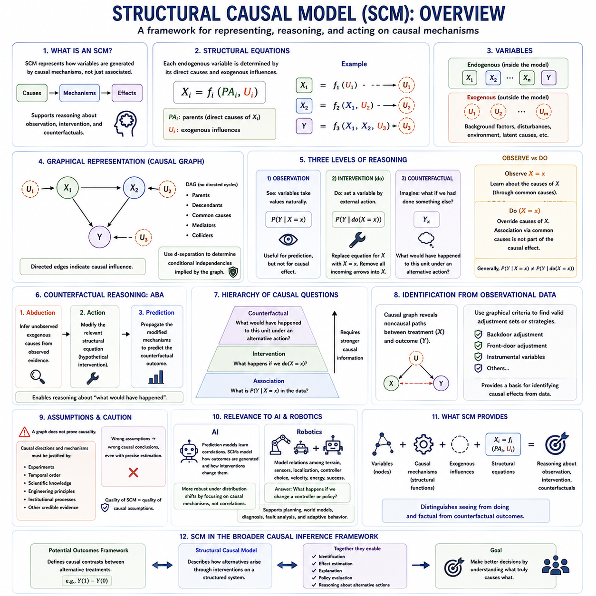
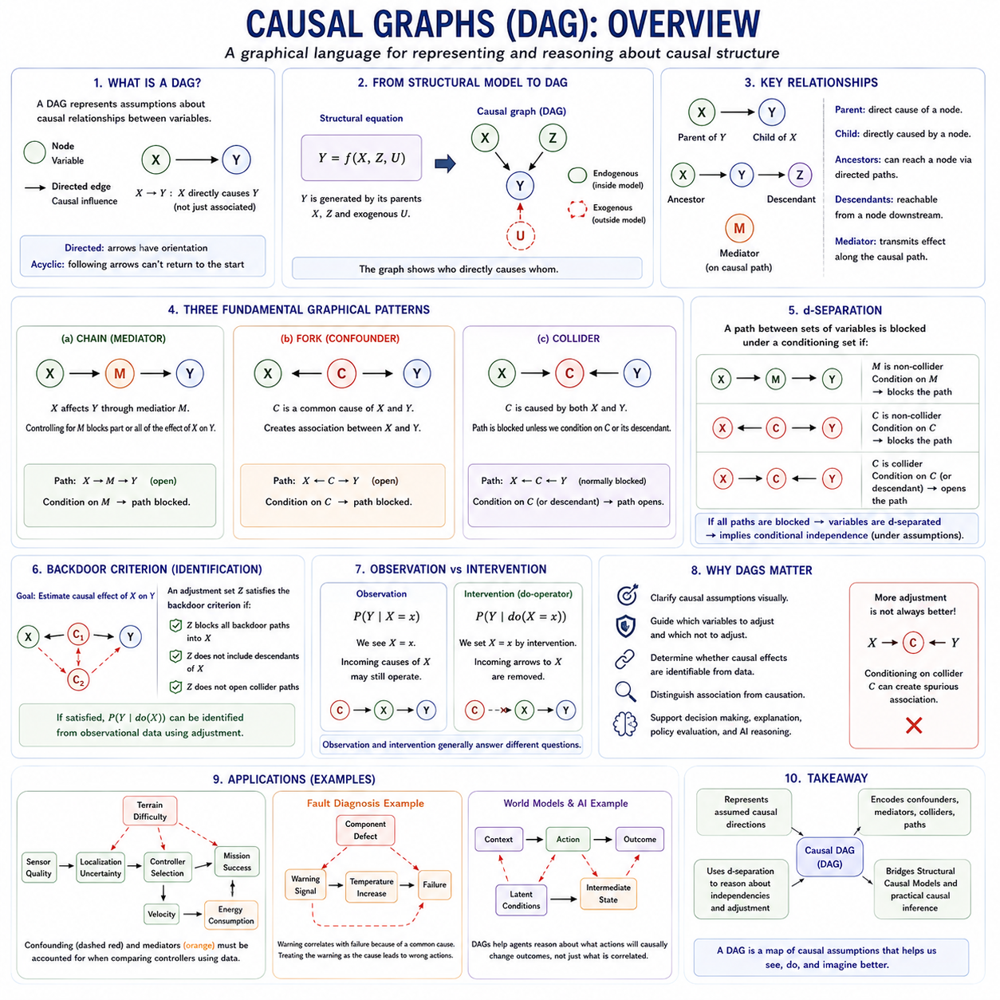
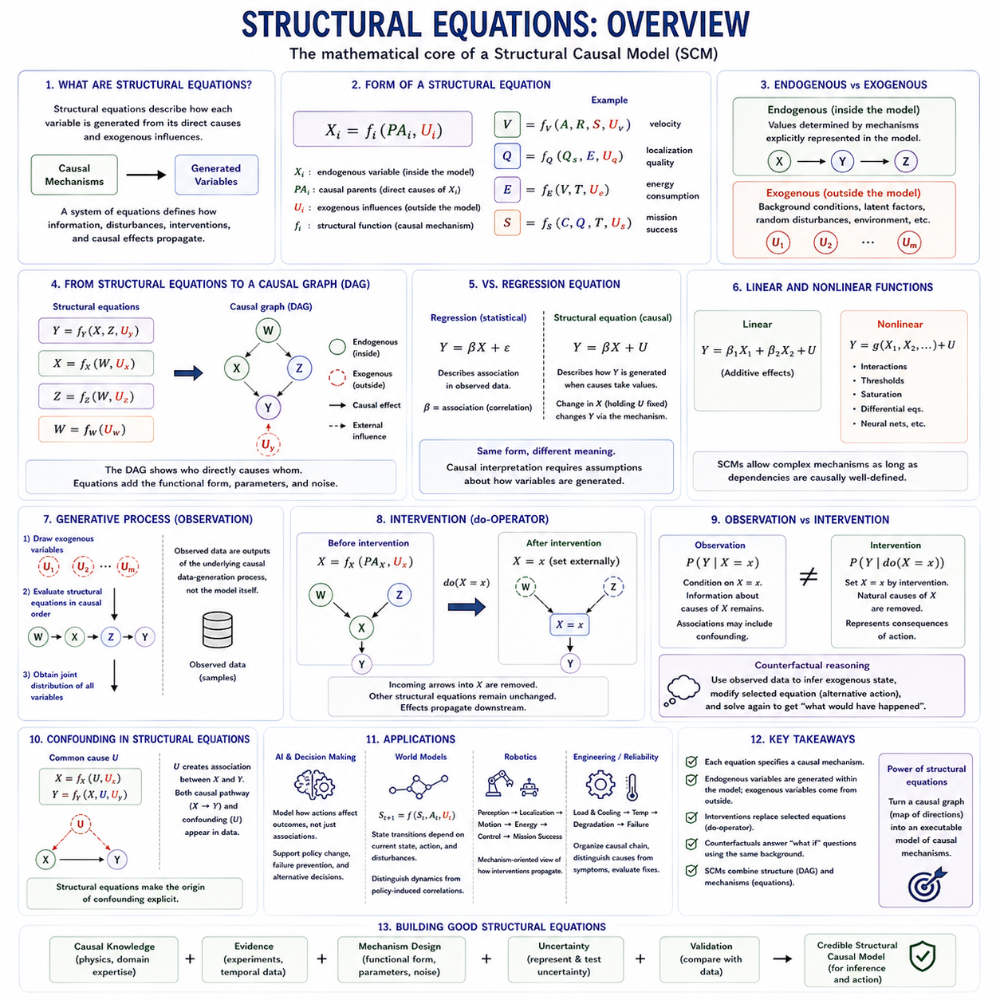
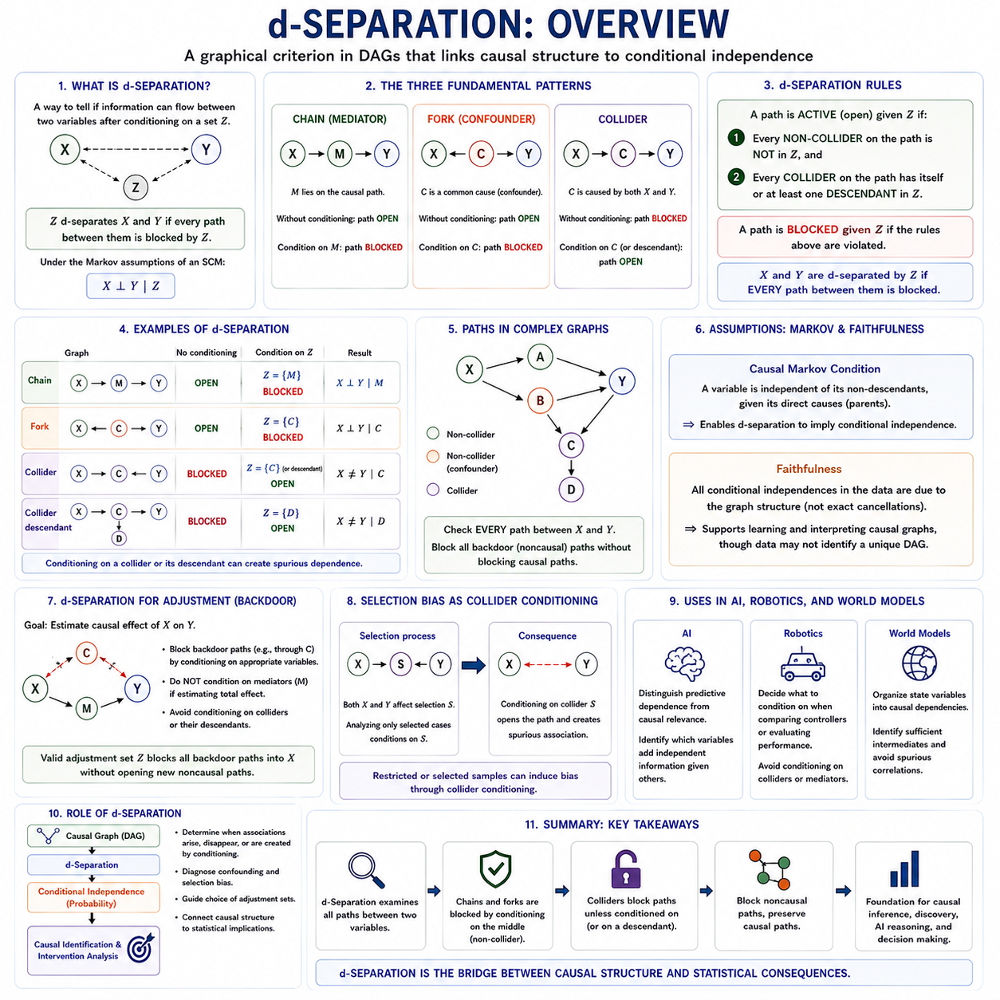
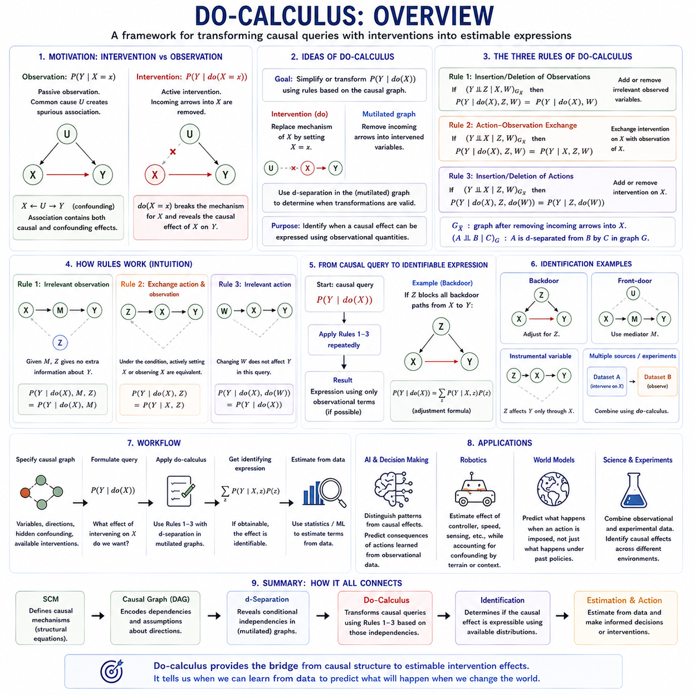
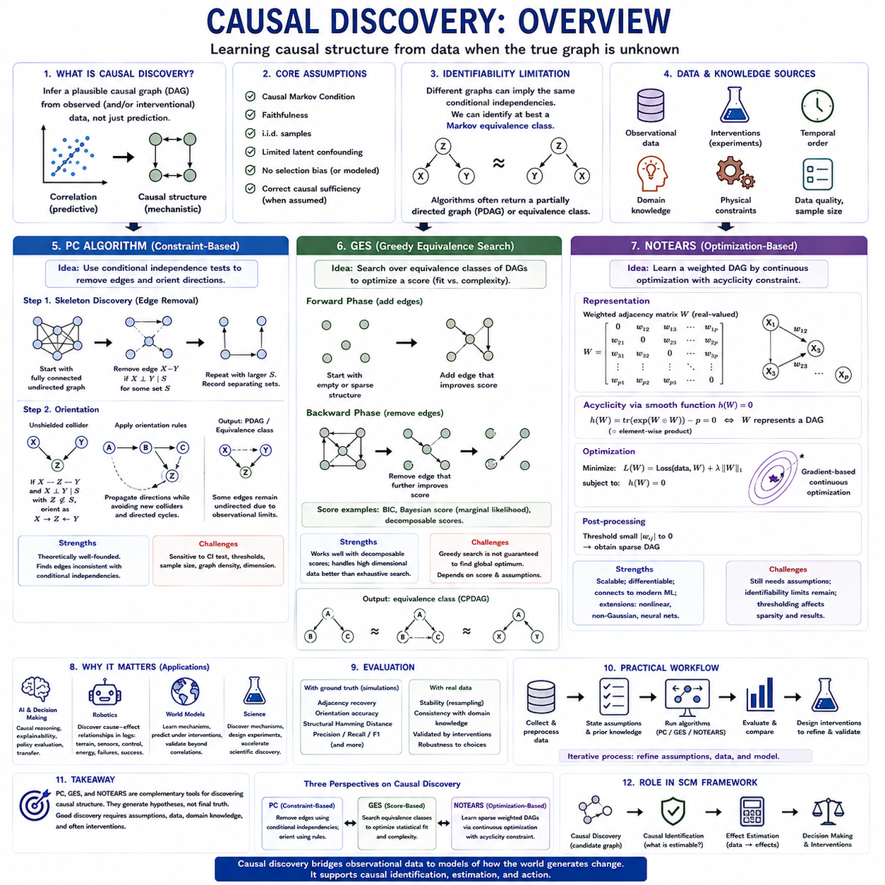
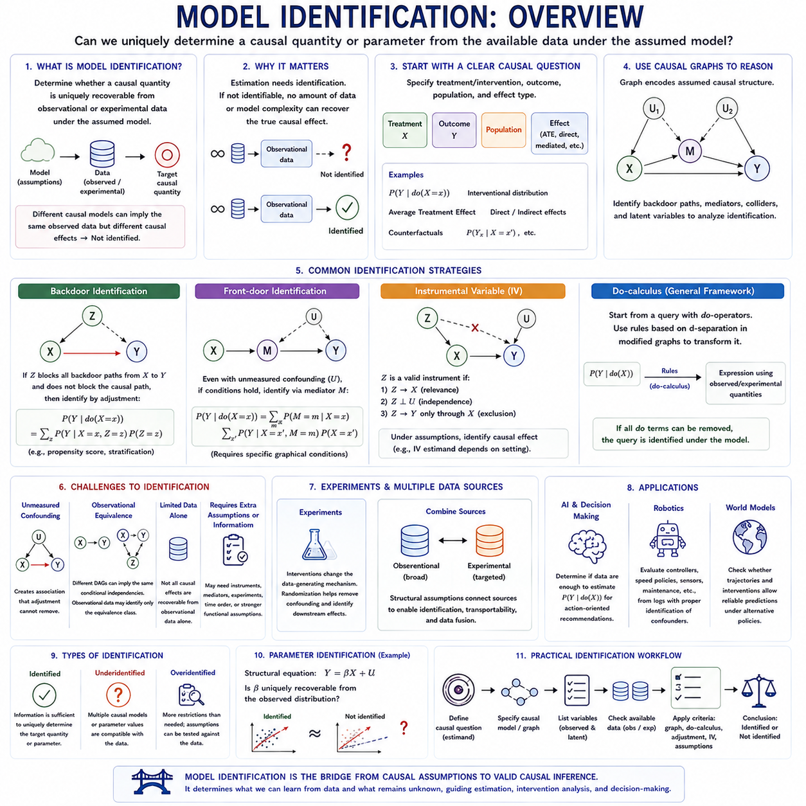
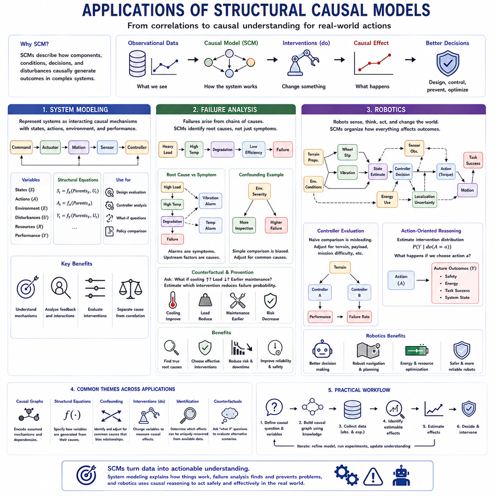

**Volume 46. Causality and Scientific AI**


# Chapter 02. Structural Causal Model

##  

## 02.00. Overview

{width="7.268055555555556in" height="7.268055555555556in"}

A Structural Causal Model provides a formal framework for representing how variables in a system are generated through causal mechanisms rather than merely associated statistically. An SCM describes each endogenous variable as the result of a structural function involving its direct causes and external influences. This representation makes causal assumptions explicit and provides a foundation for reasoning about observation, intervention, and counterfactual alternatives.

The central idea is that a system can be represented by structural equations of the form Xᵢ = fᵢ(PAᵢ, Uᵢ), where PAᵢ denotes the parent variables that directly cause Xᵢ and Uᵢ represents exogenous influences not explained within the model. Each equation describes a causal mechanism responsible for generating one variable, allowing the complete model to represent how changes propagate through interconnected processes.

SCMs distinguish endogenous variables from exogenous variables. Endogenous variables are determined by relationships represented inside the causal model, while exogenous variables capture background factors originating outside those modeled relationships. These external variables may represent environmental conditions, latent characteristics, disturbances, or other unmodeled causes that influence the system while remaining outside the explicit causal structure.

Structural equations differ fundamentally from ordinary regression equations because their meaning is causal rather than purely predictive. A regression may describe how one variable statistically varies with another, whereas a structural equation asserts a mechanism through which causes generate effects. Consequently, modifying a variable in an SCM requires changing its generating mechanism rather than simply conditioning a statistical distribution on an observed value.

The graphical representation of an SCM is commonly expressed through a directed causal graph. Variables appear as nodes, while directed edges indicate causal relationships. If X directly influences Y, the graph contains X → Y. Multiple equations can therefore be translated into a network of causal dependencies, making complex causal structures easier to inspect and reason about using graphical criteria.

Directed Acyclic Graphs are widely used when the modeled causal relationships contain no directed feedback cycles. A DAG enables analysts to reason systematically about parents, descendants, common causes, mediators, colliders, and alternative paths connecting variables. Graphical concepts such as d-separation can then determine which conditional independencies are implied by the assumed causal structure.

Observation represents the first level of reasoning supported by structural causal models. At this level, the model describes statistical relationships in naturally occurring data and answers questions such as how Y is distributed when X is observed to have a particular value. Observational reasoning is useful for prediction, but observation alone does not determine what would happen if X were deliberately changed.

Intervention introduces the essential distinction between seeing and doing. Pearl\'s do-operator expresses an intervention as do(X = x), meaning that X is externally fixed to x rather than generated by its ordinary structural equation. The original equation for X is replaced by the imposed value, while the remaining causal mechanisms are preserved. The model can then determine how this intervention propagates downstream.

Graphically, an intervention on X can be understood as removing incoming causal arrows into X and setting X externally. This operation separates intervention from ordinary conditioning. Observing X = x may provide information about the causes that produced X, whereas performing do(X = x) overrides those causes. Therefore, P(Y \| X = x) and P(Y \| do(X = x)) can represent fundamentally different quantities.

This distinction becomes particularly important in the presence of confounding. If a variable U influences both X and Y, observing X provides information about U and therefore about Y. An intervention on X does not change U, so the association generated through the common cause should not be interpreted as part of X\'s causal effect. SCMs represent this difference directly through their structural and graphical semantics.

Counterfactual reasoning extends the model beyond interventions by asking what would have happened to a particular unit under an alternative action. A counterfactual question may ask whether an observed failure would still have occurred if a controller had not been activated. Answering such questions requires reasoning about the same underlying system under both the factual and hypothetical conditions.

Counterfactual inference is often described through abduction, action, and prediction. Abduction uses observed evidence to infer information about the underlying exogenous variables. Action modifies the relevant structural equation according to the hypothetical intervention. Prediction then propagates the modified causal mechanisms forward to determine the outcome that would have occurred under the alternative scenario.

These capabilities establish a hierarchy of causal reasoning. Association concerns observations such as P(Y \| X), intervention concerns manipulated distributions such as P(Y \| do(X)), and counterfactual reasoning concerns hypothetical outcomes for specific situations. Moving upward through this hierarchy requires stronger causal information because observational distributions alone generally cannot answer every intervention or counterfactual question.

SCMs also provide a formal basis for identifying causal effects from observational data. If the assumed causal graph reveals which noncausal paths connect treatment and outcome, graphical criteria can determine whether appropriate adjustment variables exist. Backdoor adjustment, front-door reasoning, instrumental variables, and related identification strategies can therefore be understood within a unified structural framework.

The quality of an SCM depends critically on the validity of its causal assumptions. A graph cannot establish causality merely because arrows have been drawn between variables. The directions and mechanisms should be justified through experiments, temporal relationships, scientific knowledge, engineering principles, institutional processes, or other credible evidence. Incorrect structural assumptions can produce incorrect causal conclusions even when statistical estimation is precise.

Structural causal models are particularly relevant to artificial intelligence because intelligent systems increasingly need to reason about actions rather than only predict observations. A predictive model may learn that certain states are associated with failure, while an SCM can represent which factors actually generate failure and predict how interventions on controllable variables could alter the outcome. This supports decision-oriented and explainable reasoning.

SCMs can also improve robustness when environments change. Statistical correlations learned in one environment may disappear when policies, operating conditions, or data-generation processes change. Causal mechanisms can sometimes remain more stable across such distribution shifts. Representing these mechanisms explicitly can help AI systems distinguish persistent causal structure from correlations that depend on a particular training environment.

In robotics, structural equations can describe relationships among terrain, sensor observations, localization quality, controller selection, velocity, energy consumption, and mission success. Environmental difficulty may influence both controller selection and performance, creating confounding in operational logs. An SCM can represent these pathways and support questions about what would happen if a controller or operating policy were deliberately changed.

A robot equipped with causal reasoning could conceptually move beyond asking what action usually accompanies successful behavior toward asking which action would cause a better future state. Counterfactual reasoning could further support failure diagnosis by comparing an observed trajectory with hypothetical alternatives. Such reasoning connects SCMs with planning, world models, decision systems, fault analysis, and adaptive autonomous behavior.

Structural Causal Models therefore provide more than a graphical visualization of relationships. They combine variables, causal mechanisms, external influences, structural equations, and intervention semantics into a mathematical representation of how a system works. Their central contribution is the ability to distinguish observing from acting and factual outcomes from counterfactual alternatives, providing a foundation for causal inference and causal AI.

Within a broader causal inference framework, SCMs complement the Potential Outcomes Framework by emphasizing explicit mechanisms and graphical structure. Potential outcomes define causal contrasts between alternative treatments, while SCMs describe how those alternatives arise through interventions on a structured system. Together, these perspectives support identification, effect estimation, explanation, policy evaluation, and reasoning about alternative actions in complex systems.

구조적 인과 모델(Structural Causal Model, SCM)은 시스템의 변수들이 단순히 통계적으로 연관되어 있는 방식을 넘어, 인과 메커니즘(Causal Mechanisms)을 통해 어떻게 생성되는지를 표현하기 위한 형식적 프레임워크(Formal Framework)를 제공합니다. SCM은 각각의 내생 변수(Endogenous Variable)를 직접적인 원인과 외부 영향(External Influences)을 포함하는 구조 함수(Structural Function)의 결과로 설명합니다. 이러한 표현은 인과적 가정(Causal Assumptions)을 명시적으로 만들고 관찰(Observation), 개입(Intervention), 반사실적 대안(Counterfactual Alternatives)을 추론하기 위한 기반을 제공합니다.

핵심 개념은 시스템을 Xᵢ = fᵢ(PAᵢ, Uᵢ) 형태의 구조 방정식(Structural Equations)으로 표현할 수 있다는 것입니다. 여기에서 PAᵢ는 Xᵢ를 직접적으로 발생시키는 부모 변수(Parent Variables)를 의미하고, Uᵢ는 모델 내부에서 설명되지 않는 외생적 영향(Exogenous Influences)을 나타냅니다. 각각의 방정식은 하나의 변수를 생성하는 인과 메커니즘을 설명하며, 전체 모델은 변화가 서로 연결된 과정들을 통해 어떻게 전파되는지를 표현할 수 있습니다.

SCM은 내생 변수(Endogenous Variables)와 외생 변수(Exogenous Variables)를 구분합니다. 내생 변수는 인과 모델 내부에 표현된 관계에 의해 결정되는 반면, 외생 변수는 모델링된 관계 외부에서 발생하는 배경 요인(Background Factors)을 나타냅니다. 이러한 외부 변수는 환경 조건(Environmental Conditions), 잠재적 특성(Latent Characteristics), 외란(Disturbances), 또는 명시적인 인과 구조 외부에서 시스템에 영향을 주는 기타 모델링되지 않은 원인을 표현할 수 있습니다.

구조 방정식은 단순한 회귀 방정식(Regression Equations)과 근본적으로 다릅니다. 구조 방정식의 의미는 순수한 예측이 아니라 인과적이기 때문입니다. 회귀는 한 변수가 다른 변수와 통계적으로 어떻게 변화하는지를 설명할 수 있지만, 구조 방정식은 원인이 결과를 생성하는 메커니즘을 명시합니다. 따라서 SCM에서 변수를 변경한다는 것은 관측값에 통계적으로 조건화(Conditioning)하는 것이 아니라 해당 변수를 생성하는 메커니즘 자체를 변경하는 것을 의미합니다.

SCM의 그래프 표현(Graphical Representation)은 일반적으로 방향성 인과 그래프(Directed Causal Graph)를 통해 나타냅니다. 변수는 노드(Node)로 표현되고 방향성 간선(Directed Edges)은 인과관계를 나타냅니다. X가 Y에 직접적인 영향을 미친다면 그래프에는 X → Y가 포함됩니다. 따라서 여러 구조 방정식을 인과적 의존 관계(Causal Dependencies)의 네트워크로 변환할 수 있으며, 이를 통해 복잡한 인과 구조를 보다 쉽게 분석하고 추론할 수 있습니다.

방향성 비순환 그래프(Directed Acyclic Graphs, DAGs)는 모델링된 인과관계에 방향성 피드백 순환(Directed Feedback Cycles)이 존재하지 않을 때 널리 사용됩니다. DAG를 이용하면 부모(Parents), 자손(Descendants), 공통 원인(Common Causes), 매개 변수(Mediators), 충돌 변수(Colliders), 변수들을 연결하는 다양한 경로를 체계적으로 분석할 수 있습니다. 이후 d-분리(d-Separation)와 같은 그래프 개념을 이용하여 가정된 인과 구조가 어떤 조건부 독립성(Conditional Independencies)을 의미하는지 판단할 수 있습니다.

관찰(Observation)은 구조적 인과 모델이 지원하는 첫 번째 수준의 추론입니다. 이 수준에서 모델은 자연적으로 발생한 데이터의 통계적 관계를 설명하고, X가 특정 값으로 관측되었을 때 Y가 어떻게 분포하는지와 같은 질문에 답합니다. 관찰적 추론(Observational Reasoning)은 예측에 유용하지만, 관찰만으로는 X를 의도적으로 변화시켰을 때 어떤 일이 발생할지를 결정할 수 없습니다.

개입(Intervention)은 보는 것(Seeing)과 행하는 것(Doing) 사이의 핵심적인 차이를 도입합니다. 펄의 do-연산자(Pearl\'s Do-Operator)는 개입을 do(X = x)로 표현하며, 이는 X가 일반적인 구조 방정식에 의해 생성되는 대신 외부에서 x로 고정된다는 것을 의미합니다. X에 대한 기존 방정식은 강제된 값으로 대체되지만 나머지 인과 메커니즘은 유지됩니다. 이후 모델은 이러한 개입이 하류 변수(Downstream Variables)로 어떻게 전파되는지를 계산할 수 있습니다.

그래프 관점에서 X에 대한 개입은 X로 들어오는 인과적 화살표(Incoming Causal Arrows)를 제거하고 X를 외부에서 설정하는 것으로 이해할 수 있습니다. 이러한 연산은 개입과 일반적인 조건화를 구별합니다. X = x를 관측하는 것은 X를 발생시킨 원인에 대한 정보를 제공할 수 있지만, do(X = x)를 수행하는 것은 그러한 원인들을 우회하여 X를 직접 설정합니다. 따라서 P(Y \| X = x)와 P(Y \| do(X = x))는 근본적으로 서로 다른 인과량(Causal Quantities)을 나타낼 수 있습니다.

이러한 차이는 교란(Confounding)이 존재할 때 특히 중요합니다. 변수 U가 X와 Y 모두에 영향을 미친다면 X를 관측하는 것은 U에 관한 정보를 제공하고 결과적으로 Y에 관한 정보도 제공합니다. 그러나 X에 개입한다고 해서 U가 변화하는 것은 아니므로 공통 원인(Common Cause)을 통해 발생한 연관성을 X의 인과 효과의 일부로 해석해서는 안 됩니다. SCM은 이러한 차이를 구조적 의미론(Structural Semantics)과 그래프 의미론(Graphical Semantics)을 통해 직접적으로 표현합니다.

반사실적 추론(Counterfactual Reasoning)은 특정 개체(Unit)에 대해 다른 행동을 수행했다면 어떤 일이 발생했을지를 질문함으로써 개입보다 모델의 추론 능력을 더욱 확장합니다. 예를 들어 관측된 고장(Failure)이 제어기(Controller)를 활성화하지 않았더라도 발생했을지를 질문할 수 있습니다. 이러한 질문에 답하려면 동일한 기저 시스템(Underlying System)을 실제 조건(Factual Condition)과 가상의 조건(Hypothetical Condition) 모두에서 추론해야 합니다.

반사실적 추론은 일반적으로 귀추(Abduction), 행동(Action), 예측(Prediction)의 과정으로 설명됩니다. 귀추 단계에서는 관측된 증거를 이용하여 기저 외생 변수(Underlying Exogenous Variables)에 관한 정보를 추론합니다. 행동 단계에서는 가정된 개입에 따라 관련 구조 방정식을 변경합니다. 마지막으로 예측 단계에서는 수정된 인과 메커니즘을 앞으로 전파하여 대안적인 상황에서 발생했을 결과를 결정합니다.

이러한 기능은 인과 추론의 계층 구조(Hierarchy of Causal Reasoning)를 형성합니다. 연관성(Association)은 P(Y \| X)와 같은 관측에 관한 것이고, 개입은 P(Y \| do(X))와 같은 조작된 분포(Manipulated Distributions)에 관한 것이며, 반사실적 추론은 특정 상황에서 발생할 수 있었던 가상의 결과에 관한 것입니다. 이러한 계층의 상위 수준으로 이동할수록 더 강한 인과 정보가 필요합니다. 관측 분포만으로는 일반적으로 모든 개입 및 반사실적 질문에 답할 수 없기 때문입니다.

SCM은 관찰 데이터(Observational Data)에서 인과 효과(Causal Effects)를 식별하기 위한 형식적 기반도 제공합니다. 가정된 인과 그래프를 통해 처치(Treatment)와 결과 사이를 연결하는 비인과적 경로(Noncausal Paths)를 파악할 수 있다면, 그래프 기준(Graphical Criteria)을 사용하여 적절한 조정 변수(Adjustment Variables)가 존재하는지를 판단할 수 있습니다. 따라서 뒷문 조정(Backdoor Adjustment), 앞문 추론(Front-Door Reasoning), 도구 변수(Instrumental Variables) 등의 식별 전략을 하나의 통합된 구조적 프레임워크 안에서 이해할 수 있습니다.

SCM의 품질은 인과적 가정의 타당성(Validity)에 결정적으로 의존합니다. 변수 사이에 화살표를 그렸다는 사실만으로 그래프가 인과관계를 확립하는 것은 아닙니다. 인과 방향과 메커니즘은 실험(Experiments), 시간적 관계(Temporal Relationships), 과학적 지식(Scientific Knowledge), 엔지니어링 원리(Engineering Principles), 제도적 과정(Institutional Processes), 또는 기타 신뢰할 수 있는 증거에 의해 정당화되어야 합니다. 구조적 가정이 잘못되면 통계적 추정이 정밀하더라도 잘못된 인과적 결론에 도달할 수 있습니다.

구조적 인과 모델은 지능형 시스템(Intelligent Systems)이 단순히 관측값을 예측하는 것을 넘어 행동에 대해 추론해야 한다는 점에서 인공지능(Artificial Intelligence)과 특히 밀접한 관련이 있습니다. 예측 모델은 특정 상태가 고장과 연관되어 있음을 학습할 수 있지만, SCM은 어떤 요인이 실제로 고장을 발생시키는지를 표현하고 제어 가능한 변수(Controllable Variables)에 개입했을 때 결과가 어떻게 달라질지를 예측할 수 있습니다. 이는 의사결정 중심(Decision-Oriented)이며 설명 가능한 추론(Explainable Reasoning)을 지원합니다.

SCM은 환경이 변화할 때 강건성(Robustness)을 향상시키는 데에도 활용될 수 있습니다. 하나의 환경에서 학습된 통계적 상관관계는 정책(Policies), 운영 조건(Operating Conditions), 데이터 생성 과정(Data-Generation Processes)이 변화하면 사라질 수 있습니다. 반면 인과 메커니즘은 이러한 분포 변화(Distribution Shifts)에서도 상대적으로 안정적으로 유지될 수 있습니다. 이러한 메커니즘을 명시적으로 표현하면 인공지능 시스템이 지속적인 인과 구조와 특정 학습 환경에 의존하는 상관관계를 구분하는 데 도움이 될 수 있습니다.

로보틱스(Robotics)에서는 구조 방정식을 이용하여 지형(Terrain), 센서 관측(Sensor Observations), 위치추정 품질(Localization Quality), 제어기 선택(Controller Selection), 속도(Velocity), 에너지 소비(Energy Consumption), 임무 성공(Mission Success) 사이의 관계를 표현할 수 있습니다. 환경 난이도(Environmental Difficulty)가 제어기 선택과 성능 모두에 영향을 주면 운영 로그(Operational Logs)에 교란이 발생할 수 있습니다. SCM은 이러한 경로를 표현하고 제어기나 운영 정책을 의도적으로 변경했을 때 어떤 일이 발생할지를 추론할 수 있도록 지원합니다.

인과적 추론 능력을 갖춘 로봇은 성공적인 행동과 일반적으로 함께 나타나는 행동을 찾는 수준을 넘어, 어떤 행동이 더 나은 미래 상태(Future State)를 실제로 발생시키는지를 질문할 수 있습니다. 반사실적 추론은 관측된 궤적(Observed Trajectory)을 가상의 대안적 궤적(Hypothetical Alternative Trajectories)과 비교함으로써 고장 진단(Failure Diagnosis)을 더욱 지원할 수 있습니다. 이러한 추론은 SCM을 계획(Planning), 월드 모델(World Models), 의사결정 시스템(Decision Systems), 고장 분석(Fault Analysis), 적응형 자율 행동(Adaptive Autonomous Behavior)과 연결합니다.

따라서 구조적 인과 모델(Structural Causal Models)은 단순히 변수 사이의 관계를 시각화하는 그래프 이상의 의미를 가집니다. 변수, 인과 메커니즘, 외부 영향, 구조 방정식, 개입 의미론(Intervention Semantics)을 결합하여 시스템이 어떻게 작동하는지를 수학적으로 표현합니다. 핵심적인 기여는 관찰하는 것과 행동하는 것을 구별하고, 실제 결과(Factual Outcomes)와 반사실적 대안(Counterfactual Alternatives)을 구분하여 인과 추론과 인과 인공지능(Causal AI)의 기반을 제공한다는 점입니다.

보다 넓은 인과 추론 프레임워크에서 구조적 인과 모델은 명시적인 메커니즘과 그래프 구조(Graphical Structure)를 강조함으로써 잠재적 결과 프레임워크(Potential Outcomes Framework)를 보완합니다. 잠재적 결과는 서로 다른 처치 사이의 인과적 대비(Causal Contrasts)를 정의하는 반면, SCM은 구조화된 시스템에 대한 개입을 통해 그러한 대안이 어떻게 발생하는지를 설명합니다. 두 관점을 함께 활용하면 복잡한 시스템에서 식별(Identification), 효과 추정(Effect Estimation), 설명(Explanation), 정책 평가(Policy Evaluation), 대안적 행동(Alternative Actions)에 관한 추론을 체계적으로 수행할 수 있습니다.

##  

## 02.01. Causal Graphs (DAG) [w/Code]

{width="7.268055555555556in" height="7.268055555555556in"}

A causal graph provides a compact representation of assumptions about how variables causally influence one another. In a Directed Acyclic Graph, or DAG, variables are represented as nodes and causal relationships as directed edges. An arrow X → Y states that X is assumed to be a direct cause of Y within the modeled system, rather than merely indicating that X and Y are statistically associated.

The term directed means that every causal edge has an orientation, while acyclic means that following directed arrows cannot eventually return to the original variable. Thus, X → Y → Z is permitted, but X → Y → Z → X would violate the DAG assumption. This structure is especially suitable for systems in which causes precede their downstream consequences without explicit instantaneous feedback loops.

DAGs provide a graphical language for Structural Causal Models because structural equations can be translated into causal dependencies. If Y = f(X, Z, U), then X and Z may appear as parents of Y in the corresponding graph. The graph suppresses many mathematical details of the structural functions while preserving information about which variables directly participate in generating other variables.

A parent of a variable is a node with an arrow pointing directly into it, while a child receives a direct causal influence from that node. Ancestors include all variables that can reach a node through directed paths, and descendants include variables reachable downstream. These relationships allow analysts to trace how an intervention or disturbance may propagate through a causal system.

A causal path is a sequence of connected variables through which causal influence may travel. In X → M → Y, X affects Y indirectly through the mediator M. The variable M lies on the causal pathway and transmits part or all of the effect of X. Recognizing mediators is essential because controlling for them can remove portions of the causal effect that an analysis may actually seek to estimate.

Confounding occurs when a common cause influences both a treatment or exposure and an outcome. In the structure X ← C → Y, C creates an association between X and Y even if some of that association does not result from X causing Y. Such a path is commonly called a backdoor path because it enters X through an incoming arrow and can distort estimation of the causal effect X → Y.

Adjustment attempts to block appropriate noncausal paths while preserving the causal pathways relevant to the target effect. If C is a sufficient observed confounder in X ← C → Y, conditioning on C can block the backdoor association. DAGs therefore help determine which variables should be controlled rather than encouraging analysts to include every available variable indiscriminately in a statistical model.

A collider has a fundamentally different structure. In X → C ← Y, both X and Y cause C, making C a collider on the path between them. Without conditioning on C, this path is blocked. Conditioning on the collider, or sometimes on one of its descendants, can open the path and create a statistical association between X and Y even when no such association previously existed.

Collider bias demonstrates why more adjustment is not always better. A variable may strongly predict both treatment selection and observed outcomes yet still be inappropriate to control if its causal position makes it a collider. DAG-based reasoning focuses on the structural role of variables rather than their predictive importance, statistical significance, or correlation strength when selecting adjustment sets.

Chains, forks, and colliders form fundamental graphical patterns. A chain X → M → Y transmits dependence through a mediator, while a fork X ← C → Y represents dependence generated by a common cause. A collider X → C ← Y behaves oppositely because the path is normally closed but may become active after conditioning. Complex graphs can be analyzed by combining these basic structures.

The concept of d-separation formalizes whether paths between variables are blocked or open under a particular conditioning set. If every path between two sets of variables is blocked according to graphical rules, those variables are d-separated. Under the causal model assumptions, d-separation implies corresponding conditional independence relationships that can connect graphical structure with observable probability distributions.

D-separation also provides a systematic way to reason about adjustment. Conditioning on a non-collider generally blocks a path passing through that variable, whereas conditioning on a collider can activate a path that would otherwise remain blocked. Analysts can therefore inspect a DAG to determine whether a proposed adjustment set removes confounding or accidentally introduces new statistical dependence.

The backdoor criterion uses these graphical ideas to identify sets of variables that permit causal effect estimation from observational data. For estimating the effect of X on Y, an acceptable adjustment set blocks relevant paths entering X through the backdoor without improperly controlling for descendants or opening collider paths. When such conditions hold, adjusted observational comparisons can identify an interventional quantity.

DAGs also clarify why temporal order alone is insufficient for causal identification. A variable occurring before another variable may be a cause, a proxy for a hidden cause, or simply correlated through a common ancestor. Temporal information is useful for constraining impossible directions, but causal arrows should additionally reflect scientific knowledge, experimental evidence, physical mechanisms, or credible assumptions about data generation.

Latent or unobserved variables create additional challenges. An unmeasured common cause U may produce X ← U → Y even when U does not appear in the observed dataset. In graphical representations, latent confounding may be shown explicitly or represented using specialized graphical conventions. Its presence can prevent ordinary covariate adjustment from identifying the desired causal effect.

Causal graphs are therefore not automatically discovered truths about a dataset. They encode assumptions about the system that should be justified independently of observed correlations whenever possible. Multiple DAGs can sometimes imply the same set of observational conditional independencies, making them statistically indistinguishable without interventions, temporal constraints, domain knowledge, or additional causal assumptions.

Interventions change the interpretation of a causal graph. Under do(X = x), the natural causes of X are overridden and incoming arrows into X are conceptually removed. The modified graph represents the system after external manipulation. Comparing the original and intervened graphs helps distinguish P(Y \| X = x), which describes observation, from P(Y \| do(X = x)), which describes the consequences of action.

This graphical intervention perspective is particularly useful for artificial intelligence because intelligent agents act on environments rather than merely observe them. A causal graph can represent relationships among context, decisions, latent conditions, actions, and outcomes. The agent can then reason about which observed associations are actionable and which arise from common causes, selection processes, or other noncausal pathways.

In robotics, a DAG might connect terrain difficulty, sensor quality, localization uncertainty, controller selection, velocity, energy consumption, and mission success. Terrain difficulty could affect both controller selection and mission outcome, creating confounding. Sensor degradation could influence localization and downstream control behavior. Graphical analysis helps separate these mechanisms before comparing controllers using operational data.

Causal graphs can also support fault diagnosis and system safety. A warning signal may correlate strongly with failure because both are consequences of an underlying component defect. Treating the warning itself as the cause could lead to an ineffective intervention. A DAG encourages engineers to distinguish upstream causes, intermediate mechanisms, symptoms, and final outcomes before selecting corrective actions.

For world models and autonomous systems, DAGs provide a useful abstraction for representing directional dependencies among state variables and actions. They can complement learned statistical representations by expressing which changes are expected to produce downstream effects. This can support intervention-aware prediction, causal planning, transfer across environments, explanation, and reasoning about failures or alternative actions.

The primary value of a DAG is therefore not visual simplicity alone, but disciplined causal reasoning. By representing assumed causal direction, confounders, mediators, colliders, paths, and conditional independencies, causal graphs help determine what should be adjusted, what should not be adjusted, and whether an observational distribution can answer an intervention question. They form a central bridge between Structural Causal Models and practical causal inference.

인과 그래프(Causal Graph)는 변수들이 서로 어떻게 인과적으로 영향을 미치는지에 대한 가정을 간결하게 표현합니다. 방향성 비순환 그래프(Directed Acyclic Graph, DAG)에서는 변수를 노드(Node)로, 인과관계를 방향성 간선(Directed Edge)으로 표현합니다. X → Y라는 화살표는 X와 Y가 단순히 통계적으로 연관되어 있다는 의미가 아니라, 모델링된 시스템 내에서 X가 Y의 직접적인 원인(Direct Cause)이라고 가정한다는 의미입니다.

방향성(Directed)이란 모든 인과적 간선이 특정 방향을 가진다는 의미이며, 비순환(Acyclic)이란 방향성 화살표를 계속 따라가더라도 출발했던 변수로 다시 돌아올 수 없다는 의미입니다. 따라서 X → Y → Z는 허용되지만 X → Y → Z → X는 DAG의 가정을 위반합니다. 이러한 구조는 명시적인 순간 피드백 루프(Instantaneous Feedback Loops) 없이 원인이 하류의 결과보다 선행하는 시스템을 표현하는 데 특히 적합합니다.

DAG는 구조 방정식(Structural Equations)을 인과적 의존 관계(Causal Dependencies)로 변환할 수 있기 때문에 구조적 인과 모델(Structural Causal Models, SCMs)을 위한 그래프 언어(Graphical Language)를 제공합니다. Y = f(X, Z, U)라면 X와 Z는 해당 그래프에서 Y의 부모 변수(Parent Variables)로 나타날 수 있습니다. 그래프는 구조 함수(Structural Functions)의 많은 수학적 세부사항을 생략하면서도 어떤 변수가 다른 변수를 직접 생성하는 데 참여하는지에 관한 정보를 유지합니다.

어떤 변수의 부모(Parent)는 해당 변수로 직접 화살표를 보내는 노드이고, 자식(Child)은 그 노드로부터 직접적인 인과적 영향을 받는 변수입니다. 조상(Ancestors)은 방향성 경로(Directed Paths)를 통해 특정 노드에 도달할 수 있는 모든 변수를 포함하며, 자손(Descendants)은 해당 노드로부터 하류 방향으로 도달할 수 있는 변수들을 의미합니다. 이러한 관계를 이용하면 개입(Intervention)이나 외란(Disturbance)이 인과 시스템을 통해 어떻게 전파되는지를 추적할 수 있습니다.

인과 경로(Causal Path)는 인과적 영향이 전달될 수 있는 연결된 변수들의 연속입니다. X → M → Y에서 X는 매개 변수(Mediator) M을 통해 Y에 간접적으로 영향을 미칩니다. M은 인과 경로상에 위치하여 X의 효과 일부 또는 전체를 전달합니다. 매개 변수를 통제하면 분석에서 실제로 추정하려는 인과 효과의 일부를 제거할 수 있기 때문에 매개 변수를 정확하게 인식하는 것이 중요합니다.

교란(Confounding)은 하나의 공통 원인(Common Cause)이 처치(Treatment) 또는 노출(Exposure)과 결과(Outcome) 모두에 영향을 미칠 때 발생합니다. X ← C → Y 구조에서 C는 X가 Y를 발생시키는 것과 무관한 연관성까지 X와 Y 사이에 만들어낼 수 있습니다. 이러한 경로는 X로 들어오는 화살표를 통해 시작되기 때문에 일반적으로 뒷문 경로(Backdoor Path)라고 하며, X → Y의 인과 효과 추정을 왜곡할 수 있습니다.

조정(Adjustment)은 목표 인과 효과와 관련된 인과 경로를 유지하면서 적절한 비인과적 경로(Noncausal Paths)를 차단하는 것을 목표로 합니다. X ← C → Y에서 C가 충분히 관측된 교란 변수라면 C에 조건화(Conditioning)함으로써 뒷문 연관성을 차단할 수 있습니다. 따라서 DAG는 이용 가능한 모든 변수를 무차별적으로 통계 모델에 포함하는 대신 어떤 변수를 통제해야 하는지를 결정하는 데 도움을 줍니다.

충돌 변수(Collider)는 근본적으로 다른 구조를 가집니다. X → C ← Y에서는 X와 Y가 모두 C의 원인이 되므로 C는 두 변수 사이의 경로에서 충돌 변수입니다. C에 조건화하지 않은 상태에서는 이 경로가 차단되어 있습니다. 그러나 충돌 변수 또는 경우에 따라 그 자손에 조건화하면 경로가 열리면서 이전에는 존재하지 않았던 X와 Y 사이의 통계적 연관성(Statistical Association)이 발생할 수 있습니다.

충돌 변수 편향(Collider Bias)은 더 많은 변수를 조정한다고 해서 항상 더 좋은 분석이 되는 것은 아니라는 점을 보여줍니다. 어떤 변수가 처치 선택과 관측된 결과를 강하게 예측하더라도 인과 구조에서 충돌 변수의 위치를 가진다면 이를 통제하는 것이 부적절할 수 있습니다. DAG 기반 추론(DAG-Based Reasoning)은 조정 집합(Adjustment Sets)을 선택할 때 변수의 예측 중요도(Predictive Importance), 통계적 유의성(Statistical Significance), 상관관계의 강도보다 구조적 역할(Structural Role)에 초점을 맞춥니다.

연쇄(Chain), 분기(Fork), 충돌(Collider)은 기본적인 그래프 패턴(Graphical Patterns)을 형성합니다. 연쇄 X → M → Y는 매개 변수를 통해 의존성을 전달하며, 분기 X ← C → Y는 공통 원인에 의해 생성된 의존성을 나타냅니다. 반면 충돌 구조 X → C ← Y에서는 일반적으로 경로가 닫혀 있지만 조건화를 수행하면 활성화될 수 있습니다. 복잡한 그래프 역시 이러한 기본 구조들을 결합하여 분석할 수 있습니다.

d-분리(d-Separation)는 특정 조건화 집합(Conditioning Set)이 주어졌을 때 변수 사이의 경로가 차단되어 있는지 또는 열려 있는지를 형식적으로 판단하는 개념입니다. 두 변수 집합 사이의 모든 경로가 그래프 규칙에 따라 차단되어 있다면 해당 변수들은 d-분리되어 있다고 합니다. 인과 모델의 가정 아래에서 d-분리는 그래프 구조와 관측 가능한 확률 분포(Probability Distributions)를 연결하는 조건부 독립성(Conditional Independence)을 의미합니다.

d-분리는 조정에 대해 체계적으로 추론하는 방법도 제공합니다. 일반적으로 비충돌 변수(Non-Collider)에 조건화하면 해당 변수를 통과하는 경로가 차단되는 반면, 충돌 변수에 조건화하면 원래 차단되어 있던 경로가 활성화될 수 있습니다. 따라서 분석자는 DAG를 검토하여 제안된 조정 집합이 교란을 제거하는지 또는 의도하지 않은 새로운 통계적 의존성(Statistical Dependence)을 발생시키는지를 판단할 수 있습니다.

뒷문 기준(Backdoor Criterion)은 이러한 그래프 개념을 활용하여 관찰 데이터(Observational Data)로부터 인과 효과(Causal Effect)를 추정할 수 있도록 하는 변수 집합을 식별합니다. X가 Y에 미치는 효과를 추정할 때 적절한 조정 집합은 X로 뒷문을 통해 들어오는 관련 경로를 차단하면서 자손을 부적절하게 통제하거나 충돌 경로를 열지 않아야 합니다. 이러한 조건이 충족되면 조정된 관찰적 비교를 통해 개입적 인과량(Interventional Quantity)을 식별할 수 있습니다.

DAG는 시간적 순서(Temporal Order)만으로 인과관계를 식별하기에는 충분하지 않은 이유도 명확하게 보여줍니다. 어떤 변수가 다른 변수보다 먼저 발생하더라도 그것이 실제 원인일 수도 있고, 숨겨진 원인(Hidden Cause)의 대리 변수(Proxy)일 수도 있으며, 단순히 공통 조상(Common Ancestor)을 통해 상관되어 있을 수도 있습니다. 시간 정보는 불가능한 인과 방향을 제한하는 데 유용하지만, 인과적 화살표는 과학적 지식(Scientific Knowledge), 실험적 증거(Experimental Evidence), 물리적 메커니즘(Physical Mechanisms), 또는 데이터 생성 과정(Data Generation)에 관한 신뢰할 수 있는 가정을 추가로 반영해야 합니다.

잠재 변수(Latent Variables) 또는 관측되지 않은 변수(Unobserved Variables)는 추가적인 문제를 발생시킵니다. 측정되지 않은 공통 원인 U가 X ← U → Y 구조를 만들 수 있으며, U는 실제 관측 데이터셋에는 나타나지 않을 수 있습니다. 그래프 표현에서는 잠재적 교란(Latent Confounding)을 명시적으로 표시하거나 특수한 그래프 표현 방식을 이용할 수 있습니다. 이러한 교란의 존재는 일반적인 공변량 조정(Covariate Adjustment)만으로 원하는 인과 효과를 식별하는 것을 불가능하게 만들 수 있습니다.

따라서 인과 그래프는 데이터셋에서 자동으로 발견되는 확정적인 진실이 아닙니다. 인과 그래프는 시스템에 관한 가정을 표현하며, 가능한 경우 이러한 가정은 관측된 상관관계와 독립적인 근거를 통해 정당화되어야 합니다. 여러 DAG가 동일한 관찰적 조건부 독립성을 나타낼 수도 있으므로 개입, 시간적 제약(Temporal Constraints), 도메인 지식(Domain Knowledge), 추가적인 인과적 가정이 없다면 통계적으로 서로 구별할 수 없는 경우도 있습니다.

개입(Intervention)은 인과 그래프의 해석을 변화시킵니다. do(X = x)를 수행하면 X의 자연적인 원인들이 무시되고 X로 들어오는 화살표들이 개념적으로 제거됩니다. 이렇게 수정된 그래프는 외부 조작(External Manipulation) 이후의 시스템을 나타냅니다. 원래 그래프와 개입된 그래프(Intervened Graph)를 비교하면 관찰을 나타내는 P(Y \| X = x)와 행동의 결과를 나타내는 P(Y \| do(X = x))를 구별할 수 있습니다.

이러한 그래프 기반 개입 관점(Graphical Intervention Perspective)은 지능형 에이전트(Intelligent Agents)가 환경을 단순히 관찰하는 것이 아니라 실제로 행동한다는 점에서 인공지능(Artificial Intelligence)에 특히 중요합니다. 인과 그래프는 상황(Context), 의사결정(Decisions), 잠재 조건(Latent Conditions), 행동(Actions), 결과 사이의 관계를 표현할 수 있습니다. 이를 통해 에이전트는 어떤 관측된 연관성이 실제 행동 가능한 것인지, 그리고 어떤 연관성이 공통 원인, 선택 과정(Selection Processes), 기타 비인과적 경로에서 발생한 것인지를 추론할 수 있습니다.

로보틱스(Robotics)에서 DAG는 지형 난이도(Terrain Difficulty), 센서 품질(Sensor Quality), 위치추정 불확실성(Localization Uncertainty), 제어기 선택(Controller Selection), 속도(Velocity), 에너지 소비(Energy Consumption), 임무 성공(Mission Success)을 연결할 수 있습니다. 지형 난이도가 제어기 선택과 임무 결과 모두에 영향을 주면 교란이 발생할 수 있습니다. 센서 열화(Sensor Degradation)는 위치추정과 이후의 제어 행동에 영향을 줄 수 있으며, 그래프 분석을 통해 운영 데이터를 이용하여 제어기를 비교하기 전에 이러한 메커니즘을 분리할 수 있습니다.

인과 그래프는 고장 진단(Fault Diagnosis)과 시스템 안전(System Safety)도 지원할 수 있습니다. 경고 신호(Warning Signal)가 고장과 강하게 상관되어 있더라도 실제로는 경고와 고장이 모두 기저 구성요소 결함(Underlying Component Defect)의 결과일 수 있습니다. 경고 자체를 원인으로 간주하면 효과가 없는 개입으로 이어질 수 있습니다. DAG는 엔지니어가 시정 조치(Corrective Actions)를 선택하기 전에 상류 원인(Upstream Causes), 중간 메커니즘(Intermediate Mechanisms), 증상(Symptoms), 최종 결과를 구분하도록 도와줍니다.

월드 모델(World Models)과 자율 시스템(Autonomous Systems)에서 DAG는 상태 변수(State Variables)와 행동 사이의 방향성 의존 관계(Directional Dependencies)를 표현하는 유용한 추상화(Abstraction)를 제공합니다. 어떤 변화가 하류 효과(Downstream Effects)를 발생시킬 것으로 예상되는지를 표현함으로써 학습된 통계적 표현을 보완할 수 있습니다. 이는 개입 인식 예측(Intervention-Aware Prediction), 인과적 계획(Causal Planning), 환경 간 전이(Transfer Across Environments), 설명(Explanation), 고장 및 대안적 행동에 대한 추론을 지원할 수 있습니다.

따라서 DAG의 핵심적인 가치는 단순한 시각적 표현에 있는 것이 아니라 체계적인 인과적 추론(Disciplined Causal Reasoning)에 있습니다. 가정된 인과 방향(Causal Direction), 교란 변수, 매개 변수, 충돌 변수, 경로(Paths), 조건부 독립성을 표현함으로써 인과 그래프는 무엇을 조정해야 하는지, 무엇을 조정해서는 안 되는지, 그리고 관찰 분포(Observational Distribution)를 이용하여 개입 질문(Intervention Question)에 답할 수 있는지를 판단하도록 지원합니다. 이는 구조적 인과 모델(SCM)과 실제 인과 추론(Practical Causal Inference)을 연결하는 핵심적인 기반을 형성합니다.

##  

## 02.02. Structural Equations

{width="7.268055555555556in" height="7.268055555555556in"}

Structural equations are the mathematical core of a Structural Causal Model because they describe how each variable is generated from its direct causes and external influences. Rather than representing only statistical association, a structural equation specifies an assumed causal mechanism. A collection of such equations defines how information, disturbances, interventions, and causal effects propagate through a modeled system.

A typical structural equation can be written as Xᵢ = fᵢ(PAᵢ, Uᵢ), where Xᵢ is an endogenous variable, PAᵢ represents its causal parents, and Uᵢ represents exogenous influences. The function fᵢ specifies the mechanism that transforms these inputs into Xᵢ. Each endogenous variable therefore has its own generating process embedded within the larger causal model.

Endogenous variables are quantities whose values are determined by mechanisms explicitly represented inside the model. If velocity depends on commanded acceleration, terrain resistance, and vehicle state, velocity can be represented as an endogenous variable. Its structural equation specifies how these causes combine, allowing downstream variables such as energy consumption or travel time to depend causally on the resulting velocity.

Exogenous variables represent influences whose generating mechanisms are not modeled explicitly. They may encode background conditions, latent properties, random disturbances, environmental variation, or unknown factors. Although an exogenous variable can affect endogenous variables, the SCM treats its value as originating outside the modeled causal system. This provides a formal boundary between modeled mechanisms and unexplained influences.

Structural equations should not be interpreted in the same way as ordinary regression equations. A regression equation summarizes statistical dependence in observed data, while a structural equation describes how a variable would be generated when its causes take particular values. The distinction becomes crucial under intervention because changing a structural mechanism has consequences that cannot generally be inferred from correlation alone.

For example, consider Y = βX + U. As a purely statistical regression, β may describe association between X and Y. As a structural equation, however, the expression asserts that changing X while holding the relevant background influence U fixed changes Y according to the specified mechanism. The causal interpretation therefore requires assumptions about how X, U, and Y are generated, not merely a fitted coefficient.

Structural equations naturally correspond to causal graphs. If Y = f(X, Z, U), then X and Z can be represented as direct causal parents of Y, producing arrows X → Y and Z → Y. The exogenous variable U represents an external influence on Y. A system of equations can therefore be translated into a Directed Acyclic Graph when the causal dependencies contain no directed cycles.

The equations contain information that a causal graph alone does not fully represent. A DAG specifies which variables directly influence which others, but it does not necessarily specify the functional form, parameter values, noise distributions, or magnitude of effects. Structural equations add these details, allowing the model to generate quantitative outcomes rather than representing only qualitative causal topology.

Structural functions may be linear or nonlinear. A linear model may express Y = β₁X₁ + β₂X₂ + U, while a nonlinear system may use interactions, thresholds, saturation, differential relationships, neural networks, or other complex functions. Structural causal modeling therefore does not require causal mechanisms to be simple; it requires their causal interpretation and dependencies to be explicitly defined.

A complete SCM contains multiple equations whose outputs become inputs to downstream mechanisms. For example, localization quality may depend on sensor quality and environmental conditions, controller behavior may depend on localization and mission state, and mission success may depend on controller behavior and terrain. Solving the equations according to their causal ordering produces the system\'s observable state.

This generative interpretation is important because it describes how observational data arise. Samples can be conceptually generated by first drawing exogenous variables and then evaluating the structural equations in causal order. The resulting joint distribution reflects both the causal architecture and background variation. Statistical observations are therefore outputs of an underlying causal data-generation process rather than the causal structure itself.

Intervention can be represented directly by modifying a structural equation. Suppose X normally follows X = f(PAₓ, Uₓ). Under the intervention do(X = x), this equation is replaced with X = x. The natural causes of X no longer determine its value, while other structural equations remain unchanged. The consequences of the intervention can then be calculated by propagating the imposed value through downstream equations.

This operation explains the difference between conditioning and intervention. Observing X = x retains the original structural equation and therefore provides information about the causes that produced X. Setting X = x removes the influence of those causes on X for the intervention. Consequently, an observational conditional distribution and an interventional distribution can differ even when they refer to the same numerical value of X.

Structural equations also provide a basis for counterfactual reasoning. Once observations have been used to infer plausible exogenous conditions, a structural equation can be modified to represent an alternative action while keeping the same underlying background state. The modified system is then solved again to answer questions such as what would have happened if a different treatment, controller, policy, or operating decision had been selected.

The stability of causal mechanisms is an important assumption behind this reasoning. When one equation is modified by an intervention, the remaining mechanisms are generally assumed to continue operating according to their original structural functions. This modularity allows individual mechanisms to be changed without redefining the entire system and gives structural equations their powerful interpretation as independently manipulable causal components.

Confounding can also be represented through structural equations. If X = fₓ(U, Uₓ) and Y = fᵧ(X, U, Uᵧ), the common exogenous factor U influences both X and Y. Observed association between X and Y then contains both the causal effect transmitted through X and dependence generated by U. Structural equations make the origin of this confounding explicit within the data-generation process.

In artificial intelligence, structural equations can represent mechanisms connecting context, latent state, actions, intermediate states, and outcomes. Instead of learning only P(Y\|X), an AI system can model how controllable variables participate in producing Y. This supports reasoning about interventions, policy changes, failure prevention, and alternative decisions that ordinary predictive models cannot reliably answer from association alone.

Structural equations are particularly relevant to world models because a world model attempts to represent how states evolve under actions. A causal formulation can distinguish environmental dynamics from correlations produced by a particular behavior policy. State transitions may be modeled as Sₜ₊₁ = f(Sₜ, Aₜ, Uₜ), explicitly expressing how current state, action, and external disturbances generate the next state.

In robotics, separate structural equations could describe perception quality, localization uncertainty, motion, energy consumption, controller response, and mission outcome. Terrain may affect wheel slip, slip may affect localization and velocity, and control actions may alter future motion. Such equations provide a mechanism-oriented representation for analyzing how interventions on speed, sensing, planning, or control propagate through the robot.

Engineering failure analysis provides another natural application. Component temperature may depend on load and cooling performance, degradation may depend on temperature and operating time, and failure probability may depend on accumulated degradation. Structural equations organize these mechanisms into a causal chain, helping distinguish upstream causes from downstream symptoms and supporting evaluation of corrective interventions.

The usefulness of structural equations ultimately depends on whether their causal mechanisms are credible. Mathematical sophistication cannot compensate for incorrect causal assumptions. Functions and dependencies should therefore be supported by experiments, physical principles, domain knowledge, temporal information, or other evidence about the actual data-generation process. Uncertainty about mechanisms should be represented and tested rather than hidden.

Structural equations thus transform a causal graph from a map of directional relationships into an executable model of causal mechanisms. They specify how endogenous variables arise from parents and exogenous influences, how interventions replace selected mechanisms, and how alternative outcomes can be generated under counterfactual conditions. This makes them a foundational component of Structural Causal Models, causal inference, and action-oriented AI.

구조 방정식(Structural Equations)은 각 변수가 직접적인 원인(Direct Causes)과 외부 영향(External Influences)으로부터 어떻게 생성되는지를 설명하기 때문에 구조적 인과 모델(Structural Causal Model, SCM)의 수학적 핵심을 형성합니다. 구조 방정식은 단순한 통계적 연관성(Statistical Association)을 표현하는 것이 아니라 가정된 인과 메커니즘(Causal Mechanism)을 명시합니다. 이러한 방정식들의 집합은 정보, 외란(Disturbances), 개입(Interventions), 인과 효과(Causal Effects)가 모델링된 시스템을 통해 어떻게 전파되는지를 정의합니다.

일반적인 구조 방정식은 Xᵢ = fᵢ(PAᵢ, Uᵢ)와 같이 표현할 수 있습니다. 여기서 Xᵢ는 내생 변수(Endogenous Variable), PAᵢ는 해당 변수의 인과적 부모(Causal Parents), Uᵢ는 외생적 영향(Exogenous Influences)을 나타냅니다. 함수 fᵢ는 이러한 입력을 Xᵢ로 변환하는 메커니즘을 정의합니다. 따라서 각각의 내생 변수는 더 큰 인과 모델 안에서 자신만의 생성 과정(Generating Process)을 갖습니다.

내생 변수(Endogenous Variables)는 모델 내부에 명시적으로 표현된 메커니즘에 의해 값이 결정되는 변수입니다. 예를 들어 속도(Velocity)가 명령된 가속도(Commanded Acceleration), 지형 저항(Terrain Resistance), 차량 상태(Vehicle State)에 의존한다면 속도를 내생 변수로 표현할 수 있습니다. 구조 방정식은 이러한 원인들이 어떻게 결합되는지를 정의하며, 에너지 소비(Energy Consumption)나 이동 시간(Travel Time)과 같은 하류 변수(Downstream Variables)가 결과적으로 생성된 속도에 인과적으로 의존하도록 합니다.

외생 변수(Exogenous Variables)는 그 자체의 생성 메커니즘이 모델 내부에서 명시적으로 표현되지 않는 영향을 나타냅니다. 외생 변수는 배경 조건(Background Conditions), 잠재적 특성(Latent Properties), 무작위 외란(Random Disturbances), 환경적 변동(Environmental Variation), 또는 알려지지 않은 요인을 나타낼 수 있습니다. 외생 변수는 내생 변수에 영향을 줄 수 있지만 SCM은 그 값이 모델링된 인과 시스템 외부에서 발생한다고 간주합니다. 이를 통해 모델링된 메커니즘과 설명되지 않은 영향 사이의 형식적인 경계가 설정됩니다.

구조 방정식은 일반적인 회귀 방정식(Regression Equations)과 동일하게 해석해서는 안 됩니다. 회귀 방정식은 관찰 데이터에서 나타나는 통계적 의존성(Statistical Dependence)을 요약하지만, 구조 방정식은 원인들이 특정 값을 가질 때 변수가 어떻게 생성되는지를 설명합니다. 이러한 차이는 개입 상황에서 특히 중요합니다. 구조적 메커니즘을 변경했을 때 발생하는 결과는 일반적으로 상관관계(Correlation)만으로 추론할 수 없기 때문입니다.

예를 들어 Y = βX + U를 생각할 수 있습니다. 순수한 통계적 회귀 모델에서는 β가 X와 Y 사이의 연관성을 나타낼 수 있습니다. 그러나 이를 구조 방정식으로 해석하면 관련된 배경 영향 U를 고정한 상태에서 X를 변화시킬 때 지정된 메커니즘에 따라 Y가 변화한다는 것을 의미합니다. 따라서 인과적 해석(Causal Interpretation)을 위해서는 단순히 적합된 계수(Fitted Coefficient)만이 아니라 X, U, Y가 어떻게 생성되는지에 관한 가정이 필요합니다.

구조 방정식은 자연스럽게 인과 그래프(Causal Graphs)와 대응됩니다. Y = f(X, Z, U)라면 X와 Z는 Y의 직접적인 인과적 부모로 표현될 수 있으며, 그래프에는 X → Y와 Z → Y라는 화살표가 생성됩니다. 외생 변수 U는 Y에 대한 외부 영향을 나타냅니다. 따라서 인과적 의존 관계에 방향성 순환(Directed Cycles)이 존재하지 않는다면 여러 방정식으로 이루어진 시스템을 방향성 비순환 그래프(Directed Acyclic Graph, DAG)로 변환할 수 있습니다.

구조 방정식은 인과 그래프만으로는 완전히 표현되지 않는 정보도 포함합니다. DAG는 어떤 변수가 어떤 변수에 직접적인 영향을 미치는지를 나타내지만 함수 형태(Functional Form), 파라미터 값(Parameter Values), 잡음 분포(Noise Distributions), 효과의 크기(Magnitude of Effects)를 반드시 명시하지는 않습니다. 구조 방정식은 이러한 세부 정보를 추가하여 모델이 정성적인 인과적 위상(Causal Topology)뿐만 아니라 정량적인 결과(Quantitative Outcomes)까지 생성할 수 있도록 합니다.

구조 함수(Structural Functions)는 선형(Linear)일 수도 있고 비선형(Nonlinear)일 수도 있습니다. 선형 모델에서는 Y = β₁X₁ + β₂X₂ + U와 같이 표현할 수 있으며, 비선형 시스템에서는 상호작용(Interactions), 임계값(Thresholds), 포화(Saturation), 미분 관계(Differential Relationships), 신경망(Neural Networks) 또는 기타 복잡한 함수를 사용할 수 있습니다. 따라서 구조적 인과 모델링은 인과 메커니즘이 단순해야 한다고 요구하는 것이 아니라, 해당 메커니즘의 인과적 의미와 의존 관계가 명시적으로 정의되어야 한다고 요구합니다.

완전한 구조적 인과 모델은 여러 방정식으로 구성되며, 한 방정식의 출력은 하류 메커니즘의 입력이 됩니다. 예를 들어 위치추정 품질(Localization Quality)은 센서 품질(Sensor Quality)과 환경 조건(Environmental Conditions)에 의존할 수 있고, 제어기 행동(Controller Behavior)은 위치추정과 임무 상태(Mission State)에 의존할 수 있으며, 임무 성공(Mission Success)은 제어기 행동과 지형(Terrain)에 의존할 수 있습니다. 인과적 순서(Causal Ordering)에 따라 방정식을 계산하면 시스템의 관측 가능한 상태(Observable State)가 생성됩니다.

이러한 생성적 해석(Generative Interpretation)은 관찰 데이터(Observational Data)가 어떻게 발생하는지를 설명하기 때문에 중요합니다. 개념적으로 먼저 외생 변수를 추출한 후 인과적 순서에 따라 구조 방정식을 계산하여 표본을 생성할 수 있습니다. 그 결과 만들어지는 결합 분포(Joint Distribution)는 인과 구조(Causal Architecture)와 배경 변동(Background Variation)을 모두 반영합니다. 따라서 통계적 관측값은 인과 구조 자체가 아니라 그 기저에 존재하는 인과적 데이터 생성 과정(Causal Data-Generation Process)의 출력으로 이해할 수 있습니다.

개입(Intervention)은 구조 방정식을 직접 수정하는 방식으로 표현할 수 있습니다. X가 일반적으로 X = f(PAₓ, Uₓ)를 따른다고 가정하면, do(X = x)라는 개입에서는 이 방정식을 X = x로 대체합니다. 이제 X의 자연적인 원인(Natural Causes)은 그 값을 결정하지 못하지만 다른 구조 방정식들은 그대로 유지됩니다. 이후 강제로 설정된 값이 하류 방정식을 통해 전파되면서 개입의 결과를 계산할 수 있습니다.

이러한 연산은 조건화(Conditioning)와 개입의 차이를 설명합니다. X = x를 관측하면 기존 구조 방정식이 그대로 유지되므로 X를 발생시킨 원인에 관한 정보를 얻을 수 있습니다. 반면 X = x로 설정하면 개입 과정에서 이러한 원인들이 X에 미치는 영향이 제거됩니다. 따라서 동일한 X의 수치 값을 다루더라도 관찰적 조건부 분포(Observational Conditional Distribution)와 개입 분포(Interventional Distribution)는 서로 다를 수 있습니다.

구조 방정식은 반사실적 추론(Counterfactual Reasoning)의 기반도 제공합니다. 관측값을 이용하여 가능한 외생적 조건(Exogenous Conditions)을 추론한 후 구조 방정식을 수정하여 대안적인 행동(Alternative Action)을 표현하면서 동일한 기저 배경 상태(Underlying Background State)를 유지할 수 있습니다. 이후 수정된 시스템을 다시 계산하여 다른 처치, 제어기(Controller), 정책(Policy), 또는 운영 결정(Operating Decision)을 선택했다면 어떤 일이 발생했을지를 추론할 수 있습니다.

인과 메커니즘의 안정성(Stability of Causal Mechanisms)은 이러한 추론의 중요한 가정입니다. 하나의 방정식이 개입에 의해 수정되더라도 나머지 메커니즘은 일반적으로 기존 구조 함수에 따라 계속 작동한다고 가정합니다. 이러한 모듈성(Modularity)은 전체 시스템을 다시 정의하지 않고도 개별 메커니즘을 변경할 수 있도록 하며, 구조 방정식을 독립적으로 조작 가능한 인과적 구성요소(Independently Manipulable Causal Components)로 해석할 수 있게 합니다.

교란(Confounding) 역시 구조 방정식을 통해 표현할 수 있습니다. X = fₓ(U, Uₓ), Y = fᵧ(X, U, Uᵧ)라고 하면 공통 외생 요인(Common Exogenous Factor) U가 X와 Y 모두에 영향을 미칩니다. 이때 관측되는 X와 Y 사이의 연관성에는 X를 통해 전달되는 인과 효과와 U에 의해 발생하는 의존성이 모두 포함됩니다. 구조 방정식은 이러한 교란이 데이터 생성 과정에서 어디에서 발생하는지를 명시적으로 보여줍니다.

인공지능(Artificial Intelligence)에서 구조 방정식은 상황(Context), 잠재 상태(Latent State), 행동(Actions), 중간 상태(Intermediate States), 결과 사이의 메커니즘을 표현할 수 있습니다. 단순히 P(Y\|X)를 학습하는 대신 인공지능 시스템은 제어 가능한 변수(Controllable Variables)가 Y를 생성하는 과정에 어떻게 참여하는지를 모델링할 수 있습니다. 이는 일반적인 예측 모델이 연관성만으로는 신뢰성 있게 답하기 어려운 개입, 정책 변경, 고장 예방(Failure Prevention), 대안적 의사결정(Alternative Decisions)에 관한 추론을 지원합니다.

구조 방정식은 월드 모델(World Models)이 행동에 따라 상태가 어떻게 변화하는지를 표현하려 한다는 점에서 특히 관련성이 높습니다. 인과적 구성에서는 환경 동역학(Environmental Dynamics)을 특정 행동 정책(Behavior Policy)에 의해 발생한 상관관계와 구별할 수 있습니다. 상태 전이(State Transition)는 Sₜ₊₁ = f(Sₜ, Aₜ, Uₜ)와 같이 모델링할 수 있으며, 현재 상태(Current State), 행동(Action), 외부 외란(External Disturbances)이 다음 상태(Next State)를 어떻게 생성하는지를 명시적으로 표현합니다.

로보틱스(Robotics)에서는 인지 품질(Perception Quality), 위치추정 불확실성(Localization Uncertainty), 운동(Motion), 에너지 소비, 제어기 응답(Controller Response), 임무 결과(Mission Outcome)를 각각 별도의 구조 방정식으로 표현할 수 있습니다. 지형은 휠 슬립(Wheel Slip)에 영향을 주고, 슬립은 위치추정과 속도에 영향을 주며, 제어 행동은 미래의 운동을 변화시킬 수 있습니다. 이러한 방정식은 속도, 센싱(Sensing), 계획(Planning), 제어(Control)에 대한 개입이 로봇 전체에 어떻게 전파되는지를 분석하기 위한 메커니즘 중심 표현(Mechanism-Oriented Representation)을 제공합니다.

엔지니어링 고장 분석(Engineering Failure Analysis)은 또 하나의 자연스러운 응용 분야입니다. 구성요소 온도(Component Temperature)는 부하(Load)와 냉각 성능(Cooling Performance)에 의존할 수 있고, 열화(Degradation)는 온도와 운영 시간(Operating Time)에 의존하며, 고장 확률(Failure Probability)은 누적된 열화에 의존할 수 있습니다. 구조 방정식은 이러한 메커니즘을 인과적 연쇄(Causal Chain)로 구성하여 상류 원인(Upstream Causes)과 하류 증상(Downstream Symptoms)을 구분하고 시정 개입(Corrective Interventions)의 효과를 평가하도록 지원합니다.

구조 방정식의 유용성은 궁극적으로 표현된 인과 메커니즘이 얼마나 신뢰할 수 있는가에 달려 있습니다. 수학적 정교함(Mathematical Sophistication)은 잘못된 인과적 가정을 보완할 수 없습니다. 따라서 함수와 의존 관계는 실험(Experiments), 물리적 원리(Physical Principles), 도메인 지식(Domain Knowledge), 시간적 정보(Temporal Information), 또는 실제 데이터 생성 과정에 관한 다른 증거를 통해 뒷받침되어야 합니다. 메커니즘에 대한 불확실성(Uncertainty)은 숨기기보다 명시적으로 표현하고 검증해야 합니다.

따라서 구조 방정식(Structural Equations)은 인과 그래프를 단순한 방향성 관계의 지도로부터 실행 가능한 인과 메커니즘 모델(Executable Model of Causal Mechanisms)로 변환합니다. 구조 방정식은 내생 변수가 부모 변수와 외생적 영향으로부터 어떻게 생성되는지, 개입이 선택된 메커니즘을 어떻게 대체하는지, 반사실적 조건 아래에서 대안적 결과(Alternative Outcomes)가 어떻게 생성될 수 있는지를 명시합니다. 이러한 특성으로 인해 구조 방정식은 구조적 인과 모델(SCM), 인과 추론(Causal Inference), 행동 중심 인공지능(Action-Oriented AI)의 핵심적인 기반을 형성합니다.

##  

## 02.03. d Separation

{width="7.268055555555556in" height="7.268055555555556in"}

d-Separation is a graphical criterion used in Directed Acyclic Graphs to determine whether information can flow between variables after conditioning on a specified set of other variables. It provides the formal connection between causal graph structure and conditional independence. By examining whether every path between two variables is blocked, analysts can infer which statistical dependencies should disappear under the assumptions encoded by the graph.

The term d-separation stands for directional separation. Consider two variables X and Y connected by one or more paths in a causal graph. A conditioning set Z d-separates X and Y when every path between X and Y is blocked according to the graphical rules. Under the Markov assumptions of a Structural Causal Model, this graphical separation implies the conditional independence relationship X ⟂ Y \| Z.

The simplest path structure is a causal chain such as X → M → Y. Without conditioning, information can flow from X through M to Y, so the path is open. If the analysis conditions on the intermediate variable M, the path becomes blocked. Consequently, X and Y become conditionally independent along that path when M fully mediates their relationship and no other open paths connect them.

A second fundamental structure is the fork, represented as X ← C → Y. Here C is a common cause of X and Y and therefore acts as a confounder. Without conditioning on C, the path between X and Y remains open and creates statistical dependence. Conditioning on C blocks this path, which is why adjustment for an appropriate common cause can remove noncausal association between treatment and outcome.

The collider structure behaves in the opposite way. In X → C ← Y, the variable C is caused by both X and Y. Without conditioning on C, the path through the collider is blocked automatically, so X and Y may remain independent along that path. Conditioning on C, however, opens the path and can create dependence between X and Y even when none existed before.

This collider behavior is one of the most important and unintuitive aspects of d-separation. Conditioning is not always a method for removing dependence. If the conditioned variable is a collider, the analysis can introduce a spurious statistical relationship. Conditioning on a descendant of a collider can also open the path because information about the descendant may indirectly provide information about the collider itself.

The three basic structures---chain, fork, and collider---form the foundation for analyzing much larger causal graphs. Any complex path can be examined locally in terms of these configurations. A path is blocked if it contains an appropriate conditioned non-collider, or if it contains a collider for which neither the collider nor any of its descendants is conditioned upon.

More formally, a path is active given a conditioning set Z when every non-collider on the path is outside Z and every collider on the path has itself or at least one descendant included in Z. If these conditions fail, the path is blocked. Two variables are d-separated when every possible path connecting them is blocked under the chosen conditioning set.

The distinction between paths and directed causal paths is important. d-Separation considers all paths connecting variables, regardless of whether every arrow points in the same direction. A path such as X ← C → Y is not a directed causal path from X to Y, but it still transmits statistical association when open. This is why d-separation is useful for identifying confounding and other noncausal dependencies.

Conditional independence inferred through d-separation depends on the assumed causal graph being correct. If the graph omits an important common cause or incorrectly specifies a causal direction, graphical conclusions can also be wrong. d-Separation is therefore a logical consequence of the model assumptions rather than a procedure that automatically discovers the true causal structure from data.

The causal Markov condition provides the key bridge between the graph and probability. It states that, given its direct causes, a variable is independent of its non-descendants that are not its parents. This assumption allows structural relationships represented in a DAG to imply conditional independence properties in the corresponding probability distribution and makes d-separation operational for statistical reasoning.

Faithfulness is often introduced as an additional assumption. It states that conditional independence relationships observed in the data arise from the causal graph structure rather than from exact numerical cancellations among causal effects. Under faithfulness, statistical independence patterns can provide evidence about possible graph structures, although observational data alone may still be unable to determine a unique causal DAG.

d-Separation is especially useful when selecting adjustment variables for causal effect estimation. Suppose the goal is to estimate the effect of treatment X on outcome Y. The analyst must block noncausal paths connecting X and Y while preserving the causal paths through which X genuinely affects Y. Graphical reasoning can reveal whether conditioning on a proposed covariate accomplishes this objective or introduces additional bias.

The backdoor criterion relies directly on d-separation concepts. A valid adjustment set blocks every path from X to Y that enters X through an incoming arrow while avoiding inappropriate adjustment for variables that would distort the causal effect. If a suitable set of observed variables blocks all relevant backdoor paths, causal effects can often be identified from observational data through covariate adjustment.

d-Separation also explains why controlling for descendants of treatment can be problematic. A descendant may be a mediator carrying part of the causal effect or may participate in a collider structure. Conditioning on it can therefore change the estimand, block part of the effect, or open a previously closed noncausal path. The graphical position of a variable matters more than whether it is highly predictive.

For example, consider X → M → Y together with X ← C → Y. If the objective is the total causal effect of X on Y, conditioning on C is desirable because it blocks the confounding path, whereas conditioning on M would remove part of the causal effect itself. d-Separation allows these two variables to be distinguished according to their structural roles rather than their statistical correlations.

Selection bias can also be interpreted through collider conditioning. Suppose treatment X and outcome Y both influence whether a case enters the observed dataset S, producing X → S ← Y. Restricting analysis to selected cases effectively conditions on S and may create an artificial association between X and Y. This graphical view helps explain why datasets collected through selective processes can produce misleading conclusions.

In artificial intelligence, d-separation provides a principled method for determining which variables contain independent information once other variables are known. More importantly, it distinguishes predictive dependence from causal relevance. An AI system can use graphical structure to identify whether an observed relationship persists because of a causal mechanism, a common cause, or conditioning on a selection variable.

For robotics, consider terrain difficulty influencing both localization uncertainty and controller selection, while controller selection affects mission performance. A causal graph can reveal whether terrain should be conditioned on when estimating controller effectiveness. d-Separation helps determine whether the relevant confounding path is blocked and whether additional variables would improve or damage the causal comparison.

In world models, d-separation can help organize state variables into causal dependencies rather than treating every correlated feature as mutually informative. If current state variables block the influence of earlier states on a future outcome, they can act as sufficient causal intermediates for that prediction. This perspective connects graphical causal reasoning with state abstraction, planning, and intervention-aware prediction.

d-Separation is therefore more than a graphical independence test. It is a formal reasoning tool for understanding when associations arise, disappear, or are created by conditioning. By analyzing chains, forks, colliders, descendants, and multiple alternative paths, it provides the foundation for selecting adjustment sets, diagnosing confounding and selection bias, and connecting causal graphs to probability distributions.

Within Structural Causal Models, d-separation serves as the bridge between qualitative causal structure and quantitative statistical implications. The graph specifies assumed mechanisms, d-separation determines which dependencies should remain under conditioning, and causal identification uses those results to evaluate interventions. This makes d-separation a central concept for causal effect estimation, causal discovery, explainable AI, and decision-making systems.

d-분리(d-Separation)는 방향성 비순환 그래프(Directed Acyclic Graph, DAG)에서 특정한 다른 변수 집합에 조건화(Conditioning)한 이후 변수들 사이로 정보가 전달될 수 있는지를 판단하는 그래프 기준(Graphical Criterion)입니다. 이는 인과 그래프 구조(Causal Graph Structure)와 조건부 독립성(Conditional Independence)을 연결하는 형식적인 방법을 제공합니다. 두 변수 사이의 모든 경로가 차단되는지를 조사함으로써 분석자는 그래프에 표현된 가정 아래에서 어떤 통계적 의존성이 사라져야 하는지를 추론할 수 있습니다.

d-분리라는 용어는 방향성 분리(Directional Separation)를 의미합니다. 인과 그래프에서 하나 이상의 경로를 통해 연결된 두 변수 X와 Y를 생각해 보겠습니다. 조건화 집합(Conditioning Set) Z가 그래프 규칙에 따라 X와 Y 사이의 모든 경로를 차단하면 Z가 X와 Y를 d-분리한다고 합니다. 구조적 인과 모델(Structural Causal Model)의 마르코프 가정(Markov Assumptions) 아래에서 이러한 그래프적 분리는 조건부 독립 관계 X ⟂ Y \| Z를 의미합니다.

가장 단순한 경로 구조는 X → M → Y와 같은 인과적 연쇄(Causal Chain)입니다. 조건화하지 않은 상태에서는 정보가 X에서 M을 거쳐 Y로 전달될 수 있으므로 경로가 열려 있습니다. 분석에서 중간 변수(Intermediate Variable) M에 조건화하면 이 경로는 차단됩니다. 따라서 M이 두 변수 사이의 관계를 완전히 매개하고 다른 열린 경로가 존재하지 않는다면 M에 조건화했을 때 X와 Y는 해당 경로를 따라 조건부 독립이 됩니다.

두 번째 기본 구조는 X ← C → Y로 표현되는 분기(Fork)입니다. 여기서 C는 X와 Y의 공통 원인(Common Cause)이므로 교란 변수(Confounder)로 작용합니다. C에 조건화하지 않으면 X와 Y 사이의 경로가 열려 있어 통계적 의존성(Statistical Dependence)을 발생시킵니다. C에 조건화하면 이 경로가 차단되며, 이것이 적절한 공통 원인을 조정함으로써 처치(Treatment)와 결과(Outcome) 사이의 비인과적 연관성(Noncausal Association)을 제거할 수 있는 이유입니다.

충돌 구조(Collider Structure)는 이와 반대되는 방식으로 작동합니다. X → C ← Y에서 변수 C는 X와 Y 모두에 의해 발생하므로 충돌 변수(Collider)가 됩니다. C에 조건화하지 않은 상태에서는 충돌 변수를 통과하는 경로가 자동으로 차단되므로 X와 Y는 해당 경로를 따라 독립적으로 유지될 수 있습니다. 그러나 C에 조건화하면 경로가 열리면서 이전에는 존재하지 않았던 X와 Y 사이의 의존성이 발생할 수 있습니다.

이러한 충돌 변수의 특성은 d-분리에서 가장 중요하면서도 직관적으로 이해하기 어려운 부분 가운데 하나입니다. 조건화가 항상 의존성을 제거하는 방법은 아닙니다. 조건화된 변수가 충돌 변수라면 분석 과정에서 허위 통계적 관계(Spurious Statistical Relationship)가 만들어질 수 있습니다. 충돌 변수의 자손(Descendant)에 조건화하는 것 역시 경로를 열 수 있는데, 자손에 대한 정보가 간접적으로 충돌 변수 자체에 관한 정보를 제공할 수 있기 때문입니다.

연쇄(Chain), 분기(Fork), 충돌(Collider)이라는 세 가지 기본 구조는 훨씬 더 큰 인과 그래프를 분석하기 위한 기반을 형성합니다. 복잡한 경로도 이러한 구조를 중심으로 국소적으로 분석할 수 있습니다. 경로에 적절하게 조건화된 비충돌 변수(Non-Collider)가 포함되어 있거나, 충돌 변수와 그 자손 가운데 어느 것에도 조건화하지 않았다면 해당 경로는 차단됩니다.

보다 형식적으로 조건화 집합 Z가 주어졌을 때 경로상의 모든 비충돌 변수가 Z 외부에 존재하고, 경로상의 모든 충돌 변수에 대해 해당 충돌 변수 자체 또는 적어도 하나의 자손이 Z에 포함되어 있다면 그 경로는 활성화(Active)되어 있다고 합니다. 이러한 조건을 만족하지 못하면 경로는 차단됩니다. 선택한 조건화 집합 아래에서 두 변수를 연결하는 가능한 모든 경로가 차단되면 두 변수는 d-분리되어 있습니다.

경로(Paths)와 방향성 인과 경로(Directed Causal Paths)를 구별하는 것도 중요합니다. d-분리는 모든 화살표가 동일한 방향을 향하는지 여부와 관계없이 변수들을 연결하는 모든 경로를 고려합니다. X ← C → Y와 같은 경로는 X에서 Y로 향하는 방향성 인과 경로는 아니지만 경로가 열려 있다면 여전히 통계적 연관성을 전달합니다. 이러한 이유로 d-분리는 교란과 기타 비인과적 의존성(Noncausal Dependencies)을 식별하는 데 유용합니다.

d-분리를 통해 추론되는 조건부 독립성은 가정된 인과 그래프가 올바르다는 것에 의존합니다. 그래프에서 중요한 공통 원인이 누락되었거나 인과 방향(Causal Direction)이 잘못 지정되어 있다면 그래프를 이용한 결론 역시 잘못될 수 있습니다. 따라서 d-분리는 데이터에서 실제 인과 구조를 자동으로 발견하는 절차가 아니라 모델에 포함된 가정으로부터 논리적으로 도출되는 결과입니다.

인과적 마르코프 조건(Causal Markov Condition)은 그래프와 확률 사이를 연결하는 핵심적인 역할을 합니다. 이 조건에 따르면 어떤 변수는 자신의 직접적인 원인들이 주어졌을 때 부모가 아닌 비자손 변수(Non-Descendants)들과 독립적입니다. 이러한 가정을 통해 DAG에 표현된 구조적 관계로부터 해당 확률 분포의 조건부 독립성 특성을 도출할 수 있으며, d-분리를 통계적 추론에 활용할 수 있습니다.

충실성(Faithfulness)은 추가적인 가정으로 자주 도입됩니다. 충실성은 데이터에서 관측되는 조건부 독립 관계가 인과 효과 사이의 정확한 수치적 상쇄(Exact Numerical Cancellations)가 아니라 인과 그래프 구조에서 발생한다고 가정합니다. 충실성 가정 아래에서는 통계적 독립성 패턴을 이용하여 가능한 그래프 구조에 관한 증거를 얻을 수 있지만, 관찰 데이터만으로는 여전히 하나의 고유한 인과 DAG를 결정하지 못할 수 있습니다.

d-분리는 인과 효과 추정(Causal Effect Estimation)을 위한 조정 변수(Adjustment Variables)를 선택할 때 특히 유용합니다. 처치 X가 결과 Y에 미치는 효과를 추정한다고 가정하면, 분석자는 X가 실제로 Y에 영향을 미치는 인과 경로는 유지하면서 X와 Y를 연결하는 비인과적 경로를 차단해야 합니다. 그래프 추론을 통해 특정 공변량(Covariate)에 조건화하는 것이 이러한 목적을 달성하는지 또는 오히려 추가적인 편향(Bias)을 발생시키는지를 판단할 수 있습니다.

뒷문 기준(Backdoor Criterion)은 d-분리 개념을 직접적으로 활용합니다. 타당한 조정 집합(Valid Adjustment Set)은 X로 들어오는 화살표를 통해 시작되는 X와 Y 사이의 모든 경로를 차단하면서 인과 효과를 왜곡할 수 있는 변수를 부적절하게 조정하지 않아야 합니다. 적절한 관측 변수 집합이 모든 관련 뒷문 경로(Backdoor Paths)를 차단한다면 공변량 조정(Covariate Adjustment)을 통해 관찰 데이터에서 인과 효과를 식별할 수 있는 경우가 많습니다.

d-분리는 처치의 자손(Descendants of Treatment)을 통제하는 것이 문제가 될 수 있는 이유도 설명합니다. 자손 변수는 인과 효과의 일부를 전달하는 매개 변수(Mediator)일 수도 있고 충돌 구조에 포함될 수도 있습니다. 따라서 이러한 변수에 조건화하면 추정 대상(Estimand)이 변화하거나 효과의 일부가 차단되거나 이전에 닫혀 있던 비인과적 경로가 열릴 수 있습니다. 즉 변수의 예측력이 얼마나 높은지보다 인과 그래프에서 해당 변수가 어디에 위치하는지가 더욱 중요합니다.

예를 들어 X → M → Y와 X ← C → Y가 함께 존재한다고 가정하겠습니다. 목표가 X가 Y에 미치는 총 인과 효과(Total Causal Effect)를 추정하는 것이라면 C에 조건화하는 것은 교란 경로를 차단하기 때문에 바람직합니다. 반면 M에 조건화하면 인과 효과 자체의 일부가 제거됩니다. d-분리를 이용하면 통계적 상관관계가 아니라 변수의 구조적 역할(Structural Roles)에 따라 이 두 변수를 구별할 수 있습니다.

선택 편향(Selection Bias) 역시 충돌 변수에 대한 조건화로 해석할 수 있습니다. 처치 X와 결과 Y가 모두 어떤 사례가 관측 데이터셋에 포함되는지 여부 S에 영향을 주어 X → S ← Y 구조를 만든다고 가정하겠습니다. 선택된 사례로만 분석 대상을 제한하면 실질적으로 S에 조건화하는 것이 되며 X와 Y 사이에 인위적인 연관성이 발생할 수 있습니다. 이러한 그래프적 관점은 선택적인 과정으로 수집된 데이터셋이 잘못된 결론을 만들어낼 수 있는 이유를 설명합니다.

인공지능(Artificial Intelligence)에서 d-분리는 다른 변수들이 알려져 있을 때 어떤 변수들이 독립적인 정보를 포함하는지를 판단하는 원리적인 방법을 제공합니다. 더욱 중요한 점은 예측적 의존성(Predictive Dependence)과 인과적 관련성(Causal Relevance)을 구별한다는 것입니다. 인공지능 시스템은 그래프 구조를 활용하여 관측된 관계가 인과 메커니즘 때문인지, 공통 원인 때문인지, 또는 선택 변수(Selection Variable)에 조건화했기 때문에 발생한 것인지를 구별할 수 있습니다.

로보틱스(Robotics)에서는 지형 난이도(Terrain Difficulty)가 위치추정 불확실성(Localization Uncertainty)과 제어기 선택(Controller Selection) 모두에 영향을 주고, 제어기 선택이 임무 성능(Mission Performance)에 영향을 주는 상황을 생각할 수 있습니다. 인과 그래프는 제어기 효과를 추정할 때 지형에 조건화해야 하는지를 보여줄 수 있습니다. d-분리는 관련 교란 경로가 차단되었는지, 그리고 추가 변수를 포함하는 것이 인과적 비교를 개선하는지 또는 오히려 손상시키는지를 판단하는 데 도움을 줍니다.

월드 모델(World Models)에서 d-분리는 상관된 모든 특징을 서로 정보가 있는 것으로 취급하는 대신 상태 변수(State Variables)를 인과적 의존 관계에 따라 구성하는 데 도움을 줄 수 있습니다. 현재 상태 변수들이 이전 상태가 미래 결과에 미치는 영향을 차단한다면 이러한 변수들은 해당 예측을 위한 충분한 인과적 중간 상태(Sufficient Causal Intermediates)로 작용할 수 있습니다. 이러한 관점은 그래프 기반 인과 추론을 상태 추상화(State Abstraction), 계획(Planning), 개입 인식 예측(Intervention-Aware Prediction)과 연결합니다.

따라서 d-분리는 단순한 그래프적 독립성 검사(Graphical Independence Test) 이상의 의미를 가집니다. 이는 조건화에 따라 연관성이 언제 발생하고, 사라지고, 새롭게 생성되는지를 이해하기 위한 형식적 추론 도구(Formal Reasoning Tool)입니다. 연쇄, 분기, 충돌 변수, 자손, 여러 대안적 경로를 분석함으로써 조정 집합을 선택하고, 교란 및 선택 편향을 진단하며, 인과 그래프를 확률 분포(Probability Distributions)와 연결하기 위한 기반을 제공합니다.

구조적 인과 모델(Structural Causal Models)에서 d-분리는 정성적인 인과 구조(Qualitative Causal Structure)와 정량적인 통계적 함의(Quantitative Statistical Implications)를 연결하는 다리 역할을 합니다. 그래프는 가정된 메커니즘을 명시하고, d-분리는 조건화 이후 어떤 의존성이 유지되어야 하는지를 결정하며, 인과적 식별(Causal Identification)은 이러한 결과를 이용하여 개입의 효과를 평가합니다. 따라서 d-분리는 인과 효과 추정, 인과 발견(Causal Discovery), 설명 가능한 인공지능(Explainable AI), 의사결정 시스템(Decision-Making Systems)의 핵심 개념을 형성합니다.

##  

## 02.04. Do Calculus

{width="7.268055555555556in" height="7.268055555555556in"}

Do-calculus is a formal framework for transforming causal queries involving interventions into expressions that can potentially be estimated from observational or experimental data. Developed within Structural Causal Models, it provides graphical rules for reasoning about distributions such as P(Y \| do(X = x)). Its purpose is not ordinary numerical calculation, but determining when intervention effects are identifiable from available information.

The do-operator represents deliberate intervention rather than passive observation. The expression do(X = x) means that X is externally fixed to x by replacing its normal causal mechanism. In a causal graph, this operation conceptually removes the incoming arrows into X. Consequently, P(Y \| do(X = x)) describes what happens to Y when X is actively manipulated, which may differ from observing X = x naturally.

This distinction is essential when confounding exists. Suppose U influences both X and Y, producing X ← U → Y, while X may also causally influence Y. Observing X provides information about U, so P(Y \| X = x) contains both causal and confounding associations. Performing do(X = x) breaks the mechanism determining X, allowing the causal effect of manipulating X to be distinguished from associations generated by common causes.

Do-calculus operates on causal graphs by modifying edges according to hypothetical interventions and observations. These modified graphs are often called mutilated graphs because selected causal connections are removed. Graphical separation conditions such as d-separation are then evaluated in these transformed graphs. The resulting independence relationships determine whether do-expressions can be inserted, deleted, or exchanged with ordinary observations.

The first rule of do-calculus concerns the insertion or deletion of observations. Under the appropriate d-separation condition in a graph modified by intervention, observing an additional variable Z provides no further information about outcome Y once relevant variables are known. In such circumstances, Z can be added to or removed from the conditional expression without changing the causal quantity being evaluated.

Conceptually, Rule 1 states that irrelevant observations can be ignored when the causal graph shows that their informational pathways to the outcome have already been blocked. This rule resembles ordinary conditional independence reasoning, but it is evaluated in a graph altered by intervention. It therefore connects familiar probabilistic simplification with the causal semantics of manipulated systems.

The second rule concerns action-observation exchange. Under suitable graphical conditions, an intervention do(Z = z) can be exchanged with ordinary conditioning on Z = z. This means that actively setting Z and merely observing Z become equivalent for the causal query under consideration. The rule is powerful because it can convert an intervention term, which may be difficult to estimate, into an observational term.

Rule 2 does not imply that intervention and observation are generally equivalent. Their equivalence holds only when the required graphical separation condition is satisfied in the appropriately modified causal graph. If common causes or other active paths remain, observing Z may reveal information about upstream variables that intervening on Z would not reveal, preventing the exchange between action and observation.

The third rule concerns the insertion or deletion of actions. Under appropriate graphical conditions, an intervention do(Z = z) can be removed entirely from a causal expression because changing Z has no relevant effect on Y within the query being evaluated. This rule is especially important because eliminating intervention operators can move a causal quantity closer to an expression estimable from observational data.

Together, the three rules provide a symbolic transformation system for causal distributions. Rule 1 manipulates observations, Rule 2 exchanges actions and observations, and Rule 3 manipulates actions. By repeatedly applying these rules, a causal query containing do-operators may sometimes be transformed into an expression involving only observational probabilities, thereby establishing identification of the desired causal effect.

The graphical conditions behind do-calculus rely heavily on d-separation. Rather than manipulating probability expressions algebraically without causal meaning, each transformation is justified by conditional independence in a particular modified graph. This makes causal graph structure central to the procedure. The validity of the final expression therefore depends on the validity of the underlying causal assumptions represented by the graph.

A central goal of do-calculus is causal identification. Identification asks whether a causal effect is uniquely determined by the available probability distributions under the assumed causal structure. If P(Y \| do(X)) can be transformed into a function of observational quantities such as P(X, Y, Z), then the causal effect is identifiable even when direct randomized intervention data are unavailable.

The backdoor adjustment formula can be viewed as an important causal identification result compatible with this framework. If a set Z blocks all relevant backdoor paths between X and Y and satisfies the required causal conditions, then the intervention distribution can be expressed through observational quantities by averaging conditional outcomes over Z. Confounding is thereby removed through an appropriate adjustment set.

Front-door identification illustrates a more sophisticated situation. Even when X and Y have unobserved confounding, a mediator M may sometimes provide an alternative route to identification if the required graphical conditions hold. The causal effect can then be decomposed through relationships involving X, M, and Y. Do-calculus provides the formal machinery for deriving and validating such transformations.

Instrumental-variable structures are also closely related to graphical causal identification, although standard instrumental-variable estimands often require additional functional or statistical assumptions beyond purely nonparametric graphical identification. A causal graph helps clarify which paths an instrument may influence and which must remain blocked, reinforcing the broader principle that identification depends on structural assumptions rather than correlation alone.

Do-calculus separates the question of identification from the question of estimation. First, causal reasoning determines whether an intervention quantity can be expressed using available distributions. Only after an identifying expression has been derived does statistical estimation begin. Regression, weighting, matching, machine learning, or other estimators may then approximate the quantities appearing in that expression using finite data.

This distinction prevents a common error in causal analysis: applying increasingly sophisticated statistical models to a causal quantity that has never been shown to be identifiable. A highly accurate predictive model cannot compensate for missing causal information. Do-calculus addresses the logical problem first by asking whether observational evidence contains enough information, given the assumed causal graph, to recover the intervention effect.

Do-calculus is also important for combining information from different environments or experiments. Some variables may be experimentally manipulated in one dataset while only observed in another. Graphical causal reasoning can determine whether these sources can be combined to answer a target intervention question. This extends causal inference toward transportability, data fusion, and reasoning across heterogeneous experimental settings.

For artificial intelligence, do-calculus provides a formal distinction between learning patterns and reasoning about actions. An AI system may learn observational distributions from large datasets, but an autonomous agent must often predict the consequences of interventions it has never directly observed. A causal model and do-calculus can determine when observational knowledge is sufficient to support such action-oriented predictions.

In robotics, observational logs may show relationships among terrain, sensor quality, controller choice, velocity, energy use, and mission success. However, controller choice may depend on terrain difficulty, creating confounding. Do-calculus provides a theoretical framework for determining whether the effect of deliberately selecting a controller can be recovered from those logs after accounting for the causal structure.

World models can similarly benefit from intervention semantics. A conventional world model may predict the next state from patterns in past state-action trajectories, while a causal world model asks how future states change when an action is deliberately imposed. Do-calculus provides a language for determining when learned observational dynamics can support valid intervention predictions rather than merely reproduce behavior-policy correlations.

The practical use of do-calculus therefore begins with a credible causal graph, not with symbolic manipulation alone. Analysts must specify variables, causal directions, hidden confounding, and available interventions before applying graphical rules. Domain knowledge, experimental evidence, physical principles, and knowledge of the data-generation process remain essential because incorrect causal assumptions can invalidate an otherwise mathematically correct derivation.

Do-calculus ultimately provides a bridge from causal structure to estimable intervention effects. Structural Causal Models define mechanisms, causal graphs encode their dependencies, d-separation reveals graphical independencies, and do-calculus transforms intervention queries according to those independencies. Together, these concepts create a rigorous foundation for moving from observing how systems behave toward predicting what will happen when intelligent agents deliberately change them.

do-미적분(Do-Calculus)은 개입(Intervention)이 포함된 인과적 질의(Causal Queries)를 관찰 데이터(Observational Data) 또는 실험 데이터(Experimental Data)로부터 추정할 수 있는 표현으로 변환하기 위한 형식적 프레임워크(Formal Framework)입니다. 구조적 인과 모델(Structural Causal Models)에서 발전한 이 방법은 P(Y \| do(X = x))와 같은 분포를 추론하기 위한 그래프 규칙(Graphical Rules)을 제공합니다. 목적은 일반적인 수치 계산이 아니라 이용 가능한 정보로부터 개입 효과(Intervention Effects)를 식별할 수 있는지를 판단하는 것입니다.

do-연산자(Do-Operator)는 수동적인 관찰이 아니라 의도적인 개입(Deliberate Intervention)을 나타냅니다. do(X = x)는 X의 정상적인 인과 메커니즘(Causal Mechanism)을 대체하여 외부에서 X를 x로 고정한다는 의미입니다. 인과 그래프(Causal Graph)에서는 이러한 연산을 X로 들어오는 화살표를 개념적으로 제거하는 것으로 표현합니다. 따라서 P(Y \| do(X = x))는 X = x가 자연적으로 관찰되었을 때가 아니라 X를 능동적으로 조작했을 때 Y에 어떤 일이 발생하는지를 나타냅니다.

이러한 구분은 교란(Confounding)이 존재할 때 매우 중요합니다. U가 X와 Y 모두에 영향을 주어 X ← U → Y 구조를 만들고 동시에 X가 Y에 인과적으로 영향을 줄 수 있다고 가정하겠습니다. X를 관찰하면 U에 관한 정보도 얻기 때문에 P(Y \| X = x)에는 인과적 연관성과 교란에 의한 연관성이 모두 포함됩니다. 반면 do(X = x)를 수행하면 X를 결정하는 메커니즘이 끊어지므로 X를 조작함으로써 발생하는 인과 효과를 공통 원인(Common Causes)이 만든 연관성과 구별할 수 있습니다.

do-미적분은 가상의 개입과 관찰에 따라 간선(Edges)을 수정하면서 인과 그래프에서 작동합니다. 이렇게 수정된 그래프는 선택된 인과적 연결이 제거되기 때문에 절단 그래프(Mutilated Graphs)라고도 합니다. 이후 이러한 변환된 그래프에서 d-분리(d-Separation)와 같은 그래프적 분리 조건(Graphical Separation Conditions)을 평가합니다. 그 결과로 얻어진 독립 관계에 따라 do-표현을 삽입하거나 제거하거나 일반적인 관찰과 교환할 수 있는지가 결정됩니다.

do-미적분의 첫 번째 규칙(Rule 1)은 관찰의 삽입 또는 삭제(Insertion or Deletion of Observations)에 관한 것입니다. 개입에 의해 수정된 그래프에서 적절한 d-분리 조건이 성립하면 관련 변수들이 이미 알려진 상황에서 추가적인 변수 Z를 관찰하더라도 결과 Y에 새로운 정보를 제공하지 않습니다. 이러한 경우에는 평가하려는 인과량을 변경하지 않고 조건부 표현에서 Z를 추가하거나 제거할 수 있습니다.

개념적으로 규칙 1(Rule 1)은 인과 그래프에서 결과로 향하는 정보 경로가 이미 차단되어 있다면 관련성이 없는 관찰(Irrelevant Observations)을 무시할 수 있다는 것을 의미합니다. 이 규칙은 일반적인 조건부 독립성(Conditional Independence) 추론과 유사하지만 개입으로 변경된 그래프에서 평가된다는 차이가 있습니다. 따라서 익숙한 확률적 단순화(Probabilistic Simplification)를 조작된 시스템의 인과적 의미론(Causal Semantics)과 연결합니다.

두 번째 규칙(Rule 2)은 행동-관찰 교환(Action-Observation Exchange)에 관한 것입니다. 적절한 그래프 조건이 충족되면 개입 do(Z = z)를 일반적인 조건화 Z = z와 교환할 수 있습니다. 이는 현재 평가하고 있는 인과적 질의에서 Z를 능동적으로 설정하는 것과 단순히 Z를 관찰하는 것이 동등해질 수 있다는 의미입니다. 이 규칙은 추정하기 어려운 개입 항(Intervention Term)을 관찰 항(Observational Term)으로 변환할 수 있기 때문에 매우 강력합니다.

그러나 규칙 2가 개입과 관찰이 일반적으로 동일하다는 것을 의미하지는 않습니다. 두 연산의 동등성은 적절하게 수정된 인과 그래프에서 요구되는 그래프적 분리 조건이 충족될 때만 성립합니다. 공통 원인이나 다른 활성 경로(Active Paths)가 남아 있다면 Z를 관찰하는 것은 Z에 개입할 때는 얻을 수 없는 상류 변수(Upstream Variables)에 관한 정보를 제공할 수 있으므로 행동과 관찰을 교환할 수 없습니다.

세 번째 규칙(Rule 3)은 행동의 삽입 또는 삭제(Insertion or Deletion of Actions)에 관한 것입니다. 적절한 그래프 조건이 성립하면 do(Z = z)라는 개입을 인과 표현에서 완전히 제거할 수 있습니다. 이는 평가되는 질의에서 Z를 변경하는 것이 Y에 관련된 영향을 주지 않기 때문입니다. 개입 연산자를 제거하면 인과량을 관찰 데이터로부터 추정 가능한 표현에 더욱 가깝게 변환할 수 있기 때문에 이 규칙은 특히 중요합니다.

세 가지 규칙을 함께 사용하면 인과 분포(Causal Distributions)를 변환하는 기호적 변환 체계(Symbolic Transformation System)가 형성됩니다. 규칙 1은 관찰을 조작하고, 규칙 2는 행동과 관찰을 교환하며, 규칙 3은 행동을 조작합니다. 이러한 규칙을 반복적으로 적용하면 do-연산자가 포함된 인과적 질의를 관찰 확률(Observational Probabilities)만으로 구성된 표현으로 변환할 수 있으며, 이를 통해 원하는 인과 효과의 식별 가능성을 확립할 수 있습니다.

do-미적분의 그래프 조건은 d-분리에 크게 의존합니다. 인과적 의미 없이 확률 표현을 단순히 대수적으로 조작하는 것이 아니라 각각의 변환은 특정하게 수정된 그래프에서 성립하는 조건부 독립성에 의해 정당화됩니다. 따라서 인과 그래프 구조가 전체 절차의 핵심이 됩니다. 최종적으로 도출된 표현의 타당성 역시 그래프에 표현된 기저 인과적 가정(Underlying Causal Assumptions)이 얼마나 타당한지에 따라 결정됩니다.

do-미적분의 핵심적인 목적 가운데 하나는 인과적 식별(Causal Identification)입니다. 식별은 가정된 인과 구조 아래에서 이용 가능한 확률 분포를 통해 인과 효과가 고유하게 결정될 수 있는지를 묻습니다. P(Y \| do(X))를 P(X, Y, Z)와 같은 관찰량(Observational Quantities)의 함수로 변환할 수 있다면 직접적인 무작위 개입 데이터(Randomized Intervention Data)가 없더라도 해당 인과 효과는 식별 가능(Identifiable)합니다.

뒷문 조정 공식(Backdoor Adjustment Formula)은 이러한 프레임워크와 호환되는 중요한 인과적 식별 결과로 이해할 수 있습니다. 변수 집합 Z가 X와 Y 사이의 모든 관련 뒷문 경로(Backdoor Paths)를 차단하고 필요한 인과 조건을 만족한다면 Z에 대한 조건부 결과를 평균함으로써 개입 분포를 관찰량으로 표현할 수 있습니다. 이를 통해 적절한 조정 집합(Adjustment Set)을 사용하여 교란을 제거할 수 있습니다.

앞문 식별(Front-Door Identification)은 보다 복잡한 상황을 보여줍니다. X와 Y 사이에 관측되지 않은 교란(Unobserved Confounding)이 존재하더라도 필요한 그래프 조건이 만족된다면 매개 변수(Mediator) M을 이용하여 대안적인 식별 경로를 확보할 수 있습니다. 이 경우 인과 효과를 X, M, Y 사이의 관계를 이용하여 분해할 수 있습니다. do-미적분은 이러한 변환을 도출하고 타당성을 검증하기 위한 형식적인 도구를 제공합니다.

도구 변수(Instrumental Variables) 구조 역시 그래프 기반 인과적 식별과 밀접하게 관련되어 있지만, 일반적인 도구 변수 추정 대상(Instrumental-Variable Estimands)은 순수한 비모수적 그래프 식별(Nonparametric Graphical Identification)을 넘어 추가적인 함수적 또는 통계적 가정을 요구하는 경우가 많습니다. 인과 그래프는 도구 변수가 어떤 경로에 영향을 줄 수 있고 어떤 경로가 차단된 상태로 유지되어야 하는지를 명확하게 보여주며, 식별이 단순한 상관관계가 아니라 구조적 가정에 의존한다는 원칙을 강화합니다.

do-미적분은 식별 문제와 추정 문제(Estimation)를 분리합니다. 먼저 인과적 추론을 통해 개입 인과량을 이용 가능한 분포로 표현할 수 있는지를 결정합니다. 식별 표현(Identifying Expression)이 도출된 이후에야 통계적 추정을 수행합니다. 이후 회귀(Regression), 가중치 부여(Weighting), 매칭(Matching), 머신러닝(Machine Learning) 또는 기타 추정 방법을 이용하여 유한한 데이터에서 해당 표현에 포함된 인과량을 근사할 수 있습니다.

이러한 구분은 인과 분석에서 흔히 발생하는 오류를 방지합니다. 즉, 식별 가능성이 확인되지 않은 인과량에 점점 더 정교한 통계 모델을 적용하는 오류입니다. 매우 정확한 예측 모델(Predictive Model)이라도 부족한 인과 정보를 보완할 수는 없습니다. do-미적분은 먼저 관찰 증거가 가정된 인과 그래프 아래에서 개입 효과를 복원하기에 충분한 정보를 포함하는지를 질문함으로써 논리적인 문제를 해결합니다.

do-미적분은 서로 다른 환경이나 실험에서 얻은 정보를 결합하는 데에도 중요합니다. 어떤 데이터셋에서는 특정 변수가 실험적으로 조작되었지만 다른 데이터셋에서는 관찰만 되었을 수 있습니다. 그래프 기반 인과 추론(Graphical Causal Reasoning)은 이러한 정보원을 결합하여 목표 개입 질문에 답할 수 있는지를 판단할 수 있습니다. 이는 인과 추론을 전이 가능성(Transportability), 데이터 융합(Data Fusion), 이질적인 실험 환경(Heterogeneous Experimental Settings) 사이의 추론으로 확장합니다.

인공지능(Artificial Intelligence)에서 do-미적분은 패턴 학습(Learning Patterns)과 행동에 대한 추론(Reasoning about Actions)을 형식적으로 구별합니다. 인공지능 시스템은 대규모 데이터셋에서 관찰 분포를 학습할 수 있지만, 자율 에이전트(Autonomous Agent)는 직접 관찰하지 못했던 개입의 결과를 예측해야 하는 경우가 많습니다. 인과 모델(Causal Model)과 do-미적분은 관찰 지식(Observational Knowledge)이 이러한 행동 중심 예측(Action-Oriented Predictions)을 지원하기에 충분한지를 판단할 수 있습니다.

로보틱스(Robotics)의 관찰 로그(Observational Logs)에는 지형(Terrain), 센서 품질(Sensor Quality), 제어기 선택(Controller Choice), 속도(Velocity), 에너지 사용(Energy Use), 임무 성공(Mission Success) 사이의 관계가 포함될 수 있습니다. 그러나 제어기 선택이 지형 난이도(Terrain Difficulty)에 따라 결정된다면 교란이 발생할 수 있습니다. do-미적분은 인과 구조를 고려한 이후 특정 제어기를 의도적으로 선택했을 때의 효과를 이러한 로그로부터 복원할 수 있는지를 판단하기 위한 이론적 프레임워크를 제공합니다.

월드 모델(World Models) 역시 개입 의미론(Intervention Semantics)의 이점을 활용할 수 있습니다. 일반적인 월드 모델은 과거의 상태-행동 궤적(State-Action Trajectories)에서 나타난 패턴을 이용하여 다음 상태를 예측할 수 있지만, 인과적 월드 모델(Causal World Model)은 특정 행동을 의도적으로 수행했을 때 미래 상태가 어떻게 변화하는지를 질문합니다. do-미적분은 학습된 관찰 동역학(Observational Dynamics)이 단순히 행동 정책(Behavior Policy)의 상관관계를 재현하는 것을 넘어 타당한 개입 예측을 지원할 수 있는지를 판단하는 언어를 제공합니다.

따라서 do-미적분을 실제로 활용하는 과정은 단순한 기호 조작(Symbolic Manipulation)이 아니라 신뢰할 수 있는 인과 그래프에서 시작됩니다. 분석자는 그래프 규칙을 적용하기 전에 변수, 인과 방향(Causal Directions), 숨겨진 교란(Hidden Confounding), 이용 가능한 개입을 명확하게 정의해야 합니다. 잘못된 인과적 가정은 수학적으로 올바르게 수행된 유도 과정도 무효화할 수 있으므로 도메인 지식(Domain Knowledge), 실험적 증거(Experimental Evidence), 물리적 원리(Physical Principles), 데이터 생성 과정(Data-Generation Process)에 관한 지식이 필수적입니다.

궁극적으로 do-미적분(Do-Calculus)은 인과 구조(Causal Structure)에서 추정 가능한 개입 효과(Estimable Intervention Effects)로 이동하기 위한 연결 고리를 제공합니다. 구조적 인과 모델은 메커니즘을 정의하고, 인과 그래프는 그 의존 관계를 표현하며, d-분리는 그래프적 독립성(Graphical Independencies)을 밝혀내고, do-미적분은 이러한 독립성을 이용하여 개입 질의를 변환합니다. 이 개념들은 함께 시스템이 어떻게 행동하는지를 관찰하는 수준에서 지능형 에이전트가 시스템을 의도적으로 변화시켰을 때 어떤 일이 발생할지를 예측하는 수준으로 발전하기 위한 엄밀한 기반을 형성합니다.

##  

## 02.05. Causal Discovery [w/Code]

{width="7.268055555555556in" height="7.268055555555556in"}

Causal discovery addresses the problem of learning plausible causal structure from data when the complete causal graph is not known in advance. Unlike conventional predictive modeling, which primarily seeks statistical relationships that improve prediction, causal discovery attempts to determine directional dependencies that may represent data-generating mechanisms. Its output is therefore a hypothesis about causal structure rather than automatic proof of causality.

The task is closely connected to Structural Causal Models because an unknown system can be represented as variables linked by structural equations and a Directed Acyclic Graph. Causal discovery algorithms use statistical properties of observed data to restrict the possible DAGs that could have generated those observations. Domain knowledge, temporal ordering, interventions, and physical constraints can then further reduce ambiguity among candidate structures.

Observational causal discovery is fundamentally limited because different causal graphs can imply the same conditional independence relationships. Such graphs belong to a Markov equivalence class and cannot generally be distinguished using observational distributions alone. Consequently, many algorithms return a partially directed graph or an equivalence-class representation rather than claiming that every causal direction has been uniquely identified.

The reliability of causal discovery depends strongly on assumptions about the data-generating process. Common assumptions include the causal Markov condition, faithfulness, independent and identically distributed samples, and restrictions concerning latent confounding or selection bias. Violations of these assumptions can cause an algorithm to remove genuine causal relationships, introduce false ones, or orient edges in incorrect directions.

The PC Algorithm is a constraint-based causal discovery method that learns graph structure through a sequence of conditional independence tests. It typically begins with a densely connected undirected graph containing the observed variables. Edges are progressively removed when statistical tests indicate that two variables become conditionally independent given an appropriate subset of other variables.

For example, if variables X and Y appear dependent initially but become independent after conditioning on Z, the PC Algorithm may remove the edge between X and Y and record Z as a separating set. Repeating this process with increasingly larger conditioning sets produces a graph skeleton representing relationships that cannot be eliminated through the tested conditional independencies.

After discovering the skeleton, the PC Algorithm attempts to orient edges. Unshielded collider structures provide particularly important information. If X and Y are not adjacent, both are adjacent to Z, and Z was not contained in the separating set that made X and Y independent, the structure may be oriented as X → Z ← Y. Additional orientation rules propagate directions while avoiding unsupported colliders and directed cycles.

The final PC output commonly represents a Markov equivalence class rather than one uniquely determined DAG. Some edges may therefore remain undirected because observational conditional independencies cannot establish their orientation. The algorithm is theoretically attractive under its assumptions, but practical performance depends heavily on sample size, the quality of conditional independence tests, dimensionality, and the density of the underlying graph.

Implementing PC in code generally requires preparing a numerical dataset, selecting an appropriate conditional independence test, choosing significance thresholds, running skeleton discovery and orientation, and inspecting the resulting graph. Gaussian data may use partial-correlation-based tests, while discrete or nonlinear settings require suitable alternatives. Sensitivity analysis across thresholds is important because small testing changes can alter the discovered structure.

GES, or Greedy Equivalence Search, approaches causal discovery from a score-based perspective rather than directly performing a sequence of independence tests. Candidate graph structures are evaluated according to a scoring criterion that balances how well the graph explains the observed data against model complexity. Common scoring ideas include Bayesian Information Criterion and Bayesian marginal likelihood formulations.

GES searches through equivalence classes of DAGs using greedy modifications. A forward phase begins with a sparse structure and adds relationships that improve the selected score. A backward phase subsequently removes relationships when deletion further improves the score. Searching over equivalence classes helps avoid treating observationally indistinguishable DAGs as completely separate models during the optimization process.

The score-based perspective can be advantageous when conditional independence testing is unstable or when model comparison can be expressed naturally through a decomposable score. However, the space of possible causal graphs grows extremely rapidly with the number of variables. Greedy search therefore does not guarantee that every possible graph is examined, and the discovered result remains dependent on assumptions embedded in the scoring model.

In practical code, a GES workflow typically includes loading and preprocessing data, selecting a compatible score, executing the forward and backward search phases, and converting the resulting equivalence-class representation into a graph that can be inspected. Researchers should compare structures across scoring choices, sample subsets, and prior constraints rather than interpreting one optimized graph as unquestionable causal truth.

NOTEARS introduces a substantially different approach by formulating DAG learning as continuous optimization. Traditional structure learning is combinatorial because graph edges are discrete and acyclicity must be preserved while searching over possible structures. NOTEARS represents the graph using a weighted adjacency matrix and expresses the DAG requirement through a smooth equality constraint, enabling optimization with continuous numerical methods.

The central innovation is a differentiable acyclicity characterization. Instead of repeatedly checking candidate graphs for cycles through discrete graph operations, NOTEARS defines a smooth function of the weighted adjacency matrix whose value indicates whether the represented graph is acyclic. Structure learning can then be formulated as minimizing a data-fitting objective plus sparsity-related regularization while enforcing this acyclicity constraint.

In the original linear setting, each variable is modeled as a function of other variables through the weighted adjacency matrix. Optimization seeks coefficients that explain the observations while producing a sparse DAG. After optimization, small edge weights are commonly thresholded to obtain a final graph. The threshold influences graph density and therefore should be treated as an important modeling choice rather than an arbitrary cleanup operation.

NOTEARS is significant because it connects causal structure learning with modern differentiable optimization. This idea has encouraged extensions involving nonlinear functions, neural networks, alternative noise models, and richer structural equations. Nevertheless, differentiability does not eliminate the fundamental identifiability problem. A precisely optimized objective cannot recover causal directions that are not identifiable under the assumed observational model.

PC, GES, and NOTEARS therefore represent three complementary perspectives on causal discovery. PC is constraint-based and reasons from conditional independence; GES is score-based and searches for structures that optimize statistical fit and complexity; NOTEARS is optimization-based and converts DAG learning into a constrained continuous problem. Their differences concern how evidence about structure is represented and how candidate graphs are searched.

These methods should not be evaluated solely by whether their resulting graphs look plausible. When ground-truth graphs are available through simulation or controlled systems, evaluation can examine adjacency recovery, edge orientation, structural Hamming distance, precision, recall, and related measures. With real observational data, stability under resampling, consistency with domain knowledge, and validation through interventions become especially important.

Prior knowledge can substantially improve causal discovery. Known temporal ordering can prohibit effects from pointing backward in time, physical architecture can rule out impossible dependencies, and engineering interfaces can constrain which components can directly influence others. Such restrictions reduce the search space and can prevent statistically plausible but physically impossible graphs from being interpreted as candidate causal mechanisms.

Latent confounding presents a major challenge because standard forms of PC, GES, and NOTEARS are often introduced under assumptions that do not freely accommodate arbitrary hidden common causes. If an unobserved variable affects two measured variables, the discovered edge structure may misrepresent that relationship. More specialized algorithms and graphical representations are required when hidden confounding is expected to be substantial.

Interventional data can resolve ambiguities that observational causal discovery cannot. Deliberately manipulating X changes the data-generating mechanism and provides information about downstream responses that ordinary correlation cannot supply. Combining observational data with controlled interventions can therefore orient previously ambiguous edges, test candidate causal mechanisms, and progressively refine the structural model.

Causal discovery has important applications in artificial intelligence because learned causal structure can support reasoning beyond prediction. An AI system may discover candidate dependencies among context, latent state, actions, intermediate variables, and outcomes. These structures can then guide intervention analysis, explainability, transfer, policy evaluation, and the construction of models that distinguish stable mechanisms from environment-specific correlations.

In robotics and autonomous systems, causal discovery can analyze operational logs containing sensor quality, localization error, terrain properties, controller states, velocity, energy use, slip, failures, and mission outcomes. PC may identify conditional independence patterns, GES may search for a high-scoring dependency structure, and NOTEARS may learn a sparse weighted DAG through optimization. Engineering knowledge can then constrain and validate the candidate relationships.

A practical workflow should therefore treat causal discovery as an iterative process rather than a one-step graph-generation procedure. Data are prepared, assumptions are specified, prior constraints are introduced, one or more algorithms are executed, graph stability is evaluated, and discovered relationships are compared with domain knowledge. Where possible, targeted experiments are then designed to distinguish competing causal explanations.

The [w/Code] component is especially valuable because causal discovery is sensitive to implementation choices that are difficult to appreciate conceptually. Code experiments can vary sample size, noise, graph density, independence thresholds, scoring criteria, regularization, and edge thresholds while comparing recovered structures against known synthetic DAGs. Such experiments reveal when an algorithm succeeds and when apparent causal discoveries become unstable.

PC, GES, and NOTEARS should ultimately be viewed as tools for generating and refining causal hypotheses. PC asks which edges survive conditional independence constraints, GES asks which equivalence-class structure best balances fit and complexity, and NOTEARS asks which sparse weighted DAG satisfies a continuous optimization objective. None eliminates the need for assumptions, domain knowledge, or experimental validation.

Within a broader Structural Causal Model framework, causal discovery supplies candidate structure that can later support causal identification and effect estimation. The discovered graph can inform adjustment sets, interventions, structural equations, and counterfactual models, but only after its assumptions have been critically evaluated. Causal discovery therefore forms an important bridge from observational data toward explicit models of how a system may actually generate change.

인과 발견(Causal Discovery)은 완전한 인과 그래프(Causal Graph)가 사전에 알려져 있지 않은 상황에서 데이터로부터 타당한 인과 구조(Causal Structure)를 학습하는 문제를 다룹니다. 주로 예측 성능을 향상시키는 통계적 관계를 찾는 기존의 예측 모델링(Predictive Modeling)과 달리, 인과 발견은 데이터 생성 메커니즘(Data-Generating Mechanisms)을 나타낼 가능성이 있는 방향성 의존 관계(Directional Dependencies)를 파악하려고 합니다. 따라서 그 결과는 인과관계의 자동적인 증명이 아니라 인과 구조에 대한 가설(Hypothesis)로 이해해야 합니다.

이 문제는 알려지지 않은 시스템을 구조 방정식(Structural Equations)과 방향성 비순환 그래프(Directed Acyclic Graph, DAG)로 연결된 변수들로 표현할 수 있다는 점에서 구조적 인과 모델(Structural Causal Models)과 밀접하게 연결됩니다. 인과 발견 알고리즘은 관찰 데이터의 통계적 특성을 이용하여 해당 관측값을 생성했을 가능성이 있는 DAG의 범위를 제한합니다. 이후 도메인 지식(Domain Knowledge), 시간적 순서(Temporal Ordering), 개입(Interventions), 물리적 제약(Physical Constraints)을 이용하여 후보 구조 사이의 모호성을 더욱 줄일 수 있습니다.

관찰적 인과 발견(Observational Causal Discovery)은 서로 다른 인과 그래프가 동일한 조건부 독립 관계(Conditional Independence Relationships)를 나타낼 수 있기 때문에 근본적인 한계를 가집니다. 이러한 그래프들은 마르코프 동치 클래스(Markov Equivalence Class)에 속하며 일반적으로 관찰 분포(Observational Distributions)만으로 서로 구별할 수 없습니다. 따라서 많은 알고리즘은 모든 인과 방향이 고유하게 식별되었다고 주장하기보다 부분 방향 그래프(Partially Directed Graph) 또는 동치 클래스 표현(Equivalence-Class Representation)을 결과로 제공합니다.

인과 발견의 신뢰성은 데이터 생성 과정(Data-Generating Process)에 관한 가정에 크게 의존합니다. 일반적인 가정에는 인과적 마르코프 조건(Causal Markov Condition), 충실성(Faithfulness), 독립 동일 분포 표본(Independent and Identically Distributed Samples), 잠재적 교란(Latent Confounding) 또는 선택 편향(Selection Bias)에 관한 제한 등이 포함됩니다. 이러한 가정이 위반되면 알고리즘이 실제 인과관계를 제거하거나 잘못된 관계를 추가하거나 간선 방향을 잘못 결정할 수 있습니다.

PC 알고리즘(PC Algorithm)은 일련의 조건부 독립성 검정(Conditional Independence Tests)을 통해 그래프 구조를 학습하는 제약 기반(Constraint-Based) 인과 발견 방법입니다. 일반적으로 관측된 변수들이 조밀하게 연결된 무방향 그래프(Undirected Graph)에서 시작합니다. 이후 다른 변수들의 적절한 부분집합에 조건화했을 때 두 변수가 조건부 독립이 되는 것으로 통계적 검정에서 나타나면 해당 변수 사이의 간선을 점진적으로 제거합니다.

예를 들어 변수 X와 Y가 처음에는 의존적인 것으로 나타나지만 Z에 조건화한 이후 독립적이 된다면 PC 알고리즘은 X와 Y 사이의 간선을 제거하고 Z를 분리 집합(Separating Set)으로 기록할 수 있습니다. 점점 더 큰 조건화 집합(Conditioning Sets)을 이용하여 이러한 과정을 반복하면 검정된 조건부 독립성을 통해 제거할 수 없는 관계들을 나타내는 그래프 골격(Graph Skeleton)이 만들어집니다.

골격을 발견한 이후 PC 알고리즘은 간선 방향을 결정하려고 합니다. 비차폐 충돌 구조(Unshielded Collider Structures)는 특히 중요한 정보를 제공합니다. X와 Y가 서로 인접하지 않고 둘 다 Z와 인접하며, X와 Y를 독립적으로 만든 분리 집합에 Z가 포함되어 있지 않았다면 해당 구조를 X → Z ← Y로 방향화할 수 있습니다. 이후 추가적인 방향 결정 규칙(Orientation Rules)을 적용하여 근거 없는 충돌 구조나 방향성 순환을 만들지 않으면서 방향을 전파합니다.

최종적인 PC 알고리즘의 출력은 일반적으로 하나의 고유하게 결정된 DAG가 아니라 마르코프 동치 클래스를 나타냅니다. 따라서 관찰적 조건부 독립성만으로 방향을 결정할 수 없는 일부 간선은 무방향 상태로 남을 수 있습니다. 이 알고리즘은 가정이 만족될 때 이론적으로 매력적이지만 실제 성능은 표본 크기(Sample Size), 조건부 독립성 검정의 품질, 차원(Dimensionality), 기저 그래프의 밀도(Graph Density)에 크게 영향을 받습니다.

PC 알고리즘을 코드(Code)로 구현하려면 일반적으로 수치 데이터셋(Numerical Dataset)을 준비하고 적절한 조건부 독립성 검정을 선택하며 유의수준 임계값(Significance Thresholds)을 설정한 후 골격 발견과 방향 결정을 수행하고 최종 그래프를 분석해야 합니다. 가우시안 데이터(Gaussian Data)에서는 편상관 기반 검정(Partial-Correlation-Based Tests)을 사용할 수 있지만 이산형 또는 비선형 환경에서는 적절한 다른 검정 방법이 필요합니다. 작은 임계값 변화만으로도 발견된 구조가 달라질 수 있으므로 여러 임계값에 대한 민감도 분석(Sensitivity Analysis)이 중요합니다.

탐욕적 동치 탐색(Greedy Equivalence Search, GES)은 독립성 검정을 연속적으로 수행하는 대신 점수 기반 관점(Score-Based Perspective)에서 인과 발견에 접근합니다. 후보 그래프 구조는 관측 데이터를 얼마나 잘 설명하는지와 모델 복잡도(Model Complexity) 사이의 균형을 평가하는 점수 기준(Scoring Criterion)에 따라 평가됩니다. 일반적으로 베이지안 정보 기준(Bayesian Information Criterion, BIC)이나 베이지안 주변 우도(Bayesian Marginal Likelihood)와 관련된 점수 체계를 활용할 수 있습니다.

GES는 탐욕적 수정(Greedy Modifications)을 이용하여 DAG의 동치 클래스 공간을 탐색합니다. 전진 단계(Forward Phase)는 희소한 구조에서 시작하여 선택한 점수를 향상시키는 관계를 추가합니다. 이후 후진 단계(Backward Phase)에서는 관계를 제거했을 때 점수가 더욱 향상된다면 해당 관계를 삭제합니다. 동치 클래스 공간에서 탐색하면 관찰적으로 구별할 수 없는 DAG들을 완전히 서로 다른 모델처럼 취급하는 문제를 줄일 수 있습니다.

점수 기반 관점은 조건부 독립성 검정이 불안정하거나 모델 비교(Model Comparison)를 분해 가능한 점수(Decomposable Score)로 자연스럽게 표현할 수 있을 때 장점을 가질 수 있습니다. 그러나 가능한 인과 그래프의 공간은 변수 수가 증가함에 따라 매우 빠르게 증가합니다. 따라서 탐욕적 탐색은 모든 가능한 그래프를 조사한다는 것을 보장하지 않으며, 발견된 결과 역시 점수 모델에 포함된 가정에 의존합니다.

실제 코드에서 GES 작업 흐름은 일반적으로 데이터 로딩 및 전처리(Data Preprocessing), 적절한 점수 선택, 전진 및 후진 탐색 단계 수행, 결과로 얻어진 동치 클래스 표현을 분석 가능한 그래프로 변환하는 과정으로 구성됩니다. 하나의 최적화된 그래프를 의심할 여지가 없는 인과적 진실로 해석하기보다는 점수 선택, 표본 부분집합(Sample Subsets), 사전 제약(Prior Constraints)을 변화시키면서 얻어진 구조들을 비교해야 합니다.

비순환성을 이용한 비선형 최적화 기반 구조 학습(NOTEARS)은 DAG 학습을 연속 최적화(Continuous Optimization) 문제로 공식화하는 상당히 다른 접근법을 제시합니다. 기존의 구조 학습은 그래프 간선이 이산적이고 가능한 구조를 탐색하면서 비순환성(Acyclicity)을 유지해야 하므로 조합적(Combinatorial) 문제입니다. NOTEARS는 그래프를 가중 인접 행렬(Weighted Adjacency Matrix)로 표현하고 DAG 조건을 매끄러운 등식 제약(Smooth Equality Constraint)으로 표현하여 연속적인 수치 최적화 방법을 사용할 수 있도록 합니다.

NOTEARS의 핵심적인 혁신은 미분 가능한 비순환성 특성화(Differentiable Acyclicity Characterization)입니다. 이산 그래프 연산을 통해 후보 그래프에 순환이 존재하는지를 반복적으로 검사하는 대신 가중 인접 행렬에 대한 매끄러운 함수(Smooth Function)를 정의하여 표현된 그래프가 비순환인지 판단합니다. 이에 따라 구조 학습을 데이터 적합 목적 함수(Data-Fitting Objective)와 희소성 관련 정규화(Sparsity-Related Regularization)를 최소화하면서 비순환성 제약을 만족시키는 최적화 문제로 구성할 수 있습니다.

원래의 선형 설정(Linear Setting)에서는 각각의 변수를 가중 인접 행렬을 통해 다른 변수들의 함수로 모델링합니다. 최적화 과정은 관측 데이터를 설명하면서 동시에 희소 DAG(Sparse DAG)를 생성하는 계수를 찾습니다. 최적화가 완료되면 작은 간선 가중치(Edge Weights)에 임계값을 적용하여 최종 그래프를 얻는 것이 일반적입니다. 이 임계값은 그래프 밀도에 영향을 주므로 단순한 후처리 값이 아니라 중요한 모델링 선택(Modeling Choice)으로 다루어야 합니다.

NOTEARS는 인과 구조 학습을 현대적인 미분 가능 최적화(Differentiable Optimization)와 연결했다는 점에서 중요합니다. 이러한 아이디어는 비선형 함수(Nonlinear Functions), 신경망(Neural Networks), 대안적인 잡음 모델(Noise Models), 더욱 풍부한 구조 방정식으로 확장되었습니다. 그러나 미분 가능성이 인과적 식별 가능성(Identifiability)의 근본적인 문제를 제거하는 것은 아닙니다. 정밀하게 최적화된 목적 함수도 가정된 관찰 모델에서 식별할 수 없는 인과 방향을 복원할 수는 없습니다.

따라서 PC, GES, NOTEARS는 인과 발견에 대한 세 가지 상호 보완적인 관점을 나타냅니다. PC는 제약 기반 방법으로 조건부 독립성을 이용하고, GES는 점수 기반 방법으로 통계적 적합성과 복잡도를 최적화하는 구조를 탐색하며, NOTEARS는 최적화 기반(Optimization-Based) 방법으로 DAG 학습을 제약된 연속 최적화 문제로 변환합니다. 이들의 차이는 구조에 관한 증거를 어떻게 표현하고 후보 그래프를 어떻게 탐색하는지에 있습니다.

이러한 방법들은 결과로 얻어진 그래프가 직관적으로 그럴듯해 보이는지만으로 평가해서는 안 됩니다. 시뮬레이션(Simulation)이나 통제된 시스템을 통해 실제 그래프(Ground-Truth Graph)를 알고 있다면 인접 관계 복원(Adjacency Recovery), 간선 방향(Edge Orientation), 구조적 해밍 거리(Structural Hamming Distance), 정밀도(Precision), 재현율(Recall) 등의 지표를 평가할 수 있습니다. 실제 관찰 데이터에서는 재표본추출(Resampling)에 대한 안정성, 도메인 지식과의 일관성, 개입을 통한 검증이 특히 중요합니다.

사전 지식(Prior Knowledge)은 인과 발견의 성능을 크게 향상시킬 수 있습니다. 알려진 시간적 순서는 효과가 시간적으로 역방향을 가리키는 것을 금지할 수 있고, 물리적 아키텍처(Physical Architecture)는 불가능한 의존 관계를 제거할 수 있으며, 엔지니어링 인터페이스(Engineering Interfaces)는 어떤 구성요소들이 서로 직접 영향을 미칠 수 있는지를 제한할 수 있습니다. 이러한 제약은 탐색 공간을 줄이고 통계적으로는 그럴듯하지만 물리적으로 불가능한 그래프가 후보 인과 메커니즘으로 해석되는 것을 방지합니다.

잠재적 교란(Latent Confounding)은 중요한 문제를 제기합니다. PC, GES, NOTEARS의 표준적인 형태는 일반적으로 임의의 숨겨진 공통 원인(Hidden Common Causes)을 자유롭게 허용하지 않는 가정 아래에서 소개되는 경우가 많습니다. 관측되지 않은 변수가 측정된 두 변수에 영향을 준다면 발견된 간선 구조가 실제 관계를 잘못 표현할 수 있습니다. 숨겨진 교란이 상당할 것으로 예상되는 경우에는 보다 특화된 알고리즘과 그래프 표현(Graphical Representations)이 필요합니다.

개입 데이터(Interventional Data)는 관찰적 인과 발견으로 해결할 수 없는 모호성을 줄일 수 있습니다. X를 의도적으로 조작하면 데이터 생성 메커니즘이 변화하고 일반적인 상관관계만으로는 얻을 수 없는 하류 반응(Downstream Responses)에 관한 정보를 제공합니다. 따라서 관찰 데이터와 통제된 개입(Controlled Interventions)을 결합하면 이전에는 모호했던 간선의 방향을 결정하고 후보 인과 메커니즘을 검증하며 구조 모델을 점진적으로 개선할 수 있습니다.

인과 발견은 학습된 인과 구조가 단순한 예측 이상의 추론을 지원할 수 있다는 점에서 인공지능(Artificial Intelligence)에 중요한 응용 가능성을 가집니다. 인공지능 시스템은 상황(Context), 잠재 상태(Latent State), 행동(Actions), 중간 변수(Intermediate Variables), 결과 사이의 후보 의존 관계를 발견할 수 있습니다. 이후 이러한 구조를 개입 분석(Intervention Analysis), 설명 가능성(Explainability), 전이(Transfer), 정책 평가(Policy Evaluation), 환경별 상관관계와 안정적인 메커니즘을 구별하는 모델 구축에 활용할 수 있습니다.

로보틱스(Robotics)와 자율 시스템(Autonomous Systems)에서는 센서 품질(Sensor Quality), 위치추정 오류(Localization Error), 지형 특성(Terrain Properties), 제어기 상태(Controller States), 속도(Velocity), 에너지 사용(Energy Use), 슬립(Slip), 고장(Failures), 임무 결과(Mission Outcomes)가 포함된 운영 로그를 인과 발견에 활용할 수 있습니다. PC는 조건부 독립성 패턴을 찾고, GES는 높은 점수를 갖는 의존 구조를 탐색하며, NOTEARS는 최적화를 통해 희소한 가중 DAG를 학습할 수 있습니다. 이후 엔지니어링 지식을 이용하여 후보 관계를 제약하고 검증할 수 있습니다.

따라서 실용적인 작업 흐름(Practical Workflow)은 인과 발견을 한 번의 그래프 생성 절차가 아니라 반복적인 과정(Iterative Process)으로 다루어야 합니다. 데이터를 준비하고, 가정을 명시하며, 사전 제약을 도입하고, 하나 이상의 알고리즘을 실행한 다음 그래프 안정성(Graph Stability)을 평가하고 발견된 관계를 도메인 지식과 비교합니다. 가능한 경우에는 서로 경쟁하는 인과적 설명을 구별하기 위한 표적 실험(Targeted Experiments)을 설계합니다.

코드 포함([w/Code]) 구성은 개념적인 설명만으로는 이해하기 어려운 구현 선택(Implementation Choices)에 인과 발견 결과가 민감하기 때문에 특히 중요합니다. 코드 실험을 통해 표본 크기, 잡음(Noise), 그래프 밀도, 독립성 검정 임계값(Independence Thresholds), 점수 기준, 정규화(Regularization), 간선 임계값(Edge Thresholds)을 변화시키면서 복원된 구조를 알려진 합성 DAG(Synthetic DAG)와 비교할 수 있습니다. 이러한 실험은 알고리즘이 언제 성공하고 언제 겉보기의 인과 발견 결과가 불안정해지는지를 보여줍니다.

PC, GES, NOTEARS는 궁극적으로 인과적 가설을 생성하고 개선하기 위한 도구로 이해해야 합니다. PC는 어떤 간선이 조건부 독립성 제약을 통과하여 남는지를 질문하고, GES는 어떤 동치 클래스 구조가 적합성과 복잡성의 균형을 가장 잘 만족하는지를 탐색하며, NOTEARS는 어떤 희소 가중 DAG가 연속 최적화 목적 함수(Continuous Optimization Objective)를 만족하는지를 찾습니다. 어떤 방법도 인과적 가정, 도메인 지식, 실험적 검증의 필요성을 제거하지 않습니다.

보다 넓은 구조적 인과 모델(Structural Causal Model) 프레임워크에서 인과 발견은 이후의 인과적 식별(Causal Identification)과 효과 추정(Effect Estimation)을 지원할 수 있는 후보 구조를 제공합니다. 발견된 그래프는 조정 집합(Adjustment Sets), 개입, 구조 방정식, 반사실적 모델(Counterfactual Models)을 구성하는 데 활용할 수 있지만, 먼저 그 가정들을 비판적으로 평가해야 합니다. 따라서 인과 발견은 관찰 데이터로부터 시스템이 실제로 어떻게 변화를 생성하는지를 설명하는 명시적인 모델로 발전하기 위한 중요한 연결 고리를 형성합니다.

##  

## 02.06. Model Identification

{width="7.268055555555556in" height="7.268055555555556in"}

Model identification asks whether the causal quantities or structural parameters of a model can be uniquely determined from the information available. A model may describe plausible causal mechanisms, yet those mechanisms are not necessarily recoverable from observed data. Identification therefore separates what a causal model assumes from what the data can actually determine under those assumptions.

In a Structural Causal Model, identification concerns whether a target quantity such as P(Y \| do(X = x)) can be expressed uniquely using observed or experimentally available distributions. If two different causal models generate the same observed data but imply different intervention effects, the desired effect is not identified from those observations alone.

This distinction is fundamental because estimation cannot solve a lack of identification. Statistical estimators operate on finite samples and attempt to approximate quantities that have already been shown to be identifiable. If the target causal effect is not uniquely determined even with an infinite amount of observational data, increasing sample size or model complexity cannot recover it.

Identification begins with a clearly defined causal estimand. The analyst must specify the treatment or intervention, outcome, target population, and type of effect to be recovered. Average Treatment Effect, direct effects, mediated effects, interventional distributions, and counterfactual quantities can require different identification conditions even when they involve the same observed variables.

Causal graphs provide a practical language for analyzing identification. Directed edges represent assumed causal mechanisms, while common causes, mediators, colliders, and latent variables determine which paths connect treatment and outcome. By examining these paths, analysts can determine whether observational associations can be transformed into causal effects through valid adjustment or other identification strategies.

Backdoor identification is one of the most common examples. If an observed set Z blocks every noncausal backdoor path from treatment X to outcome Y without blocking the causal pathways of interest, then the causal effect can be identified through adjustment. The intervention distribution can then be reconstructed by combining observational outcome distributions across values of Z.

Identification becomes more difficult when important common causes are unobserved. If X and Y share a hidden confounder U, ordinary regression or covariate adjustment may not separate the causal effect of X from association induced by U. Additional structure, instruments, mediators, experiments, temporal restrictions, or stronger functional assumptions may then be required.

Front-door identification demonstrates that hidden confounding does not always make a causal effect unrecoverable. Under specific graphical conditions, an observed mediator M can transmit the effect of X to Y while allowing the relevant causal components to be identified separately. The resulting effect can be reconstructed even when the direct X--Y relationship is confounded by an unobserved variable.

Instrumental variables offer another route to identification. A valid instrument Z changes treatment X, is independent of relevant unobserved confounders, and affects outcome Y only through X. Under suitable assumptions, variation induced by Z can isolate causal information that ordinary observational comparisons cannot provide. The exact estimand may depend on additional assumptions and population structure.

Do-calculus provides a general formal framework for identification in causal graphs. Starting from an intervention query containing do-operators, its rules use d-separation properties in modified graphs to transform causal expressions. When all intervention terms can be reduced to quantities available from observed or experimental distributions, the causal query has been identified under the assumed graph.

Model identification should also be distinguished from causal discovery. Causal discovery attempts to infer plausible graphical structure from data, whereas identification assumes a causal structure or equivalence class and asks what causal quantities can be recovered from it. A discovered graph can therefore provide input to identification analysis, but discovering a graph does not automatically identify every causal effect.

Parameter identification is a related but more specific problem. In a structural equation such as Y = βX + U, the question may be whether β can be uniquely recovered from the observed distribution and modeling assumptions. Different parameter values can sometimes produce indistinguishable observational distributions, making the structural parameter unidentified even though the equations appear mathematically well defined.

Models are often described as identified, underidentified, or overidentified. An identified model contains enough independent information to determine the target parameters uniquely. An underidentified model lacks sufficient constraints, allowing multiple parameter values or causal explanations. An overidentified model contains additional restrictions that may allow some assumptions to be tested against observed data.

Observational equivalence is a major source of identification difficulty. Two different DAGs may imply exactly the same conditional independence relationships and therefore belong to the same Markov equivalence class. Observational data alone may determine the equivalence class without determining every edge direction. Interventional data, temporal knowledge, or domain constraints may be required to distinguish the competing models.

Experimental interventions provide especially strong identifying information because they deliberately alter the data-generating mechanism. Randomizing X removes its dependence on natural upstream causes, allowing downstream changes to be attributed more directly to the intervention. Carefully selected experiments can therefore resolve ambiguities that would remain impossible to eliminate using passive observations alone.

Identification can also improve by combining multiple data sources. Observational datasets may cover broad populations, while experimental datasets provide direct intervention information for smaller subsets or environments. Structural assumptions can sometimes connect these sources, supporting data fusion, transportability, and recovery of causal effects that no single dataset could identify independently.

In artificial intelligence, model identification determines whether learned data are sufficient to support action-oriented reasoning. A predictive system may estimate P(Y \| X) accurately without identifying P(Y \| do(X)). Before an AI system uses observational patterns to recommend interventions, it must establish whether the required causal effect is recoverable under credible assumptions about the environment and decision process.

In robotics, identification arises when operational logs are used to evaluate controllers, speed policies, sensor configurations, or maintenance actions. Terrain difficulty may influence both controller selection and mission success, creating confounding. A causal graph can reveal whether existing measurements provide sufficient adjustment variables or whether controlled interventions are needed to identify the controller\'s true effect.

World models face a similar challenge. A model trained from trajectories generated by a particular behavior policy may accurately reproduce observed state transitions while failing to identify what would happen under actions rarely or never taken. Identification analysis asks whether available trajectories, structural assumptions, and interventions contain enough information to support reliable predictions under alternative policies.

A practical identification workflow therefore begins by defining the causal question, specifying a credible graph or structural model, identifying latent and observed variables, and determining the available observational or interventional distributions. Graphical criteria, do-calculus, adjustment formulas, instrumental structures, and functional assumptions are then used to test whether the target quantity is uniquely recoverable.

Model identification ultimately defines the boundary between plausible causal explanation and justified causal inference. Structural models describe how a system might generate observations, but identification determines which consequences of that structure can actually be learned from available evidence. It therefore provides the essential bridge from causal assumptions to valid estimation, intervention analysis, and decision-making.

모델 식별(Model Identification)은 모델의 인과량(Causal Quantities) 또는 구조적 파라미터(Structural Parameters)를 이용 가능한 정보로부터 고유하게 결정할 수 있는지를 묻는 문제입니다. 어떤 모델이 그럴듯한 인과 메커니즘(Causal Mechanisms)을 설명하더라도 그러한 메커니즘을 관찰 데이터(Observed Data)로부터 반드시 복원할 수 있는 것은 아닙니다. 따라서 식별(Identification)은 인과 모델이 가정하는 것과 그러한 가정 아래에서 데이터가 실제로 결정할 수 있는 것을 구분합니다.

구조적 인과 모델(Structural Causal Model, SCM)에서 식별은 P(Y \| do(X = x))와 같은 목표 인과량(Target Causal Quantity)을 관찰 또는 실험을 통해 이용 가능한 분포(Available Distributions)를 사용하여 고유하게 표현할 수 있는지와 관련됩니다. 서로 다른 두 인과 모델이 동일한 관찰 데이터를 생성하면서 서로 다른 개입 효과(Intervention Effects)를 예측한다면, 원하는 효과는 해당 관찰만으로는 식별되지 않습니다.

이러한 구분은 추정(Estimation)이 식별 부족(Lack of Identification)을 해결할 수 없다는 점에서 매우 중요합니다. 통계적 추정량(Statistical Estimators)은 유한한 표본(Finite Samples)을 이용하여 이미 식별 가능한 것으로 확인된 인과량을 근사합니다. 무한한 양의 관찰 데이터가 있더라도 목표 인과 효과가 고유하게 결정되지 않는다면 표본 크기를 증가시키거나 모델 복잡도(Model Complexity)를 높이더라도 이를 복원할 수 없습니다.

식별은 명확하게 정의된 인과적 추정 대상(Causal Estimand)에서 시작합니다. 분석자는 처치(Treatment) 또는 개입(Intervention), 결과(Outcome), 목표 모집단(Target Population), 복원하려는 효과의 유형을 명확하게 정의해야 합니다. 평균 처치 효과(Average Treatment Effect), 직접 효과(Direct Effects), 매개 효과(Mediated Effects), 개입 분포(Interventional Distributions), 반사실적 인과량(Counterfactual Quantities)은 동일한 관측 변수를 사용하더라도 서로 다른 식별 조건을 요구할 수 있습니다.

인과 그래프(Causal Graphs)는 식별을 분석하기 위한 실용적인 언어를 제공합니다. 방향성 간선(Directed Edges)은 가정된 인과 메커니즘을 나타내며, 공통 원인(Common Causes), 매개 변수(Mediators), 충돌 변수(Colliders), 잠재 변수(Latent Variables)는 처치와 결과 사이에 어떤 경로가 형성되는지를 결정합니다. 이러한 경로를 분석하면 관찰적 연관성(Observational Associations)을 타당한 조정 또는 다른 식별 전략을 통해 인과 효과로 변환할 수 있는지를 판단할 수 있습니다.

뒷문 식별(Backdoor Identification)은 가장 일반적인 사례 가운데 하나입니다. 관측된 변수 집합 Z가 처치 X에서 결과 Y로 연결되는 모든 비인과적 뒷문 경로(Noncausal Backdoor Paths)를 차단하면서 관심 대상인 인과 경로를 차단하지 않는다면 조정을 통해 인과 효과를 식별할 수 있습니다. 이후 Z의 값에 따른 관찰적 결과 분포를 결합하여 개입 분포(Intervention Distribution)를 복원할 수 있습니다.

중요한 공통 원인이 관측되지 않으면 식별은 더욱 어려워집니다. X와 Y가 숨겨진 교란 변수(Hidden Confounder) U를 공유한다면 일반적인 회귀(Regression)나 공변량 조정(Covariate Adjustment)으로는 X의 인과 효과와 U에 의해 발생한 연관성을 분리하지 못할 수 있습니다. 이러한 경우 추가적인 구조, 도구 변수(Instruments), 매개 변수, 실험, 시간적 제약(Temporal Restrictions), 또는 더욱 강한 함수적 가정(Functional Assumptions)이 필요할 수 있습니다.

앞문 식별(Front-Door Identification)은 숨겨진 교란(Hidden Confounding)이 존재한다고 해서 인과 효과가 항상 복원 불가능한 것은 아니라는 점을 보여줍니다. 특정한 그래프 조건 아래에서 관측된 매개 변수(Mediator) M이 X의 효과를 Y로 전달하면서 관련 인과 구성요소를 각각 식별할 수 있도록 할 수 있습니다. 따라서 직접적인 X-Y 관계가 관측되지 않은 변수에 의해 교란되더라도 전체 효과를 복원할 수 있습니다.

도구 변수(Instrumental Variables)는 또 다른 식별 경로를 제공합니다. 타당한 도구 변수 Z는 처치 X를 변화시키고 관련된 관측되지 않은 교란 변수와 독립적이며, 결과 Y에는 X를 통해서만 영향을 미칩니다. 적절한 가정 아래에서 Z에 의해 발생한 변동을 이용하면 일반적인 관찰적 비교로 얻을 수 없는 인과 정보를 분리할 수 있습니다. 정확한 추정 대상은 추가적인 가정과 모집단 구조(Population Structure)에 따라 달라질 수 있습니다.

do-미적분(Do-Calculus)은 인과 그래프에서 식별을 수행하기 위한 일반적인 형식적 프레임워크(Formal Framework)를 제공합니다. do-연산자(Do-Operators)를 포함하는 개입 질의(Intervention Query)에서 시작하여 수정된 그래프(Modified Graphs)의 d-분리(d-Separation) 특성을 이용해 인과 표현을 변환합니다. 모든 개입 항을 관찰 또는 실험 분포에서 이용 가능한 인과량으로 변환할 수 있다면 해당 인과 질의는 가정된 그래프 아래에서 식별된 것입니다.

모델 식별은 인과 발견(Causal Discovery)과도 구별해야 합니다. 인과 발견은 데이터로부터 가능한 그래프 구조(Graphical Structure)를 추론하려는 반면, 식별은 인과 구조 또는 동치 클래스(Equivalence Class)를 가정하고 그 구조로부터 어떤 인과량을 복원할 수 있는지를 질문합니다. 따라서 발견된 그래프를 식별 분석의 입력으로 사용할 수 있지만 그래프를 발견했다고 해서 모든 인과 효과가 자동으로 식별되는 것은 아닙니다.

파라미터 식별(Parameter Identification)은 이와 관련되어 있지만 보다 구체적인 문제입니다. Y = βX + U와 같은 구조 방정식(Structural Equation)에서는 관찰 분포와 모델링 가정을 이용하여 β를 고유하게 복원할 수 있는지를 질문할 수 있습니다. 서로 다른 파라미터 값들이 구별할 수 없는 동일한 관찰 분포를 생성할 수 있으며, 이러한 경우 방정식이 수학적으로 명확하게 정의되어 있더라도 구조적 파라미터는 식별되지 않습니다.

모델은 일반적으로 식별됨(Identified), 과소식별됨(Underidentified), 과잉식별됨(Overidentified)으로 설명할 수 있습니다. 식별된 모델은 목표 파라미터를 고유하게 결정할 수 있을 만큼 충분한 독립적 정보를 포함합니다. 과소식별 모델은 충분한 제약이 없어 여러 파라미터 값이나 인과적 설명을 허용합니다. 과잉식별 모델은 추가적인 제약을 포함하고 있어 일부 가정을 관찰 데이터와 비교하여 검증할 수 있습니다.

관찰적 동치(Observational Equivalence)는 식별을 어렵게 만드는 주요 원인입니다. 서로 다른 두 DAG가 정확히 동일한 조건부 독립 관계(Conditional Independence Relationships)를 나타내어 동일한 마르코프 동치 클래스(Markov Equivalence Class)에 속할 수 있습니다. 관찰 데이터만으로는 동치 클래스까지 결정할 수 있어도 모든 간선 방향(Edge Directions)을 결정하지 못할 수 있습니다. 경쟁하는 모델을 구별하려면 개입 데이터(Interventional Data), 시간적 지식(Temporal Knowledge), 도메인 제약(Domain Constraints)이 필요할 수 있습니다.

실험적 개입(Experimental Interventions)은 데이터 생성 메커니즘(Data-Generating Mechanism)을 의도적으로 변화시키기 때문에 특히 강력한 식별 정보를 제공합니다. X를 무작위화(Randomizing X)하면 자연적인 상류 원인(Upstream Causes)에 대한 X의 의존성이 제거되므로 하류의 변화를 개입에 보다 직접적으로 귀속시킬 수 있습니다. 따라서 신중하게 선택된 실험은 수동적인 관찰만으로는 제거할 수 없는 모호성을 해결할 수 있습니다.

여러 데이터 소스(Data Sources)를 결합하여 식별 가능성을 향상시킬 수도 있습니다. 관찰 데이터셋은 광범위한 모집단을 포함하는 반면 실험 데이터셋은 더 작은 하위집단이나 환경에 대한 직접적인 개입 정보를 제공할 수 있습니다. 구조적 가정(Structural Assumptions)을 통해 이러한 정보원을 연결할 수 있다면 데이터 융합(Data Fusion), 전이 가능성(Transportability), 그리고 하나의 데이터셋만으로는 식별할 수 없는 인과 효과의 복원을 지원할 수 있습니다.

인공지능(Artificial Intelligence)에서 모델 식별은 학습된 데이터가 행동 중심 추론(Action-Oriented Reasoning)을 지원하기에 충분한지를 결정합니다. 예측 시스템은 P(Y \| X)를 매우 정확하게 추정하더라도 P(Y \| do(X))를 식별하지 못할 수 있습니다. 따라서 인공지능 시스템이 관찰된 패턴을 기반으로 개입을 추천하기 전에 환경과 의사결정 과정(Decision Process)에 관한 신뢰할 수 있는 가정 아래에서 필요한 인과 효과를 복원할 수 있는지를 확인해야 합니다.

로보틱스(Robotics)에서는 운영 로그(Operational Logs)를 이용하여 제어기(Controllers), 속도 정책(Speed Policies), 센서 구성(Sensor Configurations), 유지보수 행동(Maintenance Actions)을 평가할 때 식별 문제가 발생합니다. 지형 난이도(Terrain Difficulty)가 제어기 선택과 임무 성공(Mission Success) 모두에 영향을 주면 교란이 발생할 수 있습니다. 인과 그래프를 이용하면 기존 측정값들이 충분한 조정 변수를 제공하는지 또는 제어기의 실제 효과를 식별하기 위해 통제된 개입(Controlled Interventions)이 필요한지를 판단할 수 있습니다.

월드 모델(World Models)에서도 유사한 문제가 발생합니다. 특정 행동 정책(Behavior Policy)에 의해 생성된 궤적(Trajectories)으로 학습된 모델은 관측된 상태 전이(State Transitions)를 정확하게 재현하면서도 거의 수행되지 않았거나 전혀 수행되지 않은 행동에서 어떤 일이 발생할지를 식별하지 못할 수 있습니다. 식별 분석은 이용 가능한 궤적, 구조적 가정, 개입 정보가 대안적 정책(Alternative Policies) 아래의 결과를 신뢰성 있게 예측하기에 충분한지를 질문합니다.

따라서 실용적인 식별 작업 흐름(Practical Identification Workflow)은 인과적 질문(Causal Question)을 정의하고, 신뢰할 수 있는 그래프 또는 구조 모델을 설정하며, 잠재 변수와 관측 변수를 파악하고, 이용 가능한 관찰 및 개입 분포를 확인하는 과정에서 시작합니다. 이후 그래프 기준(Graphical Criteria), do-미적분, 조정 공식(Adjustment Formulas), 도구 변수 구조(Instrumental Structures), 함수적 가정을 이용하여 목표 인과량을 고유하게 복원할 수 있는지를 검증합니다.

궁극적으로 모델 식별(Model Identification)은 그럴듯한 인과적 설명(Plausible Causal Explanation)과 정당화된 인과 추론(Justified Causal Inference) 사이의 경계를 정의합니다. 구조적 모델은 시스템이 관측값을 어떻게 생성할 수 있는지를 설명하지만, 식별은 그러한 구조의 어떤 결과를 이용 가능한 증거로부터 실제로 학습할 수 있는지를 결정합니다. 따라서 모델 식별은 인과적 가정(Causal Assumptions)에서 타당한 추정(Valid Estimation), 개입 분석(Intervention Analysis), 의사결정(Decision-Making)으로 연결되는 핵심적인 다리 역할을 합니다.

##  

## 02.07. Applications

{width="7.268055555555556in" height="7.268055555555556in"}

Structural Causal Models become especially valuable when causal reasoning is applied to real systems rather than isolated variables. In system modeling, failure analysis, and robotics, the objective is to represent how components, environmental conditions, control decisions, disturbances, and outcomes influence one another. This shifts modeling from describing observed correlations toward explaining how changes propagate through an interconnected system.

System modeling uses causal structure to represent a system as interacting mechanisms rather than as a single input-output function. Variables may describe physical states, commands, environmental conditions, resources, disturbances, and performance measures. Structural equations specify how each state is generated from its causal parents, while a causal graph provides an interpretable representation of dependencies among the mechanisms.

A complex engineered system can be decomposed into subsystems whose relationships are explicitly causal. For example, commanded torque may influence actuator output, actuator output may change mechanical motion, motion may affect sensor observations, and those observations may influence subsequent control decisions. Such a representation reveals feedback-related dependencies while allowing individual causal mechanisms to be analyzed at an appropriate temporal level.

Causal system models differ from conventional simulation models in their emphasis on interventions. A simulator may reproduce trajectories that resemble historical observations, whereas a causal model seeks to answer what would happen if a component, parameter, controller, or operating condition were deliberately changed. The distinction becomes important when engineers evaluate design alternatives that are poorly represented in existing operational data.

Structural equations can incorporate physical knowledge directly into system models. Conservation laws, kinematic relationships, thermal dynamics, electrical characteristics, and control equations can constrain causal relationships that would otherwise have to be inferred statistically. Data-driven components can then complement known physics where mechanisms are uncertain, producing hybrid causal models that combine engineering knowledge with learned relationships.

Model identification determines whether the effects of proposed system changes can actually be recovered from available evidence. Operational data may reveal strong relationships among variables without uniquely determining their causal direction. Controlled experiments, temporal ordering, known architecture, or physical constraints can reduce this ambiguity and make specific intervention effects identifiable.

Failure analysis is another natural application because failures usually emerge through chains of interacting causes rather than isolated events. Excessive load may increase temperature, elevated temperature may accelerate degradation, degradation may reduce component efficiency, and reduced efficiency may generate further thermal stress. A causal model represents this progression as mechanisms connecting initiating conditions to intermediate states and eventual failure.

This causal representation helps distinguish root causes from symptoms. A temperature alarm, vibration increase, localization error, or voltage drop may be highly predictive of failure without being the underlying cause. Intervening on a symptom may therefore have little effect on system reliability. Structural causal reasoning asks which upstream variables actually generate the failure pathway and which observations merely indicate that the pathway is already active.

Confounding is important in failure data because operating conditions often influence both maintenance decisions and observed failures. Components exposed to severe environments may receive more inspections while also failing more frequently. A simple comparison could incorrectly suggest that inspection increases failure risk. Representing environmental severity as a common cause helps separate maintenance effects from differences in operating conditions.

Counterfactual reasoning extends failure analysis beyond diagnosis. After a failure occurs, engineers can ask whether it would still have occurred if cooling performance had been higher, load had been reduced, maintenance had occurred earlier, or a different controller had been used. Structural equations provide a framework for evaluating these alternative scenarios while preserving relevant background conditions associated with the actual event.

Causal failure models can also support preventive maintenance and reliability engineering. Instead of ranking components only by predicted failure probability, the system can estimate which feasible intervention is expected to reduce that probability. This distinction separates risk prediction from risk reduction: a variable can be an excellent predictor of failure while being a poor target for intervention.

Robotics provides a particularly rich environment for causal modeling because perception, state estimation, planning, control, physical dynamics, and environmental interaction form an interconnected decision system. A robot continuously observes its surroundings, estimates state, selects actions, changes the physical environment, and receives new observations. Causal structure can represent how these processes jointly generate behavior and mission outcomes.

For example, terrain properties may influence wheel slip, vibration, energy consumption, localization uncertainty, and achievable velocity. Controller decisions may affect commanded torque and motion, while motion changes future sensor observations. A causal model can distinguish environmental causes from controller responses, preventing an analysis from incorrectly attributing poor performance to a controller simply because that controller is selected more often in difficult terrain.

Sensor analysis also benefits from causal reasoning. Rain, dust, illumination, vibration, and surface geometry may simultaneously affect several perception sensors and downstream localization performance. Correlations among sensor errors do not necessarily imply direct interactions between sensors. Modeling shared environmental causes helps determine whether improved sensing, sensor fusion, environmental adaptation, or estimator redesign would provide the most effective intervention.

Robot controller evaluation illustrates the difference between observation and intervention. Operational logs may show that a conservative controller has lower average speed and higher failure rates because it is activated in hazardous situations. Comparing raw outcomes between controllers would therefore be misleading. Causal adjustment can account for terrain, mission difficulty, payload, or other variables influencing both controller selection and performance.

Causal models can further support action selection by estimating intervention distributions rather than only observational predictions. A robot may need to evaluate P(Y \| do(A = a)), where A is an action and Y represents future safety, energy use, task success, or system state. This formulation explicitly asks what outcome should follow if the robot deliberately chooses an action rather than merely observing that the action occurred historically.

World models and Structural Causal Models can therefore complement one another in robotics. A learned world model may represent high-dimensional state transitions from sensor and action sequences, while causal structure can organize which variables represent controllable actions, environmental mechanisms, latent disturbances, and downstream consequences. This separation can improve reasoning when policies or operating environments differ from those represented in training data.

Failure analysis within robotics can combine these perspectives. A navigation failure may emerge from degraded perception, poor localization, unsuitable planning, actuator limitations, communication delays, or environmental conditions. A causal graph can organize these mechanisms and identify competing pathways to failure, while operational logs and targeted experiments provide evidence for estimating the strengths of individual relationships.

Interventions are particularly valuable for validating such models. Engineers can deliberately vary payload, speed, controller parameters, sensor configurations, terrain conditions, or communication quality while measuring downstream effects. These controlled changes help distinguish causal mechanisms that observational logs alone cannot separate and can resolve ambiguities discovered during causal identification or causal discovery.

System modeling, failure analysis, and robotics also require careful treatment of time. Causes must precede their downstream consequences, but temporal precedence alone does not establish causality. Dynamic causal models can represent states such as Sₜ, actions Aₜ, disturbances Uₜ, and future states Sₜ₊₁, while longer causal chains describe how repeated interactions accumulate into degradation, adaptation, or mission-level outcomes.

The practical value of causal modeling increases when domain knowledge is incorporated explicitly. Engineering architecture can prohibit impossible causal directions, physical equations can constrain structural functions, maintenance records can identify interventions, and robot logs can provide temporal evidence. These constraints reduce the number of plausible causal models and help prevent statistically convenient relationships from being mistaken for physical mechanisms.

A useful engineering workflow therefore combines structural knowledge, observational data, and targeted experiments. Engineers first define the variables and causal question, construct an initial graph from physical and system knowledge, examine confounding and identification, and estimate identifiable effects from available data. Uncertain relationships can then motivate controlled experiments whose results update or reject parts of the proposed model.

Across these applications, the central advantage of Structural Causal Models is the transition from prediction toward intervention-oriented understanding. System modeling explains how changes propagate, failure analysis identifies mechanisms that can actually be modified, and robotics evaluates the consequences of deliberate actions. Together, these applications show how causal models can support diagnosis, design optimization, reliability, autonomy, and safer decision-making in complex engineered systems.

구조적 인과 모델(Structural Causal Models)은 인과적 추론(Causal Reasoning)을 개별 변수의 분석이 아니라 실제 시스템에 적용할 때 특히 높은 가치를 가집니다. 시스템 모델링(System Modeling), 고장 분석(Failure Analysis), 로보틱스(Robotics)에서는 구성요소, 환경 조건(Environmental Conditions), 제어 결정(Control Decisions), 외란(Disturbances), 결과가 서로 어떻게 영향을 주는지를 표현하는 것이 핵심입니다. 이를 통해 모델링의 초점을 관찰된 상관관계를 설명하는 수준에서 상호 연결된 시스템을 통해 변화가 어떻게 전파되는지를 설명하는 수준으로 전환할 수 있습니다.

시스템 모델링(System Modeling)은 시스템을 하나의 단순한 입력-출력 함수(Input-Output Function)가 아니라 서로 상호작용하는 메커니즘(Interacting Mechanisms)의 집합으로 표현하기 위해 인과 구조(Causal Structure)를 활용합니다. 변수는 물리적 상태(Physical States), 명령(Commands), 환경 조건, 자원(Resources), 외란, 성능 지표(Performance Measures)를 나타낼 수 있습니다. 구조 방정식(Structural Equations)은 각 상태가 인과적 부모(Causal Parents)로부터 어떻게 생성되는지를 정의하며, 인과 그래프(Causal Graph)는 메커니즘 사이의 의존 관계를 해석 가능한 형태로 표현합니다.

복잡한 엔지니어링 시스템(Engineered System)은 관계가 명시적으로 인과적으로 정의된 여러 하위 시스템(Sub-systems)으로 분해할 수 있습니다. 예를 들어 명령 토크(Commanded Torque)는 액추에이터 출력(Actuator Output)에 영향을 주고, 액추에이터 출력은 기계적 운동(Mechanical Motion)을 변화시키며, 운동은 센서 관측(Sensor Observations)에 영향을 주고, 이러한 관측은 이후의 제어 결정에 영향을 줄 수 있습니다. 이러한 표현은 개별 인과 메커니즘을 적절한 시간 수준(Temporal Level)에서 분석하면서 피드백과 관련된 의존성을 파악하도록 해줍니다.

인과적 시스템 모델(Causal System Models)은 개입(Interventions)을 강조한다는 점에서 기존의 시뮬레이션 모델(Conventional Simulation Models)과 차이가 있습니다. 시뮬레이터(Simulator)는 과거 관측과 유사한 궤적(Trajectories)을 재현할 수 있지만, 인과 모델은 구성요소, 파라미터(Parameter), 제어기(Controller), 운영 조건(Operating Condition)을 의도적으로 변경했을 때 어떤 일이 발생하는지를 설명하려고 합니다. 이러한 차이는 기존 운영 데이터에 충분히 포함되지 않은 설계 대안(Design Alternatives)을 엔지니어가 평가할 때 특히 중요합니다.

구조 방정식은 물리적 지식(Physical Knowledge)을 시스템 모델에 직접 포함할 수 있습니다. 보존 법칙(Conservation Laws), 운동학적 관계(Kinematic Relationships), 열역학적 동역학(Thermal Dynamics), 전기적 특성(Electrical Characteristics), 제어 방정식(Control Equations)은 그렇지 않으면 통계적으로 추론해야 하는 인과관계를 제약할 수 있습니다. 메커니즘이 불확실한 부분에는 데이터 기반 구성요소(Data-Driven Components)를 결합하여 엔지니어링 지식과 학습된 관계를 통합하는 하이브리드 인과 모델(Hybrid Causal Models)을 구성할 수 있습니다.

모델 식별(Model Identification)은 제안된 시스템 변경의 효과를 이용 가능한 증거로부터 실제로 복원할 수 있는지를 결정합니다. 운영 데이터(Operational Data)는 변수 사이의 강한 관계를 보여줄 수 있지만 그 인과 방향(Causal Direction)을 고유하게 결정하지 못할 수 있습니다. 통제된 실험(Controlled Experiments), 시간적 순서(Temporal Ordering), 알려진 아키텍처(Known Architecture), 물리적 제약(Physical Constraints)을 활용하면 이러한 모호성을 줄이고 특정 개입 효과를 식별 가능하게 만들 수 있습니다.

고장 분석(Failure Analysis)은 고장이 일반적으로 하나의 독립된 사건이 아니라 상호작용하는 원인들의 연쇄를 통해 발생한다는 점에서 또 하나의 자연스러운 응용 분야입니다. 과도한 부하(Excessive Load)는 온도를 상승시키고, 상승한 온도는 열화(Degradation)를 가속하며, 열화는 구성요소 효율(Component Efficiency)을 저하시키고, 효율 저하는 다시 추가적인 열 스트레스(Thermal Stress)를 발생시킬 수 있습니다. 인과 모델은 이러한 진행 과정을 초기 조건에서 중간 상태를 거쳐 최종 고장으로 연결되는 메커니즘으로 표현합니다.

이러한 인과적 표현은 근본 원인(Root Causes)과 증상(Symptoms)을 구별하는 데 도움을 줍니다. 온도 경고(Temperature Alarm), 진동 증가(Vibration Increase), 위치추정 오류(Localization Error), 전압 강하(Voltage Drop)는 고장을 매우 잘 예측할 수 있지만 실제 기저 원인(Underlying Cause)은 아닐 수 있습니다. 따라서 증상에 개입하더라도 시스템 신뢰성(System Reliability)에 거의 영향을 주지 못할 수 있습니다. 구조적 인과 추론(Structural Causal Reasoning)은 어떤 상류 변수(Upstream Variables)가 실제 고장 경로를 생성하고 어떤 관측값이 이미 활성화된 경로를 나타내는 지표에 불과한지를 분석합니다.

운영 조건이 유지보수 결정(Maintenance Decisions)과 관측된 고장 모두에 영향을 주는 경우가 많기 때문에 고장 데이터에서 교란(Confounding)은 중요한 문제입니다. 가혹한 환경에 노출된 구성요소는 더 자주 검사받으면서 동시에 더 빈번하게 고장날 수 있습니다. 단순한 비교에서는 검사가 오히려 고장 위험을 증가시키는 것처럼 잘못 해석할 수 있습니다. 환경의 가혹성(Environmental Severity)을 공통 원인(Common Cause)으로 표현하면 유지보수 효과를 서로 다른 운영 조건의 영향으로부터 분리할 수 있습니다.

반사실적 추론(Counterfactual Reasoning)은 고장 분석을 단순한 진단 이상으로 확장합니다. 고장이 발생한 이후 엔지니어는 냉각 성능(Cooling Performance)이 더 높았다면, 부하가 감소했다면, 유지보수가 더 일찍 수행되었다면, 또는 다른 제어기가 사용되었다면 동일한 고장이 발생했을지를 질문할 수 있습니다. 구조 방정식은 실제 사건과 관련된 배경 조건(Background Conditions)을 유지하면서 이러한 대안적 시나리오(Alternative Scenarios)를 평가하기 위한 프레임워크를 제공합니다.

인과적 고장 모델(Causal Failure Models)은 예방 정비(Preventive Maintenance)와 신뢰성 공학(Reliability Engineering)도 지원할 수 있습니다. 단순히 예측된 고장 확률(Failure Probability)을 기준으로 구성요소의 우선순위를 결정하는 대신, 시스템은 실행 가능한 어떤 개입이 실제 고장 확률을 감소시킬 것으로 예상되는지를 추정할 수 있습니다. 이는 위험 예측(Risk Prediction)과 위험 감소(Risk Reduction)를 구분합니다. 어떤 변수는 고장을 매우 잘 예측하면서도 실제 개입 대상으로서는 효과적이지 않을 수 있습니다.

로보틱스(Robotics)는 인지(Perception), 상태 추정(State Estimation), 계획(Planning), 제어(Control), 물리적 동역학(Physical Dynamics), 환경 상호작용(Environmental Interaction)이 서로 연결된 의사결정 시스템(Decision System)을 구성하기 때문에 인과 모델링에 특히 풍부한 환경을 제공합니다. 로봇은 지속적으로 주변 환경을 관찰하고 상태를 추정하며 행동을 선택하고 물리적 환경을 변화시킨 후 새로운 관측을 획득합니다. 인과 구조는 이러한 과정들이 행동과 임무 결과(Mission Outcomes)를 공동으로 어떻게 생성하는지를 표현할 수 있습니다.

예를 들어 지형 특성(Terrain Properties)은 휠 슬립(Wheel Slip), 진동(Vibration), 에너지 소비(Energy Consumption), 위치추정 불확실성(Localization Uncertainty), 달성 가능한 속도(Achievable Velocity)에 영향을 줄 수 있습니다. 제어기 결정은 명령 토크와 운동에 영향을 주며, 운동은 다시 미래의 센서 관측을 변화시킵니다. 인과 모델은 환경적 원인(Environmental Causes)과 제어기의 반응(Controller Responses)을 구분하여 어려운 지형에서 특정 제어기가 더 자주 선택되었다는 이유만으로 성능 저하의 원인을 해당 제어기에 잘못 귀속하는 것을 방지할 수 있습니다.

센서 분석(Sensor Analysis) 역시 인과적 추론의 이점을 얻을 수 있습니다. 비(Rain), 먼지(Dust), 조도(Illumination), 진동, 표면 형상(Surface Geometry)은 여러 인지 센서(Perception Sensors)와 하류의 위치추정 성능에 동시에 영향을 줄 수 있습니다. 센서 오류 사이의 상관관계가 센서 사이의 직접적인 상호작용을 의미하는 것은 아닙니다. 공통 환경 원인(Shared Environmental Causes)을 모델링하면 센싱 개선(Improved Sensing), 센서 융합(Sensor Fusion), 환경 적응(Environmental Adaptation), 추정기 재설계(Estimator Redesign) 가운데 어떤 개입이 가장 효과적인지를 판단하는 데 도움을 줍니다.

로봇 제어기 평가(Robot Controller Evaluation)는 관찰(Observation)과 개입의 차이를 잘 보여줍니다. 운영 로그에서는 보수적인 제어기(Conservative Controller)가 위험한 상황에서 주로 활성화되기 때문에 평균 속도가 낮고 고장률이 높게 나타날 수 있습니다. 따라서 제어기 사이의 원시 결과(Raw Outcomes)를 단순 비교하면 잘못된 결론을 내릴 수 있습니다. 인과적 조정(Causal Adjustment)을 이용하면 제어기 선택과 성능 모두에 영향을 주는 지형, 임무 난이도(Mission Difficulty), 페이로드(Payload) 등의 변수를 고려할 수 있습니다.

인과 모델은 관찰적 예측(Observational Predictions)만 수행하는 대신 개입 분포(Intervention Distributions)를 추정함으로써 행동 선택(Action Selection)을 추가로 지원할 수 있습니다. 로봇은 A를 행동(Action), Y를 미래 안전성(Future Safety), 에너지 사용(Energy Use), 작업 성공(Task Success), 또는 시스템 상태(System State)라고 할 때 P(Y \| do(A = a))를 평가해야 할 수 있습니다. 이는 단순히 과거에 해당 행동이 발생했음을 관찰하는 것이 아니라 로봇이 의도적으로 특정 행동을 선택했을 때 어떤 결과가 발생할지를 명시적으로 질문합니다.

따라서 월드 모델(World Models)과 구조적 인과 모델은 로보틱스에서 서로 보완적으로 활용될 수 있습니다. 학습된 월드 모델은 센서와 행동 시퀀스(Sensor and Action Sequences)로부터 고차원 상태 전이(High-Dimensional State Transitions)를 표현하고, 인과 구조는 어떤 변수가 제어 가능한 행동(Controllable Actions), 환경 메커니즘(Environmental Mechanisms), 잠재적 외란(Latent Disturbances), 하류 결과(Downstream Consequences)를 나타내는지 구조화할 수 있습니다. 이러한 분리는 학습 데이터와 다른 정책이나 운영 환경에서도 추론 능력을 향상시킬 수 있습니다.

로보틱스의 고장 분석은 이러한 관점들을 결합할 수 있습니다. 내비게이션 고장(Navigation Failure)은 성능이 저하된 인지(Degraded Perception), 부정확한 위치추정(Poor Localization), 부적절한 계획(Unsuitable Planning), 액추에이터 한계(Actuator Limitations), 통신 지연(Communication Delays), 환경 조건 등으로부터 발생할 수 있습니다. 인과 그래프는 이러한 메커니즘과 경쟁적인 고장 경로(Failure Pathways)를 구조화하고, 운영 로그와 표적 실험(Targeted Experiments)은 각각의 관계 강도를 추정하기 위한 증거를 제공합니다.

개입은 이러한 모델을 검증하는 데 특히 유용합니다. 엔지니어는 페이로드, 속도, 제어기 파라미터(Controller Parameters), 센서 구성, 지형 조건, 통신 품질(Communication Quality)을 의도적으로 변화시키면서 하류 효과를 측정할 수 있습니다. 이러한 통제된 변화는 관찰 로그만으로는 구별할 수 없는 인과 메커니즘을 분리하고 인과적 식별(Causal Identification)이나 인과 발견(Causal Discovery) 과정에서 나타난 모호성을 해결하는 데 도움을 줍니다.

시스템 모델링, 고장 분석, 로보틱스에서는 시간(Time)도 신중하게 다루어야 합니다. 원인은 하류 결과보다 먼저 발생해야 하지만 시간적 선행성(Temporal Precedence)만으로 인과관계가 성립하는 것은 아닙니다. 동적 인과 모델(Dynamic Causal Models)은 상태 Sₜ, 행동 Aₜ, 외란 Uₜ, 미래 상태 Sₜ₊₁을 표현할 수 있으며, 보다 긴 인과적 연쇄는 반복되는 상호작용이 어떻게 누적되어 열화, 적응(Adaptation), 임무 수준 결과(Mission-Level Outcomes)를 발생시키는지를 설명할 수 있습니다.

도메인 지식(Domain Knowledge)을 명시적으로 포함하면 인과 모델링의 실용적 가치가 더욱 높아집니다. 엔지니어링 아키텍처는 불가능한 인과 방향을 제거할 수 있고, 물리 방정식(Physical Equations)은 구조 함수(Structural Functions)를 제약할 수 있으며, 유지보수 기록(Maintenance Records)은 실제 개입을 식별하는 데 활용될 수 있고, 로봇 로그는 시간적 증거(Temporal Evidence)를 제공할 수 있습니다. 이러한 제약은 가능한 인과 모델의 수를 줄이고 통계적으로 편리한 관계가 실제 물리적 메커니즘으로 잘못 해석되는 것을 방지합니다.

따라서 유용한 엔지니어링 작업 흐름(Engineering Workflow)은 구조적 지식(Structural Knowledge), 관찰 데이터, 표적 실험을 결합합니다. 엔지니어는 먼저 변수와 인과적 질문(Causal Question)을 정의하고, 물리적 지식과 시스템 지식을 바탕으로 초기 그래프를 구성하며, 교란과 식별 가능성(Identifiability)을 분석하고, 이용 가능한 데이터에서 식별 가능한 효과를 추정합니다. 이후 불확실한 관계를 구별하기 위한 통제된 실험을 설계하고 그 결과를 이용하여 제안된 모델의 일부를 수정하거나 기각할 수 있습니다.

이러한 응용 분야 전반에서 구조적 인과 모델(Structural Causal Models)의 핵심적인 장점은 단순한 예측에서 개입 중심의 이해(Intervention-Oriented Understanding)로 전환할 수 있다는 것입니다. 시스템 모델링은 변화가 시스템을 통해 어떻게 전파되는지를 설명하고, 고장 분석은 실제로 변경할 수 있는 메커니즘을 식별하며, 로보틱스는 의도적으로 수행된 행동의 결과를 평가합니다. 이러한 응용은 인과 모델이 복잡한 엔지니어링 시스템에서 진단(Diagnosis), 설계 최적화(Design Optimization), 신뢰성, 자율성(Autonomy), 더욱 안전한 의사결정(Safer Decision-Making)을 지원할 수 있음을 보여줍니다.
