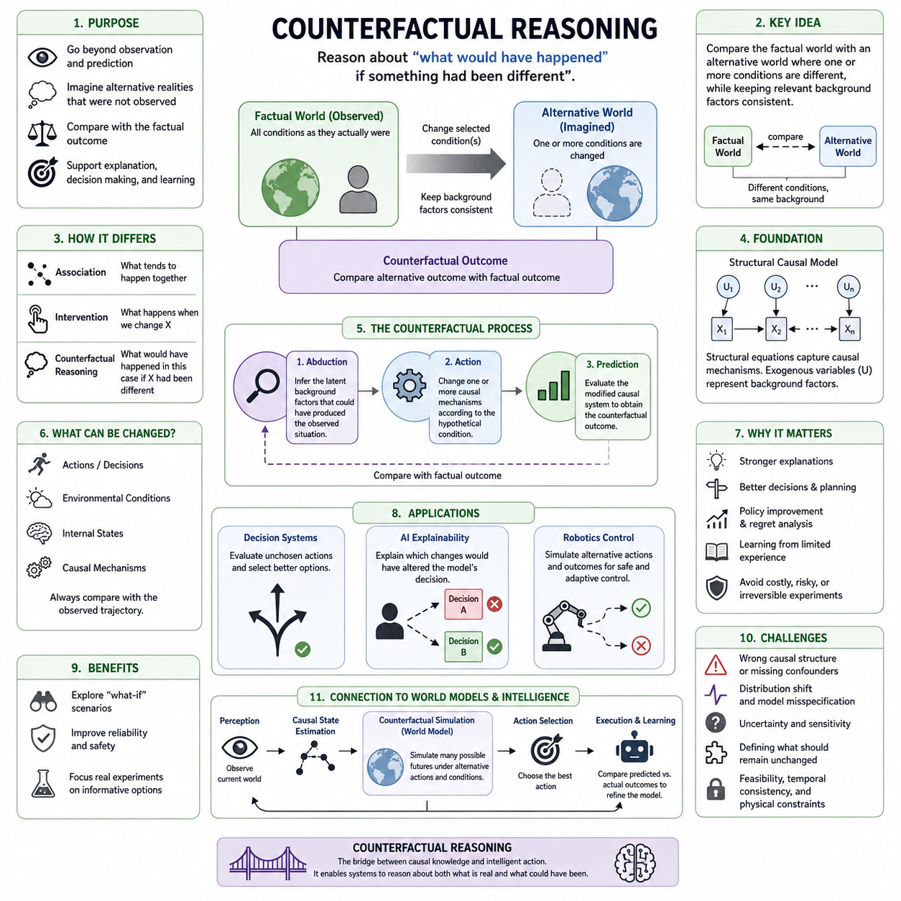
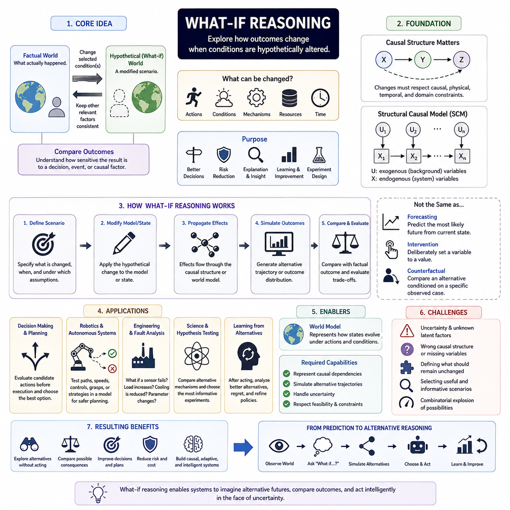
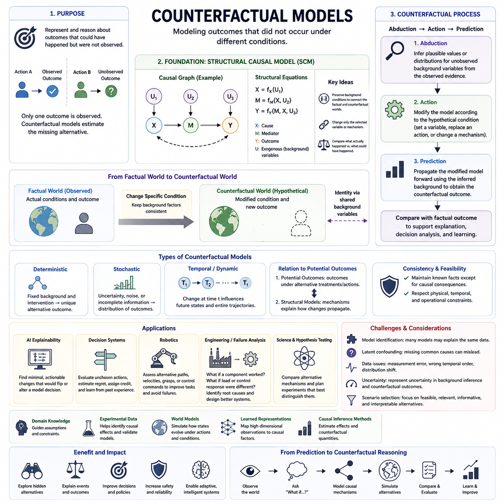
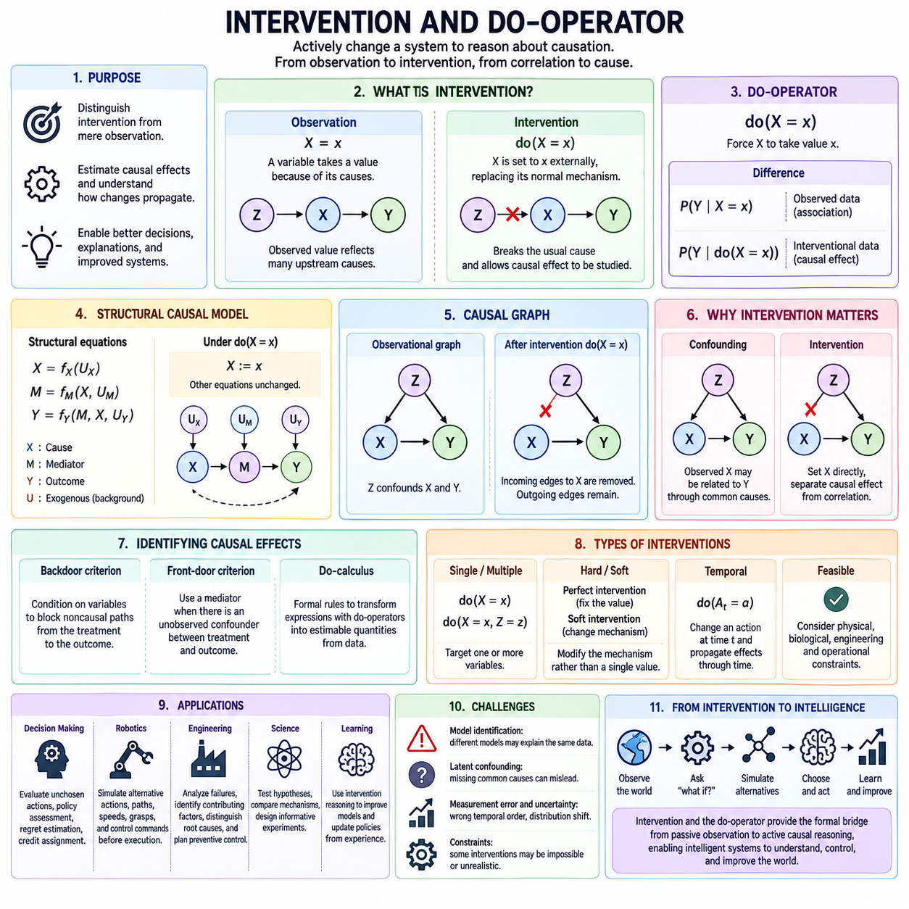
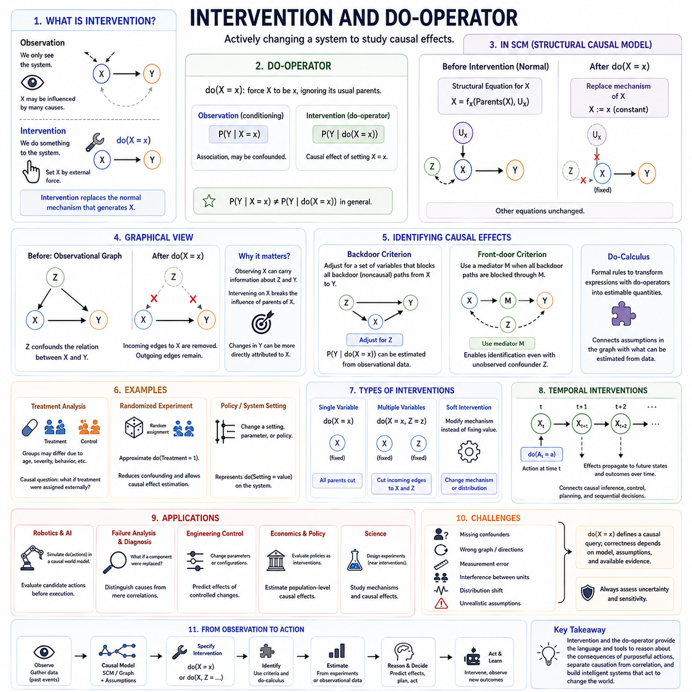
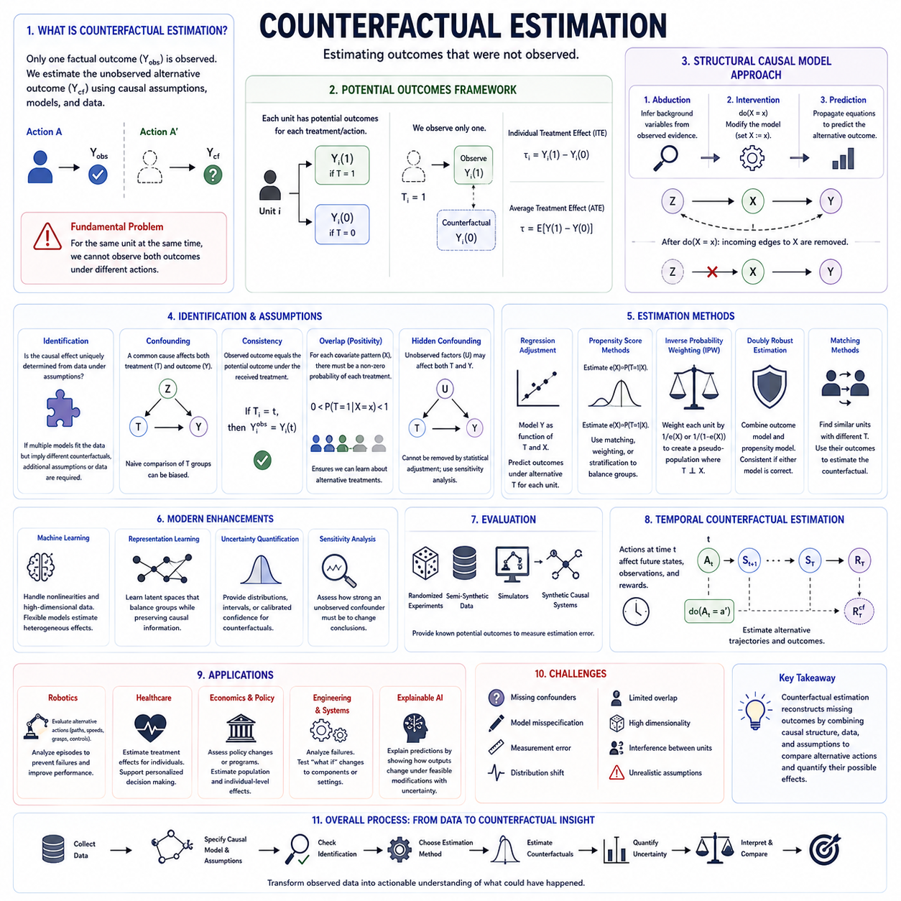
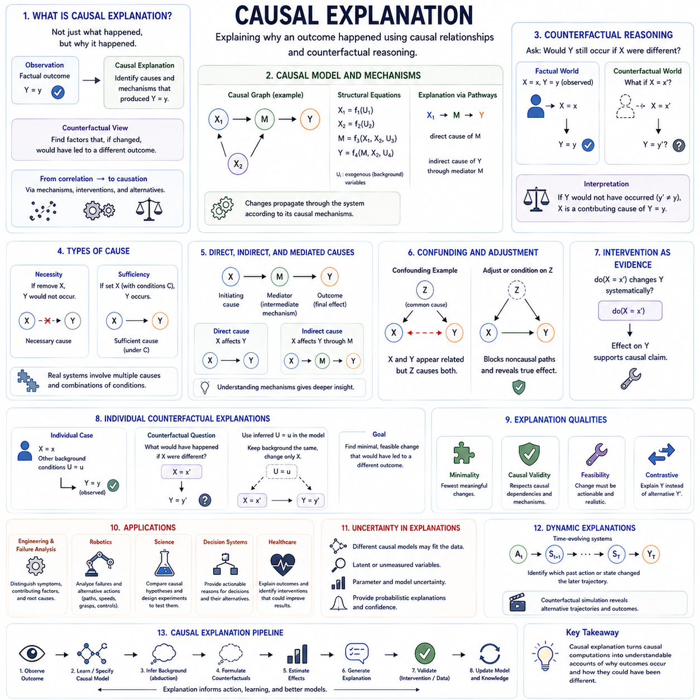
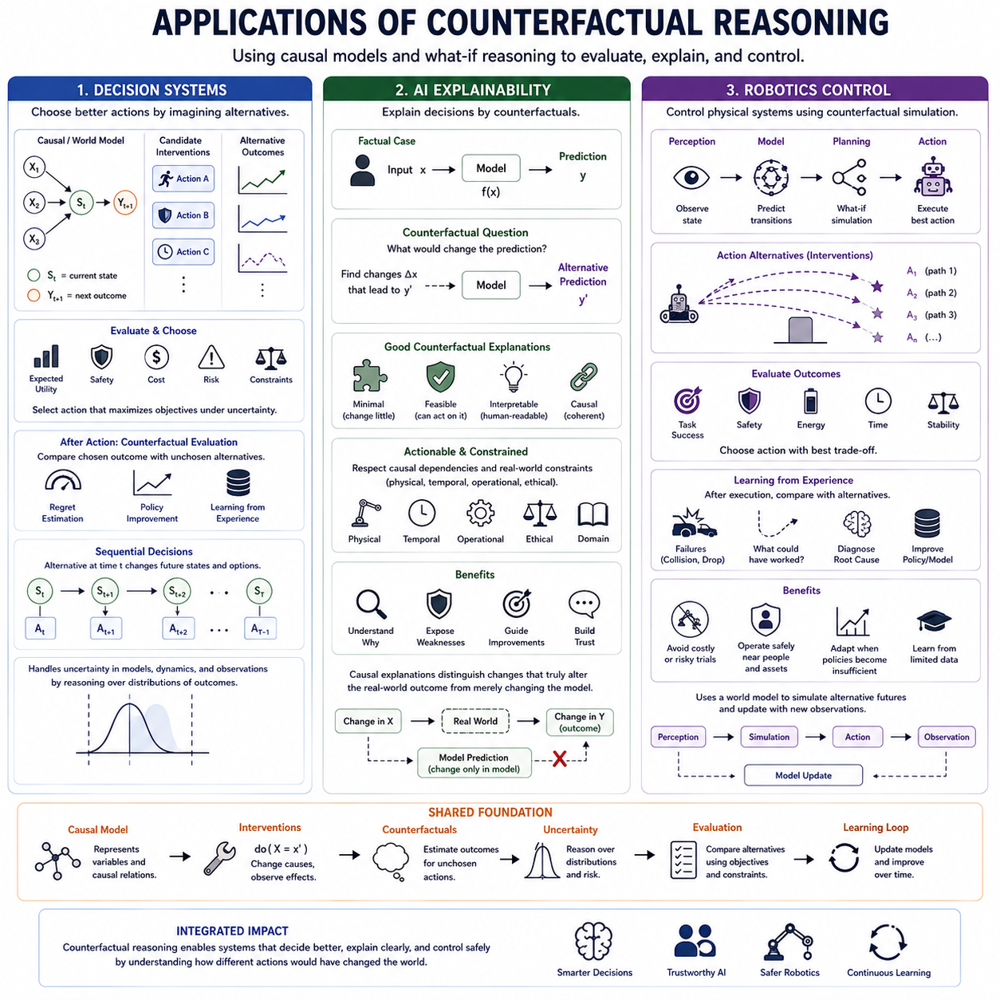

**Volume 46. Causality and Scientific AI**

# Chapter 03. Counterfactual Reasoning

## 03.00. Overview

{width="7.268055555555556in" height="7.268055555555556in"}

Counterfactual reasoning extends causal analysis beyond observing what happened and estimating what would happen under an intervention. It asks what would have happened to the same individual, system, or situation if some relevant condition had been different. This ability transforms causal knowledge into a mechanism for comparing reality with alternative possibilities that were never simultaneously observed.

A counterfactual begins with a factual world containing observed variables, events, actions, and outcomes. Reasoning then constructs an alternative world in which one or more conditions are modified while appropriate background factors remain consistent. The resulting outcome is compared with the factual outcome, allowing a system to reason about alternative causes, decisions, failures, opportunities, and consequences.

This form of reasoning differs fundamentally from ordinary prediction. A predictive model may estimate the probability of an outcome from correlations in historical data, whereas counterfactual reasoning asks how the outcome would change if a specific causal factor were altered. Consequently, useful counterfactual inference requires knowledge about causal structure rather than merely an accurate statistical mapping between inputs and outputs.

Structural causal models provide a rigorous foundation for counterfactual reasoning. Variables are connected through structural equations representing causal mechanisms, while exogenous variables encode background conditions that are not explained within the model. Once the observed situation is associated with plausible values of these background variables, the model can modify a causal mechanism and simulate an alternative outcome.

A common conceptual procedure consists of abduction, action, and prediction. During abduction, observed evidence is used to infer the latent background circumstances that could have generated the factual situation. During action, a selected causal relationship is modified according to the hypothetical condition. During prediction, the modified causal system is evaluated to determine the corresponding counterfactual outcome.

Counterfactual reasoning therefore operates at a deeper level than association and intervention alone. Association asks what tends to occur when variables are observed together, while intervention asks what is expected to occur when a variable is deliberately changed. Counterfactual reasoning additionally conditions the hypothetical analysis on what is already known about a particular realized case, connecting causal mechanisms with individual situations.

The distinction is especially important because factual and counterfactual outcomes for the same case generally cannot both be observed. If a robot selected path A, the exact same episode cannot simultaneously reveal what would have occurred had it selected path B. Counterfactual inference must therefore reconstruct the missing alternative through causal assumptions, structural knowledge, uncertainty modeling, experimental evidence, or combinations of these sources.

Counterfactual questions can concern actions, environmental conditions, internal states, or causal mechanisms. An engineer may ask whether a failure would have occurred without a temperature increase, a physician may consider an outcome without a treatment, and an autonomous agent may evaluate whether another action would have avoided a collision. Despite different domains, each question compares an observed trajectory against a causally modified alternative.

This capability is closely related to explanation. Saying that two variables are correlated does not establish that changing one would have prevented an outcome. A stronger explanation evaluates whether the outcome would remain unchanged when the suspected cause is removed or modified. Counterfactual dependence can therefore help identify which factors were causally important to a particular event and distinguish them from coincidental associations.

Counterfactuals are also central to decision making because intelligent agents must evaluate actions that they did not actually execute. After observing an outcome, an agent can ask whether another decision would have produced a better result. Repeated counterfactual evaluation supports policy improvement, regret analysis, planning, credit assignment, and learning from limited experience without physically executing every conceivable alternative action.

For AI explainability, counterfactual reasoning provides an intuitive form of explanation based on meaningful changes. Instead of only reporting feature importance, a system can describe which changes would have altered its decision. For example, a counterfactual explanation may indicate that an output would have changed if a small set of causally relevant conditions had differed, making model behavior easier to examine and challenge.

In robotics, counterfactual reasoning can become part of a perception--prediction--action loop. A robot observes the current world, estimates causal state, considers candidate interventions, predicts alternative future trajectories, and chooses an action according to expected consequences. After execution, discrepancies between predicted and observed outcomes can refine the causal model, gradually improving planning and adaptation in unfamiliar environments.

Counterfactual simulation becomes particularly valuable when real experimentation is expensive, dangerous, slow, or irreversible. Industrial systems can examine alternative operating parameters before modifying equipment, autonomous vehicles can evaluate avoided-collision scenarios, and scientific AI systems can explore hypothetical mechanisms before conducting experiments. Such reasoning can reduce unnecessary interventions while directing physical experiments toward informative alternatives.

However, counterfactual conclusions are only as reliable as the causal assumptions supporting them. Incorrect graph structures, missing confounders, inaccurate structural equations, distribution shifts, or poorly modeled latent variables can produce convincing but invalid alternative worlds. Counterfactual systems therefore require uncertainty estimation, sensitivity analysis, causal validation, and explicit documentation of assumptions rather than treating simulated alternatives as observed facts.

Another challenge is defining which aspects of the factual world should remain unchanged. Unrealistic counterfactuals may modify one variable while ignoring other variables that must causally change with it. Effective reasoning must respect feasibility, temporal consistency, physical constraints, and causal dependencies so that alternative scenarios represent coherent worlds rather than arbitrary combinations of values that could never occur.

Counterfactual reasoning also connects naturally with world models and model-based intelligence. A sufficiently structured world model should represent not only likely future states but also how those states respond to alternative actions and causal changes. This allows an intelligent system to move from forecasting a single probable future toward evaluating multiple possible futures generated by different decisions, interventions, and environmental conditions.

Within the broader structure of causality and scientific AI, counterfactual reasoning therefore serves as a bridge between structural causal knowledge and intelligent action. The chapter progresses from what-if reasoning and counterfactual models to interventions, estimation, causal explanation, and applications in decision systems, explainable AI, and robotics control, establishing the conceptual foundation for systems that reason about both actual and unrealized possibilities.

## 03.01. What if Reasoning

{width="7.268055555555556in" height="7.268055555555556in"}

What-if reasoning is the process of exploring how an outcome might change when one or more conditions in a situation are hypothetically altered. Rather than accepting the observed world as the only possible trajectory, an intelligent system constructs alternative scenarios and asks how events would unfold under different assumptions, actions, environmental states, or causal mechanisms.

The central idea is to distinguish the factual situation from a hypothetical alternative. The factual world represents what actually occurred, while the hypothetical world changes selected conditions and preserves other relevant background factors as consistently as possible. The comparison between these two worlds provides information about how sensitive an outcome is to a particular decision, event, or causal factor.

What-if reasoning is broader than simple forecasting because it does not merely ask what is likely to happen next. Forecasting typically extrapolates from the current state and historical patterns, whereas what-if reasoning explicitly changes part of the assumed state or mechanism. It therefore supports questions such as what would happen if an action were delayed, a component failed, a resource became unavailable, or an environmental condition changed.

The usefulness of what-if reasoning depends on defining the hypothetical modification precisely. A vague question such as "what if the system were different?" does not specify which variables should change or which relationships should remain fixed. A meaningful scenario must identify the modified condition, the relevant causal dependencies, the time at which the change occurs, and the assumptions that define the alternative world.

In causal analysis, what-if reasoning can operate at different levels of strength. A simple scenario may change an input and observe how a predictive model responds, but this does not necessarily represent a valid causal alternative. Stronger reasoning modifies a variable according to a causal model so that downstream consequences follow the structural relationships that connect causes, intermediate states, and outcomes.

This distinction matters because correlated variables cannot always be changed independently. If one variable is causally determined by another, constructing an alternative state by modifying only one may produce an impossible or internally inconsistent scenario. Reliable what-if reasoning must therefore respect causal constraints, physical relationships, temporal ordering, and domain knowledge when generating hypothetical alternatives.

Structural causal models provide a natural framework for representing these dependencies. Variables are connected through causal mechanisms that describe how each state is generated from its causes. A hypothetical change can then be introduced into a selected mechanism or variable, after which the model propagates the resulting effects through the remaining causal structure to estimate a new outcome.

What-if reasoning is closely related to intervention reasoning, although the two concepts should not be treated as identical in every context. An intervention asks what happens when a variable is deliberately set to a value, while a broader what-if question may involve changes to actions, assumptions, mechanisms, resources, or environmental conditions. Counterfactual reasoning further specializes this process by conditioning the hypothetical alternative on a particular observed case.

Temporal structure is especially important in dynamic systems. Changing an event at one moment can alter later states, which in turn influence subsequent observations and decisions. In such systems, a what-if scenario is better represented as an alternative trajectory rather than a single modified data point, because the consequences of one change may accumulate and interact across multiple future time steps.

For decision systems, what-if reasoning provides a mechanism for evaluating actions before they are executed. An agent can generate candidate actions, predict their consequences, compare expected outcomes, and select the action that best satisfies its objective. This ability is fundamental to planning because most candidate actions must be evaluated without first performing them in the real environment.

After an action has already been taken, the same reasoning framework can support learning from alternatives. A system may examine whether another action could have produced a better result, whether an observed failure could have been avoided, or whether a different sequence of choices would have reduced cost or risk. Such analysis supports regret evaluation, policy refinement, and improved future decision making.

What-if reasoning is particularly valuable in robotics and autonomous systems because physical experimentation can be expensive or dangerous. A robot can evaluate alternative paths, velocities, control commands, grasp strategies, or interaction sequences inside a model before selecting an action. This reduces the need to test every alternative directly in the physical world and enables safer planning under uncertainty.

For example, an autonomous robot approaching an obstacle may consider several hypothetical futures. It can estimate the consequences of continuing forward, slowing down, stopping, or changing direction. Each alternative modifies the intended action while maintaining the current environmental context, allowing the robot to compare predicted trajectories and choose the option with the most acceptable safety and task outcome.

Engineering systems use similar reasoning for fault analysis and system design. Engineers may ask what would happen if a sensor failed, a structural load increased, a cooling system became less effective, or a control parameter changed. By examining the propagation of these hypothetical disturbances, the system can identify critical dependencies, vulnerable components, and possible mitigation strategies before an actual failure occurs.

What-if analysis is also useful in scientific reasoning because hypotheses often describe alternative mechanisms or conditions. A scientific AI system can compare predictions generated under competing explanations and determine which experiments would most effectively distinguish them. In this sense, hypothetical reasoning helps transform a model from a passive predictor into an active tool for designing informative experiments.

World models provide an important computational foundation for this capability in intelligent agents. A world model represents how states evolve under actions and environmental influences, allowing the system to internally simulate possible futures. What-if reasoning uses this internal model to create multiple hypothetical trajectories rather than committing immediately to one predicted future.

A stronger world model should support more than statistical continuation of observed patterns. It should represent which variables can be changed, which states are causally dependent, which transitions are physically possible, and how uncertainty propagates through alternative scenarios. These properties allow hypothetical simulation to remain consistent with the structure of the environment rather than generating merely plausible-looking futures.

Uncertainty remains unavoidable because hypothetical outcomes are not directly observed. Different causal structures, unknown latent factors, incomplete state estimation, and stochastic dynamics can produce different predictions from the same what-if question. Intelligent systems should therefore represent a range of possible outcomes or confidence levels rather than presenting every hypothetical simulation as a certain consequence.

The quality of what-if reasoning also depends on selecting useful alternatives. The number of imaginable scenarios can grow extremely large, making exhaustive simulation impractical. Effective systems must prioritize scenarios that are feasible, causally meaningful, relevant to the current objective, sufficiently different from the factual trajectory, or particularly informative for reducing uncertainty and improving decisions.

Another important requirement is minimal and interpretable change. In many applications, the most useful hypothetical scenario is not one that completely reconstructs the world but one that alters a small number of relevant factors. Such scenarios make it easier to understand why an outcome changes and help identify which decisions or conditions have the greatest causal influence on the result.

What-if reasoning therefore connects causal modeling, simulation, planning, explanation, and learning. It enables AI systems to explore alternatives without immediately acting on them, compare possible consequences, and use those comparisons to improve decisions. Within counterfactual reasoning, it forms the conceptual entry point for progressively more rigorous analysis of interventions, alternative outcomes, and causal explanations.

As AI systems become more autonomous, the ability to ask meaningful what-if questions becomes increasingly important. An intelligent system should not only recognize the current state and predict its most likely continuation, but also reason about how the future could change under different choices and conditions. This transition from passive prediction to structured alternative reasoning is a key step toward adaptable, causal, and decision-capable intelligence.

## 03.02. Counterfactual Models

{width="7.268055555555556in" height="7.268055555555556in"}

Counterfactual models provide a formal representation for reasoning about outcomes that did not actually occur but could have occurred under different conditions. They connect observed evidence with hypothetical alternatives by specifying how variables are causally generated and how those mechanisms would respond to changes. This makes counterfactual analysis more disciplined than unconstrained imagination or ordinary scenario generation.

The central problem addressed by a counterfactual model is that only one realized outcome can normally be observed for a particular situation. If an autonomous system chooses action A, the same physical episode cannot simultaneously reveal the outcome of action B. A counterfactual model represents this missing alternative mathematically or computationally, allowing the unrealized outcome to be estimated from causal assumptions and available evidence.

Structural causal models provide one of the most important foundations for constructing counterfactual models. A structural causal model represents variables through equations that specify how each endogenous variable is determined by its causal parents and exogenous background variables. These equations describe mechanisms rather than merely statistical associations, allowing selected mechanisms to be modified while the remainder of the causal system is preserved.

Exogenous variables play a particularly important role because they represent background conditions that are not explained by other variables inside the model. They may capture individual characteristics, environmental circumstances, disturbances, or latent factors. Counterfactual reasoning attempts to preserve background circumstances associated with the observed case while changing the specific variable or mechanism involved in the hypothetical question.

This preservation creates a connection between the factual and counterfactual worlds. Rather than generating an entirely independent alternative sample, the model asks what would happen to the same underlying case under a different causal condition. Shared background variables provide a form of identity across the two worlds, enabling meaningful comparison between what actually happened and what could have happened.

Counterfactual inference is commonly understood through the sequence of abduction, action, and prediction. Abduction uses observed evidence to infer plausible values or distributions for unobserved background variables. Action modifies the causal model according to the hypothetical condition. Prediction then propagates the modified causal mechanisms forward to calculate the outcome that would arise in the resulting counterfactual world.

During abduction, the model effectively reconstructs the hidden circumstances that may have produced the observed evidence. Because these circumstances are often uncertain, the result may be a probability distribution rather than a single state. Maintaining this uncertainty is important because several latent configurations may explain the same observations, and they may generate different outcomes after a hypothetical intervention.

The action stage creates the counterfactual change. A variable may be assigned a different value, an action may be replaced, or a causal mechanism may be altered according to the question being investigated. The modification must be distinguished from ordinary observation because changing a cause can break its original generating relationship and produce downstream consequences throughout the causal system.

Prediction evaluates the modified model while retaining the background information inferred from the factual case. Downstream variables are recomputed according to their structural equations, producing the hypothetical outcome. Comparing this result with the observed outcome reveals how the selected change could have affected the system and provides the basis for counterfactual explanation, decision analysis, and alternative-action evaluation.

Counterfactual models can represent deterministic or stochastic systems. In deterministic models, fixed background variables and a specified intervention determine a unique alternative outcome. In stochastic environments, multiple outcomes may remain possible because of uncertainty, noise, incomplete observations, or probabilistic dynamics. The model should therefore represent distributions over counterfactual outcomes when a single deterministic answer cannot be justified.

Temporal counterfactual models extend these ideas to sequences and dynamic systems. Instead of changing one isolated variable, they can modify an action or event at a particular time and simulate its effects across subsequent states. This is especially important for autonomous systems, where an early decision may alter later observations, opportunities, risks, and actions, producing an entirely different trajectory.

Counterfactual models are closely related to potential outcomes, but the two perspectives emphasize different representations. Potential-outcome reasoning describes outcomes associated with alternative treatments or actions, whereas structural models explicitly represent the mechanisms connecting variables. Both address unrealized alternatives, but structural representations can provide richer explanations of how changes propagate through intermediate causal relationships.

A critical requirement is counterfactual consistency. The hypothetical world should remain compatible with known facts except where changes are required by the counterfactual condition and its causal consequences. Arbitrarily modifying unrelated variables can produce an incoherent scenario. Good models therefore preserve relevant factual information while allowing causally downstream variables to respond naturally to the hypothetical modification.

Feasibility is equally important. A mathematically possible counterfactual may violate physical, biological, engineering, temporal, or operational constraints. Counterfactual models used in real systems should distinguish merely representable states from realistically achievable alternatives. This is particularly important when counterfactual results are used to recommend actions rather than simply explain past events.

For AI explainability, counterfactual models can identify changes that would have altered a model or system decision. Instead of reporting only that a variable was influential, the system can evaluate alternative values and determine whether the decision would change. Useful explanations generally favor small, understandable, actionable, and feasible modifications rather than unrealistic combinations of many simultaneous changes.

In decision systems, counterfactual models allow an agent to evaluate actions that were not selected. After observing the consequence of one action, the agent can estimate what alternative actions might have produced under comparable background conditions. This supports policy evaluation, regret estimation, credit assignment, offline learning, and improvement from historical experience without requiring every candidate decision to be executed.

Robotics provides a natural application because robots continuously interact with environments in which actions have physical consequences. A robot can reason about whether another velocity, path, grasp, or control command would have prevented a failure or improved task performance. Such models can combine state estimation, dynamics, causal structure, and simulation to reconstruct alternative trajectories from recorded episodes.

Counterfactual models can also contribute to failure analysis in engineering. After a system failure, the model can examine whether the outcome would still have occurred if a component had remained functional, a load had been smaller, or a control response had been different. This helps distinguish contributing factors from root causes and can guide redesign, maintenance strategies, and preventive control.

The reliability of counterfactual conclusions depends strongly on model identification and causal assumptions. Observational data alone may not determine every causal relationship or counterfactual quantity uniquely. Different structural models can sometimes explain the same observed distribution while implying different hypothetical outcomes, making experimental evidence, domain knowledge, assumptions, and sensitivity analysis essential components of responsible inference.

Latent confounding presents another challenge. If important common causes are missing, the model may attribute changes to the wrong mechanism and produce misleading alternatives. Measurement error, incomplete state representation, incorrect temporal ordering, and distribution shift can create similar problems. Counterfactual estimates should therefore be accompanied by uncertainty and by clear statements about assumptions that cannot be verified directly from available data.

Modern AI creates opportunities to combine counterfactual models with learned representations and world models. High-dimensional observations such as images, language, sensor streams, and robot states can be mapped into latent representations in which relevant causal factors are modeled. The challenge is to ensure that learned latent variables capture mechanisms that support interventions rather than only statistical features useful for prediction.

A causal world model can extend ordinary predictive simulation by representing how alternative interventions produce different future trajectories. Instead of asking only what will probably happen next, the system can ask what would happen under action A, action B, or a changed environmental condition. Counterfactual modeling therefore provides an important mechanism for turning internal simulation into structured causal reasoning.

Counterfactual models ultimately connect observed experience, causal structure, and unrealized possibilities within one reasoning framework. They enable intelligent systems to reconstruct alternative outcomes, explain events, evaluate unchosen actions, analyze failures, and improve future decisions. Within causal AI, they provide the formal bridge from general what-if reasoning toward rigorous intervention, counterfactual estimation, causal explanation, and autonomous decision making.

## 03.03. Intervention and Do Operator

{width="7.268055555555556in" height="7.268055555555556in"}

{width="7.268055555555556in" height="7.268055555555556in"}

Intervention is a central concept in causal reasoning because it distinguishes actively changing a system from merely observing it. When a variable is observed to have a particular value, its value may reflect many upstream causes. When the same variable is deliberately set through an intervention, its ordinary causal generation mechanism is replaced, allowing the consequences of that controlled change to be studied separately from observational associations.

The do-operator provides a formal notation for expressing interventions. The expression do(X = x) means that variable X is externally forced to take value x rather than receiving its value through its normal causal parents. This operation represents a modification of the causal system itself, making it fundamentally different from simply conditioning on the observation X = x in a probability distribution.

This distinction can be expressed through the difference between P(Y \| X = x) and P(Y \| do(X = x)). The first quantity describes the distribution of Y among cases where X is observed to equal x, while the second describes the distribution of Y when X is deliberately set to x. These quantities may coincide under suitable conditions, but confounding or selection mechanisms can cause them to differ substantially.

A structural causal model makes the meaning of intervention especially clear. Suppose X is normally generated by a structural equation using its causal parents and an exogenous variable. Under do(X = x), this structural equation is replaced by the constant assignment X := x. The remaining structural equations stay unchanged, allowing the effects of the intervention to propagate through descendants of X according to the model\'s causal mechanisms.

Graphically, an intervention can be represented by modifying the causal graph associated with the model. When do(X = x) is applied, incoming causal edges from the parents of X are removed because those variables no longer determine X. Outgoing edges from X remain, since X can still influence its descendants. The resulting modified graph represents the causal system under the intervention rather than the original observational system.

This graph modification explains why intervention can separate causation from correlation. If a common cause Z influences both X and Y, observing X may provide information about Z and therefore about Y even when X has no direct causal effect on Y. Intervening on X breaks the normal influence of its parents, allowing changes in Y to be attributed more directly to causal pathways originating from X.

Confounding is therefore one of the main reasons the do-operator is needed. Observational data may contain statistical relationships produced by common causes rather than direct causal influence. Causal inference attempts to determine whether an interventional quantity can be estimated despite these relationships. When appropriate variables are measured, adjustment methods can sometimes reconstruct the effect of intervention from observational data.

A familiar example is treatment analysis. Patients receiving a treatment may differ systematically from untreated patients because age, disease severity, behavior, or other factors influence treatment selection. Comparing the two observed groups directly may therefore produce a biased estimate. The causal question instead asks what the outcome distribution would be if treatment status were externally assigned, corresponding conceptually to an interventional distribution.

Randomized experiments approximate this intervention by assigning treatment independently of many pre-existing causes. Randomization reduces systematic dependence between treatment assignment and confounding variables, making causal effects easier to estimate. However, experiments may be expensive, dangerous, unethical, or impossible, which motivates methods for identifying interventional effects from observational evidence combined with causal assumptions.

The backdoor criterion provides an important graphical principle for identifying causal effects. A set of variables can sometimes be conditioned on to block noncausal paths entering the treatment variable through its causal ancestors. If an appropriate adjustment set satisfies the required graphical conditions, observational quantities can be combined to estimate the distribution that would have resulted from an intervention.

Not every causal effect can be recovered through ordinary adjustment. Some causal structures contain mediators, latent confounders, selection effects, or other relationships requiring more sophisticated reasoning. The front-door criterion provides one important example in which a measured mediator can sometimes support identification even when the treatment and outcome are affected by an unobserved confounder.

Do-calculus generalizes these ideas by providing formal rules for transforming expressions containing interventions and observations. Its purpose is to determine whether a causal query involving do-operators can be rewritten using quantities available from observed or experimental distributions. This makes do-calculus an important theoretical bridge between assumptions encoded in causal graphs and quantities that can actually be estimated from data.

Intervention can target more than one variable. Expressions such as do(X = x, Z = z) represent simultaneous manipulations in which multiple generating mechanisms are replaced. Such interventions are useful for reasoning about coordinated policies, system configurations, robot actions, or experimental settings. Their effects must still be evaluated according to the remaining causal structure after the specified mechanisms have been modified.

Interventions may also be understood at different levels of realism. A perfect intervention completely overrides the normal mechanism generating a variable, while softer interventions can alter a mechanism without fixing its output to one constant value. Real systems often resemble soft interventions because control policies, environmental changes, or parameter adjustments modify probability distributions or mechanisms rather than deterministically assigning exact states.

Temporal interventions are especially important in dynamic systems. Applying an action at time t can modify the state at t+1, which then influences later observations, actions, and outcomes. Intervention reasoning must therefore consider how causal effects propagate through time. Repeated interventions create action-conditioned trajectories and provide a natural connection between causal inference, sequential decision making, control, and planning.

In robotics, the distinction between observation and intervention is fundamental because robots continuously act upon their environments. Observing that an object occupies a location differs from moving it there, just as observing low velocity differs from commanding the robot to slow down. Robot actions alter the causal state of the environment and therefore should be modeled as interventions when reasoning about their consequences.

A robot equipped with a causal world model can use interventions to evaluate candidate actions before physical execution. It may simulate do(turn = left), do(speed = low), or alternative manipulation commands and compare the resulting trajectories. This enables planning to move beyond statistical continuation of past observations toward explicit reasoning about how deliberate actions can change future states.

Intervention reasoning also supports failure analysis and diagnosis. An engineer may ask whether a failure would disappear if a particular component were replaced, a control parameter changed, or an environmental disturbance removed. By representing these modifications as interventions, the analysis can distinguish factors that merely correlate with failure from mechanisms whose manipulation would actually change the outcome.

The relationship between intervention and counterfactual reasoning is close but conceptually distinct. Intervention generally asks what would happen across a population or system if a variable were deliberately changed. Counterfactual reasoning additionally conditions the hypothetical intervention on evidence about a particular realized case, asking what would have happened in that same case under a different intervention.

This distinction corresponds to progressively richer levels of causal reasoning. Association concerns patterns in observations, intervention concerns consequences of deliberate changes, and counterfactual reasoning concerns alternative outcomes for specific observed situations. The do-operator provides the formal language for the intervention level and also becomes an essential component when constructing more advanced counterfactual queries.

Reliable intervention analysis depends on the correctness of the assumed causal model. Missing confounders, incorrect edge directions, measurement errors, interference between units, distribution shifts, or unrealistic intervention assumptions can invalidate causal estimates. The notation do(X = x) does not itself guarantee causality; it defines a causal query whose answer remains dependent on structural assumptions and available evidence.

For intelligent systems, the importance of intervention extends beyond estimating isolated causal effects. Autonomous agents must understand which aspects of the world they can manipulate, how actions propagate through causal mechanisms, and which consequences remain uncertain. Combining intervention models with perception, world models, simulation, planning, and learning enables AI to reason about actions as mechanisms for deliberately transforming future states.

Intervention and the do-operator therefore provide a formal transition from passive observation to active causal reasoning. They clarify the difference between seeing a condition and creating it, provide a mathematical language for controlled changes, and support identification of causal effects from experiments or observational evidence. Within counterfactual reasoning, this framework establishes the mechanism through which hypothetical actions modify causal worlds and generate alternative outcomes.

## 03.04. Counterfactual Estimation [w/Code]

{width="7.268055555555556in" height="7.268055555555556in"}

Counterfactual estimation is the process of estimating outcomes that were not observed for a particular individual, system, or event. Because only one factual outcome is realized, the corresponding alternative outcome is fundamentally missing. The objective is therefore to infer this unobserved result from causal assumptions, observed evidence, structural models, experimental data, or combinations of these sources.

The fundamental difficulty is often called the fundamental problem of causal inference. For the same unit at the same moment, it is impossible to observe both the outcome under the factual action and the outcome under an alternative action. Counterfactual estimation attempts to reconstruct this missing quantity while preserving the characteristics and background conditions that define the original case.

In the potential outcomes framework, each unit is associated conceptually with multiple possible outcomes corresponding to different treatments or actions. If treatment T can take values 0 or 1, the outcomes may be written as Y(0) and Y(1). Only one is observed, while the other becomes the counterfactual outcome. Their difference represents an individual treatment effect that cannot normally be measured directly.

Population-level causal effects can nevertheless become estimable by combining information across comparable units. Quantities such as the Average Treatment Effect summarize expected differences between potential outcomes across a population. Counterfactual estimation at the individual level is generally more demanding because it requires stronger information about how the specific observed case would have behaved under another condition.

Structural causal models provide another framework for estimating counterfactuals. Observed evidence is first used to infer plausible background variables through abduction. The causal model is then modified according to the hypothetical intervention, and the resulting equations are evaluated to predict the alternative outcome. This procedure maintains a connection between the factual and counterfactual worlds through shared latent circumstances.

The quality of estimation depends strongly on whether the causal effect is identifiable. Identification asks whether a counterfactual or interventional quantity can be uniquely determined from the available data under specified causal assumptions. If multiple causal models are compatible with the observed data but imply different counterfactual outcomes, additional assumptions, experiments, or measurements are required.

Confounding is a major obstacle because treatment or action selection may depend on variables that also affect the outcome. Directly comparing treated and untreated observations can therefore produce biased estimates. Adjustment strategies attempt to make groups comparable with respect to relevant confounders so that differences in outcomes better approximate the consequences of changing the treatment itself.

Regression adjustment estimates outcomes as functions of treatments and observed covariates, allowing the model to predict what each unit might experience under alternative treatment values. The same individual can then be evaluated under multiple hypothetical conditions. However, reliable estimation requires adequate model specification and sufficient overlap between the observed treatment groups.

Propensity score methods approach the same problem from the treatment-assignment side. A propensity score estimates the probability that a unit receives a treatment given its observed characteristics. Matching, weighting, or stratifying observations according to these probabilities can construct more comparable populations and reduce bias caused by measured confounding.

Inverse probability weighting assigns larger weights to observations whose received treatments were relatively unlikely given their characteristics. The resulting weighted sample can approximate a pseudo-population in which treatment is less dependent on measured confounders. Counterfactual expectations can then be estimated by comparing outcomes across these reweighted treatment conditions.

Doubly robust estimation combines an outcome model with a treatment-assignment model. The estimator can remain consistent when either the outcome model or the propensity model is correctly specified under appropriate assumptions. This combination is attractive in practical causal analysis because it reduces dependence on the correctness of a single modeling component.

Matching methods estimate counterfactual outcomes by finding observations with similar relevant characteristics but different treatments or actions. The observed outcome of a sufficiently comparable unit can serve as an approximation to the missing outcome. Matching is intuitive, but its reliability decreases when high-dimensional covariates make genuinely comparable observations difficult to find.

Overlap, also called positivity, is essential for many estimation methods. For each relevant combination of characteristics, there must be meaningful probability of observing the alternative treatments being compared. If certain individuals always receive only one treatment, the data contain little direct evidence about what would happen to those individuals under another treatment.

Consistency provides another important assumption. It connects the observed outcome with the potential outcome corresponding to the treatment actually received. If a unit receives treatment T = 1, its observed outcome should correspond to Y(1). This apparently simple relationship becomes difficult when treatments are poorly defined, have multiple versions, or interact with contextual factors.

Unobserved confounding remains particularly challenging. Statistical adjustment can only control variables that have been measured or otherwise represented. If hidden factors influence both treatment and outcome, counterfactual estimates may remain biased even after sophisticated modeling. Sensitivity analysis is therefore important for examining how strongly an unobserved confounder would need to act to change the conclusion.

Machine learning can improve counterfactual estimation when outcomes depend on complex nonlinear relationships or high-dimensional covariates. Tree ensembles, neural networks, representation learning, and specialized causal learning architectures can estimate heterogeneous effects across populations. Their predictive flexibility is useful, but high predictive accuracy alone does not guarantee valid causal estimation.

Representation learning can attempt to construct latent spaces in which treated and untreated populations become more comparable while retaining information relevant to outcomes. This is especially useful when inputs include images, sensor data, language, or other complex observations. The central challenge is ensuring that the representation preserves causal factors instead of merely compressing statistical correlations.

Counterfactual uncertainty should be estimated whenever possible because the hypothetical outcome is never directly observed for validation in the same case. Uncertainty may originate from finite data, measurement noise, model parameters, latent variables, causal structure, or stochastic dynamics. Reliable systems should therefore provide distributions, intervals, or calibrated confidence rather than unsupported point estimates.

Evaluation of counterfactual estimators is difficult because ground-truth individual counterfactuals are typically unavailable in observational datasets. Randomized experiments, semi-synthetic datasets, simulators, and fully synthetic causal systems are therefore useful for benchmarking. These environments provide known treatment mechanisms or potential outcomes against which estimation errors can be measured.

Temporal counterfactual estimation extends the problem from isolated treatments to sequences of decisions. An alternative action at one time may change subsequent states, observations, available actions, and future rewards. Estimation must therefore reconstruct an entire alternative trajectory rather than predict one missing value, creating strong connections with sequential causal inference and reinforcement learning.

In robotics, counterfactual estimation can analyze recorded episodes to determine whether alternative actions might have prevented failures or improved performance. A robot may estimate outcomes under different velocities, paths, grasp configurations, or control commands. Combining causal models with dynamics and world models allows alternative trajectories to be evaluated without physically replaying every possibility.

Counterfactual estimation is also valuable for explainable AI. Instead of reporting only which variables influenced a prediction, a system can estimate how the outcome or decision would change under feasible modifications. Effective explanations usually favor minimal, actionable alternatives whose estimated effects are both causally meaningful and accompanied by uncertainty.

Ultimately, counterfactual estimation converts hypothetical reasoning into measurable causal quantities. It combines assumptions about causal structure with observational or experimental evidence to reconstruct missing outcomes, compare alternative actions, and quantify possible effects. Within counterfactual reasoning, it provides the computational bridge from asking what might have happened to estimating how different the alternative outcome could actually have been.

## 03.05. Causal Explanation

{width="7.268055555555556in" height="7.268055555555556in"}

Causal explanation seeks to answer not only what happened, but why it happened in terms of underlying causal relationships. Within counterfactual reasoning, an explanation becomes stronger when it identifies factors whose alteration would have changed the observed outcome. This moves explanation beyond descriptive correlation toward claims about mechanisms, interventions, and alternative possibilities.

A descriptive explanation may identify variables that frequently appear together, but such associations do not establish that one variable produced another. Causal explanation requires a model of how changes propagate through a system. It therefore depends on distinguishing causes from consequences, identifying relevant intermediate variables, and recognizing background conditions that may influence both the proposed cause and the outcome.

Structural causal models provide a natural representation for causal explanations. Variables are connected through directed relationships, while structural equations describe how each variable is generated from its causal parents and exogenous influences. An explanation can then identify which pathways transmit causal influence and how modifying one component would alter downstream states while other mechanisms remain unchanged.

Counterfactual reasoning strengthens this framework by asking whether the outcome would still have occurred if a suspected cause had been different. If removing or changing a factor causes the modeled outcome to disappear, the factor may contribute causally to the event. If the outcome remains essentially unchanged, the factor may be correlated with the event without being necessary for its occurrence.

Causal explanation is therefore closely related to necessity and sufficiency. A cause may be necessary when the outcome would not have occurred without it, while another factor may be sufficient when its presence can generate the outcome under relevant conditions. Real systems frequently involve multiple interacting causes, so explanations often need to represent combinations of conditions rather than identify one isolated factor.

The distinction between direct and indirect causes is also important. A variable can affect an outcome through an intermediate mediator rather than through a direct causal edge. A useful explanation should distinguish the initiating cause, intermediate mechanisms, and final effect. This provides more insight than simply ranking correlated variables according to predictive importance.

Confounding complicates causal explanation because a common cause can make two variables appear related even when neither directly causes the other. If an explanation ignores such confounders, it may incorrectly attribute responsibility to an observed variable. Causal graphs and adjustment methods help determine whether an apparent relationship survives after relevant noncausal pathways are considered.

Intervention provides another test of explanatory claims. If changing X through do(X = x) systematically changes Y, this supports the interpretation that X lies on a causal pathway to Y under the assumed model. Observing X = x alone is weaker evidence because the observation may contain information about upstream variables that also influence Y.

Counterfactual explanations are especially useful for explaining individual cases. Rather than reporting only an average causal effect across a population, the system can ask what would have needed to change for the specific observed outcome to be different. This makes the explanation directly connected to the factual case while preserving the background conditions inferred for that case.

In explainable AI, this approach can produce explanations such as identifying the smallest feasible change that would alter a decision. Such explanations are often easier to interpret than large collections of feature-importance scores because they describe an alternative that has a clear consequence. However, the suggested modification should be causally valid, realistic, and actionable rather than merely statistically convenient.

Minimality is often desirable because explanations involving a small number of meaningful changes are easier to understand. Yet the smallest mathematical change is not always the best causal explanation. A useful explanation must also respect causal dependencies, temporal ordering, feasibility constraints, and the distinction between variables that can be manipulated and variables that merely describe a state.

Causal explanations can also be contrastive. Instead of asking only "Why did Y occur?", a user may ask "Why did Y occur rather than Y′?" The relevant explanation depends on this contrast because different causal factors may distinguish different alternative outcomes. Counterfactual models naturally support this form of reasoning by comparing the factual outcome with a specified alternative.

In engineering and failure analysis, causal explanation helps separate symptoms, contributing factors, and root causes. A component may correlate with a failure because both are consequences of another hidden problem. By testing counterfactual interventions such as replacing a component, reducing a load, or modifying control logic, the analysis can identify which mechanisms would actually prevent recurrence.

Robotics provides similar examples because a failed action often results from interacting perception, planning, control, environment, and dynamics. A robot can examine whether a different path, velocity, grasp, or state estimate would have changed the outcome. Such explanations can support debugging, policy improvement, safer operation, and learning from previously recorded episodes.

Causal explanation is also important for scientific AI because scientific understanding requires more than prediction. A model that predicts an event accurately may still fail to explain which mechanism produced it. By comparing alternative causal structures, interventions, and counterfactual outcomes, scientific systems can evaluate competing hypotheses and identify experiments that distinguish between them.

Uncertainty must remain visible in causal explanations. Different causal models may fit the same observational data while supporting different explanations, especially when important variables are latent or poorly measured. A responsible explanation should therefore reflect uncertainty about causal structure, parameter values, counterfactual outcomes, and assumptions rather than presenting one narrative as unquestionably true.

Explanation quality also depends on the intended user and purpose. An engineer may need a mechanistic explanation describing failure propagation, while a decision maker may need an actionable intervention and an AI user may need a concise contrastive explanation. The causal model can remain the same while the explanatory presentation selects different pathways, variables, and counterfactual comparisons.

World models can extend causal explanation into dynamic environments by representing how actions and states evolve over time. Instead of explaining only a static outcome, the system can identify which earlier action or state transition altered the later trajectory. Counterfactual simulation can then replay alternative trajectories and reveal how different interventions would have changed subsequent events.

For autonomous intelligence, causal explanation can become part of the learning loop rather than a separate reporting function. After observing an outcome, the system can reconstruct relevant causes, test alternative actions, compare counterfactual trajectories, and update its internal causal model. Explanation then contributes directly to adaptation, planning, diagnosis, and policy improvement.

Within the structure of counterfactual reasoning, causal explanation connects what-if reasoning, counterfactual models, interventions, and counterfactual estimation into an interpretable account of why outcomes occur. It transforms causal computations into structured explanations of mechanisms and alternatives, providing the conceptual bridge toward applications in decision systems, AI explainability, and robotics control.

## 03.06. Applications

{width="7.268055555555556in" height="7.268055555555556in"}

Counterfactual reasoning becomes operationally valuable when it is embedded in systems that must choose actions, explain outcomes, or control physical processes. Its applications extend causal analysis from retrospective understanding toward prospective intelligence. Decision systems, explainable AI, and robotics control all benefit from comparing observed or predicted outcomes with alternatives generated under different actions, interventions, or causal conditions.

In decision systems, an intelligent agent rarely has the opportunity to execute every possible action before choosing among them. It must evaluate alternatives internally and estimate their consequences. Counterfactual reasoning provides a framework for asking what would happen under different decisions while maintaining relevant aspects of the current situation, enabling choices to be based on causal consequences rather than correlation alone.

A decision system can represent candidate actions as interventions on a causal or world model. Each intervention generates an alternative trajectory containing possible future states, rewards, costs, risks, and constraints. By comparing these trajectories, the system can select actions according to expected utility, safety, task objectives, or multiple criteria while explicitly considering how its own actions change the environment.

Counterfactual evaluation is also useful after a decision has been executed. The system can compare the observed outcome with estimated outcomes for actions that were available but not selected. This supports regret estimation, policy improvement, credit assignment, and learning from historical decisions. Valuable information can therefore be extracted from experience without physically executing every alternative policy.

Sequential decision systems require counterfactual reasoning across time rather than for isolated actions. An alternative decision at time t may change the next state, which changes later observations and available actions. The resulting counterfactual is therefore an alternative trajectory. This perspective connects causal reasoning with planning, reinforcement learning, model predictive control, and model-based decision making.

Uncertainty is essential when counterfactual estimates influence decisions. Alternative outcomes depend on incomplete observations, uncertain causal structures, stochastic dynamics, and imperfect models. A robust decision system should compare distributions over possible outcomes rather than relying only on single predictions, allowing expected benefit to be balanced against uncertainty, risk, and potentially severe failure modes.

In AI explainability, counterfactual reasoning answers a particularly intuitive question: what would need to be different for the system to produce another decision? Instead of describing a prediction only through correlations or feature importance, a counterfactual explanation identifies meaningful changes associated with a different output. This provides users with a direct contrast between the factual decision and an alternative possibility.

Useful counterfactual explanations should generally be minimal, feasible, interpretable, and causally coherent. Changing a variable independently may be misleading when that variable is constrained by other causes. An explanation should therefore respect causal dependencies and distinguish variables that can realistically be changed from variables that merely describe immutable or downstream properties of the observed situation.

Actionability is particularly important when explanations are intended to guide future behavior. A technically valid counterfactual may have little practical value if the proposed change cannot be implemented. Explainable systems should therefore search for alternatives that satisfy operational, physical, temporal, ethical, or domain-specific constraints while remaining sufficiently close to the factual case to support meaningful comparison.

Counterfactual explanations can also expose weaknesses in AI systems. If extremely small or implausible changes produce large decision shifts, the model may be unstable or relying on undesirable relationships. Comparing explanations across similar cases can reveal inconsistency, sensitivity, shortcut learning, or possible distribution problems, making counterfactual analysis useful not only for interpretation but also for model auditing.

Causal explanation strengthens this approach by distinguishing changes that merely alter a model prediction from changes that would alter the real-world outcome of interest. This distinction is critical in high-impact applications. An AI model may respond strongly to a feature that is predictive but not causally actionable, so explanation systems should avoid presenting purely statistical modifications as if they represented effective interventions.

Robotics control provides an especially direct application because robot actions are physical interventions. Commands for velocity, steering, manipulation, grasping, force, or trajectory selection deliberately modify the state of the environment. Counterfactual reasoning allows the robot to evaluate how different control actions could generate different future states before committing to an action in the physical world.

A robot approaching an obstacle, for example, may compare continuing forward, slowing, stopping, or changing direction. A manipulation robot may compare alternative grasp poses, approach directions, forces, and contact sequences. Each candidate action generates a possible future trajectory, and the controller can select the alternative that best balances task success, safety, energy consumption, stability, and execution time.

Counterfactual reasoning can operate together with a world model to provide internal action simulation. Perception estimates the current state, the world model predicts state transitions, and candidate interventions create alternative futures. The control system evaluates these futures and executes one action. New observations then provide evidence for correcting the world model, producing a continuous perception--simulation--action--learning loop.

This capability is particularly useful when physical trial and error is expensive or dangerous. Robots operating near people, industrial equipment, vehicles, hazardous environments, or valuable objects cannot safely explore every possible action. Counterfactual simulation allows many alternatives to be rejected internally, reducing unnecessary physical experimentation while preserving the ability to adapt when familiar policies become inadequate.

Recorded robot episodes provide additional opportunities for counterfactual learning. After a collision, failed grasp, localization error, unstable maneuver, or inefficient trajectory, the system can ask whether another action would have produced a better result. Reconstructing alternative trajectories helps identify whether failure originated from perception, planning, control, dynamics estimation, or environmental uncertainty.

Counterfactual analysis can consequently contribute to robot diagnosis and root-cause analysis. A failure may appear to result from an incorrect control command while actually originating from an earlier perception error or state-estimation bias. By intervening on different components of the reconstructed causal chain, the system can identify which changes would have prevented the final failure and prioritize appropriate corrective mechanisms.

For autonomous robots, counterfactual reasoning can also improve policy learning from limited data. Real-world datasets contain executed actions but not outcomes for all actions that could have been chosen. A causal world model can estimate selected alternatives and generate additional learning signals. These estimates must remain uncertainty-aware because inaccurate imagined outcomes can otherwise reinforce incorrect policies.

Decision systems, AI explainability, and robotics control therefore share a common computational pattern. The system first represents a factual state, identifies possible interventions, generates alternative outcomes or trajectories, evaluates their consequences, and compares them with the factual or predicted baseline. The result can then support action selection, explanation, diagnosis, learning, or control depending on the application.

The three application areas also reinforce one another. A robotic decision system can use counterfactual simulation to choose an action, counterfactual explanation to communicate why that action was selected, and post-action counterfactual analysis to learn from the resulting trajectory. This creates a unified architecture in which decision making, explanation, physical control, and learning operate on a shared causal representation.

The reliability of these applications ultimately depends on the quality of the causal model, state estimation, intervention definitions, and uncertainty representation. Incorrect causal assumptions can generate persuasive but invalid alternatives. Practical systems therefore require model validation, sensitivity analysis, feasibility constraints, uncertainty calibration, and continuous comparison between predicted counterfactual consequences and newly observed evidence.

Through these applications, counterfactual reasoning becomes more than a theoretical tool for asking what might have happened. It becomes a functional component of intelligent systems that evaluate unchosen decisions, explain why outcomes differ, and select physical actions by comparing possible futures. Decision systems, AI explainability, and robotics control together demonstrate how causal reasoning can support more adaptive, interpretable, and action-oriented intelligence.
