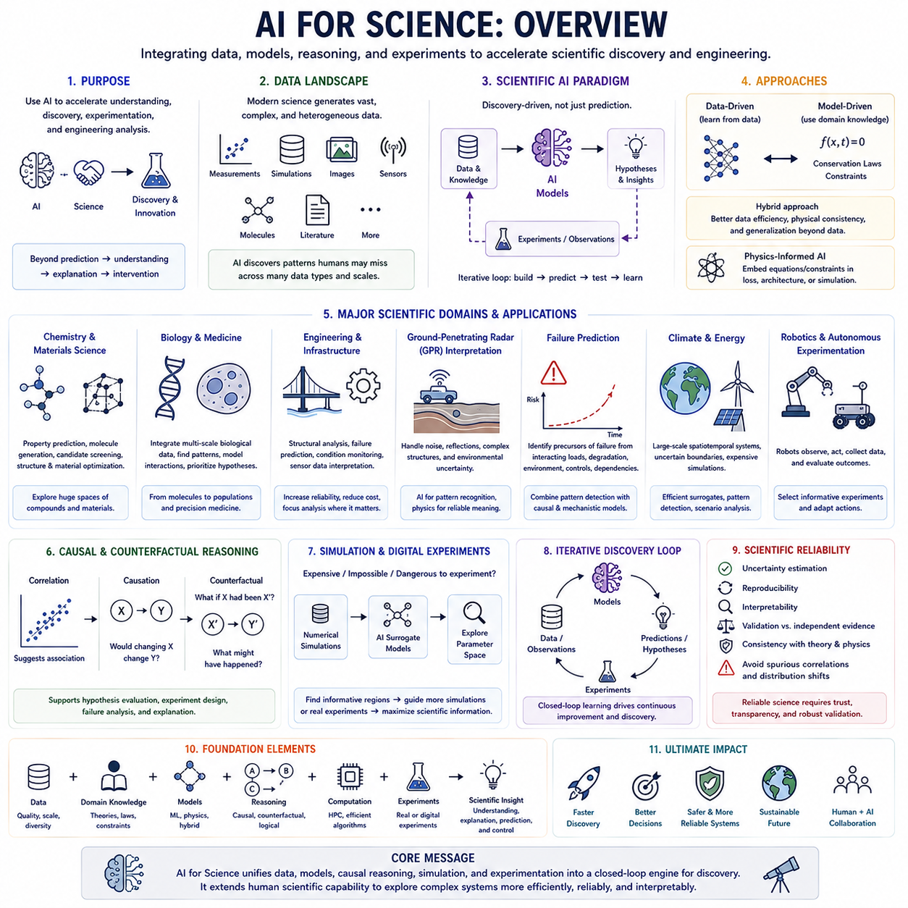
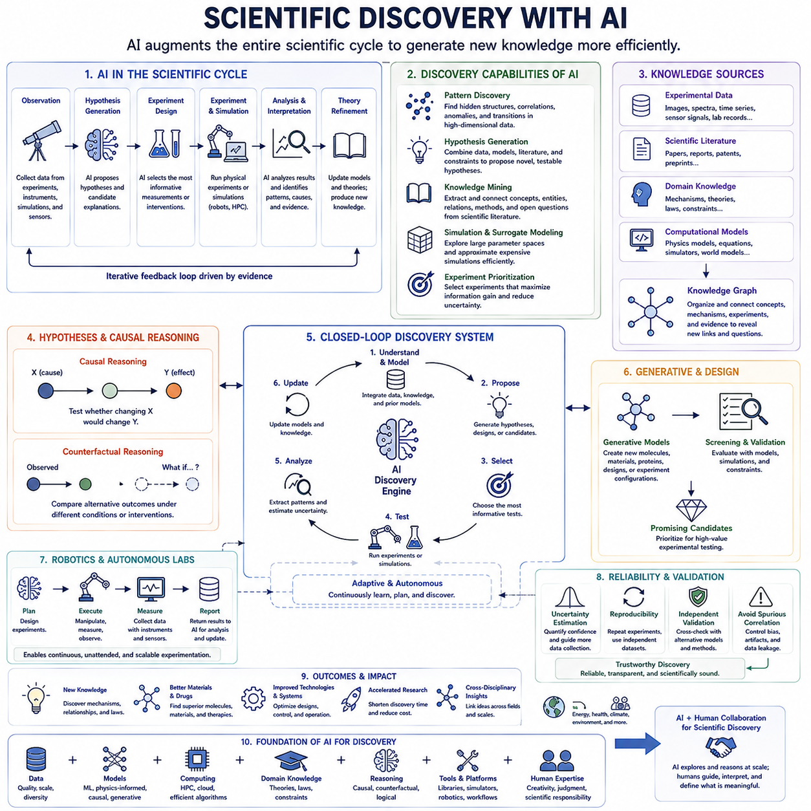
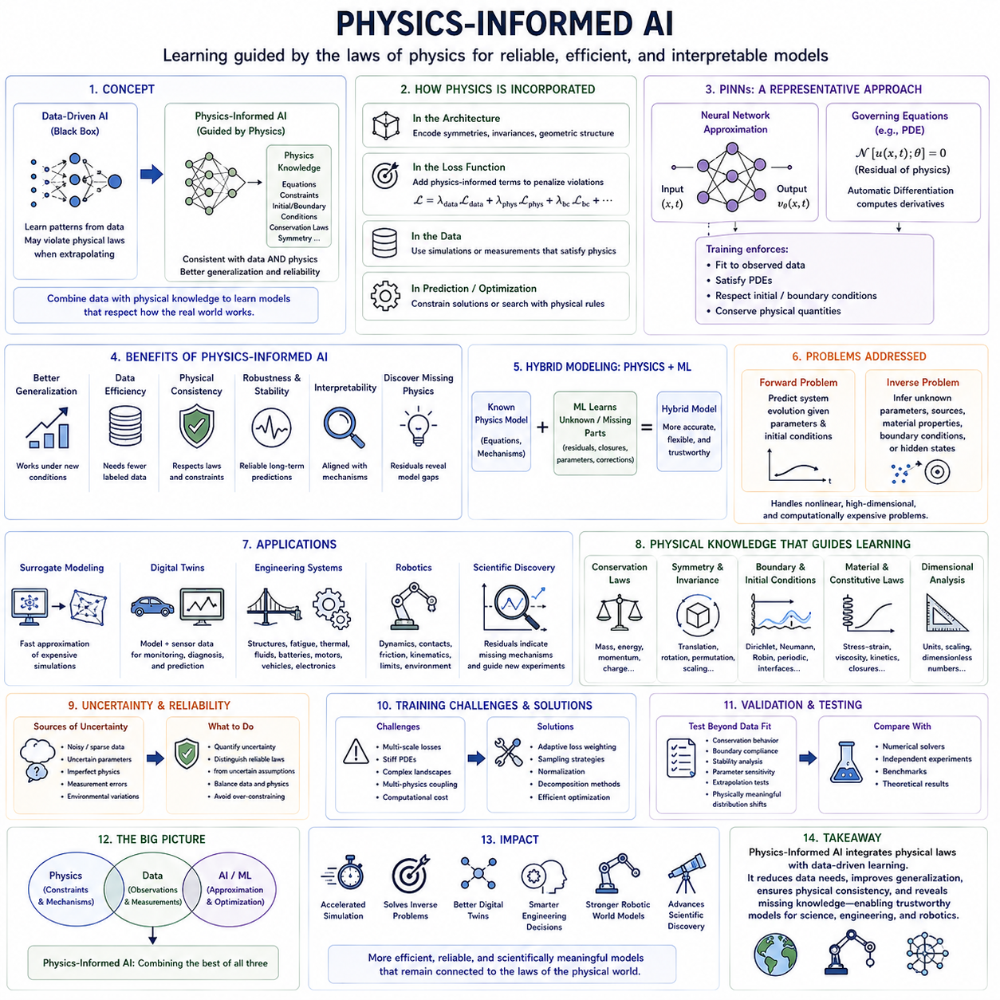
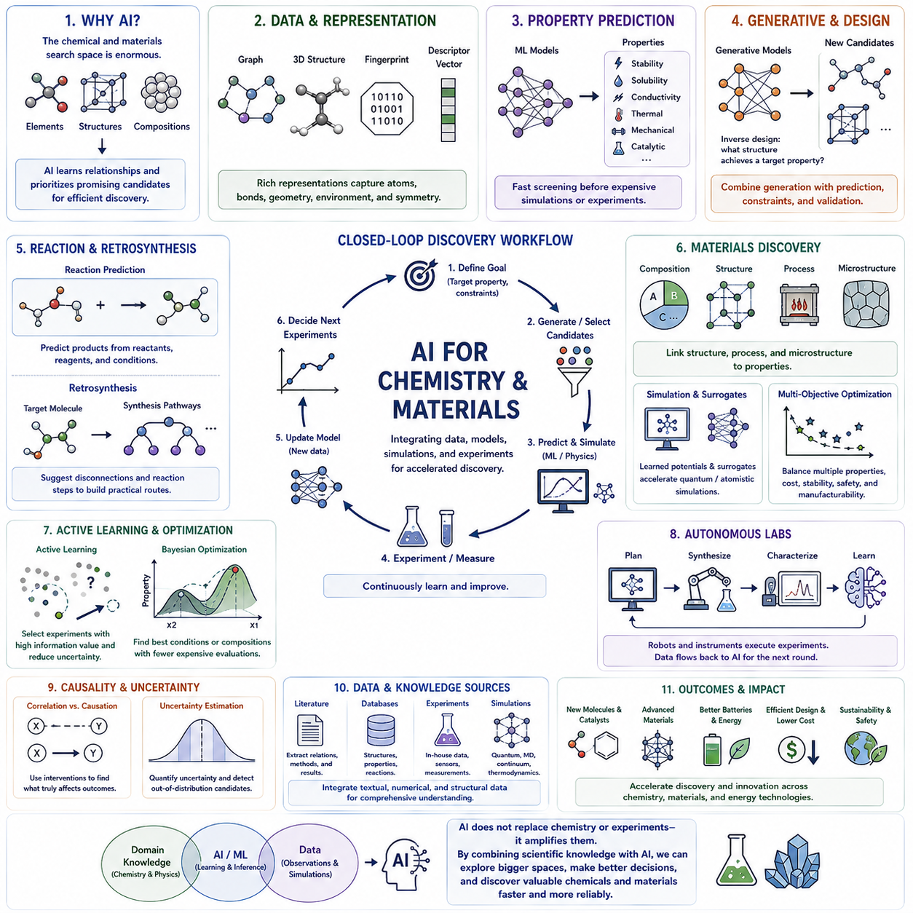
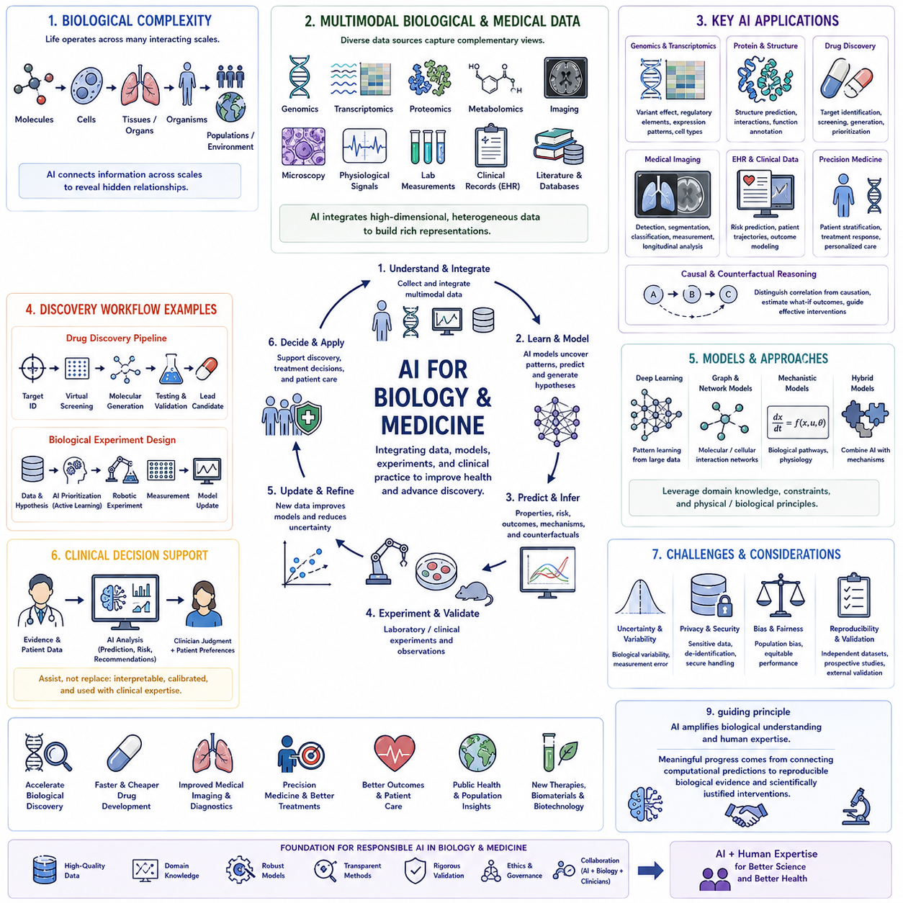
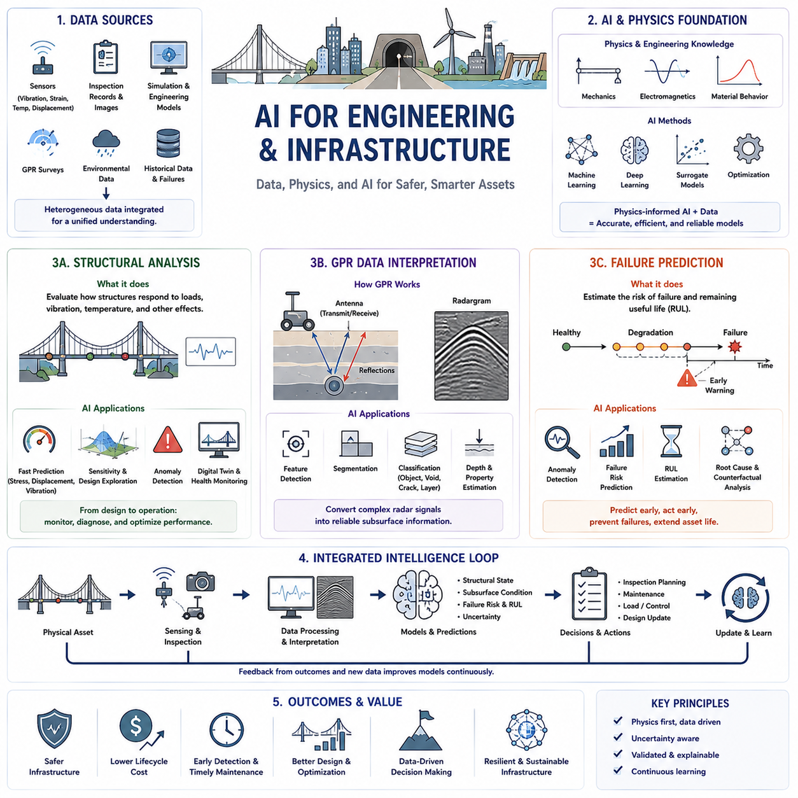
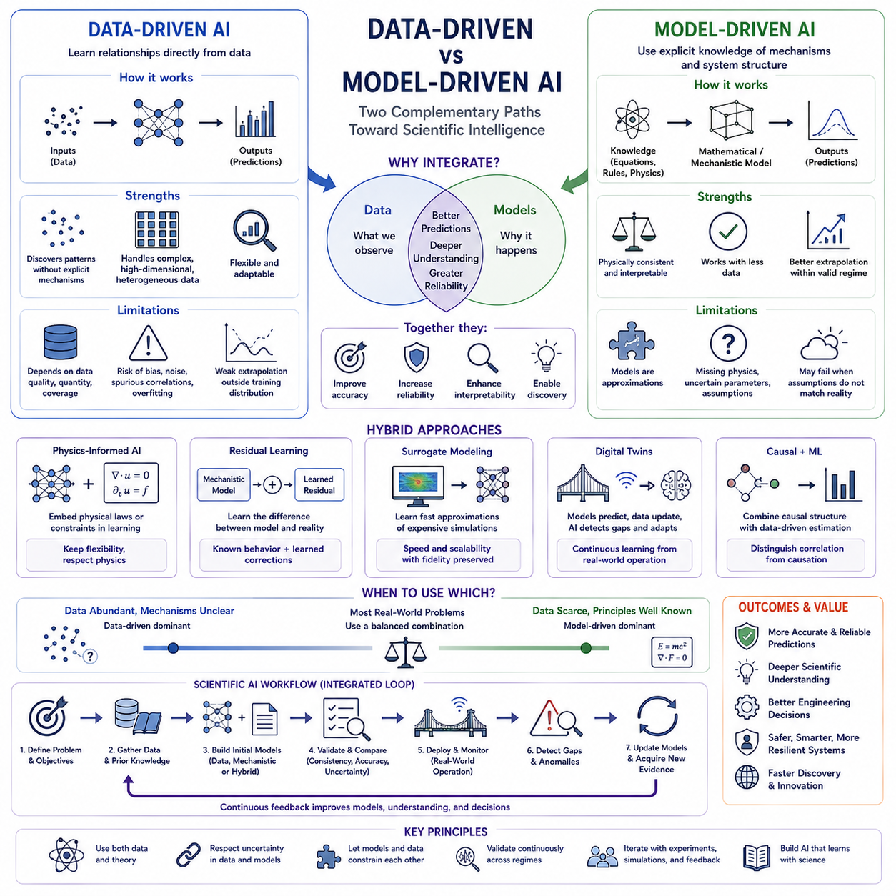
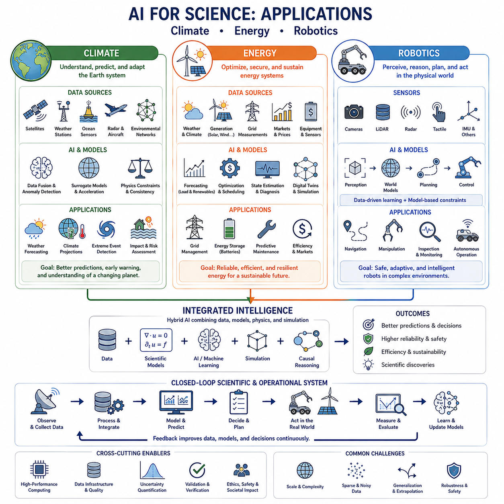

**Volume 46. Causality and Scientific AI**

# Chapter 04. AI for Science

## 04.00. Overview

{width="7.268055555555556in" height="7.268055555555556in"}

과학을 위한 AI(AI for Science)는 과학적 이해, 발견, 실험, 공학적 분석을 가속하기 위해 인공지능(Artificial Intelligence)을 활용하는 것을 의미합니다. 이 분야에서는 AI를 단순한 예측 도구(Predictive Tool)로만 취급하지 않고 데이터 기반 학습(Data-Driven Learning), 물리 모델(Physical Model), 인과 추론(Causal Reasoning), 시뮬레이션(Simulation), 도메인 지식(Domain Knowledge)을 통합하여 과학자가 가설을 수립하고 관찰을 해석하며 복잡한 시스템을 더욱 효율적으로 탐구하도록 지원합니다.

현대 과학 연구는 기존의 전통적인 방법만으로 효과적으로 분석하기 어려울 정도로 규모, 차원, 복잡성이 증가한 데이터셋을 지속적으로 생성하고 있습니다. AI는 실험 측정값, 시뮬레이션, 이미지, 센서 스트림(Sensor Stream), 분자 구조(Molecular Structure), 과학 문헌(Scientific Literature) 전반에서 패턴을 발견할 수 있습니다. 이러한 능력을 통해 수작업 분석이나 기존 통계적 워크플로(Statistical Workflow)만으로는 식별하기 어려운 관계를 탐구할 수 있습니다.

과학을 위한 AI의 핵심 목표는 단순한 예측이 아니라 과학적 발견(Scientific Discovery)입니다. 과학 모델(Scientific Model)은 관찰된 현상을 설명하는 데 도움이 되는 의미 있는 관계, 메커니즘, 구조 또는 법칙을 밝혀낼 수 있어야 합니다. 따라서 AI의 예측이 독립적인 수치 출력으로 머무르지 않고 가설(Hypothesis), 실험(Experiment), 인과 메커니즘(Causal Mechanism), 이론적 제약(Theoretical Constraint)과 연결될 때 과학적으로 더 높은 가치를 갖게 됩니다.

과학 AI(Scientific AI)는 데이터 기반 접근법(Data-Driven Approach)과 모델 기반 접근법(Model-Driven Approach)을 결합합니다. 데이터 기반 모델은 관찰로부터 표현과 관계를 직접 학습하는 반면, 모델 기반 접근법은 기존 방정식, 보존 법칙(Conservation Law), 물리적 제약(Physical Constraint), 메커니즘적 지식(Mechanistic Knowledge)을 활용합니다. 이들을 결합하면 데이터 효율성을 높이고 물리적으로 불가능한 예측을 줄이며 제한된 관측 조건을 벗어난 상황에서도 의미 있는 모델을 구축할 수 있습니다.

물리 정보 기반 AI(Physics-Informed AI)는 머신러닝(Machine Learning)과 과학적 모델링(Scientific Modeling)을 연결하는 중요한 가교 역할을 합니다. 신경망(Neural Network)이 임의의 매핑을 학습하도록 하는 대신 물리 방정식이나 제약을 학습 목적 함수(Training Objective), 아키텍처(Architecture), 시뮬레이션 과정에 포함할 수 있습니다. 이를 통해 모델은 관찰 데이터와 과학 원리를 동시에 학습할 수 있으며, 특히 실험 데이터가 제한적이거나 획득 비용이 높은 상황에서 유용합니다.

AI는 화학(Chemistry)과 재료과학(Materials Science)에서 방대한 분자, 화합물, 구조, 재료 구성의 탐색 공간(Search Space)을 조사하는 데 점점 더 많이 활용되고 있습니다. 학습된 표현(Learned Representation)은 물성 예측(Property Prediction), 후보 선별(Candidate Screening), 분자 생성(Molecular Generation), 최적화(Optimization)를 지원할 수 있습니다. 시뮬레이션과 실험적 검증(Experimental Validation)을 결합하면 방대한 후보군을 과학적으로 유망한 소수의 대안으로 축소하여 탐색 과정을 단축할 수 있습니다.

생물학(Biology)과 의학(Medicine) 역시 생물학적 시스템이 분자, 세포, 조직, 개체, 모집단에 이르는 여러 규모에서 작동하기 때문에 매우 복잡한 과학 환경을 제공합니다. AI는 이질적인 측정값(Heterogeneous Measurement)을 통합하고 생물학적 패턴을 식별하며 상호작용을 모델링하고 가설의 우선순위를 결정할 수 있습니다. 그러나 통계적 예측 자체를 생물학적 설명으로 간주하기보다는 이러한 패턴을 메커니즘 및 실험적 증거와 연결할 때 과학적 가치가 확보됩니다.

공학 및 인프라(Engineering and Infrastructure) 응용은 과학 AI를 물리적 제약과 신뢰성 요구사항 아래에서 작동해야 하는 시스템으로 확장합니다. 구조 해석(Structural Analysis), 고장 예측(Failure Prediction), 상태 모니터링(Condition Monitoring), 복잡한 센서 데이터 해석에서 시뮬레이션과 학습 모델을 결합할 수 있습니다. AI는 계산 비용을 줄이고 비정상적인 동작을 식별하며 엔지니어가 가장 정보 가치가 높은 구성요소나 운전 조건에 상세 분석을 집중하도록 지원할 수 있습니다.

지표투과레이더(Ground-Penetrating Radar) 데이터 해석은 복잡한 측정값에서 과학적 또는 공학적 의미를 추출하는 보다 일반적인 문제를 보여주는 사례입니다. 원시 신호(Raw Signal)에는 잡음, 반사, 중첩된 구조, 불확실한 환경 영향이 포함될 수 있습니다. AI는 패턴 인식(Pattern Recognition)과 표현 학습을 지원할 수 있지만 탐지된 패턴을 신뢰할 수 있는 해석으로 변환하기 위해서는 물리적 이해와 상황적 제약(Contextual Constraint)이 여전히 중요합니다.

고장 예측 역시 중요한 응용 분야입니다. 공학 시스템의 고장은 하나의 독립된 변수로 발생하기보다 하중, 열화(Degradation), 환경 조건, 제어 동작, 구성요소 간 의존성이 상호작용하면서 발생하는 경우가 많습니다. AI는 고장에 선행하는 패턴을 식별할 수 있으며, 인과 모델(Causal Model)과 메커니즘 모델(Mechanistic Model)은 어떤 요인이 실제 원인에 기여하고 어떤 요인이 단순한 상관 지표(Correlated Indicator)인지를 판단하는 데 도움을 줍니다.

인과 추론은 과학 AI를 패턴 발견에서 설명과 개입(Intervention)으로 발전시키는 데 중요한 역할을 합니다. 상관관계는 과학자가 어디를 조사해야 하는지 알려줄 수 있지만, 인과 모델은 하나의 요인을 변경했을 때 다른 요인이 실제로 달라지는지를 질문합니다. 반사실적 추론(Counterfactual Reasoning)은 서로 다른 조건에서 어떤 일이 발생했을지를 검토함으로써 이를 더욱 확장하며 가설 평가, 실험 설계, 고장 분석, 과학적 설명을 지원합니다.

시뮬레이션은 AI 기반 과학(AI-Driven Science)을 위한 또 하나의 기반을 제공합니다. 실제 물리 실험이 비싸거나 느리거나 위험하거나 수행할 수 없는 경우 수치 모델(Numerical Model)과 디지털 환경(Digital Environment)을 통해 대규모의 구조화된 데이터를 생성할 수 있습니다. AI는 계산 비용이 높은 시뮬레이션을 근사하는 대리 모델(Surrogate Model)을 학습하고, 파라미터 탐색(Parameter Exploration)을 안내하며, 추가 시뮬레이션이나 실험이 가장 높은 과학적 정보를 제공할 영역을 식별할 수 있습니다.

AI와 실험의 상호작용은 반복적인 발견 루프(Iterative Discovery Loop)를 형성할 수 있습니다. 기존 데이터와 과학 지식을 이용하여 모델을 구축하고, 모델은 예측이나 가설을 생성하며, 실험은 가장 정보 가치가 높은 가능성을 검증합니다. 이후 얻어진 관찰 결과를 이용해 모델을 업데이트하고 다음 가설을 정교화합니다. 이러한 폐루프 워크플로(Closed-Loop Workflow)는 AI를 수동적인 데이터 분석 도구에서 과학적 과정에 능동적으로 참여하는 시스템으로 발전시킵니다.

기후(Climate)와 에너지(Energy) 연구는 대규모 관측 데이터와 과학 모델을 통합하는 접근법의 가치를 보여줍니다. 이러한 영역에는 공간적·시간적 시스템(Spatial and Temporal System), 상호작용하는 물리 과정, 불확실한 경계 조건(Boundary Condition), 높은 계산 비용의 시뮬레이션이 포함됩니다. AI는 과학 지식과 불확실성의 제약을 유지하면서 효율적인 근사, 복잡한 패턴 탐지, 운영 최적화, 시나리오 분석(Scenario Analysis)을 지원할 수 있습니다.

로보틱스(Robotics)는 과학 AI와 물리적 실험(Physical Experiment)을 연결하는 또 다른 영역입니다. 로봇은 환경을 관찰하고, 변수를 조작하며, 측정값을 수집하고, 결과를 평가하는 자율 실험 플랫폼(Autonomous Experimental Platform)으로 활용될 수 있습니다. 인과 추론과 월드 모델(World Model)을 결합하면 로봇 시스템은 정보 가치가 높은 실험을 선택하고 이전 관찰이 근본적인 시스템에 대해 무엇을 알려주는지에 따라 행동을 적응시킬 수 있습니다.

중요한 과제 가운데 하나는 과학적 신뢰성(Scientific Reliability)입니다. 높은 정확도를 가진 모델이라도 허위 상관관계(Spurious Correlation)를 이용하거나, 분포 이동(Distribution Shift)에서 실패하거나, 알려진 제약을 위반하거나, 잘못된 신뢰도를 제공할 수 있습니다. 따라서 과학 AI에는 불확실성 추정(Uncertainty Estimation), 재현성(Reproducibility), 해석 가능한 모델링(Interpretable Modeling), 벤치마크 설계(Benchmark Design), 독립적 증거를 통한 검증, 기존 이론 및 물리적 관찰과의 지속적인 비교가 필요합니다.

더 넓은 관점에서 목표는 과학적 추론(Scientific Reasoning)을 대체하는 것이 아니라 그 범위를 확장하는 것입니다. AI는 더 넓은 가설 공간(Hypothesis Space)을 탐색하고, 더 풍부한 데이터셋을 처리하며, 시뮬레이션을 가속하고, 인간이 직접 조사하기 어려운 패턴을 발견할 수 있습니다. 동시에 과학 지식은 이러한 결과를 의미 있게 만드는 데 필요한 제약과 해석을 제공합니다. 가장 강력한 시스템은 학습, 인과 추론, 도메인 모델, 실험, 인간의 과학적 판단(Human Scientific Judgment)을 결합합니다.

과학을 위한 AI의 전체 구조에서 이러한 개념은 AI 기반 과학적 발견(Scientific Discovery with AI), 물리 정보 기반 방법(Physics-Informed Methods), 화학과 재료과학(Chemistry and Materials), 생물학과 의학(Biology and Medicine), 공학과 인프라(Engineering and Infrastructure), 그리고 데이터 기반 지능(Data-Driven Intelligence)과 모델 기반 지능(Model-Driven Intelligence)의 관계로 확장됩니다. 기후, 에너지, 로보틱스 응용은 이러한 접근법이 궁극적으로 더욱 빠르고 체계적이며 점차 자율화되는 과학적 발견(Autonomous Scientific Discovery)을 어떻게 지원할 수 있는지를 보여줍니다.

## 04.01. Scientific Discovery with AI

{width="7.268055555555556in" height="7.268055555555556in"}

AI를 활용한 과학적 발견(Scientific Discovery with AI)은 인공지능(Artificial Intelligence)을 예측과 자동화의 범위를 넘어 새로운 과학 지식(Scientific Knowledge)을 생성하는 과정으로 확장합니다. AI 시스템은 관찰 데이터를 분석하고, 숨겨진 구조를 발견하며, 가설(Hypothesis)을 제안하고, 유망한 실험을 식별하며, 서로 경쟁하는 설명을 평가할 수 있습니다. AI의 역할은 데이터, 모델, 추론, 시뮬레이션(Simulation), 실험을 연결하여 과학적 순환(Scientific Cycle)을 더욱 효율적인 발견 과정으로 강화하는 방향으로 발전하고 있습니다.

전통적인 과학적 발견(Scientific Discovery)은 일반적으로 관찰에서 시작하여 가설 형성(Hypothesis Formation), 실험적 검증(Experimental Testing), 해석(Interpretation), 이론 개선(Theory Refinement)의 과정으로 진행됩니다. AI는 연구자가 수작업으로 조사할 수 있는 범위를 넘어 더 큰 데이터셋을 처리하고 더 많은 후보 설명을 탐색함으로써 각 단계에 참여할 수 있습니다. 이는 과학적 추론(Scientific Reasoning)을 제거하는 것이 아니라 탐색 가능한 패턴, 가설, 메커니즘, 실험적 가능성의 공간을 확장하는 것입니다.

패턴 발견(Pattern Discovery)은 AI가 과학에 기여해 온 가장 확립된 영역 가운데 하나입니다. 머신러닝 모델(Machine Learning Model)은 기존 분석 방법으로 탐지하기 어려운 고차원 측정값(High-Dimensional Measurement) 사이의 관계를 식별할 수 있습니다. 이미지, 스펙트럼(Spectrum), 분자 구조, 센서 신호, 시뮬레이션 출력, 실험 기록을 표현(Representation)으로 변환하여 군집(Cluster), 이상 현상(Anomaly), 상관관계, 전이(Transition), 이전에는 인식하지 못했던 구조를 발견할 수 있습니다.

그러나 과학적 발견은 단순히 통계적 패턴(Statistical Pattern)을 발견하는 것 이상을 요구합니다. 어떤 패턴이 해석 가능한 메커니즘(Interpretable Mechanism), 재현 가능한 관찰(Reproducible Observation), 이론적 원리(Theoretical Principle), 실험적으로 검증 가능한 가설과 연결될 때 과학적 의미를 갖게 됩니다. 따라서 발견을 위한 AI 시스템은 규칙성을 식별하는 수준에서 더 나아가 어떤 관계를 추가로 조사해야 하며 어떤 증거가 이를 확인하거나 반박할 수 있는지를 판단해야 합니다.

가설 생성(Hypothesis Generation)은 AI가 수행할 수 있는 더욱 발전된 역할을 나타냅니다. 모델은 기존 관찰, 과학 문헌(Scientific Literature), 학습된 표현(Learned Representation), 도메인 제약(Domain Constraint)을 결합하여 아직 검증되지 않은 관계를 제안할 수 있습니다. 후보 가설은 메커니즘, 상호작용, 재료 특성(Material Property), 생물학적 기능(Biological Function), 물리적 관계 또는 추가적인 과학적 조사가 필요한 이상 관찰(Anomalous Observation)에 대한 설명을 포함할 수 있습니다.

자동으로 생성된 가설의 유용성은 검증 가능성(Testability)에 크게 좌우됩니다. 측정 가능한 예측을 생성하거나 경쟁하는 설명과 자신을 구별할 수 없는 가설은 과학적 가치가 제한적입니다. 따라서 AI 시스템은 제안된 가설을 관찰 가능한 결과(Observable Consequence), 예상 측정값, 실험 조건, 그리고 제안된 설명을 반증하거나 지지할 수 있는 기준과 연결해야 합니다.

과학 문헌은 또 하나의 중요한 지식원(Knowledge Source)을 제공합니다. 출판되는 연구의 양이 방대하기 때문에 개별 연구자가 여러 분야의 연구 결과를 지속적으로 통합하기는 어렵습니다. 언어 모델(Language Model)과 지식 추출 시스템(Knowledge Extraction System)은 대규모 문서 집합에서 개체(Entity), 관계, 방법, 결과, 해결되지 않은 질문을 식별하여 기존에 분리되어 있던 과학 지식 영역 사이의 연결 가능성을 발견할 수 있습니다.

지식 그래프(Knowledge Graph)는 추출된 관계를 개념, 개체, 실험, 메커니즘, 증거를 연결하는 구조화된 표현(Structured Representation)으로 구성할 수 있습니다. AI는 이러한 그래프에서 누락된 관계, 비정상적인 연결, 새로운 가설을 암시하는 경로를 탐색할 수 있습니다. 도메인 전문성(Domain Expertise)과 결합하면 이러한 접근법은 분산되어 있는 과학 정보를 추가 연구를 위한 후보 방향으로 변환할 수 있습니다.

시뮬레이션은 비용이 높은 실제 물리 실험을 수행하기 전에 가설을 탐색할 수 있는 가상 환경(Virtual Environment)을 제공하여 발견 과정을 확장합니다. AI는 시뮬레이션 결과를 분석하고, 계산 비용이 높은 모델을 대리 모델(Surrogate Model)로 근사하며, 예상하지 못한 동작이 발생하는 파라미터 영역(Parameter Region)을 식별할 수 있습니다. 이를 통해 연구자는 더 넓은 과학적 공간을 탐색하면서 가장 정보 가치가 높은 사례에 실제 실험을 집중할 수 있습니다.

AI는 어떤 측정이나 개입(Intervention)이 가장 많은 정보를 제공할지를 추정하여 실험 설계(Experimental Design)에도 기여할 수 있습니다. 모든 후보를 동일하게 시험하는 대신 지능형 시스템은 불확실성을 감소시키거나, 경쟁 가설을 구별하거나, 아직 탐색되지 않은 영역을 밝힐 것으로 예상되는 실험에 우선순위를 부여할 수 있습니다. 능동 학습(Active Learning)과 베이지안 최적화(Bayesian Optimization)는 제한된 실험 예산 아래에서 정보 가치가 높은 실험을 선택하기 위한 계산 전략을 제공합니다.

이러한 과정은 자연스럽게 폐루프 과학적 발견(Closed-Loop Scientific Discovery)으로 이어집니다. AI 시스템은 기존 증거를 분석하고, 가설이나 후보 구성을 제안하고, 실험을 선택하고, 새로운 측정 결과를 받아 내부 모델을 업데이트합니다. 업데이트된 지식은 다시 다음 실험을 결정합니다. 이러한 순환을 반복하면 축적된 증거에 따라 실험이 지속적으로 조정되는 적응형 발견 과정(Adaptive Discovery Process)이 형성됩니다.

자율 실험실(Autonomous Laboratory)은 이러한 폐루프 개념을 실제 물리적 실험으로 확장합니다. 로봇 장비(Robotic Equipment)는 시료를 준비하고, 실험 변수를 조작하며, 측정 절차를 실행하고, 그 결과를 AI 모델에 다시 전달할 수 있습니다. 계획, 최적화, 실험실 자동화(Laboratory Automation)가 통합되면 연구자가 목표, 제약, 검증 절차, 발견 결과의 과학적 해석을 정의하는 동안 과학적 탐색을 지속적으로 수행할 수 있습니다.

발견의 목표가 단순한 상관관계가 아니라 메커니즘을 규명하는 것이라면 인과 추론(Causal Reasoning)이 중요해집니다. 관찰 패턴은 관계의 가능성을 제시할 수 있지만, 개입을 통해 하나의 요인을 변경했을 때 다른 요인이 실제로 변화하는지를 판단할 수 있습니다. 인과 모델(Causal Model)과 실험 설계를 결합한 AI 시스템은 서로 경쟁하는 인과 구조(Causal Structure)를 구별하는 개입을 제안하여 예측적 관계를 더욱 강력한 과학적 설명으로 전환할 수 있습니다.

반사실적 추론(Counterfactual Reasoning)은 대안적 가능성을 평가함으로써 개입을 보완합니다. 과학자는 초기 조건, 파라미터, 처치(Treatment), 환경 상태가 달랐더라도 관찰된 현상이 여전히 발생했을지를 질문할 수 있습니다. 반사실 모델(Counterfactual Model)은 대안적 결과를 실제 관찰과 비교할 수 있게 하며 메커니즘 분석(Mechanism Analysis), 가설 평가, 특정 결과를 발생시킨 조건의 식별을 지원합니다.

생성형 AI(Generative AI)는 기존 후보를 평가하는 것에 그치지 않고 새로운 후보 객체(Candidate Object)를 생성함으로써 또 다른 발견 메커니즘을 제공합니다. 화학과 재료과학(Materials Science)에서는 생성 모델(Generative Model)이 원하는 특성을 갖는 분자 구조나 재료 구성을 제안할 수 있습니다. 동일한 원리는 단백질(Protein), 실험 구성, 공학 설계(Engineering Design) 및 가능한 후보의 수가 방대한 다른 과학적 탐색 공간에도 적용할 수 있습니다.

그러나 생성 자체가 과학적 발견을 의미하는 것은 아닙니다. 생성된 후보는 과학적·물리적 제약을 만족해야 하며, 예측 모델, 시뮬레이션, 이론적 검증(Theoretical Check), 실제 실험 등을 통해 평가되어야 합니다. 따라서 효과적인 발견 파이프라인(Discovery Pipeline)은 생성 과정에 제약 적용(Constraint Enforcement), 불확실성 추정(Uncertainty Estimation), 최적화, 검증(Validation)을 결합하여 창의적인 탐색이 과학적 실행 가능성(Scientific Feasibility)과 연결되도록 해야 합니다.

과학적 관찰이 고차원일 경우 표현 학습(Representation Learning)이 특히 중요합니다. 신경망(Neural Network)은 복잡한 측정값을 유용한 구조나 변화 요인(Factor of Variation)을 포착하는 잠재 표현(Latent Representation)으로 변환할 수 있습니다. 과학적 발견에서는 이러한 표현이 특정 데이터셋의 예측 성능만 향상시키는 특징이 아니라 의미 있는 물리적, 화학적, 생물학적 또는 인과적 속성에 대응하도록 만드는 것이 핵심 과제입니다.

발견 시스템은 불확실성에 대해서도 추론해야 합니다. 과학 데이터셋은 희소하거나, 잡음이 존재하거나, 편향되어 있거나, 제한된 조건에서 수집될 수 있으며, 가설은 관찰된 영역을 크게 벗어날 수도 있습니다. 불확실성 추정은 신뢰할 수 있는 예측과 추측적인 외삽(Speculative Extrapolation)을 구분하고, 증거가 부족하지만 잠재적으로 높은 과학적 가치를 가진 영역으로 추가 측정을 유도하는 데 도움을 줍니다.

AI가 매우 유망한 발견을 생성하더라도 재현성(Reproducibility)과 독립적 검증(Independent Validation)은 여전히 필수적입니다. 발견된 관계가 데이터 누출(Data Leakage), 실험적 인공물(Experimental Artifact), 모델 편향(Model Bias), 허위 상관관계(Spurious Correlation)에서 발생했을 수 있기 때문입니다. 따라서 결과를 신뢰할 수 있는 지식으로 받아들이기 전에 독립적인 데이터셋, 대안적 모델, 반복 실험, 확립된 과학적 방법을 이용하여 검증해야 합니다.

과학적 중요성(Scientific Significance)을 항상 하나의 최적화 목표(Optimization Objective)로 환원할 수 있는 것은 아니므로 인간 과학자(Human Scientist)는 이러한 과정에서 여전히 핵심적인 역할을 담당합니다. 연구자는 어떤 질문이 중요한지를 결정하고, 가정의 타당성을 평가하며, 개념적 의미를 인식하고, 발견을 더 광범위한 이론과 연결합니다. AI는 계산적 탐색과 추론 능력을 제공하고 인간의 전문성은 맥락(Context), 판단, 창의성, 과학적 책임(Scientific Responsibility)을 제공합니다.

장기적인 발전 방향은 점점 더 협력적이고 부분적으로 자율적인 발견 시스템(Partially Autonomous Discovery System)으로 향하고 있습니다. AI는 과학 문헌, 실험 데이터, 시뮬레이션, 인과 모델, 로봇 실험을 지속적으로 통합하면서 여러 가설을 동시에 유지하고 정보 가치가 높은 검증 방법을 선택할 수 있습니다. 이를 통해 과학자는 모든 후보 구성을 직접 탐색하기보다 목표를 정의하고 새롭게 나타나는 원리(Emerging Principle)를 해석하는 더욱 높은 수준의 역할을 수행할 수 있습니다.

따라서 AI를 활용한 과학적 발견은 머신러닝을 주로 완료된 실험의 결과를 분석하는 데 사용하던 방식에서 AI를 발견 순환(Discovery Cycle) 전체에 활용하는 방식으로의 전환을 의미합니다. 패턴 인식(Pattern Recognition), 가설 생성, 인과 추론, 시뮬레이션, 실험 선택(Experiment Selection), 생성 모델링(Generative Modeling), 검증을 통합함으로써 AI는 방대한 과학적 탐색 공간(Scientific Search Space)을 새로운 지식으로 이어지는 구조화된 경로(Structured Pathway)로 전환하는 데 기여할 수 있습니다.

## 04.02. Physics Informed AI [w/Code]

{width="7.268055555555556in" height="7.268055555555556in"}

물리 정보 기반 AI(Physics-Informed AI)는 머신러닝(Machine Learning)과 확립된 물리 지식(Physical Knowledge)을 통합하여 학습 모델이 연구 대상 시스템을 지배하는 법칙과 제약에 따라 학습되도록 하는 접근법입니다. 데이터만으로 관계를 학습하는 대신 방정식, 보존 원리(Conservation Principle), 경계 조건(Boundary Condition), 대칭성(Symmetry) 또는 기타 과학 지식을 모델에 포함합니다. 이를 통해 유연한 데이터 기반 학습(Data-Driven Learning)과 해석 가능한 모델 기반 과학(Model-Driven Science)을 연결합니다.

전통적인 머신러닝은 일반적으로 학습 데이터셋(Training Dataset)에 포함된 사례를 이용하여 입력과 출력 사이의 통계적 매핑(Statistical Mapping)을 탐색합니다. 이러한 모델은 보간(Interpolation)에서는 뛰어난 성능을 달성할 수 있지만 관측 데이터가 희소하거나 운용 조건이 변하면 물리적으로 불가능한 예측을 생성할 수 있습니다. 물리 정보 기반 방법은 학습의 자유도를 제한하여 알려진 물리 시스템의 특성과 일치하는 해를 찾도록 유도합니다.

물리 지식은 AI 모델의 여러 단계에 포함될 수 있습니다. 아키텍처(Architecture)에 직접 인코딩하거나, 손실 함수(Loss Function)의 제약으로 도입하거나, 시뮬레이션(Simulation)을 통해 학습 데이터를 생성하는 데 사용하거나, 예측 및 최적화 과정에 적용할 수 있습니다. 적절한 전략은 이용 가능한 물리 지식의 양과 정확성, 그리고 시스템에서 관측 데이터로부터 추가로 학습해야 하는 요소에 따라 달라집니다.

일반적으로 PINN이라고 불리는 물리 정보 신경망(Physics-Informed Neural Networks)은 대표적인 접근법입니다. 신경망(Neural Network)이 알려지지 않은 물리장(Physical Field)이나 시스템 상태를 근사하는 동시에 시스템을 설명하는 미분 방정식(Differential Equation)을 학습 목적 함수에 포함합니다. 자동 미분(Automatic Differentiation)을 이용해 신경망 출력의 미분값을 계산하고, 지배 방정식(Governing Equation)의 위반 정도를 관측 데이터에 대한 오차와 함께 최소화할 수 있습니다.

일반적인 물리 정보 기반 목적 함수(Physics-Informed Objective)는 여러 형태의 오차를 결합합니다. 데이터 손실(Data Loss)은 예측과 관측 사이의 차이를 측정하고, 물리 손실(Physics Loss)은 지배 방정식의 위반 정도를 측정합니다. 여기에 초기 조건(Initial Condition), 경계 조건, 보존 법칙 또는 인터페이스 제약(Interface Constraint)을 적용하는 항을 추가할 수 있습니다. 학습은 경험적 증거와 이러한 과학적 구조를 동시에 만족하는 모델 파라미터를 찾는 과정입니다.

편미분 방정식(Partial Differential Equation)은 많은 과학 시스템이 공간과 시간에 따른 장(Field)으로 표현되기 때문에 특히 중요합니다. 유체 흐름(Fluid Flow), 열전달(Heat Transfer), 탄성(Elasticity), 전자기학(Electromagnetism), 확산(Diffusion), 파동 전파(Wave Propagation)는 모두 공간과 시간에 따른 미분 관계를 포함합니다. 물리 정보 기반 학습은 이러한 방정식의 해를 근사하면서 희소한 측정 데이터를 이용하여 알려지지 않은 파라미터나 불완전한 모델을 보정할 수 있습니다.

데이터와 물리의 관계를 물리 모델이 항상 완전하다는 가정으로 이해해서는 안 됩니다. 실제 시스템에는 알려지지 않은 힘, 해결되지 않은 상호작용, 불확실한 파라미터, 제조 편차(Manufacturing Variation), 환경적 교란(Environmental Disturbance)이 존재할 수 있습니다. 하이브리드 모델(Hybrid Model)은 잘 이해된 방정식을 유지하면서 머신러닝을 이용하여 분석적으로 도출하기 어려운 잔차 항(Residual Term), 구성 관계(Constitutive Relationship), 폐쇄 모델(Closure), 보정 항(Correction)을 추정할 수 있습니다.

이러한 하이브리드 접근법은 순수한 데이터 기반 시스템과 순수한 모델 기반 시스템이 서로 보완적인 약점을 갖기 때문에 중요합니다. 데이터 기반 모델은 많은 데이터를 필요로 하고 외삽(Extrapolation) 성능이 떨어질 수 있으며, 메커니즘 모델(Mechanistic Model)은 중요한 과정이 누락되면 부정확해질 수 있습니다. 두 접근법을 결합하면 과학 지식이 해 공간(Solution Space)을 제한하고 관측 데이터가 기존 이론의 한계를 보완할 수 있습니다.

보존 법칙(Conservation Law)은 특히 강력한 형태의 물리 정보를 제공합니다. 에너지, 질량, 운동량, 전하 등의 보존량(Conserved Quantity)은 유효한 예측이 반드시 만족해야 하는 관계를 규정합니다. 이러한 제약을 모델에 포함하면 통계적으로는 그럴듯해 보이지만 기본적인 시스템 거동을 위반하는 궤적을 생성하는 것을 방지할 수 있으며, 장기 예측(Long-Horizon Prediction)과 시뮬레이션의 신뢰성을 향상시킬 수 있습니다.

대칭성과 불변성(Invariance) 역시 학습을 안내할 수 있습니다. 많은 물리 법칙은 병진(Translation), 회전(Rotation), 순열(Permutation) 또는 기타 변환에도 변하지 않습니다. 이러한 특성을 반영하도록 설계된 아키텍처는 서로 동등한 관계를 많은 사례에서 반복적으로 학습할 필요가 없습니다. 이를 통해 데이터 효율성을 높이고 과학 문제의 기본적인 기하학적 구조와 더욱 잘 대응하는 표현을 생성할 수 있습니다.

물리 정보 기반 학습은 순방향 문제(Forward Problem)와 역문제(Inverse Problem)를 모두 지원할 수 있습니다. 순방향 문제에서는 알려진 물리 파라미터와 초기 조건을 이용하여 시스템이 어떻게 변화하는지를 추정합니다. 역문제에서는 관측 데이터를 이용하여 알려지지 않은 파라미터, 재료 특성(Material Property), 발생원(Source), 경계 조건 또는 숨겨진 상태(Hidden State)를 추론합니다. 이러한 역관계가 비선형적이고 고차원적이거나 계산 비용이 높은 경우 AI가 특히 유용합니다.

대리 모델링(Surrogate Modeling)은 또 하나의 주요 응용 분야입니다. 고충실도 수치 시뮬레이션(High-Fidelity Numerical Simulation)은 하나의 구성 조건을 계산하는 데에도 수시간 또는 수일이 필요할 수 있습니다. 학습된 대리 모델은 물리 파라미터와 시뮬레이션 결과 사이의 관계를 훨씬 빠르게 근사할 수 있습니다. 여기에 물리 지식을 포함하면 타당한 거동을 유지하면서 신속한 설계 탐색, 불확실성 분석, 최적화, 반복 평가를 수행할 수 있습니다.

디지털 트윈(Digital Twin)도 모델과 데이터의 이러한 결합으로부터 이점을 얻을 수 있습니다. 물리 모델은 자산이나 프로세스의 예상 거동을 제공하고 센서 관측은 추정 상태를 지속적으로 업데이트합니다. 머신러닝은 모델링되지 않은 효과와 계산적 한계를 보완할 수 있습니다. 따라서 물리 정보 기반 AI는 지속적으로 갱신되는 표현 안에서 시뮬레이션, 센싱(Sensing), 진단(Diagnosis), 예측, 운영 의사결정(Operational Decision Making)을 연결하는 데 도움을 줍니다.

공학 시스템(Engineering System)은 역학(Mechanics), 열역학(Thermodynamics), 전자공학(Electronics), 제어 이론(Control Theory)의 제약을 받기 때문에 다양한 응용 가능성을 제공합니다. 구조 변형(Structural Deformation), 피로(Fatigue), 열관리(Thermal Management), 유체 시스템, 배터리, 모터, 차량, 로봇 메커니즘에서 센서 관측과 물리 방정식을 결합한 모델을 활용할 수 있습니다. 이러한 모델은 설계 최적화, 상태 모니터링(Condition Monitoring), 고장 예측(Failure Prediction)을 지원할 수 있습니다.

로보틱스(Robotics)에서는 학습된 모델이 물리적 상호작용(Physical Interaction)과 일치해야 한다는 추가적인 요구사항이 존재합니다. 로봇의 운동은 운동학(Kinematics), 동역학(Dynamics), 접촉(Contact), 마찰(Friction), 액추에이터 한계(Actuator Limit), 환경의 기하학적 구조에 의해 제약됩니다. 물리 정보 기반 학습은 이러한 관계를 학습 동역학이나 월드 모델(World Model)에 포함하여 물리적으로 불가능한 예측을 줄이고 계획, 제어, 시뮬레이션, 적응(Adaptation)을 향상시킬 수 있습니다.

과학적 발견(Scientific Discovery)에서도 물리 정보 기반 모델은 기존 이론과 관측 사이의 불일치를 밝혀내는 데 활용될 수 있습니다. 지속적으로 나타나는 잔차 오차(Residual Error)는 누락된 메커니즘, 잘못된 가정 또는 이전에 알려지지 않은 상호작용을 나타낼 수 있습니다. 물리를 단순한 고정 제약으로 취급하는 대신 지능형 시스템은 물리 모델이 실패하는 영역을 분석하고 이를 가설 생성(Hypothesis Generation)과 추가 실험을 안내하는 정보로 활용할 수 있습니다.

물리 지식 자체가 근사적일 수 있기 때문에 불확실성(Uncertainty)은 여전히 중요합니다. 파라미터가 불확실하거나 경계 조건이 정확하게 측정되지 않을 수 있으며, 지배 방정식도 현실을 단순화하여 표현한 것일 수 있습니다. 지나치게 엄격한 제약은 AI 시스템을 잘못된 해로 유도할 수 있습니다. 따라서 실제적인 방법에서는 신뢰할 수 있는 물리 법칙과 불확실한 가정을 구분하고 데이터와 모델 구성요소 모두에 대한 신뢰도를 표현해야 합니다.

물리 정보 기반 모델의 학습 자체도 계산적으로 어려울 수 있습니다. 여러 손실 항이 서로 다른 수치적 스케일에서 작동할 수 있고, 미분 방정식은 복잡한 최적화 지형(Optimization Landscape)을 만들며, 시스템에 여러 공간적 또는 시간적 스케일이 존재할 수 있습니다. 따라서 안정적이고 정확한 학습을 위해 샘플링 전략(Sampling Strategy), 정규화(Normalization), 적응형 손실 가중치(Adaptive Loss Weighting), 분해 방법(Decomposition Method), 향상된 수치 최적화(Numerical Optimization)가 중요할 수 있습니다.

검증(Validation)은 무작위로 분리한 테스트 데이터의 예측 오차만 평가해서는 충분하지 않습니다. 과학적으로 유용한 모델은 보존 특성, 경계 조건 준수, 안정성(Stability), 파라미터 민감도(Parameter Sensitivity), 외삽 성능, 물리적으로 의미 있는 분포 이동(Distribution Shift)에 대해서도 평가되어야 합니다. 수치 해석기(Numerical Solver), 독립적인 실험, 확립된 이론적 결과와의 비교는 일반적인 머신러닝 정확도만 사용하는 것보다 강력한 검증 근거를 제공합니다.

궁극적으로 물리 정보 기반 AI는 학습과 구조화된 과학 지식(Structured Scientific Knowledge)을 결합하는 보다 광범위한 원리를 나타냅니다. 목표는 단순히 신경망이 기존 방정식을 재현하도록 강제하는 것이 아니라 각 구성요소에 적절한 역할을 부여하는 것입니다. 물리는 제약과 메커니즘을 제공하고, 데이터는 해결되지 않은 거동을 드러내며, AI는 유연한 근사(Flexible Approximation)와 최적화 능력을 제공합니다. 이러한 통합을 통해 더욱 효율적이고 신뢰할 수 있으며 과학적으로 의미 있는 모델을 구축할 수 있습니다.

과학을 위한 AI(AI for Science)의 전체 구조에서 이러한 접근법은 과학 이론(Scientific Theory)과 현대적인 학습 시스템을 연결하는 기반을 제공합니다. 물리 정보 기반 모델은 시뮬레이션을 가속하고, 역문제를 해결하며, 디지털 트윈을 개선하고, 공학 분석을 지원하며, 로봇 월드 모델을 강화할 수 있습니다. 더 넓게 보면 이는 AI가 제약 없는 통계적 적합(Unconstrained Statistical Fitting)을 넘어 예측 결과가 실제 물리 세계(Physical World)의 구조와 연결되는 학습 시스템으로 발전할 수 있음을 보여줍니다.

## 04.03. Chemistry and Materials

{width="7.268055555555556in" height="7.268055555555556in"}

화학(Chemistry)과 재료과학(Materials Science)은 탐색 공간(Search Space)이 매우 방대하기 때문에 AI 활용에 특히 적합한 분야입니다. 화학 원소, 분자 구조, 조성(Composition), 공정 조건(Processing Condition), 결정 배열(Crystal Arrangement)을 비교적 단순하게 조합하는 것만으로도 엄청난 수의 후보가 생성될 수 있습니다. AI는 구조, 조성, 공정, 그리고 최종적으로 나타나는 특성 사이의 관계를 학습하여 연구자가 이러한 거대한 탐색 공간을 효과적으로 탐색하도록 지원합니다.

전통적인 화학 및 재료 발견(Chemical and Materials Discovery)은 일반적으로 이론적 이해, 실험적 직관(Experimental Intuition), 시뮬레이션(Simulation), 반복적인 실험실 검증에 의존합니다. 이러한 방법은 여전히 필수적이지만 후보를 하나씩 평가하는 과정에는 많은 시간과 비용이 필요합니다. AI는 계산 기반 선별(Computational Screening)과 우선순위 설정(Prioritization)을 도입하여 과학적 또는 기술적으로 가치 있는 특성을 가질 것으로 예측되는 후보에 실험과 고충실도 시뮬레이션(High-Fidelity Simulation)을 집중할 수 있도록 합니다.

분자 표현(Molecular Representation)은 AI 기반 화학의 기본적인 구성요소입니다. 분자는 원자와 결합으로 이루어진 그래프(Graph), 3차원 좌표(Three-Dimensional Coordinates), 지문(Fingerprint), 문자열(String), 학습된 임베딩(Learned Embedding) 등으로 표현할 수 있습니다. 서로 다른 표현은 화학 구조의 서로 다른 측면을 포착합니다. 효과적인 모델은 계산 가능한 수준을 유지하면서 결합, 기하학적 구조, 전자 환경(Electronic Environment), 대칭성(Symmetry), 상호작용과 관련된 정보를 보존해야 합니다.

그래프 신경망(Graph Neural Network)은 분자와 많은 재료가 본질적으로 관계적 구조(Relational Structure)를 갖기 때문에 특히 유용합니다. 원자는 노드(Node)로, 화학 결합이나 공간적 관계는 간선(Edge)으로 표현할 수 있습니다. 이러한 구조를 통해 정보를 전파하여 국소적·전역적 화학 환경을 학습할 수 있으며, 가능한 모든 분자 구성에 대해 사람이 직접 설계한 기술자(Descriptor)를 만들지 않고도 특성을 추정할 수 있습니다.

물성 예측(Property Prediction)은 가장 확립된 응용 분야 가운데 하나입니다. 머신러닝 모델(Machine Learning Model)은 분자 또는 재료 표현으로부터 안정성(Stability), 용해도(Solubility), 전도도(Conductivity), 기계적 강도(Mechanical Strength), 열적 거동(Thermal Behavior), 촉매 활성(Catalytic Activity), 전자적 특성(Electronic Property) 등을 추정할 수 있습니다. 빠른 예측은 계산 비용이 높은 양자 계산(Quantum Calculation), 분자 시뮬레이션, 실제 실험을 수행하기 전에 후보를 선별하는 필터 역할을 할 수 있습니다.

재료 발견(Materials Discovery)은 이러한 원리를 개별 분자에서 복잡한 공정 이력(Processing History)을 갖는 조성과 구조로 확장합니다. 재료의 최종 거동은 화학 조성뿐 아니라 결정 구조(Crystal Structure), 결함(Defect), 계면(Interface), 미세구조(Microstructure), 제조 조건, 환경 노출에도 영향을 받을 수 있습니다. AI 모델은 이러한 이질적인 변수들을 통합하여 단순한 경험 방정식(Empirical Equation)으로 표현하기 어려운 관계를 식별할 수 있습니다.

양자화학(Quantum Chemistry)은 가치 있는 학습 신호를 제공하지만 계산 비용이 매우 높습니다. 전자구조 계산(Electronic-Structure Calculation)은 에너지, 힘, 반응 거동, 분자 특성을 높은 물리적 타당성을 가지고 추정할 수 있지만 계산 비용 때문에 대규모 탐색에는 한계가 있습니다. 머신러닝 기반 대리 모델(Machine-Learned Surrogate Model)은 일부 양자 계산을 근사하여 고충실도 시뮬레이션으로부터 학습한 정보를 유지하면서 훨씬 많은 후보를 빠르게 평가할 수 있도록 합니다.

머신러닝 기반 원자간 퍼텐셜(Machine-Learned Interatomic Potential)은 이러한 전략의 중요한 사례입니다. 계산 비용이 높은 전자구조 방법으로 원자 간 상호작용을 반복 계산하는 대신 학습된 퍼텐셜(Potential)이 원자 환경으로부터 에너지와 힘을 추정합니다. 이를 통해 더 크고 긴 시간 규모의 분자 및 재료 시뮬레이션이 가능해질 수 있지만, 신뢰성은 학습 데이터가 얼마나 다양하고 충분한 물리적 영역을 포함하는지에 크게 의존합니다.

생성 모델(Generative Model)은 알려진 후보 가운데 하나를 선택하는 문제를 새로운 후보 자체를 제안하는 문제로 변화시킵니다. 모델은 원하는 특성을 조건으로 분자 구조, 조성, 결정 구성(Crystal Configuration) 또는 다른 후보 설계를 생성할 수 있습니다. 이러한 역설계(Inverse Design) 관점에서는 기존 구조가 어떤 특성을 가질지를 묻는 것에서 나아가 목표 거동을 만들어내려면 어떤 구조가 필요한지를 탐색합니다.

그러나 생성된 후보는 여전히 화학적·물리적 제약(Chemical and Physical Constraint)을 만족해야 합니다. 수학적으로 유효한 표현이라고 해서 합성 가능성(Synthesizability), 안정성, 안전성, 유용한 성능 또는 현실적인 제조 가능성이 보장되는 것은 아닙니다. 따라서 효과적인 발견 파이프라인(Discovery Pipeline)은 생성 과정과 물성 예측, 물리 시뮬레이션, 제약 검증(Constraint Checking), 불확실성 추정(Uncertainty Estimation), 실험적 검증(Experimental Validation)을 결합해야 합니다.

반응 예측(Reaction Prediction)은 또 하나의 주요 응용 분야입니다. AI는 축적된 반응 데이터로부터 반응물(Reactant), 시약(Reagent), 조건, 생성물(Product)을 연결하는 패턴을 학습할 수 있습니다. 이러한 시스템은 가능한 반응 결과를 추정하거나 합성 경로(Synthesis Pathway)를 제안하는 데 도움을 줄 수 있습니다. 그러나 신뢰할 수 있는 화학적 추론을 위해서는 반응 메커니즘, 선택성(Selectivity), 경쟁 반응 경로, 실험 조건, 기록된 반응 데이터셋의 한계와 편향을 고려해야 합니다.

역합성(Retrosynthesis)은 목표 분자로부터 시작하여 이용 가능한 전구체(Precursor)로 해당 분자를 만들 수 있는 일련의 반응을 탐색하는 방식으로 합성 문제를 역방향으로 해결합니다. AI는 가능한 결합 절단(Bond Disconnection)과 반응 단계를 평가하여 후보 합성 트리(Synthesis Tree)를 생성할 수 있습니다. 이러한 제안은 탐색 노력을 줄일 수 있지만 실제 합성 경로는 실행 가능성, 수율(Yield), 비용, 안전성, 확장성(Scalability), 실험실 접근성을 추가로 평가해야 합니다.

촉매 발견(Catalyst Discovery)은 구조와 메커니즘을 연결하는 것이 얼마나 중요한지를 보여줍니다. 촉매 성능은 전자 구조, 표면 기하학(Surface Geometry), 흡착(Adsorption), 반응 중간체(Reaction Intermediate), 온도, 압력, 주변 화학 조건 등에 영향을 받을 수 있습니다. AI는 잠재적 촉매를 선별하고 복잡한 관계를 분석할 수 있으며, 물리 기반 시뮬레이션과 실험은 예측된 성능이 실제 반응 메커니즘과 일치하는지를 검증합니다.

배터리 및 에너지 재료(Battery and Energy Materials)는 또 하나의 중요한 영역입니다. 연구자는 에너지 밀도(Energy Density), 출력 성능(Power Capability), 열화(Degradation), 열적 안정성(Thermal Stability), 비용, 자원 가용성, 제조 가능성, 안전성을 동시에 고려해야 합니다. AI는 실험 측정과 시뮬레이션을 결합하여 전극(Electrode), 전해질(Electrolyte), 계면, 공정 공간을 탐색할 수 있습니다. 하나의 특성을 개선하면 다른 특성이 저하될 수 있으므로 다목적 최적화(Multi-Objective Optimization)가 특히 중요합니다.

구조 재료 및 기능성 재료(Structural and Functional Materials)에서도 여러 설계 목표가 서로 결합되어 있습니다. 기계적 강도, 강성(Stiffness), 인성(Toughness), 중량, 내식성(Corrosion Resistance), 열적 거동, 전도도, 제조 제약을 동시에 고려해야 할 수 있습니다. AI 기반 재료 설계는 대규모 설계 공간에서 이러한 상충관계(Trade-Off)와 유망한 후보 영역을 식별하여 하나의 독립적인 특성만 최적화하는 방식에서 균형 잡힌 재료 성능을 탐색하는 방식으로 발전하도록 지원합니다.

과학 문헌(Scientific Literature)과 재료 데이터베이스(Materials Database)는 발견을 위한 추가적인 정보를 제공합니다. AI는 대규모 논문 집합과 구조화된 데이터셋에서 화합물, 특성, 합성 방법, 공정 조건, 측정 결과 사이의 관계를 추출할 수 있습니다. 텍스트 지식(Textual Knowledge)을 수치 데이터와 구조적 표현(Structural Representation)에 결합하면 각각의 정보원을 독립적으로 분석했을 때 놓칠 수 있는 후보 관계를 발견할 수 있습니다.

능동 학습(Active Learning)은 실험적 탐색의 효율성을 크게 향상시킬 수 있습니다. 모든 후보를 측정하는 대신 모델이 예상 성능과 불확실성을 함께 추정하고 가장 유용한 정보를 제공할 것으로 예상되는 다음 실험을 추천합니다. 새로운 측정값을 이용하여 모델을 업데이트한 후 다시 다음 후보를 선택합니다. 이러한 반복 과정은 화학 및 재료 공간에서 정보 가치가 높은 영역에 실험실 자원을 집중하도록 합니다.

베이지안 최적화(Bayesian Optimization)는 실험 비용이 높고 비교적 적은 평가만으로 높은 성능의 조건이나 조성을 찾아야 하는 경우 활용할 수 있는 관련 프레임워크입니다. 확률적 대리 모델(Probabilistic Surrogate)은 설계 변수와 결과 사이의 관계를 표현하며, 획득 전략(Acquisition Strategy)은 불확실한 영역을 탐색하는 탐험(Exploration)과 이미 높은 성능이 예상되는 후보를 활용하는 이용(Exploitation) 사이의 균형을 조정합니다.

자율 실험실(Autonomous Laboratory)은 이러한 개념을 폐루프 발견 시스템(Closed-Loop Discovery System)으로 통합할 수 있습니다. AI가 후보 실험을 선택하고, 로봇 장비가 재료나 화학 혼합물을 준비하며, 계측 장비가 결과를 측정하고, 관찰 결과가 다시 학습 시스템으로 전달됩니다. 이후 모델은 예측을 업데이트하고 다음 실험을 선택함으로써 발견 과정의 일부를 반복적인 수작업을 줄인 적응형 방식으로 운영할 수 있습니다.

인과 추론(Causal Reasoning)은 예측적 상관관계와 실제로 결과를 제어하는 변수를 구분함으로써 화학 및 재료 발견을 더욱 강화할 수 있습니다. 공정 온도, 조성, 구조, 측정 조건이 통계적으로 연관되어 있더라도 각각의 인과적 역할(Causal Role)은 서로 다를 수 있습니다. 개입 기반 실험(Intervention-Based Experiment)은 어떤 변수가 실제로 재료 거동을 변화시키는지를 밝히고 더욱 메커니즘적으로 의미 있는 모델을 구축하도록 지원합니다.

화학 및 재료 모델은 학습 데이터에 포함되지 않은 새로운 후보를 자주 다루기 때문에 불확실성 추정은 필수적입니다. 관찰된 화학 공간(Chemical Space)을 크게 벗어난 예측이 수치적으로 정밀해 보이더라도 실제로는 신뢰하기 어려울 수 있습니다. 따라서 모델은 분포 외 후보(Out-of-Distribution Candidate)를 식별하고 불확실성을 정량화하며, 불확실하지만 과학적 가치가 높은 사례를 더 높은 충실도의 계산이나 실제 실험으로 전달해야 합니다.

궁극적으로 AI는 예측, 생성, 시뮬레이션, 최적화, 실험을 하나의 통합된 발견 워크플로(Unified Discovery Workflow)로 연결함으로써 화학과 재료 연구를 변화시킵니다. 가장 강력한 시스템은 화학 이론(Chemical Theory)이나 실험실 과학(Laboratory Science)을 대체하는 것이 아니라 과학 지식을 이용하여 학습을 제약하면서 AI를 통해 탐색 규모를 확장합니다. 이러한 결합은 목표 특성을 가진 분자, 촉매, 배터리, 구조 재료, 기능성 재료(Functional Materials)를 더욱 빠르고 체계적으로 발견하도록 지원할 수 있습니다.

## 04.04. Biology and Medicine

{width="7.268055555555556in" height="7.268055555555556in"}

생물학(Biology)과 의학(Medicine)은 생명 시스템이 서로 상호작용하는 여러 규모에서 작동하기 때문에 AI가 다루어야 하는 가장 복잡한 환경 가운데 하나입니다. 분자 상호작용(Molecular Interaction)은 세포의 행동에 영향을 주고, 세포는 조직과 장기를 형성하며, 개체는 환경과 상호작용하고, 모집단에서는 추가적인 패턴이 나타납니다. AI는 이러한 여러 수준의 정보를 통합하여 개별적인 실험이나 기존 분석만으로 발견하기 어려운 관계를 식별할 수 있습니다.

현대 생물학 연구는 유전체학(Genomics), 전사체학(Transcriptomics), 단백질체학(Proteomics), 대사체학(Metabolomics), 현미경 영상(Microscopy), 의료 영상(Medical Imaging), 생리학적 센서(Physiological Sensor), 실험실 측정값, 임상 기록(Clinical Record) 등으로부터 다양한 형태의 데이터를 생성합니다. 각각의 데이터는 생물학적 상태의 서로 다른 측면을 나타냅니다. AI는 이러한 고차원 관찰을 결합하고 구조, 상호작용, 잠재적으로 의미 있는 생물학적 패턴을 드러내는 표현(Representation)을 구축하는 계산 방법을 제공합니다.

유전체학은 DNA 서열에 생물학적 기능, 조절(Regulation), 변이(Variation), 질병과 관련된 방대한 정보가 포함되어 있기 때문에 중요한 응용 분야입니다. 머신러닝(Machine Learning)은 서열 패턴을 분석하고, 조절 요소(Regulatory Element)를 식별하며, 유전적 변이(Genetic Variant)의 기능적 영향을 추정하고, 유전체 차이를 관찰된 표현형(Phenotype)과 연결할 수 있습니다. 핵심 과제는 실제 생물학적 메커니즘과 모집단 구조 또는 제한된 데이터셋으로 발생하는 통계적 연관성을 구분하는 것입니다.

유전자 발현(Gene Expression)은 세포 활동에 대한 동적인 관점을 제공합니다. 전사체 측정(Transcriptomic Measurement)은 특정 조건에서 어떤 유전자가 활성화되어 있는지를 보여주며, 단일세포 기술(Single-Cell Technology)은 모집단 평균에서는 숨겨질 수 있는 개별 세포 사이의 차이를 드러냅니다. AI는 이러한 복잡한 데이터셋으로부터 세포 아형(Cellular Subtype), 발달 궤적(Developmental Trajectory), 조절 관계(Regulatory Relationship), 환경 또는 치료적 개입(Therapeutic Intervention)에 대한 반응을 식별할 수 있습니다.

단백질(Protein)은 그 구조와 상호작용이 많은 생물학적 기능을 결정하기 때문에 또 하나의 핵심적인 연구 대상입니다. AI 모델은 아미노산 서열(Amino-Acid Sequence), 3차원 구조, 분자 상호작용, 기능적 특성 사이의 관계를 학습할 수 있습니다. 구조 예측(Structure Prediction)과 표현 학습(Representation Learning)은 실험적으로 탐색해야 하는 공간의 일부를 줄일 수 있지만, 예측된 구조와 상호작용이 실제 생물학적 행동과 일치하는지를 판단하기 위해서는 여전히 실험실 측정이 필요합니다.

신약 개발(Drug Discovery)은 이러한 생물학적·화학적 문제를 복합적으로 포함합니다. 후보 화합물(Candidate Compound)은 적절한 분자 표적(Molecular Target)과 상호작용하면서 효능(Efficacy), 선택성(Selectivity), 독성(Toxicity), 안정성(Stability), 약동학(Pharmacokinetics), 제조 가능성(Manufacturability) 등의 요구조건을 충족해야 합니다. AI는 표적 식별(Target Identification), 가상 선별(Virtual Screening), 분자 생성(Molecular Generation), 물성 예측(Property Prediction), 후보 우선순위 설정을 지원하여 비용이 높은 실험 평가가 필요한 후보의 수를 줄일 수 있습니다.

생성형 AI(Generative AI)는 원하는 특성에 최적화된 분자 구조를 제안하여 신약 개발을 더욱 확장할 수 있습니다. 기존 화합물 라이브러리(Compound Library)만 탐색하는 대신 생성 모델(Generative Model)을 이용하여 새로운 화학 공간(Chemical Space)을 탐색할 수 있습니다. 그러나 생성된 분자가 과학적으로 의미 있는 후보가 되려면 화학적 유효성, 합성 가능성(Synthesizability), 생물학적 활성(Biological Activity), 독성 및 기타 제약에 대한 추가 평가가 필요합니다.

의료 영상은 AI가 해부학적·생리학적 공간 표현(Spatial Representation)으로부터 정보를 추출하는 또 다른 응용 분야입니다. 방사선 촬영(Radiography), 컴퓨터 단층촬영(Computed Tomography), 자기공명영상(Magnetic Resonance Imaging), 초음파(Ultrasound), 현미경 영상, 병리 영상(Pathology Image)에는 질병이나 조직 상태와 관련된 패턴이 포함될 수 있습니다. 딥러닝(Deep Learning)은 대규모 영상 데이터에서 탐지, 분할(Segmentation), 분류, 측정, 시간에 따른 비교(Longitudinal Comparison)를 지원할 수 있습니다.

AI 기반 의료 영상 해석을 단순한 자동 시각 인식(Automated Visual Recognition)으로만 이해해서는 안 됩니다. 임상적으로 의미 있는 해석에는 영상 획득 조건, 환자 맥락(Patient Context), 질병 유병률(Disease Prevalence), 불확실성(Uncertainty), 잠재적인 교란 변수(Confounding Variable)에 대한 정보가 필요합니다. 한 병원이나 특정 영상 프로토콜로 학습한 모델은 다른 환경에서 다른 성능을 보일 수 있으므로 결과를 일반화하기 전에 외부 검증(External Validation)과 분포 이동(Distribution Shift)에 대한 평가가 필수적입니다.

전자건강기록(Electronic Health Record)은 진단, 검사실 검사, 약물, 의료 절차, 관찰 결과, 임상 결과에 대한 종단적 정보(Longitudinal Information)를 제공합니다. AI는 이러한 기록의 시간적 패턴(Temporal Pattern)을 분석하여 위험을 추정하고, 환자 궤적(Patient Trajectory)을 식별하거나, 임상 의사결정 과정을 지원할 수 있습니다. 그러나 의료 기록은 통제된 실험이 아니라 의료 업무 과정에서 생성되므로 결측 데이터(Missing Data)와 치료 결정으로 인해 상당한 편향이 발생할 수 있습니다.

멀티모달 AI(Multimodal AI)는 서로 다른 생물학 및 의료 정보원을 통합하는 것을 목표로 합니다. 하나의 시스템이 의료 영상, 분자 측정값, 검사실 수치, 임상 기록, 생리학적 신호, 인구통계학적 변수(Demographic Variable)를 함께 분석할 수 있습니다. 이러한 통합은 단일 모달리티(Modality)보다 풍부한 생물학적 상태 표현을 제공하지만 동기화, 누락된 모달리티, 일관되지 않은 측정, 서로 다른 신뢰도 수준과 같은 문제도 발생시킵니다.

정밀의학(Precision Medicine)은 개인의 생물학적·임상적 특성을 이용하여 예방, 진단, 치료를 결정하는 것을 목표로 합니다. AI는 환자 하위집단(Patient Subgroup)을 식별하고 서로 다른 치료 전략에서 결과가 어떻게 달라질지를 추정할 수 있습니다. 핵심 과제는 단순히 누가 높은 위험을 갖는지를 예측하는 것이 아니라 임상적으로 현실적인 조건에서 특정 환자의 결과를 실제로 개선할 가능성이 높은 개입을 결정하는 것입니다.

이러한 단계에서는 인과 추론(Causal Reasoning)이 특히 중요해집니다. 질병과 연관된 변수가 반드시 질병의 원인인 것은 아니며, 치료 결과를 잘 예측하는 특징이 반드시 효과적인 개입 표적(Intervention Target)을 의미하는 것도 아닙니다. 인과 모델(Causal Model)은 바이오마커(Biomarker)와 메커니즘을 구분하고 치료, 노출 또는 생물학적 과정을 의도적으로 변경했을 때 결과가 어떻게 달라질지를 추론하는 데 도움을 줄 수 있습니다.

반사실적 추론(Counterfactual Reasoning)은 대안적인 임상적 또는 생물학적 이력(Alternative History)을 고려함으로써 이러한 접근법을 확장합니다. 시스템은 다른 치료를 시행했거나, 개입을 더 일찍 수행했거나, 특정 생물학적 요인이 존재하지 않았다면 어떤 결과가 발생했을지를 추정할 수 있습니다. 동일한 개인에 대한 대안적 결과는 직접 관찰할 수 없으므로 이러한 추론은 가정, 모델, 이용 가능한 증거를 기반으로 수행되어야 합니다.

임상 의사결정 지원(Clinical Decision Support)은 예측 모델, 인과 지식(Causal Knowledge), 불확실성, 환자 정보를 결합하여 의료 전문가를 지원할 수 있습니다. AI는 관련 증거를 식별하고 가능한 위험을 추정하거나 치료 대안을 비교할 수 있습니다. 그러나 중요한 의료 환경에서는 권고가 해석 가능하고 적절하게 보정되어야 하며, 임상의가 모델 출력과 진찰 결과, 환자의 선호, 더 광범위한 의료 맥락을 종합하는 책임을 유지해야 합니다.

AI는 생물학적 실험(Biological Experiment)도 지원할 수 있습니다. 모델은 유용한 정보를 제공할 가능성이 높은 유전자, 단백질, 화합물, 세포주(Cell Line), 실험 조건에 우선순위를 부여할 수 있습니다. 능동 학습(Active Learning)은 불확실성을 감소시키는 실험을 선택하고 실험실 자동화(Laboratory Automation)는 선택된 절차를 실행할 수 있습니다. 이를 통해 모델과 실험이 반복적으로 서로를 업데이트하는 폐루프 생물학적 발견(Closed-Loop Biological Discovery)이 가능해집니다.

자율 실험실(Autonomous Laboratory)은 AI 계획(AI Planning)과 로봇 실험(Robotic Experimentation)을 결합하여 이러한 과정을 더욱 가속할 수 있습니다. 자동화 플랫폼은 시료를 준비하고, 실험 조건을 제어하며, 측정값을 수집하고, 그 결과를 다시 학습 시스템으로 전달할 수 있습니다. 연구자가 목표와 제약을 정의하는 동안 시스템이 후보 실험을 탐색할 수 있지만 전체 과정에서는 엄격한 품질 관리(Quality Control)와 과학적 검증(Scientific Validation)이 지속적으로 필요합니다.

메커니즘 모델링(Mechanistic Modeling)은 순수한 데이터 기반 생물학 AI(Data-Driven Biological AI)를 보완하는 중요한 방법입니다. 생물학적 경로(Biological Pathway), 반응 네트워크(Reaction Network), 생리학적 모델(Physiological Model), 알려진 제약은 학습을 안내하는 구조를 제공할 수 있습니다. 하이브리드 접근법(Hybrid Approach)은 이러한 모델과 머신러닝을 결합하여 알려지지 않은 상호작용이나 개인별 변이를 표현하고, 데이터만으로 충분하지 않은 상황에서 해석 가능성과 일반화 성능을 향상시킬 수 있습니다.

생물학적 시스템에는 본질적인 변이(Intrinsic Variability)가 존재하고 의료 데이터셋에는 측정 오차, 불완전한 관찰, 모집단 차이가 포함되기 때문에 불확실성은 피할 수 없습니다. AI 시스템은 불확실한 증거를 겉보기에 정밀한 결론으로 변환하기보다 불확실성을 명확하게 전달해야 합니다. 따라서 신뢰도 보정(Confidence Calibration), 민감도 분석(Sensitivity Analysis), 분포 외 탐지(Out-of-Distribution Detection), 독립적인 모집단에서의 검증이 신뢰할 수 있는 바이오메디컬 AI(Biomedical AI)의 필수 구성요소입니다.

개인정보 보호(Privacy), 공정성(Fairness), 거버넌스(Governance)는 바이오메디컬 데이터에 매우 민감한 정보가 포함되는 경우가 많기 때문에 추가적인 요구사항을 제시합니다. 모델은 특정 모집단이 충분히 포함되지 않았거나 과거 의료 불평등(Healthcare Inequality)을 반영한 데이터셋의 편향을 학습할 수 있습니다. 책임 있는 개발을 위해서는 안전한 데이터 처리, 대표성 있는 평가, 투명한 검증, 성능 차이가 불평등한 임상적 결과를 발생시킬 가능성에 대한 신중한 평가가 필요합니다.

재현성(Reproducibility)은 과학적 신뢰성을 확보하는 핵심 요소입니다. AI가 발견한 생물학적 관계가 배치 효과(Batch Effect), 측정 인공물(Measurement Artifact), 교란, 데이터 누출(Data Leakage), 특정 모델에만 나타나는 동작에서 발생했을 수 있습니다. 따라서 계산적 발견을 신뢰할 수 있는 과학적 또는 의학적 증거로 받아들이기 전에 독립적인 데이터셋, 반복 실험, 전향적 연구(Prospective Study), 기존 생물학 지식과의 비교가 필요합니다.

따라서 생물학과 의학에서 AI의 가장 강력한 역할은 생물학적 과학이나 임상적 판단(Clinical Judgment)을 대체하는 것이 아니라 인간이 단독으로 효율적으로 분석하기 어려운 규모의 복잡한 증거를 연결하는 것입니다. AI는 분자 데이터, 영상, 임상 관찰, 메커니즘 지식, 인과 추론, 실험을 통합하여 연구자가 더 나은 가설을 수립하도록 돕고 임상의가 점점 복잡해지는 정보를 해석하도록 지원할 수 있습니다.

과학을 위한 AI(AI for Science)의 전체 구조에서 생물학과 의학은 데이터 기반 지능(Data-Driven Intelligence)이 메커니즘, 실험, 불확실성, 인간 전문성(Human Expertise)과 어떻게 상호작용해야 하는지를 보여줍니다. AI는 생물학적 발견, 신약 개발, 의료 영상, 정밀의학, 임상 분석을 가속할 수 있지만 의미 있는 발전을 위해서는 계산적 예측을 재현 가능한 생물학적 증거(Reproducible Biological Evidence)와 과학적으로 정당화된 개입(Scientifically Justified Intervention)에 연결해야 합니다.

## 04.05. Engineering and Infrastructure

{width="7.268055555555556in" height="7.268055555555556in"}

공학 및 인프라(Engineering and Infrastructure)는 물리적 자산이 하중, 재료, 환경 조건, 노후화, 인간의 사용이 복잡하게 결합된 조건에서 작동하기 때문에 과학을 위한 AI(AI for Science)의 주요 응용 영역입니다. AI는 센서 측정값, 공학 모델, 검사 기록, 시뮬레이션(Simulation), 과거 고장 데이터를 결합하여 공학적 의사결정에 필요한 물리적 맥락을 유지하면서 구조 해석(Structural Analysis), 지하 데이터 해석(Subsurface Interpretation), 고장 예측(Failure Prediction)을 지원할 수 있습니다.

전통적인 공학 해석(Engineering Analysis)은 수학적 모델, 수치 시뮬레이션(Numerical Simulation), 실험실 시험, 현장 검사(Field Inspection), 확립된 설계 표준에 크게 의존합니다. 이러한 방법은 강력한 물리적 기반을 제공하지만 구조물이 많은 구성요소, 불확실한 파라미터, 비선형 거동(Nonlinear Behavior), 지속적으로 변화하는 운용 조건을 포함하면 계산 비용이 크게 증가할 수 있습니다. AI는 효율적인 근사 모델을 학습하고 축적된 공학 데이터에서 패턴을 추출하여 이러한 방법을 보완할 수 있습니다.

구조 해석(Structural Analysis)은 구조물이 힘, 변형, 진동, 온도, 피로(Fatigue) 및 기타 물리적 영향에 어떻게 반응하는지를 평가합니다. 건물, 교량, 터널, 산업 시설, 차량, 기계 시스템은 예상 운용 조건에서 허용 가능한 거동을 유지해야 합니다. AI는 구조 파라미터와 측정된 응답을 연결하여 응력(Stress), 변위(Displacement), 손상(Damage), 안정성(Stability), 잔존 성능(Remaining Performance)을 예측하는 데 도움을 줄 수 있습니다.

유한요소해석(Finite Element Analysis)과 기타 수치해석 방법은 상세한 물리 시뮬레이션을 제공하지만 대규모 모델이나 반복적인 파라미터 연구에서는 상당한 계산량이 필요할 수 있습니다. 머신러닝 기반 대리 모델(Machine-Learned Surrogate Model)은 선택된 시뮬레이션 관계를 근사하여 후보 조건을 훨씬 빠르게 평가할 수 있습니다. 이를 통해 고충실도 해석기(High-Fidelity Solver)를 중요한 검증에 유지하면서 신속한 민감도 분석, 설계 공간 탐색, 불확실성 연구, 최적화를 수행할 수 있습니다.

물리 정보 기반 AI(Physics-Informed AI)는 평형 방정식(Equilibrium Equation), 재료 거동(Material Behavior), 경계 조건(Boundary Condition), 보존 원리(Conservation Principle), 알려진 기계적 제약을 포함하여 구조 모델을 강화할 수 있습니다. 모델이 임의의 통계적 관계를 학습하도록 하는 대신 물리 지식이 예측을 기계적으로 타당한 해(Mechanically Plausible Solution)로 제한합니다. 이후 데이터는 불확실한 재료 파라미터, 알려지지 않은 하중, 제조 편차, 해석 모델의 단순화된 가정을 보완할 수 있습니다.

구조 건전성 모니터링(Structural Health Monitoring)은 구조 해석을 설계 단계에서 실제 운용 자산의 지속적인 관찰로 확장합니다. 가속도계(Accelerometer), 변형률 게이지(Strain Gauge), 변위 센서, 음향 센서(Acoustic Sensor), 카메라, 온도 측정 장치 등의 계측기는 시간에 따른 구조물 거동 정보를 제공할 수 있습니다. AI는 진동 모드(Vibration Mode), 변형 패턴, 센서 관계의 변화를 탐지하여 육안으로 명확한 손상이 나타나기 전에 열화 가능성을 식별할 수 있습니다.

디지털 트윈(Digital Twin)은 이러한 측정값과 구조 모델을 통합하여 자산의 지속적으로 변화하는 표현을 유지할 수 있습니다. 시뮬레이션은 예상 거동을 예측하고 센서 데이터는 추정된 상태와 파라미터를 보정합니다. AI는 이상화된 모델과 실제 구조물 사이의 차이를 학습하여 디지털 트윈이 검사 계획(Inspection Planning), 이상 탐지(Anomaly Detection), 유지보수 의사결정, 미래 구조 상태 예측을 지원하도록 할 수 있습니다.

지표투과레이더(Ground-Penetrating Radar, GPR)는 이와 다른 형태의 공학적 해석 문제를 제공합니다. GPR은 전자기파(Electromagnetic Wave)를 재료 내부로 전송하고 반사된 신호를 분석하여 지하 또는 내부 구조를 추론합니다. 도로, 교량, 콘크리트 구조물, 매설 설비(Utility), 지질 환경 등 중요한 특징이나 결함이 표면 아래에 숨겨져 직접 검사하기 어려운 인프라에 적용할 수 있습니다.

GPR 데이터 해석(GPR Data Interpretation)은 반사 신호가 재료 특성, 기하학적 구조, 수분, 안테나 특성, 깊이, 계면, 환경 조건에 영향을 받기 때문에 어렵습니다. 원시 레이더그램(Raw Radargram)에는 클러터(Clutter), 잡음, 중첩된 반사, 쌍곡선 패턴(Hyperbolic Pattern), 모호한 구조가 포함될 수 있습니다. 따라서 숙련된 해석에서는 신호 특성과 물리적 이해, 검사 대상 환경에 관한 맥락적 지식(Contextual Knowledge)을 함께 활용합니다.

AI는 레이더 신호의 표현을 학습하고 매설 물체, 철근(Reinforcement), 공동(Void), 균열(Crack), 층 경계(Layer Boundary), 수분 및 기타 지하 특징과 관련된 패턴을 식별하여 GPR 해석을 지원할 수 있습니다. 합성곱 신경망(Convolutional Neural Network) 및 관련 모델은 탐지, 분할(Segmentation), 분류, 자동 특징 추출(Automated Feature Extraction)을 지원하여 대규모 조사에서 반복적인 수작업 해석의 부담을 줄일 수 있습니다.

그러나 GPR 해석을 단순한 이미지 분류(Image Classification) 문제로 축소해서는 안 됩니다. 서로 다른 물리적 원인이 유사한 시각적 패턴을 만들 수 있으며 토양, 콘크리트, 수분 함량, 안테나 주파수, 데이터 획득 기하학(Acquisition Geometry)의 변화가 신호 형태를 바꿀 수 있습니다. 따라서 신뢰할 수 있는 AI는 전자기학 지식, 조사 메타데이터(Survey Metadata), 보정 정보(Calibration Information), 시뮬레이션, 불확실성 추정을 활용하여 학습된 패턴을 물리적으로 가능한 지하 구조와 연결해야 합니다.

레이블이 지정된 현장 측정 데이터가 부족한 경우 합성 데이터(Synthetic Data)가 도움이 될 수 있습니다. 전자기 시뮬레이션(Electromagnetic Simulation)은 기하학적 구조, 재료, 결함, 센서 구성의 통제된 변화에 대한 레이더 응답을 생성할 수 있습니다. 이러한 시뮬레이션은 실제 실험에서 획득하기 어려운 학습 사례를 제공할 수 있습니다. 그러나 시뮬레이션 신호가 모든 현장 조건의 복잡성을 재현할 수는 없으므로 도메인 적응(Domain Adaptation)과 실제 측정 데이터를 이용한 검증이 여전히 필요합니다.

고장 예측(Failure Prediction)은 구조 해석 및 검사 데이터를 미래 위험(Future Risk)과 연결합니다. 공학적 고장은 일반적으로 하나의 관찰 변수 때문이 아니라 여러 과정의 상호작용을 통해 발생합니다. 피로, 부식(Corrosion), 마모(Wear), 과부하(Overload), 열 사이클(Thermal Cycling), 진동, 제조 결함, 환경 노출, 제어 동작 등이 시간에 따라 누적되면서 시스템이 임계 상태(Critical Threshold)에 도달할 수 있습니다.

AI는 센서 이력, 운용 조건, 유지보수 기록, 검사 결과, 환경 데이터를 분석하여 고장에 선행하는 시간적 패턴(Temporal Pattern)을 학습할 수 있습니다. 고정된 경보 임계값이 초과될 때까지 기다리는 대신 여러 개의 약한 신호가 결합되어 열화를 나타내는 패턴을 인식할 수 있습니다. 이를 통해 더 이른 유지보수 개입(Maintenance Intervention)과 효율적인 검사 자원 배분이 가능해집니다.

잔여 유효 수명 추정(Remaining Useful Life Estimation)은 구성요소나 구조물이 허용할 수 없는 상태에 도달하기 전까지 얼마나 오랫동안 운용될 수 있는지를 추정함으로써 고장 예측을 확장합니다. 이러한 추정은 현재 열화 상태, 미래 하중, 환경 노출, 유지보수 활동, 불확실성에 영향을 받습니다. AI는 과거의 열화 궤적(Degradation Trajectory)과 메커니즘 모델(Mechanistic Model)을 결합하여 고정된 정비 주기에만 의존하지 않고 지속적으로 갱신되는 추정치를 생성할 수 있습니다.

실제 고장 사례가 드문 경우 이상 탐지(Anomaly Detection)가 유용합니다. 모델은 정상 운용 패턴을 학습하고 예상 거동에서 벗어난 관측값을 식별할 수 있습니다. 그러나 운용 모드와 환경 변화도 비정상적인 신호를 발생시킬 수 있기 때문에 모든 이상이 손상을 의미하는 것은 아닙니다. 따라서 공학적 해석에서는 정상적인 변동(Benign Variation)과 실제 열화 또는 새롭게 발생하는 위험을 나타내는 변화를 구분해야 합니다.

인과 추론(Causal Reasoning)은 지표와 실제 메커니즘을 구분함으로써 고장 분석을 개선할 수 있습니다. 특정 센서 변수가 고장과 강한 상관관계를 갖더라도 그 변수가 열화 과정 자체의 원인이라는 의미는 아닙니다. 인과 모델(Causal Model)은 하중, 환경 조건, 구성요소 상태, 제어 행동, 관찰된 증상 사이의 관계를 표현하여 엔지니어가 재발 가능성을 줄이기 위해 실제로 어떤 요인을 변경해야 하는지를 식별하도록 지원합니다.

반사실 분석(Counterfactual Analysis)은 대안적인 조건에서도 고장이 발생했을지를 질문함으로써 이를 보완합니다. 엔지니어는 하중을 감소시키거나, 재료를 변경하거나, 유지보수 시점을 조정하거나, 제어 행동을 수정하거나, 특정 환경 노출을 제거했을 경우 고장을 방지할 수 있었는지를 분석할 수 있습니다. 이러한 추론은 고장 예측을 근본 원인 분석(Root-Cause Analysis) 및 수정 공학 의사결정(Corrective Engineering Decision)과 연결합니다.

구조 해석, GPR 데이터 해석, 고장 예측 전반에서 불확실성(Uncertainty)은 명시적으로 다루어져야 합니다. 센서 잡음, 불완전한 검사 범위, 불확실한 재료 특성, 변화하는 환경, 제한된 고장 데이터, 모델 근사는 모두 결과의 신뢰도에 영향을 줍니다. 확률적 예측(Probabilistic Prediction)과 보정된 불확실성(Calibrated Uncertainty)은 충분한 근거가 있는 결론과 추가 검사, 시뮬레이션 또는 측정이 필요한 사례를 구분하도록 지원합니다.

이 세 영역은 하나의 통합된 인프라 지능 루프(Infrastructure Intelligence Loop)로 작동할 수 있습니다. 구조 모델은 예상되는 물리적 거동을 설명하고, GPR 및 기타 센싱 기술은 숨겨져 있거나 변화하고 있는 상태를 파악하며, 고장 예측은 미래 위험을 추정합니다. 새로운 검사 결과는 자산 모델(Asset Model)을 업데이트하고, 예측된 위험은 후속 검사를 안내하며, 유지보수 조치는 물리 시스템이 어떻게 반응하는지에 대한 추가적인 증거를 생성합니다.

따라서 목표는 공학적 해석을 제약 없는 머신러닝(Unconstrained Machine Learning)으로 대체하는 것이 아닙니다. 신뢰할 수 있는 시스템은 역학(Mechanics), 전자기 이론(Electromagnetic Theory), 수치 시뮬레이션, 센싱(Sensing), 과거 증거, 인과 추론, AI를 결합합니다. 물리 모델은 구조적 기반을 제공하고, 측정 데이터는 실제 상태를 보여주며, 학습 모델은 대규모 데이터셋과 광범위한 인프라 네트워크에서 확장 가능한 추론(Scalable Inference)을 제공합니다.

과학을 위한 AI(AI for Science)의 전체 구조에서 공학 및 인프라는 과학 AI(Scientific AI)가 이론과 지속적으로 관찰되는 물리 시스템을 어떻게 연결할 수 있는지를 보여줍니다. 구조 해석은 기계적 기반(Mechanical Foundation)을 제공하고, GPR 데이터 해석은 인지 범위를 눈에 보이는 표면 아래까지 확장하며, 고장 예측은 현재의 증거를 미래 위험 추정으로 변환합니다. 이들은 함께 더욱 안전한 설계, 상태 기반 유지보수(Condition-Aware Maintenance), 조기 고장 탐지, 점차 예측적으로 발전하는 인프라 관리(Predictive Infrastructure Management)를 지원합니다.

## 04.06. Data Driven vs Model Driven AI

{width="7.268055555555556in" height="7.268055555555556in"}

데이터 기반 AI(Data-Driven AI)와 모델 기반 AI(Model-Driven AI)는 지능형 과학 시스템(Intelligent Scientific System)을 구축하기 위한 서로 보완적인 두 가지 접근법을 나타냅니다. 데이터 기반 방법은 관찰 데이터로부터 직접 관계를 학습하는 반면, 모델 기반 방법은 메커니즘, 방정식, 제약 또는 시스템 구조에 관한 명시적인 지식에서 출발합니다. 과학을 위한 AI(AI for Science)가 경험적 학습(Empirical Learning)과 확립된 과학 지식을 점점 더 결합하고 있기 때문에 이 두 접근법의 차이를 이해하는 것이 중요합니다.

데이터 기반 AI는 충분히 대표성 있는 데이터셋(Representative Dataset)에서 유용한 관계를 추출할 수 있다는 가정을 기반으로 합니다. 머신러닝 모델(Machine Learning Model)은 모든 근본적인 메커니즘을 명시적으로 정의하지 않고도 입력과 출력 사이의 매핑을 학습합니다. 신경망(Neural Network)은 관계가 비선형적이고 고차원적이거나 분석적으로 공식화하기 어려운 경우 특히 효과적이며, 미리 정의된 방정식 대신 사례로부터 복잡한 거동을 학습할 수 있습니다.

데이터 기반 학습(Data-Driven Learning)의 강점은 유연성에 있습니다. 모델은 연구자가 예상하지 못했던 패턴을 발견할 수 있으며 이미지, 신호, 텍스트, 센서 스트림(Sensor Stream), 실험 측정값 및 기타 이질적인 정보를 통합할 수 있습니다. 따라서 물리적 메커니즘이 완전히 이해되지 않았거나 시스템에 많은 상호작용 변수가 존재하여 상세한 해석 모델(Analytical Model)을 구축하기 어려운 경우 데이터 기반 AI가 특히 유용합니다.

그러나 데이터 기반 모델은 학습 데이터의 품질과 포괄성에 크게 의존합니다. 관찰 데이터에 편향(Bias), 잡음, 누락된 조건 또는 허위 상관관계(Spurious Correlation)가 존재하면 학습된 모델도 이러한 약점을 재현할 수 있습니다. 학습 분포(Training Distribution) 내에서 뛰어난 성능을 보이더라도 새로운 운용 조건, 비정상적인 환경, 희귀 고장 또는 학습에서 충분히 표현되지 않은 파라미터 조합에서도 신뢰할 수 있는 동작을 보장하지는 않습니다.

모델 기반 AI는 다른 관점에서 시작합니다. 관찰 데이터로부터 전체 시스템을 학습하는 대신 시스템이 어떻게 동작해야 하는지에 대한 사전 지식(Prior Knowledge)을 포함합니다. 이러한 지식은 미분 방정식(Differential Equation), 인과 구조(Causal Structure), 보존 법칙(Conservation Law), 기하학적 제약(Geometric Constraint), 재료 모델(Material Model), 생물학적 경로(Biological Pathway), 화학 규칙(Chemical Rule), 공학적 관계 등 시스템 변수 사이의 의미 있는 상호작용을 정의하는 형태로 표현될 수 있습니다.

모델 기반 접근법의 주요 장점은 구조적 일관성(Structural Consistency)입니다. 예측은 알려진 관계에 의해 제약되며 과학자나 엔지니어가 이미 이해하고 있는 메커니즘을 통해 해석할 수 있는 경우가 많습니다. 또한 사전 지식이 가능한 해 공간(Solution Space)을 제한하기 때문에 더 적은 데이터로도 학습할 수 있습니다. 지배 원리가 관찰된 조건을 벗어난 영역에서도 유효하다면 더 강력한 외삽(Extrapolation) 성능을 제공할 수도 있습니다.

그러나 모델 기반 접근법에도 한계가 있습니다. 과학 모델은 현실의 근사(Approximation)이기 때문에 중요한 상호작용, 미해결 스케일(Unresolved Scale), 불확실한 파라미터, 외란(Disturbance), 제조 편차(Manufacturing Variation), 변화하는 환경 효과를 누락할 수 있습니다. 따라서 이론적으로 정교한 모델이라도 가정이 실제 시스템과 일치하지 않으면 부정확한 예측을 생성할 수 있습니다. 명시적인 지식은 그 타당성과 불확실성을 이해하는 범위에서만 가치가 있습니다.

이러한 차이는 구조 공학(Structural Engineering)을 통해 설명할 수 있습니다. 데이터 기반 모델은 과거 측정 데이터로부터 센서 신호와 구조적 손상 사이의 관계를 학습할 수 있습니다. 반면 모델 기반 접근법은 역학(Mechanics)과 유한요소 방정식(Finite Element Equation)을 사용하여 변형과 응력을 계산할 수 있습니다. 전자는 관찰된 거동으로부터 직접 학습하는 반면, 후자는 구조물의 물리적 특성을 명시적으로 표현하여 거동을 예측합니다.

어느 하나의 접근법만으로 항상 충분한 것은 아닙니다. 과거 센서 데이터에는 심각한 손상이나 비정상적인 하중의 사례가 충분하지 않을 수 있으며, 유한요소 모델(Finite Element Model)은 노후화, 알려지지 않은 경계 조건, 재료 열화(Material Degradation), 시공 편차를 정확하게 표현하지 못할 수 있습니다. 하이브리드 시스템(Hybrid System)은 구조 역학을 물리적 기반으로 사용하면서 머신러닝으로 해석 모델이 충분히 포착하지 못하는 잔여 거동(Residual Behavior)을 추정할 수 있습니다.

지표투과레이더(Ground-Penetrating Radar, GPR) 데이터 해석에서도 유사한 차이가 나타납니다. 순수한 데이터 기반 시스템은 매설 물체, 공동(Void), 철근(Reinforcement), 층 경계(Layer Boundary)와 관련된 시각적 또는 신호 패턴을 학습할 수 있습니다. 모델 기반 시스템은 전자기파 전파(Electromagnetic Wave Propagation)와 재료 특성을 이용하여 예상되는 반사를 예측할 수 있습니다. 두 관점을 결합하면 학습된 패턴을 물리적으로 타당한 지하 구조와 연결하여 해석의 모호성을 줄일 수 있습니다.

고장 예측(Failure Prediction) 역시 통합의 중요성을 보여줍니다. 데이터 기반 모델은 열화에 선행하는 약한 통계적 패턴을 탐지할 수 있으며, 모델 기반 접근법은 피로(Fatigue), 부식(Corrosion), 열응력(Thermal Stress), 마모(Wear)와 같은 메커니즘을 표현할 수 있습니다. 두 모델을 결합하면 관찰된 이상 현상(Anomaly)을 알려진 열화 과정과 연관하여 해석할 수 있으므로 예측 성능뿐 아니라 예측의 공학적 의미도 향상시킬 수 있습니다.

물리 정보 기반 AI(Physics-Informed AI)는 대표적인 하이브리드 전략(Hybrid Strategy)입니다. 물리 방정식이나 제약을 신경망 아키텍처, 학습 목적 함수(Training Objective), 예측 과정에 포함할 수 있습니다. 모델은 관찰 데이터로부터 학습하는 유연성을 유지하면서 물리적으로 불가능한 해를 생성하지 않도록 제한됩니다. 따라서 데이터가 전체 해를 독립적으로 결정하는 대신 과학 지식으로 구조화된 해 공간 안에서 모델을 정교화합니다.

잔차 학습(Residual Learning)은 또 다른 하이브리드 아키텍처를 제공합니다. 먼저 메커니즘 모델(Mechanistic Model)이 알려진 이론에 따라 예상되는 거동을 계산하고, 학습 모델은 해당 예측과 실제 관찰 사이의 차이를 추정합니다. 이러한 분해는 알려진 거동을 기존 과학 모델이 담당하고 알려지지 않은 거동을 머신러닝이 담당하도록 하여 원래 물리 모델의 해석 가능성(Interpretability)을 유지하면서 정확도를 향상시킬 수 있습니다.

대리 모델링(Surrogate Modeling)은 두 접근법 사이의 또 다른 관계를 보여줍니다. 계산 비용이 높은 모델 기반 시뮬레이터(Model-Driven Simulator)가 학습 데이터를 생성하고, 이후 데이터 기반 대리 모델(Data-Driven Surrogate Model)이 그 입력과 출력 사이의 거동을 근사하도록 학습할 수 있습니다. 학습이 완료되면 대리 모델은 최적화나 불확실성 분석을 위한 훨씬 빠른 예측을 제공하며, 고충실도 시뮬레이션(High-Fidelity Simulation)은 과학적 기준 모델로 유지됩니다.

디지털 트윈(Digital Twin)은 두 접근법을 지속적으로 통합할 수 있습니다. 모델 기반 표현은 예상되는 물리적 거동을 설명하고 실시간 센서 데이터는 시스템의 실제 상태를 보여줍니다. 머신러닝은 두 정보 사이의 차이를 식별하고 불확실한 파라미터를 업데이트하거나 모델링되지 않은 효과를 예측할 수 있습니다. 그 결과 디지털 트윈은 기존 물리 지식과 지속적으로 축적되는 운용 증거(Operational Evidence)의 상호작용을 통해 발전합니다.

인과 추론(Causal Reasoning)은 또 다른 형태의 모델 기반 구조를 제공합니다. 통계적 학습은 결과를 예측하는 변수를 식별할 수 있지만, 인과 모델(Causal Model)은 개입(Intervention)이 시스템을 통해 어떻게 전파되는지를 설명합니다. 인과 구조와 데이터 기반 추정을 결합하면 AI는 단순한 예측 지표와 실제로 변경했을 때 결과를 변화시킬 수 있는 변수를 구분할 수 있으며, 이는 과학적 실험과 공학적 의사결정에서 매우 중요합니다.

데이터 기반 방법과 모델 기반 방법 사이의 균형은 문제의 특성에 따라 달라집니다. 대표성 있는 데이터가 풍부하지만 메커니즘에 대한 이해가 부족하다면 데이터 기반 학습이 중심적인 역할을 할 수 있습니다. 반대로 관측 데이터는 부족하지만 지배 원리(Governing Principle)가 잘 확립되어 있다면 모델 기반 접근법이 더욱 신뢰할 수 있습니다. 많은 과학 문제는 이 두 극단 사이에 존재하므로 경험적 증거와 사전 지식을 서로 다른 비율로 결합해야 합니다.

각 정보원을 어느 정도 신뢰할 것인지는 불확실성(Uncertainty)에 따라 결정되어야 합니다. 물리 방정식이 특정 영역에서는 매우 신뢰할 수 있지만 다른 영역에서는 근사적일 수 있으며, 측정 데이터 역시 일반적인 조건에서는 정밀하지만 임계 사건(Critical Event) 주변에서는 희소할 수 있습니다. 따라서 하이브리드 AI는 데이터나 이론 가운데 어느 하나를 항상 정확한 것으로 간주하지 않고 관측, 파라미터, 모델 가정, 학습된 예측에 포함된 불확실성을 함께 표현해야 합니다.

검증(Validation) 역시 이러한 통합적 관점을 반영해야 합니다. 데이터 기반 구성요소는 일반화(Generalization), 강건성(Robustness), 분포 이동(Distribution Shift)에 대해 평가해야 하며, 모델 기반 구성요소는 가정의 타당성과 파라미터 민감도(Parameter Sensitivity)를 검증해야 합니다. 하이브리드 시스템에서는 물리적 일관성, 보존 특성, 외삽 성능, 불확실성 보정(Uncertainty Calibration), 독립적인 실험 또는 고충실도 시뮬레이션과의 일치 여부도 평가해야 합니다.

두 접근법 사이의 불일치로부터 과학적 발견(Scientific Discovery)이 이루어질 수도 있습니다. 충분히 검증된 데이터 기반 모델이 기존 모델로 설명할 수 없는 거동을 반복적으로 관찰한다면 이러한 차이는 누락된 물리 현상(Missing Physics), 알려지지 않은 상호작용 또는 잘못된 가정을 나타낼 수 있습니다. AI는 단순히 예측 오차를 수정하는 데 그치지 않고 이러한 잔차(Residual)를 분석하여 기존 과학적 이해에 추가적인 연구가 필요한 영역을 식별할 수 있습니다.

따라서 데이터 기반 AI와 모델 기반 AI의 관계는 현대 머신러닝과 전통적인 과학 모델링 사이의 경쟁 관계가 아닙니다. 두 접근법은 서로 다른 형태의 지식을 제공합니다. 데이터는 무엇이 관찰되었는지를 설명하고, 모델은 시스템이 왜 그렇게 동작하는지에 대한 가설을 인코딩합니다. 지능형 과학 시스템은 이러한 두 지식원이 서로를 제약하고, 수정하고, 보완할 때 더욱 강력해집니다.

과학을 위한 AI(AI for Science)의 장기적인 발전 방향은 데이터, 모델, 시뮬레이션, 인과 지식(Causal Knowledge), 실험을 동적으로 결합하는 적응형 하이브리드 지능(Adaptive Hybrid Intelligence)입니다. 이러한 시스템은 확립된 과학 원리에서 출발하여 관찰 데이터로부터 해결되지 않은 거동을 학습하고, 기존 가정이 실패하는 상황을 탐지하며, 추가적인 증거를 요청하고, 내부 표현을 지속적으로 업데이트할 수 있습니다. 이러한 통합은 AI를 단순한 통계적 예측에서 과학적으로 기반을 둔 추론(Scientifically Grounded Reasoning)과 발견으로 발전시킵니다.

## 04.07. Applications

{width="7.268055555555556in" height="7.268055555555556in"}

기후 분야의 과학을 위한 AI(AI for Science)는 관측, 물리 모델(Physical Model), 시뮬레이션(Simulation), 머신러닝(Machine Learning)을 결합하여 방대한 공간적·시간적 규모에 걸쳐 작동하는 시스템을 이해합니다. 대기 순환(Atmospheric Circulation), 해양, 육지 표면, 빙권(Ice), 생태계, 인간 활동은 비선형적인 과정을 통해 상호작용합니다. AI는 확립된 기후 물리학(Climate Physics)과의 연결을 유지하면서 이러한 구성요소를 통합하고, 과학적 계산을 가속하며, 패턴을 식별하고, 예측을 개선할 수 있습니다.

현대 기후과학(Climate Science)은 위성, 기상 관측소, 해양 센서, 레이더, 항공기, 환경 모니터링 네트워크(Environmental Monitoring Network)의 관측에 의존합니다. 이러한 측정값은 해상도, 관측 범위, 불확실성(Uncertainty), 샘플링 주기가 서로 다릅니다. AI는 이질적인 관측 데이터를 더욱 일관된 지구 시스템(Earth System)의 표현으로 융합하고, 누락된 정보를 복원하며, 이상 현상(Anomaly)을 탐지하고, 개별 데이터 소스만으로 발견하기 어려운 관계를 추출할 수 있습니다.

기후 모델(Climate Model)은 대기, 해양, 육지, 빙권의 과정을 수치적으로 표현하지만 고해상도 시뮬레이션(High-Resolution Simulation)에는 막대한 계산 자원이 필요합니다. 머신러닝 기반 대리 모델(Machine-Learned Surrogate Model)은 특정 구성요소를 근사하거나 계산 비용이 높은 연산을 가속할 수 있습니다. 물리 정보 기반 접근법(Physics-Informed Approach)은 보존 법칙, 지배 방정식(Governing Equation), 알려진 관계를 이용하여 이러한 학습 기반 근사를 제약함으로써 계산 가속 과정에서도 예측이 물리적 일관성(Physical Consistency)에서 완전히 벗어나지 않도록 할 수 있습니다.

AI는 과거 관측 데이터와 시뮬레이션 출력에서 공간적·시간적 관계를 학습하여 기상 및 기후 예측(Weather and Climate Forecasting)을 지원할 수도 있습니다. 단기 예측은 빠르게 변화하는 대기 상태를 중심으로 하는 반면, 장기 기후 분석은 느리게 변화하는 과정과 변화하는 경계 조건(Boundary Condition)을 표현해야 합니다. 하이브리드 시스템(Hybrid System)은 학습 기반 예측 능력과 수치 모델을 결합하여 물리적으로 의미 있는 동역학을 유지하면서 계산 효율성을 향상시킬 수 있습니다.

극한 현상(Extreme Event)은 홍수, 가뭄, 폭염, 폭풍, 산불 등이 사회적으로 심각한 결과를 초래할 수 있기 때문에 특히 중요합니다. AI는 이러한 사건과 관련된 전조 현상(Precursor)과 환경 변수의 복잡한 조합을 식별할 수 있습니다. 그러나 희귀한 극한 현상은 과거 데이터셋에서 충분히 표현되지 않는 경우가 많으므로 빈번하게 관측된 조건을 벗어나 외삽(Extrapolation)하는 모델에는 불확실성 추정, 물리적 제약, 시뮬레이션, 신중한 검증이 필수적입니다.

에너지 응용(Energy Application)은 과학과 공학이 긴밀하게 결합된 또 다른 영역입니다. 에너지 시스템(Energy System)은 발전, 저장, 송전, 소비, 시장, 기상, 물리적 인프라를 연결합니다. AI는 이러한 상호작용을 분석하여 예측, 최적화, 진단, 제어를 개선할 수 있습니다. 에너지 시스템을 제약 없는 통계적 데이터셋으로 취급하는 것보다 학습된 패턴과 전기적, 열적, 기계적, 경제적 모델을 결합할 때 더 큰 가치를 얻을 수 있습니다.

재생에너지(Renewable Energy)는 태양광과 풍력 발전량이 환경 조건에 크게 영향을 받기 때문에 예측 측면에서 어려움이 존재합니다. AI는 기상 예측, 위성 관측, 과거 발전량, 지역 센서 데이터, 장비 특성을 결합하여 미래 발전량을 추정할 수 있습니다. 향상된 예측은 전력망 스케줄링(Grid Scheduling)과 에너지 저장 관리(Storage Management)를 지원하면서 변동성이 높은 재생에너지 발전으로 발생하는 불확실성을 감소시킬 수 있습니다.

에너지 저장 시스템(Energy Storage System), 특히 배터리는 전기화학적 거동(Electrochemical Behavior)과 실제 운용 측정값을 연결하는 모델을 필요로 합니다. 충전 상태(State of Charge), 건전 상태(State of Health), 온도, 열화(Degradation), 충전 이력, 미래 부하는 모두 성능에 영향을 줍니다. AI는 복잡한 열화 패턴을 학습하고 물리 기반 배터리 모델(Physics-Based Battery Model)은 메커니즘 구조를 제공하여 더욱 신뢰할 수 있는 수명 추정, 충전 최적화, 열관리(Thermal Management), 이상 거동의 조기 탐지를 가능하게 합니다.

전력망(Power Grid)은 발전과 소비가 지속적으로 균형을 유지해야 하는 대규모 동적 네트워크(Dynamic Network)입니다. AI는 부하 예측(Load Forecasting), 재생에너지 통합, 고장 탐지, 상태 추정(State Estimation), 운용 계획을 지원할 수 있습니다. 그러나 예측과 제어 행동은 정상 상태와 장애 상태 모두에서 전력 흐름(Power Flow), 장비 정격, 안정성 한계(Stability Limit), 안전 요구사항을 준수해야 하므로 모델 기반 제약(Model-Driven Constraint)이 여전히 중요합니다.

디지털 트윈(Digital Twin)은 지속적으로 갱신되는 에너지 인프라의 표현을 제공할 수 있습니다. 물리 모델은 예상되는 시스템 거동을 설명하고, 센서는 실제 운용 증거(Operational Evidence)를 제공하며, AI는 불확실한 상태나 이론과 현실 사이의 차이를 추정합니다. 이러한 디지털 트윈은 장비의 노후화와 운용 조건 변화에 적응하면서 예측 유지보수(Predictive Maintenance), 효율 최적화, 고장 분석, 시나리오 평가를 지원할 수 있습니다.

로보틱스(Robotics)는 지능형 로봇이 인지, 예측, 계획, 행동을 실제 물리 세계와 지속적으로 연결해야 하기 때문에 특히 직접적인 응용 분야입니다. 카메라, 라이다(LiDAR), 레이더(Radar), 촉각 센서(Tactile Sensor), 관성 측정(Inertial Measurement) 및 기타 센서는 환경에 대한 불완전한 관측을 제공합니다. AI는 이러한 관측을 객체, 기하학적 구조, 움직임, 주행 가능성(Traversability), 상호작용, 불확실성에 대한 표현으로 변환하여 자율 행동을 지원합니다.

로봇 인지(Robot Perception)는 본질적으로 데이터 기반이지만 궁극적으로 물리적으로 제약된 행동을 지원해야 합니다. 인지 모델이 장애물을 인식하거나 지형 특성을 추정할 수 있더라도 실제 로봇은 자신의 질량, 기하학적 구조, 접지력(Traction), 액추에이터 성능(Actuator Capability), 안정성을 고려하여 안전하게 상호작용할 수 있는지를 판단해야 합니다. 따라서 과학 및 공학 모델은 인지 정보를 단순한 의미적 설명이 아니라 실행 가능한 행동으로 변환하기 위한 제약을 제공합니다.

월드 모델(World Model)은 환경과 로봇 상태가 시간에 따라 어떻게 변화할지를 표현함으로써 로봇 지능을 확장합니다. 학습 모델은 미래 관측, 객체 움직임, 상호작용 결과 또는 상태 전이(State Transition)를 예측할 수 있으며, 모델 기반 구성요소는 운동학적·동역학적 제약(Kinematic and Dynamic Constraint)을 적용할 수 있습니다. 두 접근법을 결합하면 물리적으로 불가능한 예측을 감소시키고 계획을 위한 더욱 신뢰할 수 있는 내부 시뮬레이션(Internal Simulation)을 제공할 수 있습니다.

계획(Planning)은 이러한 내부 표현을 이용하여 가능한 미래 행동을 평가합니다. 로봇은 실제 환경에서 행동을 실행하기 전에 여러 경로, 조작 전략(Manipulation Strategy), 작업 순서를 비교할 수 있습니다. 데이터 기반 모델은 복잡한 환경에 관한 학습된 지식을 제공하고, 모델 기반 방법은 충돌 제약, 동역학, 액추에이터 한계, 에너지 소비, 안전성을 표현합니다. 이들의 통합은 적응적이면서 물리적으로 실행 가능한 계획을 지원합니다.

로봇 제어(Robot Control)는 더 짧은 시간 척도에서 작동하며 시스템 동역학과 강한 일관성을 요구합니다. 학습 기반 제어기(Learned Controller)는 비선형성, 알려지지 않은 지형, 페이로드 변화, 복잡한 상호작용에 적응할 수 있지만 제약되지 않은 정책(Unconstrained Policy)은 불안정하거나 위험한 동작을 생성할 수 있습니다. 고전 제어(Classical Control), 최적화, 동역학 모델, 머신러닝을 결합하면 안정성, 실행 가능성, 운용 한계를 유지하면서 적응적 행동을 구현할 수 있습니다.

실제 로봇 경험을 수집하는 것은 비용이 높고 느리며 위험할 수 있기 때문에 시뮬레이션이 중요한 역할을 합니다. 물리 시뮬레이터(Physics Simulator)는 대량의 학습 경험을 생성하고 AI는 시뮬레이션 상호작용으로부터 정책(Policy), 표현 또는 예측 모델을 학습할 수 있습니다. 그러나 시뮬레이션된 접촉, 마찰, 센서, 재료, 환경이 현실을 완벽하게 재현할 수 없기 때문에 시뮬레이션-현실 격차(Sim-to-Real Gap)는 여전히 중요한 과제입니다.

디지털 트윈과 지속적으로 업데이트되는 월드 모델은 실제 운용 과정에서 이러한 격차를 줄일 수 있습니다. 실제 센서 측정값을 이용하여 예측된 거동과 실제 거동 사이의 차이를 식별하고, 불확실한 파라미터나 학습된 잔차 모델(Learned Residual Model)을 업데이트할 수 있습니다. 따라서 로봇은 배치 전에 설정된 가정에 영구적으로 의존하지 않고 자신의 동역학과 환경에 대한 표현을 지속적으로 발전시킬 수 있습니다.

자율 로봇에서는 모터, 배터리, 관절, 타이어, 센서, 컴퓨팅 시스템의 열화가 완전한 고장이 발생하기 전부터 로봇의 행동에 영향을 줄 수 있기 때문에 고장 예측(Failure Prediction)도 중요합니다. AI는 텔레메트리(Telemetry)와 운용 이력을 분석하여 미세한 열화 패턴을 탐지할 수 있습니다. 이러한 관측과 물리 모델을 결합하면 잔여 유효 수명(Remaining Useful Life)을 추정하고 유지보수를 계획하여 예기치 않은 가동 중단을 줄일 수 있습니다.

기후, 에너지, 로보틱스는 실제 인프라 환경에서 점점 더 긴밀하게 연결되고 있습니다. 자율 로봇은 재생에너지 시설, 전력망, 해안 인프라, 산림, 농업 환경, 재난 지역을 검사할 수 있습니다. 기후 및 기상 모델은 환경적 맥락을 제공하고, 에너지 모델은 사용 가능한 전력을 관리하며, 로봇 지능(Robotic Intelligence)은 실제 물리적 검사나 개입을 어떻게 수행할지를 결정할 수 있습니다.

예를 들어 현장 로봇(Field Robot)은 임무 계획을 선택하기 전에 기상 예측과 환경 위험 추정(Environmental Risk Estimation)을 전달받을 수 있습니다. 에너지 모델은 예상 지형과 온도에서 배터리 용량이 충분한지를 예측하고, 월드 모델은 가능한 경로와 위험 요소를 평가할 수 있습니다. 운용 중에는 새로운 관측 데이터를 이용하여 환경, 에너지, 로봇 모델을 동시에 업데이트함으로써 폐루프 과학·운용 시스템(Closed-Loop Scientific and Operational System)을 구성할 수 있습니다.

인과 추론(Causal Reasoning)은 상관관계와 메커니즘을 구분함으로써 세 분야 모두를 강화할 수 있습니다. 기후 분석에서는 개입이나 강제력 변수(Forcing Variable)가 환경 결과에 어떤 영향을 미치는지를 분석할 수 있고, 에너지 시스템에서는 운용 결정이 신뢰성이나 효율에 어떤 영향을 주는지를 평가할 수 있으며, 로봇은 자신의 행동이 주변 환경을 어떻게 변화시킬지를 예측할 수 있습니다. 따라서 인과 모델은 과학적 설명을 의사결정 및 물리적 개입(Physical Intervention)과 연결합니다.

불확실성 역시 세 분야 모두에서 핵심적인 요소입니다. 기후 예측에는 미래 환경 상태에 대한 불확실성이 존재하고, 에너지 시스템에는 수요와 발전량의 불확실성이 있으며, 로봇은 불완전한 인지와 정확하지 않은 동역학 모델을 가지고 작동합니다. 신뢰할 수 있는 AI는 이러한 불확실성을 예측과 의사결정 과정 전체에 전달하여 추가 측정, 보수적인 행동(Conservative Action), 인간의 개입(Human Intervention)이 필요한 상황을 시스템이 인식하도록 해야 합니다.

따라서 기후, 에너지, 로보틱스에서 공통적으로 나타나는 아키텍처는 데이터, 과학 모델, 예측, 의사결정, 행동, 새로운 관측을 연결하는 하이브리드 루프(Hybrid Loop)입니다. 데이터 기반 AI(Data-Driven AI)는 복잡한 관계를 발견하고, 모델 기반 지식(Model-Driven Knowledge)은 물리적 구조를 유지하며, 시뮬레이션은 다양한 대안을 탐색하고, 실제 측정값은 시스템을 지속적으로 보정합니다. 이를 통해 물리 시스템의 실제 거동에 기반하면서 지속적으로 학습하는 지능을 구축할 수 있습니다.

과학을 위한 AI의 전체 구조에서 이러한 응용은 인공지능이 과학 데이터를 분석하는 수준에서 복잡한 물리 시스템의 이해와 실제 운용에 참여하는 수준으로 발전할 수 있음을 보여줍니다. 기후 AI(Climate AI)는 변화하는 지구를 모델링하고, 에너지 AI(Energy AI)는 핵심 자원을 최적화하고 보호하며, 로보틱스는 예측을 실제 물리적 행동으로 전환합니다. 이들은 함께 적응형(Adaptive), 물리 인식형(Physics-Aware), 과학적 기반을 갖춘 AI(Scientifically Grounded AI)로의 발전을 보여줍니다.
