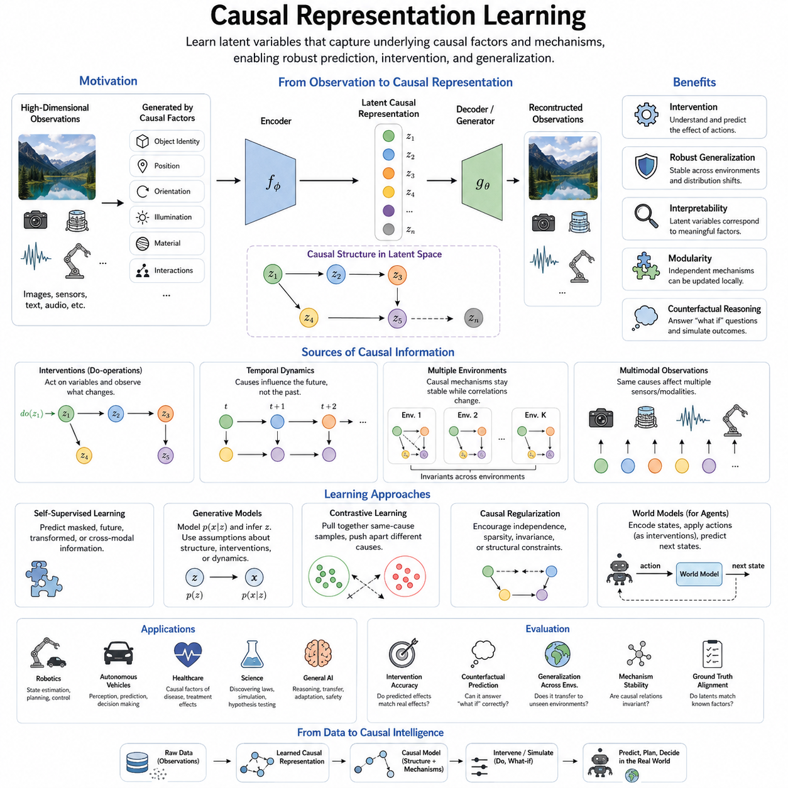
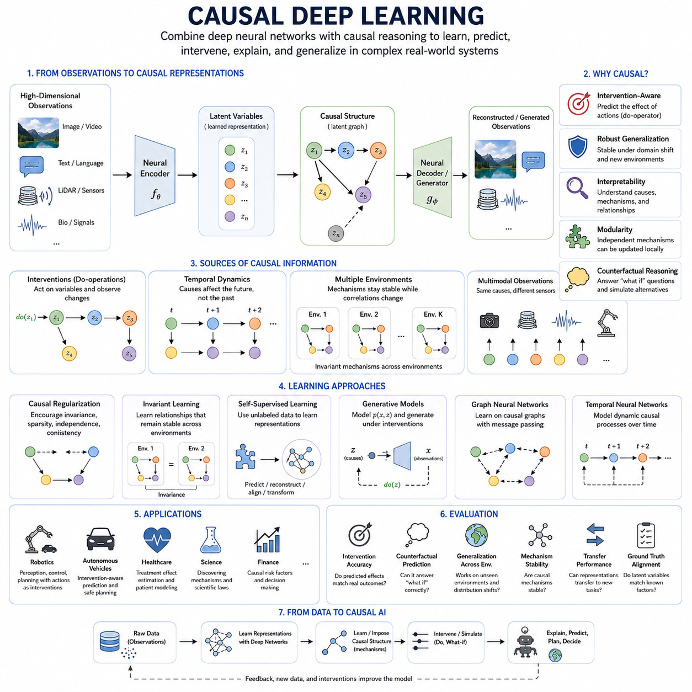
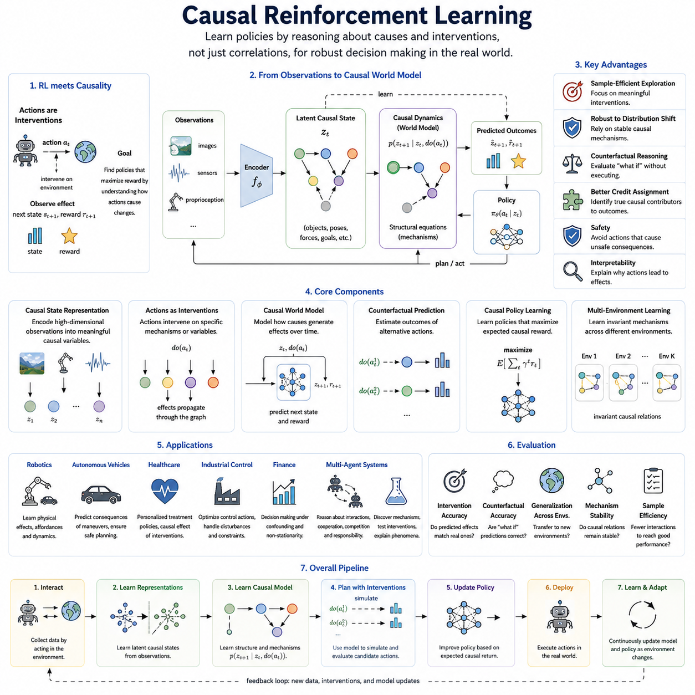
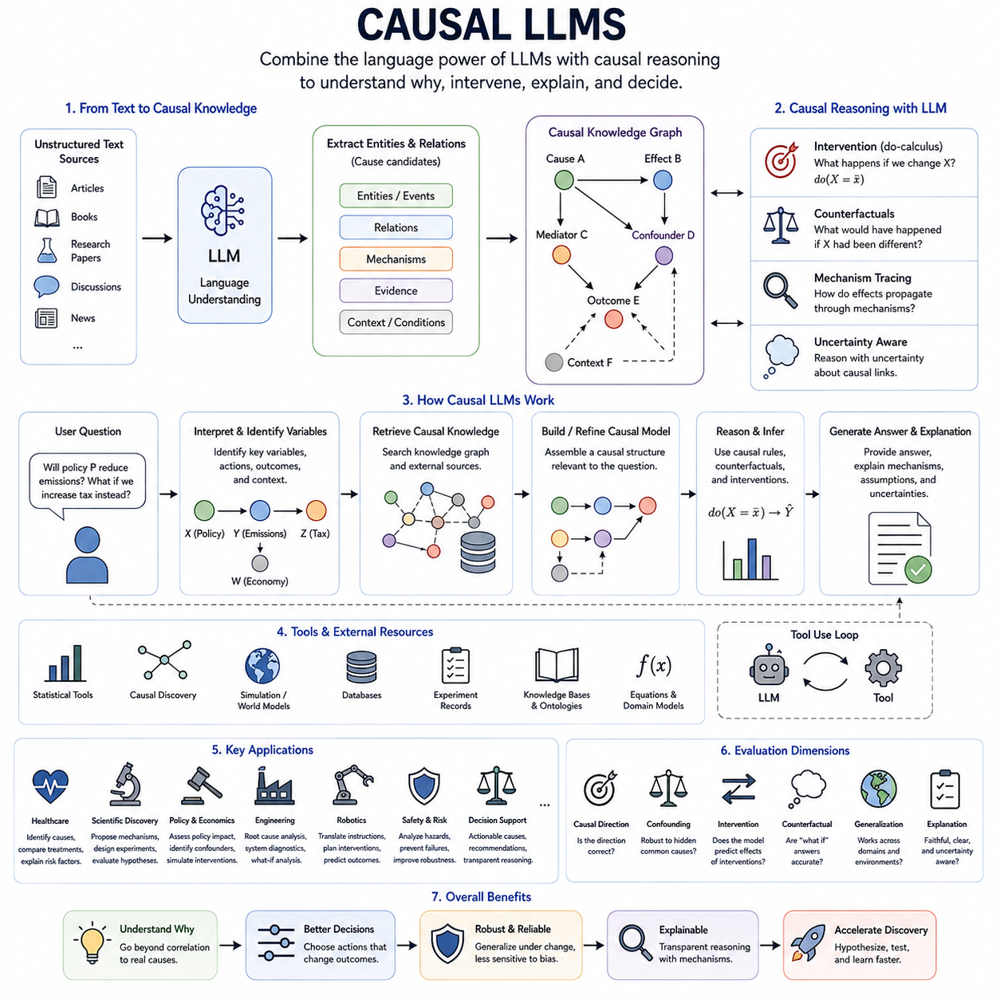
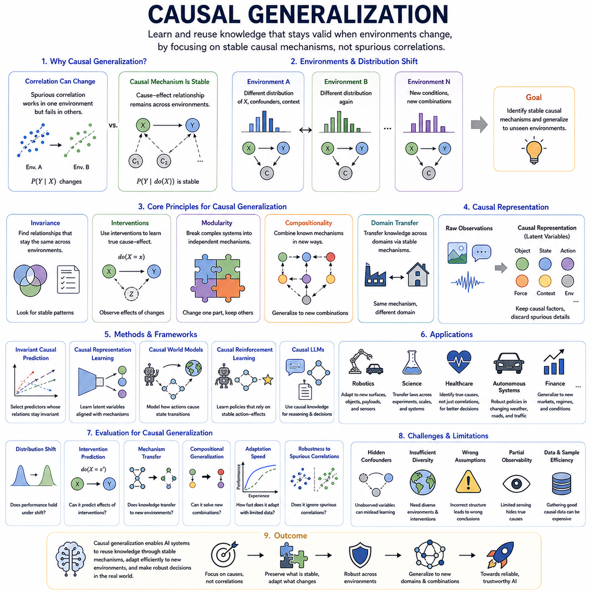

**Volume 46. Causality and Scientific AI**

# Chapter 05. Causal AI and Learning

## 05.01. Causal Representation Learning [w/Code]

{width="7.268055555555556in" height="7.268055555555556in"}

Causal representation learning seeks to learn internal representations that capture the underlying causal factors responsible for observed data rather than merely encoding statistical correlations. Conventional representation learning can discover compact features that are highly predictive within a training distribution, yet these features may depend on accidental correlations. A causal representation instead aims to organize latent variables around mechanisms that generate observations and determine how the world changes.

The central motivation is that observations are often high-dimensional manifestations of a much smaller set of meaningful causal variables. An image may contain millions of pixel values, while its relevant generative factors include object identity, position, orientation, illumination, material, and interactions with other objects. Causal representation learning attempts to infer such variables from raw observations and encode them into a structured latent space where causal relationships become easier to discover and manipulate.

A useful distinction exists between ordinary latent variables and causal latent variables. An autoencoder can compress observations into a low-dimensional vector without assigning causal meaning to individual dimensions. Two latent coordinates may arbitrarily mix several physical factors while still reconstructing the input accurately. Causal representations seek variables whose changes correspond more directly to independent mechanisms, interventions, or stable properties of the underlying system.

This objective is closely related to disentangled representation learning, but the two concepts are not identical. Disentanglement attempts to separate independent factors of variation, whereas causality additionally describes directional relationships among those factors. Variables may be statistically dependent because one causes another, because they share a common cause, or because selection mechanisms connect them. A causal representation therefore requires structural information beyond simple statistical independence.

Structural causal models provide a natural conceptual foundation for this approach. A latent representation can be interpreted as a collection of variables connected through structural equations, where each variable is generated from its causal parents and an associated exogenous disturbance. The resulting latent causal graph describes not only which variables are related but also how changes propagate through the system when particular variables or mechanisms are modified.

Interventions provide especially valuable information for learning causal representations. Observational data reveal how variables coexist under naturally occurring conditions, while interventions deliberately modify part of the system and expose which other variables respond. If changing one latent factor repeatedly produces predictable changes in another while leaving unrelated mechanisms stable, the learning system obtains evidence about causal direction and modular structure that observational correlation alone may not reveal.

Temporal data can provide another source of causal information because causes generally influence future states rather than arbitrary past states. Sequential observations allow models to examine which latent factors persist, which evolve, and which changes precede other changes. In dynamical environments, representations can therefore be trained to encode state variables that support prediction of future trajectories while separating persistent properties from transient disturbances and externally applied actions.

Independent causal mechanisms are an important principle behind many approaches. A complex system can often be understood as a collection of mechanisms that operate relatively independently, even though their outputs interact. If one mechanism changes, other mechanisms may remain valid. Representations organized according to these modules can support adaptation because the model may update the affected component without relearning every relationship encoded in the entire system.

Identifiability is one of the fundamental difficulties of causal representation learning. Many different latent representations can explain exactly the same observational distribution, making it impossible in general to determine the true causal variables from passive data alone. Additional assumptions or information are therefore required, such as temporal structure, multiple environments, known interventions, weak supervision, sparsity, independence assumptions, or knowledge about how the underlying system generates observations.

Multiple environments are particularly useful because causal mechanisms often remain stable while correlations produced by context change. A model trained across different environments can search for representations that preserve invariant relationships rather than features that happen to predict well in only one domain. This idea connects causal representation learning with domain generalization, invariant prediction, transfer learning, and robust machine learning under distribution shifts.

Self-supervised learning can serve as an important practical bridge because causal variables are rarely available as explicit labels. Predicting masked information, future states, transformations, temporal relationships, or cross-modal correspondences can encourage an encoder to discover meaningful structure without exhaustive human annotation. However, self-supervision alone does not guarantee causal representations; objectives and data variations must provide signals capable of distinguishing causal mechanisms from convenient statistical shortcuts.

Generative models offer another important route. A decoder can describe how latent variables generate observations, while an encoder estimates those variables from data. Variational autoencoders, flow-based models, and other latent-variable architectures can be extended with assumptions about causal graphs, interventions, environments, or structured transitions. The learned latent space then becomes not merely a compressed description but a candidate model of the hidden processes responsible for observed phenomena.

Contrastive methods can also contribute when positive and negative pairs are constructed according to meaningful transformations or environmental changes. Observations sharing the same underlying causal factor can be encouraged to have similar representations while irrelevant variations are separated or suppressed. The effectiveness of this strategy depends strongly on how pairs are generated, because poorly chosen augmentation rules can accidentally remove causal information or preserve undesirable shortcuts.

Causal representation learning becomes especially important when an AI system must operate outside its training distribution. A purely correlational representation may fail when background conditions, sensor properties, environmental statistics, or operational contexts change. Representations based on stable causal mechanisms can potentially distinguish what has changed from what remains structurally valid, allowing downstream predictors and decision systems to reuse knowledge rather than treating every new environment as an unrelated problem.

For robotics and embodied AI, causal representations can describe properties such as object state, robot configuration, contact, motion, force, affordance, and environmental dynamics. An agent does not merely observe these variables; its actions intervene on them. Pushing an object, opening a door, accelerating a vehicle, or grasping a tool produces controlled changes that reveal causal structure. Interactive agents therefore possess a powerful source of causal supervision through their own actions.

A robot world model can exploit this structure by encoding observations into latent causal states, applying candidate actions as interventions, and predicting resulting state transitions. Instead of asking only what is likely to happen next, the model can estimate what would happen if a particular action were executed. Such representations connect perception, prediction, planning, and control and provide a foundation for counterfactual simulation before potentially costly or dangerous actions are performed.

Multimodal observations further strengthen this framework because causal factors often produce simultaneous effects across several sensing channels. Motion may appear in camera images, LiDAR geometry, inertial measurements, joint encoders, and force sensors in different forms. Learning a shared causal representation can separate sensor-specific appearance from common physical causes, allowing multimodal systems to reason about the underlying state rather than treating each sensor stream as an independent statistical signal.

Evaluation remains difficult because good predictive accuracy does not prove that a representation is causal. Evaluation may instead examine whether latent variables correspond to known generative factors, whether interventions produce correct downstream changes, whether mechanisms remain stable across environments, and whether representations support transfer under distribution shift. Counterfactual prediction and intervention generalization provide particularly demanding tests because they require knowledge beyond ordinary observational fitting.

Causal representation learning ultimately attempts to move machine learning from recognizing recurring patterns toward modeling the mechanisms that produce those patterns. Its promise lies in representations that are interpretable, modular, transferable, intervention-aware, and robust to changing environments. Within causal AI, it forms a bridge between raw high-dimensional perception and explicit causal reasoning, providing structured variables upon which causal deep learning, causal reinforcement learning, causal world models, and more general reasoning systems can operate.

## 05.02. Causal Deep Learning

{width="7.268055555555556in" height="7.268055555555556in"}

Causal deep learning combines the representation power of deep neural networks with explicit principles of causal reasoning. Conventional deep learning is exceptionally effective at discovering statistical patterns in large datasets, but prediction alone does not reveal why an outcome occurs or how it would change under intervention. Causal deep learning seeks neural models that represent causes, mechanisms, interventions, and counterfactual relationships while retaining the scalability of modern deep architectures.

The distinction between correlation and causation becomes especially important when neural networks operate outside their training conditions. A model may learn that two variables frequently appear together without understanding the mechanism connecting them. When the environment changes, such correlations may disappear. Incorporating causal structure encourages models to rely on relationships that remain meaningful across environments rather than shortcuts that happen to perform well on the original training distribution.

A causal deep learning system can be viewed as combining neural representation learning with a structural causal model. Neural encoders transform high-dimensional observations into latent variables, while causal relationships among those variables describe how different components of the system influence one another. Neural networks can also parameterize structural equations, allowing nonlinear and highly complex causal mechanisms to be represented while preserving an explicit distinction between causes and their effects.

This combination is valuable because classical causal models often assume relatively compact variables that have already been defined by researchers. Real-world AI systems instead receive images, video, language, LiDAR, audio, biological signals, or large collections of sensor measurements. Deep networks can extract useful latent variables from these observations, while causal modeling organizes the resulting representations into mechanisms suitable for intervention, explanation, prediction, and decision making.

Intervention is a defining concept in causal deep learning. Ordinary prediction estimates an outcome conditioned on observed information, whereas intervention asks what would happen if a variable were deliberately changed. Neural models can be trained using observational and interventional datasets so that they distinguish naturally occurring associations from externally imposed changes. This distinction enables systems to predict consequences of actions rather than merely extrapolate correlations found in historical observations.

Counterfactual reasoning extends this capability by considering alternative outcomes for events that have already occurred. After estimating the latent state and causal mechanisms responsible for an observation, a model can modify one causal variable while holding relevant background conditions fixed. It can then simulate an alternative outcome, supporting questions such as what would have happened under another treatment, control action, environmental condition, or operational decision.

Causal regularization provides one practical method for introducing causal assumptions into neural learning. Training objectives can encourage invariance, sparsity, modularity, independence of mechanisms, or consistency under intervention. Instead of optimizing only prediction or reconstruction error, the model is penalized when its internal representations violate desired causal properties. These additional constraints guide learning toward representations that may generalize more reliably than unconstrained statistical features.

Invariant learning is particularly important for causal deep networks. If a relationship represents a stable causal mechanism, it should often remain useful when background conditions or environmental distributions change. Training across multiple domains can therefore encourage the network to identify features whose predictive relationships remain stable. Spurious correlations that vary across environments become less attractive, while persistent mechanisms receive greater importance in the learned representation.

Domain shifts illustrate why this matters. An image classifier may associate a particular background with an object because the two frequently coexist in the training dataset. A causal approach attempts to separate properties responsible for the object\'s identity from contextual variables that merely correlate with it. Similar problems occur in medicine, autonomous driving, industrial inspection, finance, robotics, and scientific modeling whenever deployment conditions differ from historical training data.

Attention mechanisms can also participate in causal deep learning, although attention itself should not be interpreted automatically as causality. Attention identifies information that a model considers useful for its computation, whereas causal influence concerns how changing one variable changes another. Causal constraints, interventions, or graph structures can be combined with attention so that information selection is informed by candidate causal relationships rather than purely predictive relevance.

Graph neural networks provide a natural architecture when causal variables and their relationships can be represented as nodes and directed connections. Message passing can model interactions among variables, components, agents, or physical entities, while structural constraints specify which directions of influence are permitted. Neural causal graphs can therefore combine relational learning with causal structure and are useful for complex systems whose topology plays an important role in their behavior.

Generative deep models provide another route toward causal modeling. Variational autoencoders and related architectures can represent latent causal factors and generate observations from them. By incorporating causal graphs or structured mechanisms into the latent space, the model can generate not only statistically plausible samples but also samples corresponding to interventions. This allows the generative process to answer how observations might change when particular underlying causes are modified.

Temporal neural networks are especially relevant because many causal processes unfold dynamically. Recurrent networks, temporal convolutional networks, Transformers, and state-space models can learn relationships among sequences of latent states. When combined with causal assumptions, they can distinguish persistent state, external intervention, system dynamics, and environmental disturbance, providing a richer description than ordinary sequence prediction based only on temporal correlation.

Causal deep learning also connects strongly with self-supervised learning. Large quantities of unlabeled data can be used to learn representations through future prediction, masked reconstruction, cross-modal alignment, or transformation prediction. Causal constraints can then encourage these representations to correspond to stable mechanisms rather than arbitrary predictive features. This combination is attractive because explicit causal labels are difficult to obtain, while observational and sequential data are abundant.

In robotics, causal deep learning naturally integrates perception and action. A robot observes the environment through cameras, LiDAR, force sensors, proprioception, and other modalities, while its motor commands actively modify the environment. Actions therefore provide intervention signals. A model can learn which state changes result from its own actions, which arise from external agents, and which reflect environmental dynamics, improving planning and control in interactive physical environments.

Causal world models extend this idea by learning structured internal models of environment dynamics. The model encodes the current observation into a latent state, represents actions as interventions, and predicts possible future states. Planning can then compare alternative action sequences before execution. Rather than relying solely on statistical trajectory prediction, the system attempts to represent how specific actions cause changes in objects, agents, and environmental conditions.

Autonomous systems benefit from this capability because safety often depends on reasoning about consequences rather than simply predicting likely events. An autonomous vehicle, for example, must distinguish between observing another vehicle slowing down and understanding how its own acceleration, braking, or lane change could alter future interactions. Causal deep models can support intervention-aware prediction, enabling planners to evaluate possible actions within a structured model of dynamic relationships.

Scientific AI provides another important application. Deep networks can approximate complicated nonlinear relationships in physical, biological, chemical, or engineering systems, while causal structures encode hypotheses about underlying mechanisms. Experimental interventions can then test whether learned relationships behave consistently with the proposed causal model. This creates a connection between data-driven discovery and scientific reasoning, where models are expected not only to predict observations but also to support mechanistic explanations.

Interpretability can improve when neural representations are connected to explicit causal variables and mechanisms. Traditional neural networks may distribute information across many hidden units without assigning clear meaning to them. A causal architecture attempts to organize relevant information according to variables, mechanisms, and directed dependencies. Explanations can therefore focus on which causes influenced an outcome and how changes to those causes would alter the predicted result.

Evaluation of causal deep learning requires more than conventional predictive accuracy. Models should be tested under interventions, distribution shifts, unseen environments, and counterfactual scenarios. Researchers can examine whether predicted intervention effects match actual outcomes, whether causal mechanisms remain stable across domains, and whether learned representations support transfer to new tasks. Strong performance on ordinary test data may otherwise conceal dependence on fragile correlations.

A major challenge is that causal structure cannot generally be recovered from observational data without assumptions. Deep neural networks do not remove this fundamental limitation. Greater model capacity may actually allow more alternative explanations of the same data. Effective causal deep learning therefore depends on appropriate inductive biases, environmental variation, interventions, temporal information, domain knowledge, or other constraints capable of reducing causal ambiguity.

Causal deep learning ultimately aims to transform deep networks from powerful pattern recognition systems into models capable of reasoning about mechanisms and consequences. By combining neural representation learning with structural causality, intervention, invariance, and counterfactual reasoning, it provides a pathway toward AI systems that can generalize beyond familiar data, explain outcomes, predict the consequences of actions, and support robust decision making in changing environments.

## 05.03. Causal Reinforcement Learning

{width="7.268055555555556in" height="7.268055555555556in"}

Causal reinforcement learning combines reinforcement learning with causal reasoning so that an agent can learn not only which actions produce high reward, but also why particular actions change the environment. Standard reinforcement learning often discovers effective policies through repeated interaction, yet the learned policy may depend heavily on correlations encountered during training. Causal reinforcement learning seeks policies grounded in intervention, mechanism, and structured environmental understanding.

The connection between reinforcement learning and causality is natural because actions are themselves interventions. When an agent selects an action, it deliberately changes part of the environment and observes the resulting transition. This differs from passive prediction, where the model only estimates relationships among observed variables. By treating actions as interventions, causal reinforcement learning can distinguish effects produced by the agent from changes caused by external processes or hidden environmental factors.

A Markov Decision Process provides the conventional foundation for reinforcement learning through states, actions, transition probabilities, rewards, and policies. Causal reinforcement learning extends this view by representing the transition process using causal variables and mechanisms. Instead of modeling only the probability of the next state, the agent may represent how specific components of the current state and chosen action cause particular components of the future state.

Structural causal models can therefore be integrated with reinforcement learning environments. State variables become nodes in a causal graph, actions can intervene on selected mechanisms, and transition dynamics are represented through structural equations. Such models allow the agent to reason about which variables directly influence others and which relationships remain unchanged when particular interventions or environmental conditions vary.

This structure supports more efficient exploration. In ordinary reinforcement learning, the agent may need many trials to discover which actions matter because it treats the environment largely as a black box. A causal model can identify variables that are likely to influence desired outcomes and direct exploration toward informative interventions. The agent can therefore reduce unnecessary experiments while learning more about the mechanisms that determine reward and state transitions.

Causal exploration is particularly valuable when interaction is expensive or dangerous. Robots, autonomous vehicles, industrial systems, and healthcare decision systems cannot freely test arbitrary actions in the real world. If an agent can infer causal relationships from previous experience, demonstrations, simulations, or limited interventions, it can prioritize safer and more informative actions rather than relying on unrestricted trial and error.

Counterfactual reasoning provides another important capability. After observing the result of an action, the agent can ask what might have happened if a different action had been chosen under the same background conditions. A causal model can estimate alternative trajectories without physically executing every candidate action. These counterfactual estimates can improve policy evaluation, credit assignment, and decision making when direct experimentation is limited.

Credit assignment is a central reinforcement learning problem because a delayed reward may result from a long sequence of actions. Causal structure can help identify which actions and intermediate variables actually contributed to the outcome. Instead of assigning influence primarily through temporal proximity, the agent can use causal dependencies to determine which decisions changed the mechanisms responsible for later rewards.

Causal reinforcement learning can also improve robustness under distribution shift. A conventional policy may exploit correlations that hold only in the training environment. When object appearances, background conditions, sensor characteristics, traffic patterns, or task configurations change, these correlations may fail. Policies based on stable causal mechanisms have a better chance of transferring because they depend on relationships governing how actions produce consequences.

Multiple environments provide useful information for learning such stable mechanisms. If some correlations change across environments while action-effect relationships remain consistent, the agent can identify which parts of its internal model are invariant. This can support policy transfer from simulation to reality, from one robot platform to another, or from one operational environment to another without relearning the complete policy from the beginning.

Causal state representation is therefore important. High-dimensional observations such as images, LiDAR, language, and proprioceptive signals may contain many details that do not directly affect decision making. An encoder can transform these observations into latent causal states representing objects, positions, contacts, forces, goals, hazards, or other meaningful variables. Reinforcement learning can then operate on a representation closer to the underlying mechanisms of the environment.

Model-based reinforcement learning is especially compatible with this approach. A learned world model predicts future states and rewards from current states and actions. When the world model includes causal structure, actions can be treated explicitly as interventions and future trajectories can be generated according to learned mechanisms. Planning algorithms can then compare candidate action sequences through internal simulation before selecting an action for execution.

This differs from purely predictive world modeling because causal structure attempts to describe how changes propagate. A model might predict that an object will move because similar trajectories appeared in training data, while a causal world model represents that applying force through contact changes velocity and position. Such mechanistic structure can make predictions more reliable when the agent encounters combinations of states and actions not frequently observed during training.

Offline reinforcement learning can also benefit from causal reasoning. Offline agents learn from previously collected datasets without unrestricted interaction with the environment. These datasets may contain strong selection bias because actions were generated by particular historical policies. Causal methods can help distinguish the effect of an action from the circumstances under which that action happened to be selected, improving policy evaluation and reducing misleading conclusions from observational data.

Confounding is especially relevant in these settings. A hidden or observed variable may influence both the selected action and the resulting reward, making the action appear more effective or harmful than it truly is. Causal reinforcement learning attempts to identify, adjust for, or otherwise model such confounding factors so that estimated action effects more accurately represent what would happen under deliberate policy intervention.

Hierarchical reinforcement learning can also be connected to causal mechanisms. Complex tasks may be decomposed into relatively independent subgoals and reusable skills. If these modules correspond to causal mechanisms, an agent can transfer individual skills when only part of the environment changes. This modularity can reduce relearning and support compositional behavior in tasks where familiar mechanisms appear in new combinations.

Multi-agent reinforcement learning introduces further causal complexity because each agent's action can influence the observations and decisions of other agents. A causal model can represent direct and indirect interactions among agents and help distinguish coordination effects from common environmental causes. This can support reasoning about cooperation, competition, communication, and responsibility in systems where many decision makers interact simultaneously.

For robotics, causal reinforcement learning is particularly attractive because embodied agents naturally generate intervention data. A robot can push, grasp, rotate, accelerate, stop, open, or manipulate objects and directly observe how the environment responds. These interactions reveal action-effect relationships that are difficult to infer from passive visual observation alone and can gradually build a structured model of physical affordances and dynamics.

A mobile robot, for example, can learn that steering changes heading, acceleration changes velocity, obstacles constrain motion, and surface properties influence traction. A manipulation robot can learn how grasp pose, applied force, object geometry, and contact conditions affect object motion. Encoding these relationships causally can improve planning when the robot faces unfamiliar objects, altered payloads, or new environmental conditions.

Safety is another important motivation. Reinforcement learning policies optimized only for expected reward may exploit unintended shortcuts or unsafe behaviors that happen to receive favorable training signals. A causal model can represent how actions influence hazards, constraints, and safety-critical variables. Planning can then reject interventions likely to produce dangerous downstream consequences even when such actions appear attractive according to short-term reward.

Causal reasoning can also support explanation of agent decisions. Instead of reporting only that a policy selected a particular action, the system can identify which state variables influenced the decision and what outcomes were expected to change as a result. Such explanations are valuable in autonomous systems, industrial control, healthcare, and other applications where operators need to understand the mechanisms behind an AI-generated decision.

Evaluation should therefore examine more than cumulative reward in familiar environments. Causal reinforcement learning systems can be tested on intervention prediction, counterfactual accuracy, transfer to changed environments, robustness to confounding, sample efficiency, and adaptation after mechanism changes. A strong causal agent should preserve useful knowledge when irrelevant correlations change and update only those components associated with genuinely altered mechanisms.

Important limitations remain because causal structure cannot automatically be recovered from arbitrary interaction data. Hidden confounders, insufficient exploration, partial observability, incorrect structural assumptions, and limited intervention diversity can all produce inaccurate causal models. The agent must therefore combine environmental interaction with suitable inductive biases, temporal information, domain knowledge, multimodal observations, or experimental design strategies.

Causal reinforcement learning ultimately aims to move reinforcement learning from trial-and-error policy optimization toward mechanism-aware decision making. By interpreting actions as interventions and combining causal representations, structural models, counterfactual reasoning, and policy learning, it provides a pathway toward agents that explore more efficiently, transfer knowledge more reliably, reason about consequences, and act more safely in changing real-world environments.

## 05.04. Causal LLMs

{width="7.268055555555556in" height="7.268055555555556in"}

Causal LLMs combine the language understanding and generation capabilities of large language models with explicit ideas from causal inference and structural causal reasoning. Conventional LLMs learn statistical dependencies among tokens, concepts, events, and descriptions from large text corpora. Causal LLMs aim to move beyond association by representing why events occur, how interventions change outcomes, and which mechanisms remain stable across changing contexts.

An important challenge is that natural language contains enormous amounts of causal information, but most of it is expressed indirectly. Text describes actions, consequences, explanations, experiments, failures, intentions, and hypothetical alternatives without providing explicit causal graphs. A causal LLM must therefore distinguish statements of correlation from claims of causation and infer candidate relationships while preserving uncertainty about relationships that are not sufficiently supported.

Structural causal models provide one possible framework for organizing this information. Entities, events, conditions, and outcomes can be mapped to causal variables, while directed relationships describe how one variable influences another. An LLM can help identify candidate variables and mechanisms from unstructured text, while a structured causal component constrains reasoning about interventions, dependencies, confounders, mediators, and downstream effects.

This creates an important distinction between linguistic prediction and causal reasoning. Predicting that two events commonly appear together in text does not establish that one causes the other. A language model may reproduce frequent explanations from its training data even when those explanations reflect bias or convention. Causal reasoning requires asking whether changing a proposed cause would change the outcome while other relevant conditions are appropriately controlled.

Intervention-based reasoning allows an LLM to answer questions that go beyond ordinary conditional prediction. Instead of asking what normally follows a particular situation, the system can reason about what would happen if a variable were deliberately changed. Connecting language representations with the do-operator or an intervention model enables the system to distinguish observed evidence from hypothetical manipulation and to trace how effects may propagate through a causal structure.

Counterfactual reasoning extends this capability to alternative histories. After representing an observed event and its background conditions, a causal LLM can consider what might have happened if one decision, action, treatment, or environmental condition had been different. This supports explanations, decision analysis, debugging, policy reasoning, scientific investigation, and planning where users need to compare actual outcomes with plausible alternatives.

Causal knowledge graphs can provide an external structure for this reasoning. An LLM may extract entities and relations from documents and organize them into graphs representing causes, effects, mechanisms, evidence, and contextual conditions. Retrieval can then supply relevant causal structures during inference, allowing the model to reason with explicit relationships rather than relying only on causal patterns implicitly stored in neural parameters.

Tool use is also important because reliable causal analysis often requires capabilities beyond text generation. A causal LLM can interact with statistical packages, causal discovery algorithms, simulation environments, databases, experiment records, or structural models. The LLM can interpret the user\'s problem and formulate hypotheses, while specialized tools estimate effects, test assumptions, simulate interventions, or evaluate alternative causal structures.

Scientific applications are particularly suitable because scientific reasoning frequently involves hypotheses about mechanisms and experimental interventions. A causal LLM can connect published knowledge, experimental observations, equations, and domain constraints to propose candidate explanations. It can then help formulate experiments that distinguish competing hypotheses, making the language model part of an iterative cycle of hypothesis generation, intervention, observation, and model revision.

Causal LLMs can also improve decision-support systems. In medicine, engineering, economics, and operations, users often ask not merely what is likely to happen but what action could change the outcome. A causally structured system can separate risk factors from actionable causes, identify potential confounders, compare interventions, and explain which assumptions influence a recommendation rather than presenting predictive correlations as direct prescriptions.

For robotics and embodied AI, an LLM can connect language-level reasoning with a causal world model. Instructions such as moving an object, avoiding a hazard, or repairing a failure can be translated into candidate interventions on a structured representation of the environment. The world model predicts how those interventions affect future states, while the LLM interprets goals, constraints, explanations, and high-level plans expressed in language.

Causal reasoning may also contribute to reducing some forms of hallucination, although it does not automatically guarantee factual correctness. A model constrained to maintain consistent causal relationships can detect contradictions between proposed causes and expected effects. External evidence, retrieval, tools, and structured models remain necessary because an internally coherent causal explanation can still be based on incorrect assumptions or incomplete information.

Evaluation therefore requires more than conventional language benchmarks. A causal LLM should be tested on causal direction, confounding, intervention prediction, counterfactual reasoning, mechanism transfer, and robustness when superficial correlations change. Evaluation should also examine whether explanations correspond to the model\'s actual causal assumptions and whether answers change appropriately when relevant variables or background conditions are modified.

Ultimately, Causal LLMs represent a bridge between statistical language modeling and mechanism-based reasoning. Their objective is not to replace the generative capabilities of LLMs, but to complement them with explicit representations of causes, interventions, counterfactuals, and stable mechanisms. Such integration can support more reliable reasoning, scientific discovery, planning, explanation, and decision making as language models become components of increasingly autonomous AI systems.

## 05.05. Causal Generalization

{width="7.268055555555556in" height="7.268055555555556in"}

Causal generalization refers to the ability of an AI system to preserve useful knowledge when the statistical distribution of observations changes but the underlying causal mechanisms remain stable. Conventional machine learning often generalizes by interpolating within patterns similar to the training data, whereas causal generalization seeks relationships that continue to hold across environments, domains, interventions, and previously unseen combinations of conditions.

The central idea is that correlations may vary while causal mechanisms remain comparatively invariant. A feature that predicts an outcome in one dataset may lose its predictive value when background conditions change, especially when the feature is only indirectly associated with the outcome. By identifying variables that directly participate in stable mechanisms, a causal model can reduce dependence on spurious correlations and improve out-of-distribution generalization.

This distinction can be expressed through changes in data-generating processes. Different environments may alter the distributions of inputs, confounders, or contextual variables while leaving selected structural relationships unchanged. Causal generalization attempts to discover which parts of the system are invariant and which are environment-specific, allowing a model to reuse stable mechanisms rather than relearning every relationship whenever the operational context changes.

Invariant causal prediction provides an important conceptual foundation for this approach. If a set of variables represents genuine causes of a target under suitable assumptions, the conditional relationship between those causes and the target should remain stable across environments where unrelated mechanisms change. Learning algorithms can therefore compare multiple environments and prefer representations or predictors whose relationships remain consistent despite changing observational distributions.

Causal representation learning contributes by transforming high-dimensional observations into latent variables that correspond more closely to underlying mechanisms. Images, language, sensor measurements, and other complex inputs may contain numerous irrelevant details. A causally structured representation seeks to preserve variables such as object identity, physical state, action, force, context, or environmental condition while separating factors whose correlations are accidental or domain-specific.

Interventions provide stronger evidence for generalization because they reveal how systems respond when selected variables are deliberately changed. A model that has learned the effect of an intervention can often apply that mechanism in situations where surface appearances differ. Instead of asking only whether two variables usually occur together, causal generalization asks whether manipulating one variable produces a stable effect on another across relevant contexts.

Modularity is closely connected to this capability. Complex systems can often be decomposed into relatively independent causal mechanisms, each governing part of the overall process. When an environment changes, only a subset of these mechanisms may be affected. A modular causal model can update the changed component while preserving unaffected knowledge, making adaptation more efficient and reducing the risk of catastrophic changes to previously learned behavior.

Compositional generalization extends this principle to new combinations of familiar mechanisms. An AI system may encounter objects, actions, goals, or environmental conditions that were previously observed separately but never together. If its internal representation captures modular causal relationships, the system can combine known mechanisms to reason about novel situations rather than depending on memorized combinations from the training distribution.

Domain generalization and domain adaptation are related but not identical to causal generalization. Domain methods often seek representations that transfer across datasets or operational contexts, while causal generalization emphasizes why transfer should be possible. Stable causal mechanisms provide a structural explanation for invariance and can help determine which information should be retained, ignored, or adapted when moving between domains.

Causal generalization is particularly relevant to reinforcement learning and autonomous agents because actions continuously alter the environment. A policy trained only on correlations from one environment may fail when dynamics, sensors, objects, or task configurations change. If the agent represents how actions causally affect states and rewards, it can preserve useful action-effect knowledge and adapt more efficiently to new conditions.

World models provide a practical framework for implementing this capability. A causal world model represents states, actions, environmental variables, and transition mechanisms in a structured latent space. Planning can then simulate interventions under new conditions and reuse mechanisms learned elsewhere. When only one part of the environment changes, the model can revise that mechanism instead of discarding its complete predictive structure.

Robotics provides a clear example. A mobile robot may operate on different surfaces, under different lighting conditions, with altered payloads or sensor configurations. Visual appearance and measured dynamics may change, but fundamental relationships among steering, force, motion, collision, and object interaction can remain stable. Causal generalization seeks to preserve these relationships so that adaptation requires less data and fewer risky real-world trials.

Scientific AI also benefits because scientific laws are valuable precisely because they generalize beyond individual observations. A causal model that captures a mechanism can potentially transfer knowledge across experimental conditions, scales, or related systems. Combining learned representations with physical constraints, interventions, and structural assumptions can therefore support models that seek reusable explanations rather than dataset-specific predictive rules.

Evaluation of causal generalization should explicitly test environments that differ from training conditions. Useful criteria include performance under distribution shift, intervention prediction, mechanism transfer, compositional generalization, adaptation speed, and robustness when spurious correlations are deliberately modified. A model that performs well only on randomly held-out samples may still fail to demonstrate genuine causal generalization.

A major limitation is that invariant behavior does not automatically prove causality. Multiple predictors may remain stable across the environments included in training, while hidden confounders or unobserved mechanism changes may still produce incorrect conclusions. Reliable causal generalization therefore requires appropriate environmental diversity, structural assumptions, interventions, temporal information, domain knowledge, or experimental evidence that meaningfully constrains alternative explanations.

Ultimately, causal generalization aims to make AI systems reuse knowledge according to stable mechanisms rather than superficial similarity. It connects causal representation learning, causal deep learning, causal reinforcement learning, and causal LLMs by providing a common objective: discovering knowledge that survives environmental change. Such capability is central to robust AI systems expected to operate, reason, and adapt beyond the conditions represented in their original training data.
