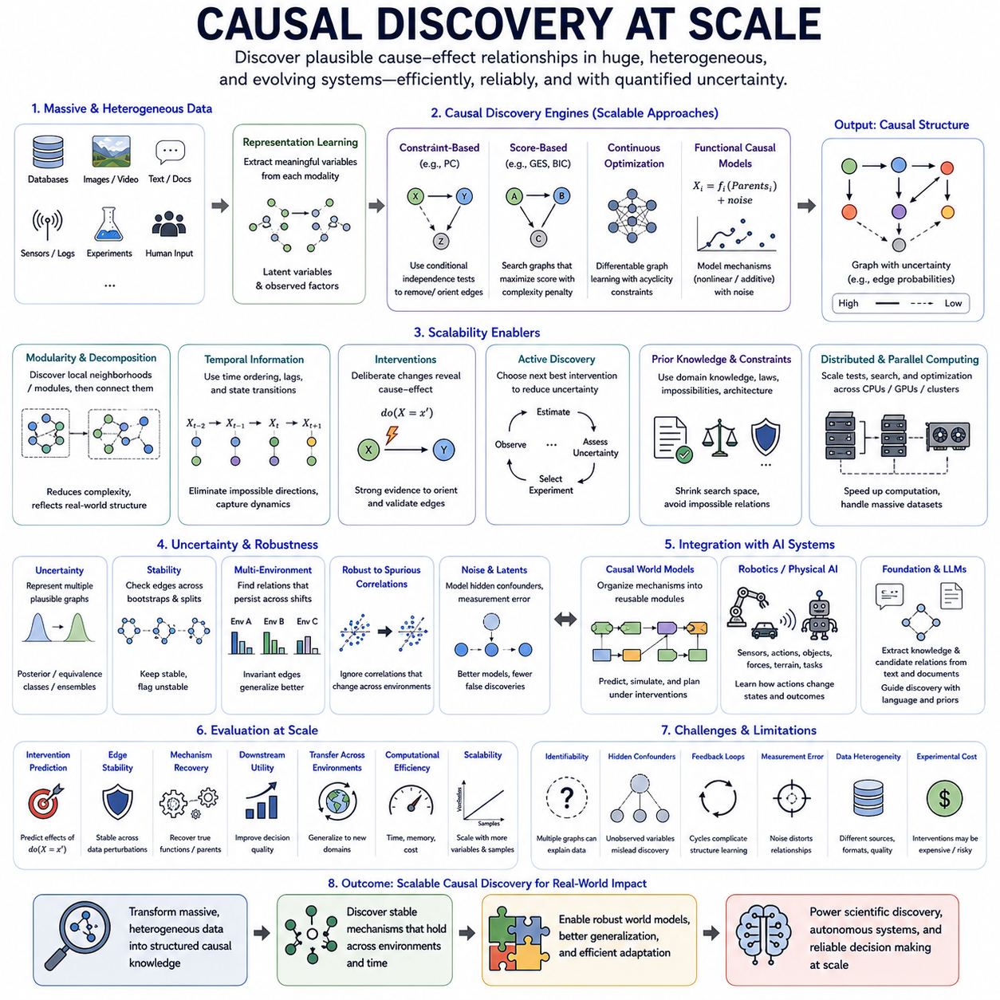
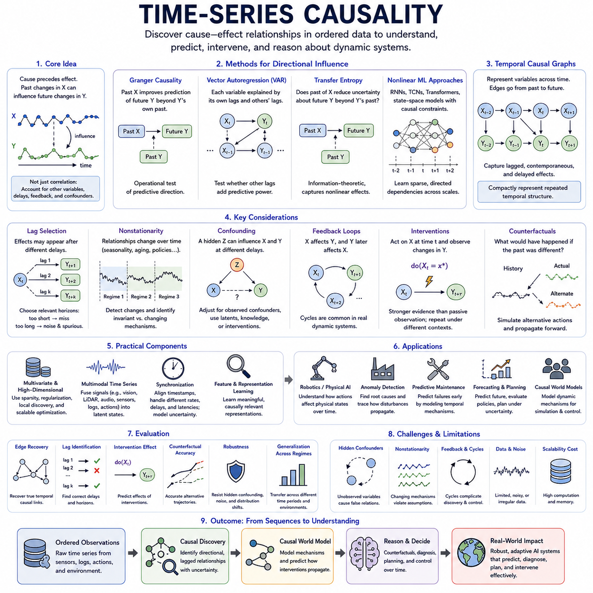
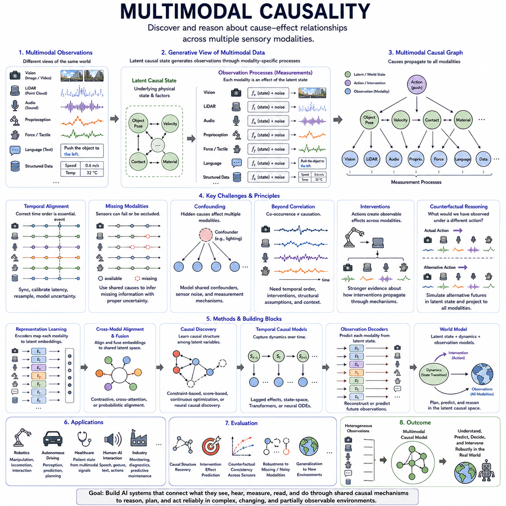
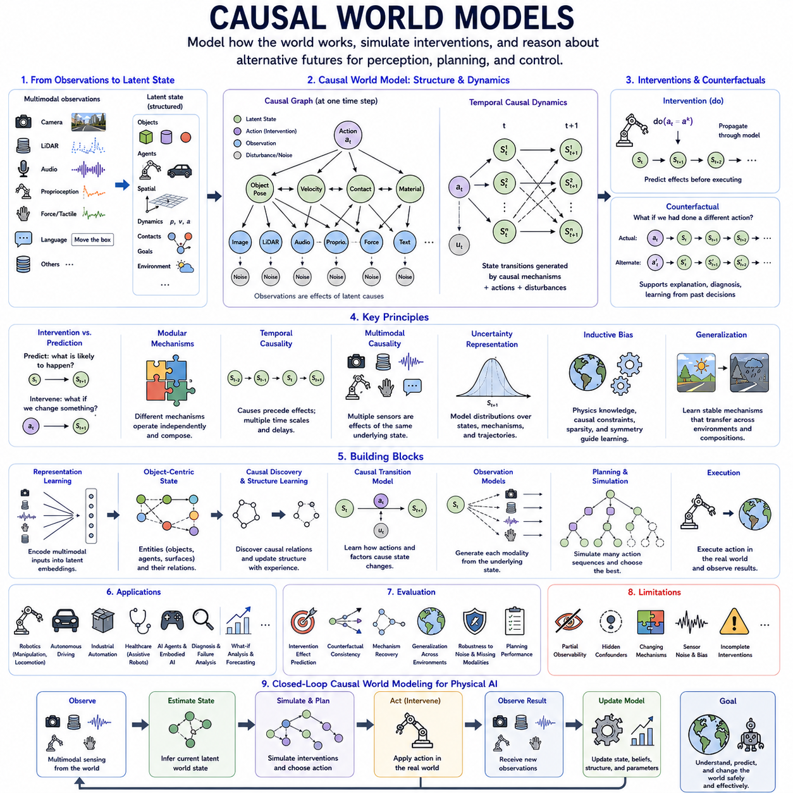
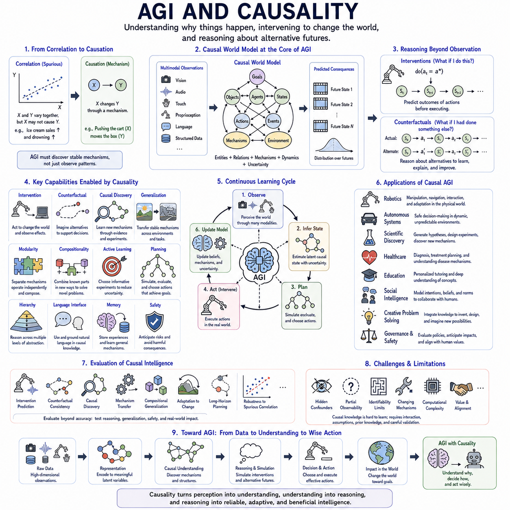

**Volume 46. Causality and Scientific AI**

# Chapter 06. Advanced Causality

## 06.01. Causal Discovery at Scale

{width="7.268055555555556in" height="7.268055555555556in"}

Causal discovery at scale extends causal structure learning from relatively small datasets to systems containing thousands or millions of variables, massive observational records, heterogeneous data sources, and continuously evolving environments. The objective is to identify plausible cause--effect relationships without exhaustively testing every possible graph, while maintaining statistical reliability, computational efficiency, and meaningful representations of the underlying mechanisms.

The fundamental difficulty arises from the enormous search space of possible causal graphs. As the number of variables increases, the number of candidates directed structures grows super-exponentially, making brute-force evaluation impossible. Scalable causal discovery therefore requires algorithms that restrict candidate relationships, exploit sparsity, decompose large problems, parallelize computation, or learn continuous approximations to otherwise discrete graph-search problems.

Constraint-based methods discover causal structure by testing conditional independence relationships among variables. Algorithms derived from approaches such as PC can progressively eliminate edges that are inconsistent with observed independence patterns and orient remaining relationships when sufficient evidence exists. At large scale, their practical success depends heavily on efficient statistical tests, sparse neighborhoods, dimensionality reduction, and strategies that avoid conditioning on excessively large variable sets.

Score-based causal discovery takes a different approach by assigning candidate graphs scores representing how well they explain the data while balancing model complexity. Searching directly through all directed acyclic graphs is computationally prohibitive, so scalable methods use greedy search, local optimization, decomposable scores, heuristics, or restricted graph families. These techniques trade exhaustive guarantees for computational feasibility when the number of variables becomes large.

Continuous optimization has introduced another important direction for scalable causal discovery. Instead of treating graph edges purely as discrete decisions, adjacency structures can be represented through differentiable parameters and optimized using gradient-based learning. Acyclicity can be imposed through differentiable constraints, allowing causal graph learning to interact naturally with neural networks and modern optimization frameworks designed for high-dimensional computation.

Functional causal models provide additional information by modeling how each variable is generated from its causal parents and an independent disturbance. Assumptions about functional form, noise distributions, nonlinearities, or additive mechanisms can sometimes reveal causal direction that conditional independence alone cannot determine. At scale, neural networks and other flexible function approximators can represent complex mechanisms, although increased flexibility also raises computational and identifiability challenges.

High-dimensional data frequently contain many variables that are irrelevant to a particular causal relationship. Feature selection and dimensionality reduction therefore become essential components of scalable systems. However, ordinary compression can destroy causal information by mixing causes, effects, and confounders. Causal representation learning offers an alternative by attempting to construct lower-dimensional variables that preserve mechanisms important for causal discovery and intervention.

Large-scale discovery can also exploit modularity. Real systems are rarely fully connected; biological pathways, industrial processes, robotic systems, organizations, and physical environments often consist of interacting subsystems. A discovery pipeline can identify local neighborhoods or modules, learn causal relationships within them, and subsequently estimate connections among modules. Such decomposition reduces computational complexity while reflecting the structured organization of many real-world systems.

Temporal information provides powerful constraints when large datasets describe evolving processes. Time ordering can eliminate many impossible causal directions because future variables normally cannot cause already observed past states under standard assumptions. Time-series causal discovery can combine lagged dependencies, instantaneous relationships, state transitions, and temporal invariance to reduce the candidate graph space and reveal dynamic mechanisms operating at different time scales.

Interventional data can dramatically strengthen causal discovery because deliberate changes provide information unavailable from passive observation. Even a limited number of interventions may orient relationships that remain ambiguous in observational data. At scale, the challenge becomes experimental design: selecting interventions that maximize information about uncertain parts of a large causal graph while minimizing financial cost, operational disruption, physical risk, or experimental time.

Active causal discovery addresses this problem by allowing the learning system to choose which intervention or experiment should be performed next. Instead of collecting data uniformly, the system estimates where uncertainty in the causal structure is most consequential and selects experiments expected to reduce it. This creates an iterative cycle of graph estimation, uncertainty assessment, intervention selection, observation, and causal model refinement.

Distributed and parallel computing are increasingly important when causal discovery involves very large datasets. Conditional independence tests, local score calculations, bootstrap analyses, candidate-edge evaluations, and neural optimization can often be distributed across CPUs, GPUs, or computing nodes. Efficient implementations must minimize communication overhead and avoid repeatedly moving massive datasets, making algorithm architecture as important as statistical methodology.

Heterogeneous data introduce another scaling dimension. Modern systems may combine structured databases, images, text, sensor streams, logs, experimental measurements, and human annotations. These modalities cannot always be inserted directly into a common causal graph. Representation models can first extract meaningful variables from each modality, after which causal discovery searches for relationships among shared latent states, observed variables, actions, and contextual factors.

Foundation models and large language models can assist this process by extracting candidate causal variables and relationships from unstructured knowledge sources. Scientific papers, engineering documents, maintenance reports, or operational logs may contain valuable prior information about plausible mechanisms. Such information can constrain the search space or prioritize hypotheses, although linguistic statements should be treated as uncertain evidence rather than automatically accepted as causal truth.

Prior knowledge is particularly valuable at scale because unconstrained discovery can generate enormous numbers of candidate relationships. Physical laws, temporal ordering, known system architecture, impossible connections, expert knowledge, and previously validated mechanisms can define structural constraints. Incorporating these constraints reduces computational burden and can prevent algorithms from spending resources evaluating relationships that are physically or logically impossible.

Causal discovery at scale must also represent uncertainty rather than returning a single graph with unjustified confidence. Observational equivalence, hidden confounding, finite samples, measurement noise, and model assumptions can leave multiple structures consistent with available evidence. Confidence estimates, equivalence classes, posterior graph distributions, stability analysis, or ensembles can communicate which relationships are strongly supported and which remain uncertain.

Robustness becomes essential when datasets originate from multiple environments. A relationship appearing in one environment may reflect a temporary correlation rather than a stable mechanism. Comparing candidate structures across environments can identify relationships that persist despite distribution changes. This connects scalable causal discovery with invariant learning and causal generalization, enabling large datasets to provide environmental diversity rather than merely greater sample volume.

Robotics and Physical AI create particularly demanding large-scale causal discovery problems. A robot may simultaneously observe cameras, LiDAR, proprioception, forces, actions, objects, agents, terrain, weather, and task variables. Discovering every relationship directly is impractical. A scalable architecture must organize observations into structured states and local mechanisms, then learn how actions intervene on these mechanisms and produce changes in future states.

A causal world model can incorporate discovered mechanisms into a reusable predictive structure. Rather than maintaining one enormous undifferentiated transition model, the system can represent interacting causal modules governing motion, contact, objects, agents, sensors, and environmental dynamics. Newly discovered mechanisms can update selected modules, allowing the world model to evolve as an autonomous system accumulates experience across different environments.

Evaluation at scale requires more than comparing an estimated graph with a small known ground truth. Large systems can be evaluated through intervention prediction, edge stability, mechanism recovery, downstream decision quality, transfer across environments, computational cost, memory requirements, and scalability with increasing variables and samples. Synthetic benchmarks remain useful because exact causal structures are known, while real-world experiments test whether discovered mechanisms produce practical value.

Scalable causal discovery remains fundamentally limited by identifiability. More data and greater computational power do not automatically reveal causal direction when observational distributions are compatible with multiple causal explanations. Hidden confounders, selection effects, feedback loops, measurement errors, and latent variables further complicate discovery. Scaling must therefore include richer evidence and stronger experimental design, not merely larger algorithms.

The long-term goal of causal discovery at scale is to enable AI systems to construct and continually refine large causal models of complex environments. By combining efficient graph search, representation learning, temporal structure, interventions, prior knowledge, distributed computation, and uncertainty estimation, scalable discovery can transform massive heterogeneous datasets into structured hypotheses about how systems actually work, providing a foundation for causal world models, scientific AI, and increasingly autonomous decision-making systems.

## 06.02. Time Series Causality [w/Code]

{width="7.268055555555556in" height="7.268055555555556in"}

Time-series causality studies how causal relationships unfold across ordered observations when variables influence one another through time. Unlike ordinary correlation analysis, it attempts to determine whether past changes in one process contribute to future changes in another and whether those relationships remain meaningful after accounting for alternative explanations. Time ordering provides valuable structure, but temporal precedence alone is not sufficient to establish causation.

A central principle is that causes normally precede their effects. If changes in variable X consistently occur before changes in variable Y, X becomes a plausible causal candidate for Y, whereas future values of X cannot normally explain already realized values of Y. This temporal constraint substantially reduces the space of possible causal structures, although common causes, delayed effects, feedback, and measurement timing can still create misleading dependencies.

Granger causality is one of the most widely used concepts for analyzing directional relationships in time series. Variable X is said to Granger-cause Y when past values of X improve prediction of future Y beyond the information already contained in past values of Y and other included variables. This provides an operational test of predictive direction, but Granger causality should not automatically be interpreted as proof of physical or structural causation.

Vector autoregressive models provide a classical framework for multivariate Granger analysis. Each variable is modeled using lagged values of itself and other variables, allowing researchers to test whether particular historical signals contribute additional predictive information. These models are interpretable and statistically well established, but they may struggle with nonlinear relationships, high-dimensional systems, nonstationary dynamics, and long temporal dependencies.

Transfer entropy offers an information-theoretic perspective on directional dependence. It measures whether knowledge of the past state of one process reduces uncertainty about the future state of another process beyond what can already be inferred from the target\'s own history. Because it is not restricted to linear relationships, transfer entropy can detect more complex dependencies, although reliable estimation can require substantial amounts of data.

Modern time-series causality increasingly incorporates nonlinear machine learning. Neural networks, recurrent neural networks, temporal convolutional networks, Transformers, and state-space models can represent complicated dependencies extending over multiple time scales. Causal constraints can be incorporated into these architectures so that they learn sparse directional relationships rather than merely maximizing sequence-prediction accuracy from every available signal.

Temporal causal graphs provide a structured representation of these relationships. Variables can be indexed by time, producing edges such as X at time t influencing Y at time t+1 or later. Repeated temporal structure can then be represented compactly through lagged causal relationships. Such graphs distinguish contemporaneous relationships from delayed effects and provide a foundation for reasoning about dynamic interventions and evolving system states.

Lag selection is therefore an important practical problem. A causal effect may appear immediately, after a fixed delay, or across several time scales. Choosing lags that are too short can miss important mechanisms, while excessively long lag windows increase computational complexity and introduce spurious relationships. Data-driven lag discovery, domain knowledge, multiscale modeling, and attention over historical states can help identify relevant temporal horizons.

Stationarity is another major concern because many classical methods assume that statistical relationships remain stable over time. Real systems frequently violate this assumption through aging, seasonal effects, environmental changes, policy shifts, component degradation, or changing behavior. Time-series causal analysis must therefore distinguish genuine causal changes from ordinary statistical fluctuations and identify when previously stable mechanisms have changed.

Nonstationarity can itself provide useful causal information. If different mechanisms change independently over time, shifts in distributions may help distinguish cause from effect. Comparing multiple temporal regimes can reveal which relationships remain invariant and which change together. This connects time-series causality with causal generalization, change-point detection, domain adaptation, and the broader principle of independent causal mechanisms.

Confounding remains a fundamental challenge. A third process Z may influence both X and Y at different delays, creating the appearance that X causes Y even when no direct causal relationship exists. Multivariate modeling can adjust for observed confounders, but hidden variables remain difficult. Incorporating additional sensors, latent-variable models, domain knowledge, interventions, or natural experiments can reduce ambiguity about such relationships.

Feedback loops are especially common in dynamic systems. X may influence Y, while Y subsequently influences X, creating bidirectional causal relationships across time. Control systems, biological regulation, markets, social interactions, and autonomous agents frequently exhibit such feedback. Temporal indexing makes these cycles manageable because relationships can remain acyclic across individual time steps even when the overall dynamical system contains recurrent interactions.

Interventions provide stronger evidence than passive temporal observation. If a system deliberately changes X at time t and subsequently observes a predictable change in Y, the resulting evidence can help distinguish causal effects from ordinary temporal association. Repeated interventions under different conditions are particularly valuable because they reveal whether the discovered mechanism remains stable when context and background variables change.

Counterfactual temporal reasoning asks how an observed trajectory would have evolved if an earlier event or action had been different. A causal time-series model can estimate the latent state preceding an intervention, replace the historical action or condition, and propagate the alternative dynamics forward. This capability supports planning, diagnosis, policy evaluation, fault analysis, and autonomous decision making.

Multivariate systems create significant scalability challenges because the number of possible lagged relationships increases rapidly with variables and temporal horizons. Sparse causal discovery assumes that each variable is directly influenced by only a limited subset of the available history. Regularization, graph constraints, local discovery, dimensionality reduction, and scalable optimization can therefore make causal analysis practical for large sensor networks and complex AI systems.

Multimodal temporal causality extends the problem beyond homogeneous numerical signals. Robots and intelligent systems may simultaneously process video, LiDAR, audio, language, proprioception, force measurements, and control commands. Representation learning can transform these streams into synchronized latent states, after which causal discovery can investigate how actions, objects, environmental conditions, and internal states influence one another through time.

Synchronization becomes critical in such systems. Sensors may operate at different sampling frequencies, communication delays may shift timestamps, and preprocessing pipelines may introduce additional latency. Apparent temporal order can therefore differ from true physical order. Accurate timestamping, clock synchronization, latency calibration, resampling, and uncertainty modeling are essential before causal conclusions are drawn from multimodal sequential data.

Robotics and Physical AI provide natural applications because physical behavior is fundamentally temporal. Motor commands generate forces, forces change acceleration, acceleration changes velocity, and velocity changes position. At the same time, contacts, terrain, payload, external agents, and environmental disturbances modify these transitions. Time-series causality can help separate these mechanisms and identify how actions propagate through physical state over time.

A causal world model can use these relationships to represent dynamic mechanisms rather than merely memorize trajectories. Current observations are encoded into a state, actions are represented as interventions, and causal transition mechanisms predict subsequent states. The model can then simulate alternative action sequences and reason about how different interventions propagate through the environment over multiple future time steps.

Time-series causal reasoning is also valuable for anomaly detection and predictive maintenance. Instead of detecting only that a sensor signal has become unusual, a causal model can examine which upstream mechanism may have produced the abnormal pattern and how the disturbance is propagating. This distinction can help separate root causes from downstream symptoms in industrial equipment, robots, vehicles, infrastructure, and other complex systems.

Evaluation should examine whether discovered temporal relationships support correct intervention and forecasting behavior under changing conditions. Useful criteria include causal edge recovery, lag identification, intervention-effect prediction, counterfactual trajectory accuracy, robustness to hidden confounding, and transfer across temporal regimes. Predictive accuracy alone is insufficient because a model can forecast well while relying on noncausal temporal correlations.

Time-series causality ultimately seeks to transform sequences from records of what happened into structured models of how changes propagate through time. By combining temporal ordering, lagged relationships, causal graphs, nonlinear learning, interventions, and counterfactual reasoning, it provides a foundation for understanding dynamic mechanisms and building AI systems that can predict, diagnose, plan, and intervene effectively in continuously evolving environments.

## 06.03. Multimodal Causality

{width="7.268055555555556in" height="7.268055555555556in"}

Multimodal causality studies causal relationships when information about a system is distributed across multiple forms of observation such as images, video, language, audio, LiDAR, force measurements, proprioception, physiological signals, and structured data. Instead of analyzing each modality independently, it seeks shared causal mechanisms that explain how events observed through different sensory channels arise, interact, and influence future outcomes.

The central challenge is that different modalities provide distinct but overlapping views of the same underlying world. A camera may reveal object appearance and motion, LiDAR may describe geometry and distance, audio may indicate contact or mechanical events, and language may provide semantic context. Multimodal causal reasoning attempts to identify latent variables that generate these observations while separating genuine causes from modality-specific correlations and measurement artifacts.

A useful conceptual framework assumes that an underlying causal state produces observations through different measurement processes. The physical state of an object, for example, may simultaneously determine its visual appearance, spatial geometry, acoustic response, and tactile properties. Rather than treating these signals as unrelated features, a causal model represents them as consequences of shared latent causes and uses their agreement or disagreement to refine its understanding of the environment.

Multimodal representation learning therefore plays an important role. Encoders transform heterogeneous inputs into latent representations that can be aligned, fused, or organized into structured variables. Ordinary multimodal learning may optimize similarity or prediction across modalities, whereas causal representation learning attempts to preserve factors corresponding to stable mechanisms. The objective is to discover representations that remain meaningful when sensors, environments, or observational conditions change.

Cross-modal relationships can provide evidence that is unavailable within a single modality. If visual motion is consistently followed by a contact force and a characteristic sound, the combination can provide stronger evidence about an interaction than any individual signal. However, repeated co-occurrence alone does not establish causality. Temporal ordering, interventions, structural assumptions, and contextual variation are still required to distinguish common causes from direct causal influence.

Synchronization is particularly important because causal interpretation depends on the order in which events occur. Cameras, microphones, LiDARs, inertial sensors, and control systems frequently operate at different sampling frequencies and latencies. Incorrect timestamps can reverse apparent temporal relationships or create false delays. Multimodal causal systems therefore require accurate time alignment, latency calibration, resampling, and explicit modeling of synchronization uncertainty.

Missing modalities create another practical challenge. Sensors may fail, become occluded, lose communication, or operate unreliably under particular environmental conditions. A robust causal model should not depend on every modality being continuously available. If different observations are connected through shared causal variables, the system can use available modalities to infer missing information while representing increased uncertainty rather than simply assuming that absent measurements are normal.

Confounding can occur both within and across modalities. Environmental lighting may influence several cameras, terrain may affect both vibration and wheel slip, and human activity may simultaneously change audio and visual observations. Without modeling such common causes, a system may incorrectly conclude that one sensor signal causes another. Multimodal causal discovery therefore requires reasoning about shared confounders, sensor-specific noise, latent variables, and measurement mechanisms.

Interventions provide especially valuable information in multimodal systems. When an agent performs an action, the consequences may appear simultaneously across several sensory channels. A robot pushing an object may observe visual displacement, force variation, motor current changes, and contact sounds. Because the action is deliberately selected, these synchronized responses provide evidence about how an intervention propagates through physical mechanisms and becomes observable through different modalities.

Counterfactual reasoning can then operate across modalities. After observing an event, a model can estimate what visual, acoustic, geometric, or force-related observations might have occurred if an earlier action had been different. Such reasoning requires a shared causal state rather than independent predictors for every sensor. The alternative causal state is propagated through modality-specific observation models to generate consistent counterfactual consequences across sensory channels.

Causal graphs provide a structured representation for these relationships. Nodes can represent latent physical states, semantic concepts, actions, environmental conditions, and modality-specific observations. Directed edges describe how causes propagate from hidden mechanisms toward observable signals. Separating world-state variables from measurement variables is particularly useful because sensor readings should often be modeled as effects of physical conditions rather than as direct causes of those conditions.

Attention and Transformer architectures can support multimodal causal modeling by selecting relationships among tokens originating from different sensory streams. Cross-attention can associate language with visual objects, actions with observed motion, or force events with contact regions. Yet attention weights alone do not establish causal influence. Causal constraints and intervention-based evidence are needed to determine whether an attended relationship corresponds to an actual mechanism.

Multimodal foundation models create opportunities for learning causal knowledge from very large heterogeneous datasets. Models trained jointly on text, images, video, sensor streams, and actions can acquire broad representations of objects, events, and interactions. Causal structure can organize these representations around mechanisms rather than purely statistical alignment, potentially improving transfer when a system encounters new combinations of environments, sensors, objects, or tasks.

Language has a distinctive role because it can provide semantic descriptions of relationships that are difficult to infer from raw sensor data alone. Instructions, maintenance reports, scientific documents, and human explanations may describe possible causes, failures, constraints, or expected effects. These descriptions can supply prior hypotheses for causal discovery, while physical observations and interventions provide evidence for testing whether the linguistic hypotheses correspond to actual mechanisms.

Temporal modeling is essential because multimodal causal processes evolve through time. Video frames, control commands, force signals, and language events can be represented as synchronized sequences of latent states. Temporal causal models can identify immediate and delayed effects while separating persistent state from transient observations. This enables reasoning about how actions propagate through physical dynamics and subsequently appear in multiple sensing channels.

Multimodal causal discovery must also address dimensionality. Raw images and point clouds may contain millions of measurements, making direct causal graph discovery impractical. Hierarchical representations can first organize data into objects, surfaces, agents, contacts, events, and other meaningful entities. Causal discovery can then operate on these structured variables rather than individual pixels or points, greatly reducing the search space while improving interpretability.

Robotics and Physical AI provide a natural setting for this approach. An embodied robot continuously integrates vision, LiDAR, inertial measurements, proprioception, force sensing, localization, language instructions, and control commands. These signals describe different aspects of a single physical process. Multimodal causality can connect them through shared mechanisms, allowing the robot to distinguish what it observes from what its own actions cause.

For example, wheel slip may be reflected simultaneously in commanded velocity, encoder measurements, inertial motion, visual odometry, and terrain appearance. A purely correlational model may associate any one of these signals with failure. A causal multimodal model can instead represent terrain properties and traction as underlying mechanisms that influence several measurements, helping the robot diagnose the cause and select an appropriate corrective action.

Manipulation provides another example. Object geometry can be observed visually or through depth sensing, contact can be detected through force and tactile signals, and action is represented by joint commands and end-effector motion. Combining these modalities causally allows a robot to reason about how grasp configuration and applied force produce object motion, rather than merely learning statistical associations between sensor patterns and successful manipulation.

Autonomous vehicles similarly depend on multimodal causal understanding. Cameras, radar, LiDAR, maps, vehicle dynamics, driver or planner commands, and communication systems provide complementary information. A causal representation can separate environmental state from sensor measurement and distinguish external events from changes caused by the vehicle\'s own actions. This supports more reliable prediction when individual sensors become uncertain or environmental conditions change.

Causal world models can integrate these ideas into a unified architecture. Multimodal observations are encoded into a structured latent world state, actions are represented as interventions, causal dynamics predict future states, and modality-specific decoders predict future observations. Planning can operate primarily in the causal state space while sensory predictions provide consistency checks against what the system expects to observe after executing an action.

Evaluation should therefore measure more than multimodal prediction accuracy. Important criteria include recovery of shared causal variables, intervention-effect prediction, robustness when modalities are missing or corrupted, counterfactual consistency across sensors, transfer to new environments, and performance under sensor distribution shifts. A system should preserve causal conclusions even when superficial properties of individual modalities change.

Significant limitations remain because multimodal data do not automatically resolve causal ambiguity. Multiple sensors may simply provide several correlated measurements of the same uncertain process, while hidden confounders can influence all modalities simultaneously. Sensor bias, synchronization errors, representation mistakes, and incomplete interventions can produce convincing but incorrect causal structures. Multimodal diversity must therefore be combined with appropriate assumptions and experimental evidence.

Ultimately, multimodal causality seeks to transform heterogeneous sensory information into a coherent model of how the underlying world works. By combining representation learning, temporal alignment, causal graphs, interventions, counterfactual reasoning, and structured world models, it enables AI systems to connect what they see, hear, measure, read, and do through shared mechanisms. This capability is especially important for robust Physical AI operating in complex, changing, and partially observable environments.

## 06.04. Causal World Models

{width="7.268055555555556in" height="7.268055555555556in"}

Causal world models extend predictive world modeling by representing not only how environments are likely to evolve, but also why state transitions occur and how actions or interventions alter future outcomes. A conventional world model may learn statistical regularities between observations, actions, and future states. A causal world model instead attempts to organize these relationships around stable mechanisms that describe how changes propagate through the environment.

The central distinction lies between prediction and intervention. Predictive models estimate what is likely to happen given the current state and historical behavior, whereas causal models ask what would happen if an agent deliberately changed some part of the system. Actions are therefore represented as interventions on the world state, allowing the model to distinguish naturally occurring transitions from changes produced directly by the agent.

A causal world model typically transforms high-dimensional observations into a structured latent state. Images, LiDAR, audio, proprioception, force measurements, language, and other sensory signals may be compressed into variables describing objects, agents, positions, velocities, contacts, materials, goals, and environmental conditions. These variables provide a more suitable foundation for causal reasoning than raw pixels or unstructured sensor measurements.

Structural causal models provide a conceptual framework for organizing these latent variables. Each state variable can be generated by causal parents, external disturbances, and structural mechanisms. Directed relationships describe how changes in one variable influence others. When extended through time, this structure forms a dynamic causal model capable of representing how actions and environmental processes jointly determine future states.

Causal transition models are therefore more structured than ordinary learned dynamics. Instead of approximating the entire transition from one latent vector to another with a single undifferentiated function, the model can represent separate mechanisms for motion, contact, object interaction, agent behavior, sensing, and environmental dynamics. Such modularity makes it possible to identify which mechanism is responsible when predictions fail.

The principle of independent causal mechanisms is particularly important. Different parts of the world may operate according to mechanisms that are relatively autonomous even though their outputs interact. A change in terrain friction should not require relearning how a camera projects geometry, and a new object appearance should not necessarily alter the mechanics of collision. Modular causal models seek to preserve these separations.

Temporal causality provides the dynamic foundation of a causal world model. Current states influence future states through mechanisms operating over different time scales. Some effects are immediate, such as contact force after collision, while others develop gradually, such as acceleration changing velocity and position. Modeling temporal direction and lag enables the system to distinguish causes from downstream consequences within evolving trajectories.

Multimodal causality strengthens the model because the same physical state is often observed through several sensors. Object motion may simultaneously change camera images, LiDAR geometry, inertial measurements, and proprioceptive signals. A causal world model can treat these measurements as consequences of a shared underlying state rather than independent features, improving consistency when individual sensors become noisy, unavailable, or unreliable.

Actions provide particularly valuable causal information because embodied agents actively intervene in their environments. A robot can accelerate, steer, push, grasp, rotate, or release objects and observe the resulting state changes. Repeated interaction allows the world model to learn action-effect relationships that passive observation alone may not reveal, gradually transforming experience into a structured model of environmental dynamics.

Intervention modeling enables planning beyond trajectory imitation. Given a current causal state, the system can apply hypothetical actions internally and propagate their consequences through learned mechanisms. Several candidate interventions can therefore be evaluated before physical execution. This supports model-based control in situations where real-world experimentation is expensive, slow, energy-intensive, or potentially dangerous.

Counterfactual reasoning extends internal simulation by asking how an already observed trajectory would have changed under an alternative action. The model estimates the relevant background state, replaces one intervention, and propagates the modified dynamics forward. Such reasoning can support failure analysis, policy improvement, diagnosis, explanation, and learning from previous decisions without repeating every experience physically.

Object-centric representations are especially useful because physical interactions often occur among persistent entities. Instead of representing a scene as one global latent vector, the model can maintain states for objects, agents, surfaces, and environmental components. Relations among these entities describe contact, proximity, support, visibility, ownership, or interaction, enabling causal mechanisms to operate on reusable entities rather than fixed scene configurations.

Graph-based architectures naturally support this representation. Nodes can encode entities and latent state variables, while directed or relational edges describe possible interactions. Graph neural networks can approximate mechanisms through message passing, while causal constraints restrict which relationships should be interpreted as influence. Dynamic graphs can change as objects enter, leave, contact, or separate from one another.

Uncertainty must also be represented explicitly because a world model never has complete information. Partial observability, sensor noise, hidden variables, uncertain object properties, and unpredictable external agents can produce several plausible future states. A causal world model should therefore represent distributions over latent states, mechanisms, or trajectories rather than treating one predicted future as certain.

Causal discovery can allow the world model to evolve instead of relying entirely on a predefined structure. As the agent accumulates observations and interventions, it can search for previously unknown dependencies among states and actions. Newly discovered mechanisms can be incorporated into the model, while relationships that repeatedly fail under intervention or environmental change can be revised or assigned lower confidence.

Causal generalization becomes possible when the model separates stable mechanisms from environment-specific correlations. A robot trained in one location may encounter different lighting, textures, objects, payloads, or terrain elsewhere. If the underlying mechanics remain similar, the model can reuse relevant causal modules while adapting only those mechanisms that actually changed, reducing the amount of new experience required.

Compositional generalization follows from the same modular structure. Familiar objects, actions, and mechanisms may appear in combinations never observed during training. A model that has independently learned grasping, rigid-body motion, collision, and support relationships can potentially combine these mechanisms in a new scene. This is more flexible than memorizing complete trajectories or scene-specific statistical patterns.

Hierarchical causal world models can represent mechanisms at multiple levels of abstraction. Low-level variables may describe forces, joint states, velocity, and contact, while higher levels represent objects, actions, goals, tasks, and semantic events. Causal relationships across these levels connect physical dynamics with planning concepts, allowing an autonomous system to reason from motor commands to task-level consequences.

Language can provide another abstraction layer. Instructions such as "move the container without blocking the doorway" describe goals and constraints rather than direct motor commands. A language model can translate these semantic requirements into candidate changes in the causal world state, while the world model evaluates whether proposed action sequences produce the required physical consequences without violating constraints.

Reinforcement learning can use causal world models to improve exploration and policy learning. Instead of discovering useful actions entirely through trial and error, an agent can plan using its internal model and direct real-world exploration toward uncertain mechanisms. Experience becomes valuable not only for obtaining reward but also for reducing uncertainty about causal relationships that influence future decisions.

Safety is a major motivation for this approach. Autonomous systems must often evaluate consequences that should not be tested directly. A robot should not need to experience every collision, unstable grasp, or dangerous trajectory before learning to avoid it. Causal simulation can estimate how hazardous states arise and allow planners to reject interventions that propagate toward unsafe outcomes.

For Physical AI, the causal world model can become the central bridge between perception, reasoning, planning, and control. Multimodal observations estimate the current world state, causal dynamics predict how that state can change, planning evaluates interventions, and control executes selected actions. New observations then update the internal state, producing a continuous perception--prediction--intervention--observation loop.

Evaluation must extend beyond next-state prediction accuracy. A causal world model should be tested on intervention-effect prediction, counterfactual consistency, mechanism identification, transfer across environments, adaptation after dynamics changes, multimodal robustness, and planning performance. A model that predicts familiar trajectories accurately may still fail when asked to reason about actions or situations outside its training distribution.

Important limitations remain because causal structure cannot generally be identified from passive observations alone. Hidden confounders, incomplete interventions, partial observability, incorrect representations, and changing mechanisms can all produce misleading models. Reliable causal world modeling therefore requires interaction, environmental diversity, temporal information, suitable inductive biases, prior knowledge, and explicit uncertainty management.

Ultimately, causal world models aim to transform learned environmental prediction into mechanism-aware internal simulation. By combining structured representations, temporal and multimodal causality, interventions, counterfactual reasoning, causal discovery, and modular dynamics, they provide a foundation for AI systems that can understand how actions change the world, imagine alternative futures, generalize beyond familiar conditions, and plan safely in complex physical environments.

## 06.05. AGI and Causality

{width="7.268055555555556in" height="7.268055555555556in"}

Artificial General Intelligence requires more than the ability to recognize patterns and generate plausible responses across many tasks. A generally intelligent system must understand how changes in the world produce consequences, distinguish correlation from causation, and determine which actions can deliberately alter future states. Causality therefore provides a possible foundation for moving from statistical competence toward flexible reasoning, intervention, and autonomous adaptation.

Modern AI systems learn remarkably rich statistical structures from large datasets, but statistical association alone can fail when familiar correlations disappear. An AGI operating across changing environments cannot assume that relationships observed during training will always remain valid. It must identify mechanisms that remain stable across contexts and separate them from temporary correlations created by particular datasets, environments, cultures, sensors, or historical conditions.

Causal representation is important because intelligence operates on meaningful factors rather than raw observations alone. Images, language, sensor streams, actions, and memories must be transformed into internal variables representing objects, agents, goals, physical states, intentions, constraints, and environmental conditions. If these representations correspond to causal factors, an AGI can reason about how changing one part of a situation may influence other parts.

Intervention provides a deeper level of reasoning than observation. An intelligent agent should not only estimate what is likely to happen next, but also ask what would happen if it performed a particular action. Actions can be represented as interventions that modify selected variables or mechanisms within an internal world model. This allows an AGI to evaluate possible consequences before committing to actions in the external environment.

Counterfactual reasoning further enables an AGI to learn from possibilities that were never directly experienced. After observing an outcome, the system can ask how events might have unfolded if another decision had been made or a different condition had existed. Such reasoning supports explanation, error analysis, responsibility assessment, strategy improvement, and learning from previous experience without physically repeating every alternative action.

A causal world model can provide the internal structure needed for these capabilities. Rather than predicting future observations as an undifferentiated sequence, the model represents entities, states, actions, relationships, and transition mechanisms. An AGI can use this model to simulate interventions, compare alternative futures, identify mechanisms responsible for outcomes, and update selected components when its expectations disagree with new observations.

Temporal causality is essential because intelligent behavior unfolds through sequences of events. Actions influence states, states influence later opportunities, and delayed consequences may appear long after the original decision. An AGI must distinguish immediate effects from downstream consequences and understand feedback loops operating across multiple time scales. This enables planning beyond short-term correlations and supports reasoning about long-horizon objectives.

Multimodal causality is equally important because a generally intelligent system may receive information through language, vision, audio, touch, proprioception, structured databases, and other channels. These observations should not be treated as independent descriptions of reality. They often arise from shared underlying causes. Integrating them through common causal states can produce a more coherent and robust understanding of the environment.

Causal discovery allows an AGI to extend its knowledge beyond mechanisms supplied during training. When the system encounters unfamiliar environments, it can observe relationships, perform safe interventions, compare alternative hypotheses, and revise its internal causal structure. Intelligence then becomes an iterative process of forming hypotheses, gathering evidence, testing mechanisms, and updating beliefs rather than merely applying a fixed pretrained model.

Active learning naturally follows from this perspective. An AGI does not need to collect information passively or explore randomly. It can identify which uncertainty matters for its current goals and select observations or interventions expected to provide the most informative evidence. This transforms exploration into purposeful experimentation and can substantially reduce the experience required to understand unfamiliar systems.

Causal generalization is central to transferring knowledge across environments. If an AGI learns that a mechanism remains stable while superficial properties change, it can reuse that mechanism in new contexts. Changes in appearance, language, location, sensor configuration, or task description should not require complete relearning when the underlying causal structure remains similar. This supports robust out-of-distribution behavior.

Modularity strengthens this form of generalization. Complex environments can be represented as collections of interacting causal mechanisms rather than one monolithic predictive function. When one mechanism changes, an AGI can revise that component while preserving unaffected knowledge. Such modularity supports efficient adaptation, continual learning, and compositional reasoning by allowing previously learned mechanisms to be recombined in unfamiliar situations.

Compositional reasoning is particularly important for general intelligence because new problems frequently consist of familiar elements arranged in unfamiliar combinations. An AGI may understand individual objects, actions, physical principles, and social constraints without having encountered their exact combination before. Causal representations allow these components to be recombined according to their mechanisms rather than requiring memorized examples for every possible situation.

Hierarchical causality can connect different levels of abstraction. Low-level mechanisms may describe forces, motion, signals, or neural computations, while higher levels represent objects, goals, plans, organizations, and social interactions. An AGI must reason across these levels without assuming that every useful explanation exists at the same resolution. Different tasks require different causal abstractions while remaining connected to underlying mechanisms.

Language can provide a powerful interface to causal knowledge. Human explanations frequently describe reasons, consequences, intentions, conditions, and hypothetical alternatives. Large language models can extract and manipulate this knowledge, but linguistic plausibility alone does not establish causal truth. An AGI must connect language-based hypotheses with observations, external knowledge, experiments, tools, and world models to determine which explanations are supported.

Memory also interacts closely with causal reasoning. Episodic memory can preserve particular experiences, while semantic memory can store generalized mechanisms extracted from many events. An AGI can compare new situations with previous episodes, identify which causal structures remain relevant, and revise mechanisms when repeated evidence contradicts them. Memory therefore becomes more than retrieval; it contributes to continuous causal model construction.

Planning can be understood as causal reasoning over possible futures. Given goals and constraints, an AGI can generate candidate actions, intervene on its internal world model, simulate resulting state transitions, and compare expected outcomes. Planning becomes especially powerful when the model can represent uncertainty and alternative causal hypotheses, allowing the agent to choose actions that both accomplish goals and reduce important uncertainty.

Causal reasoning can also support safety. A generally capable autonomous system may encounter situations that were not anticipated by its designers, making fixed rules insufficient. Understanding how actions propagate toward hazards allows the system to reject plans that create unsafe downstream states. Counterfactual simulation can further evaluate dangerous possibilities internally rather than requiring harmful outcomes to be experienced directly.

Social intelligence introduces additional causal complexity because other agents possess goals, beliefs, knowledge, and intentions that influence their behavior. An AGI interacting with humans must distinguish observable behavior from the hidden factors that may generate it while maintaining uncertainty about those factors. Causal models of agents can support cooperation and communication, but they must avoid treating uncertain inferred intentions as established facts.

Scientific reasoning represents another important connection between AGI and causality. Science advances by proposing explanations, deriving predictions, designing experiments, performing interventions, and revising theories. An AGI capable of participating in this cycle would need to compare competing causal models rather than simply summarize existing information. Causal reasoning therefore connects general intelligence with autonomous hypothesis formation and discovery.

Embodied AGI makes causality especially concrete because physical actions generate direct intervention data. A robot can manipulate objects, move through environments, observe consequences, and refine its understanding of physical mechanisms. Perception estimates the current state, the world model predicts consequences, planning evaluates interventions, control executes actions, and new observations provide evidence for updating the internal causal model.

Uncertainty must remain explicit throughout this process. Causal relationships are rarely known with complete certainty, particularly in partially observable or unfamiliar environments. An AGI should maintain alternative hypotheses, estimate confidence, seek additional evidence when necessary, and avoid converting weak correlations into confident causal conclusions. Calibrated uncertainty is therefore as important as the ability to construct causal explanations.

Evaluating causal capabilities in AGI requires tests beyond conventional benchmark accuracy. Systems should be evaluated on intervention reasoning, counterfactual consistency, causal discovery, mechanism transfer, compositional generalization, adaptation after environmental change, long-horizon planning, and robustness to altered correlations. Strong performance on familiar tasks does not demonstrate general causal intelligence if the system fails when underlying conditions change.

Major theoretical limitations remain because causality cannot always be recovered from observational data. Different causal structures may generate identical statistical patterns, and hidden confounders can make apparently reasonable explanations incorrect. AGI therefore cannot obtain reliable causal knowledge from scale alone. Interaction, interventions, temporal evidence, prior knowledge, experimental design, and explicit assumptions remain necessary for resolving many causal ambiguities.

AGI and causality ultimately converge on the problem of building systems that can understand, predict, and intentionally influence a changing world. Causal representations transform observations into mechanisms, interventions connect reasoning with action, counterfactuals support alternative futures, and causal discovery enables continuous learning. Together, these capabilities provide a pathway from pattern-based intelligence toward adaptive agents that can reason about why events occur and how their actions can change what happens next.
