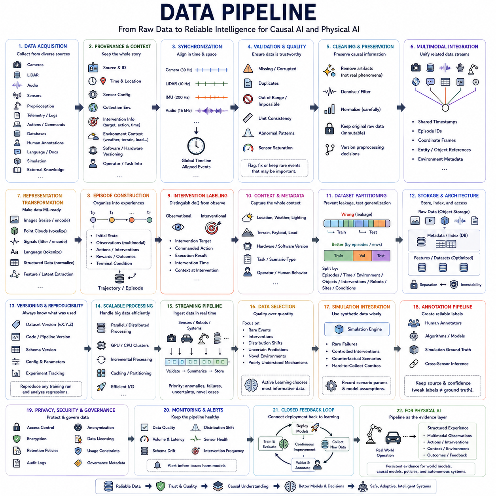
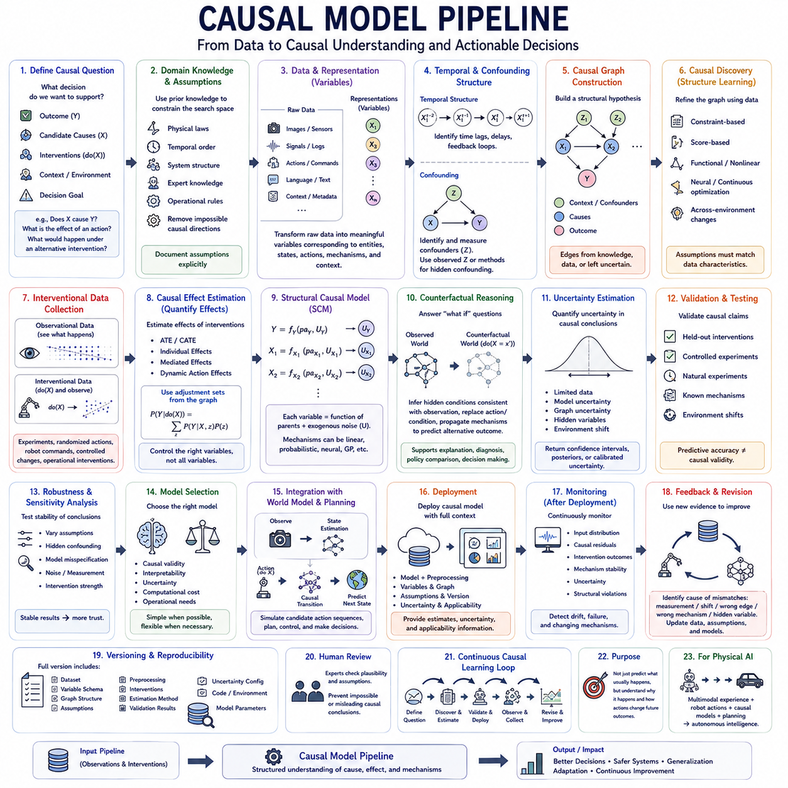
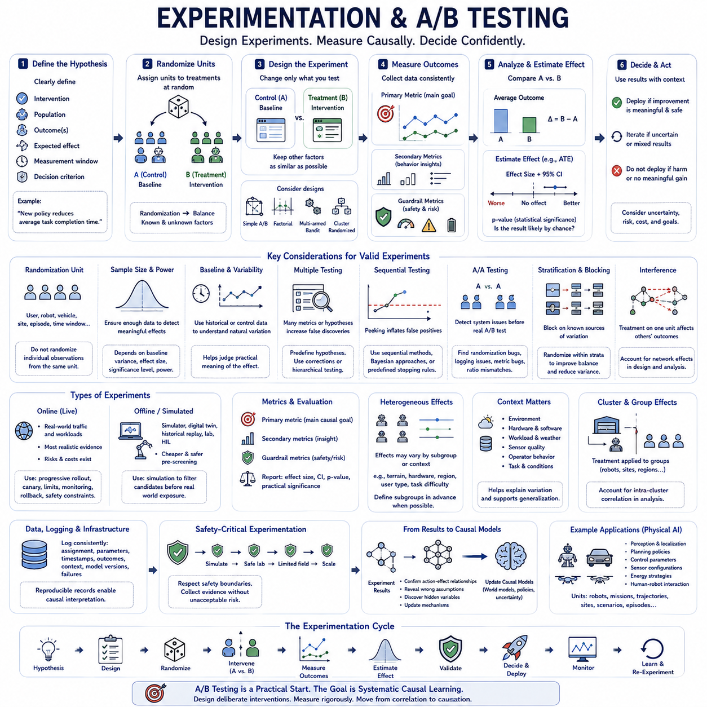
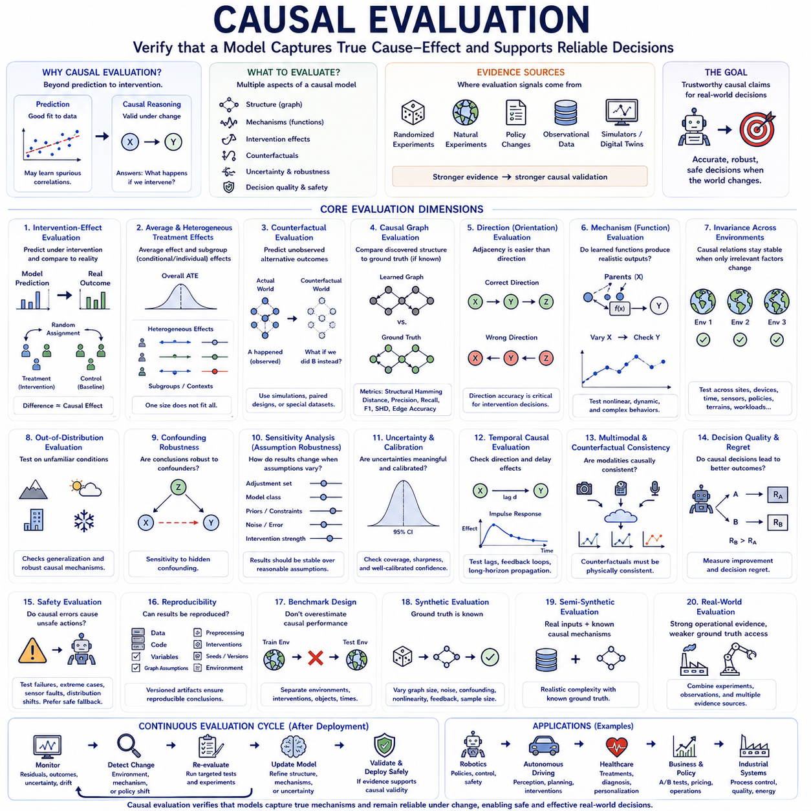
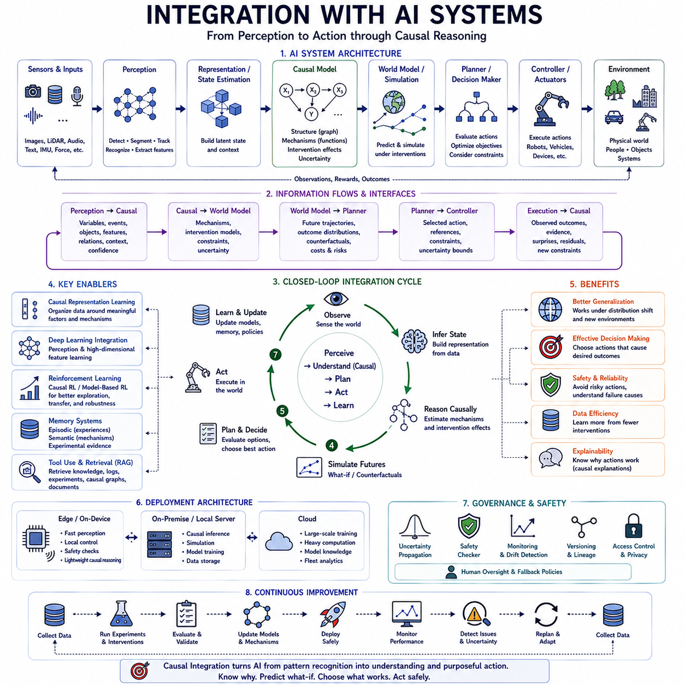
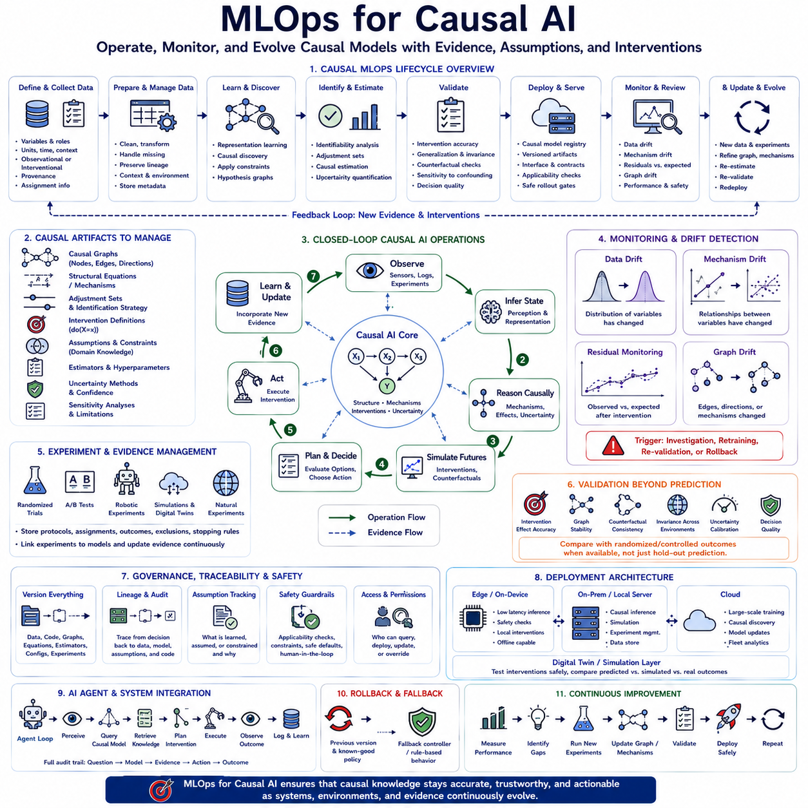

**Volume 46. Causality and Scientific AI**

# Chapter 07. Engineering and Deployment

## 07.01. Data Pipeline [w/Code]

{width="7.268055555555556in" height="7.268055555555556in"}

A data pipeline provides the operational foundation that transforms raw information into reliable inputs for causal analysis, model training, evaluation, and deployment. In engineering systems, data rarely arrives in a directly usable form. It must be collected, validated, synchronized, transformed, stored, versioned, and delivered through a repeatable process that preserves the information required for later reasoning.

The pipeline begins with data acquisition from observational, experimental, simulated, and operational sources. Depending on the application, these sources may include databases, logs, cameras, LiDAR, audio, telemetry, control commands, human annotations, language documents, and external knowledge. Acquisition must preserve relevant context because causal interpretation often depends on where, when, and under what conditions each observation was generated.

Data provenance is particularly important for causal systems. Every record should retain information about its origin, collection environment, sensor configuration, preprocessing history, intervention status, and relevant experimental conditions. Without provenance, observations gathered under fundamentally different mechanisms may be combined incorrectly, producing apparent relationships that reflect collection procedures rather than the underlying system being studied.

Temporal synchronization is essential whenever data represents dynamic processes. Different sensors and software components may operate at different frequencies, clocks, and communication latencies. Accurate timestamps, clock synchronization, buffering, interpolation, and latency compensation are required to reconstruct the true order of events. Incorrect temporal alignment can create false causal directions by making an effect appear to occur before its actual cause.

Raw data must then pass through validation and quality control. Missing values, corrupted records, duplicated samples, sensor saturation, inconsistent units, impossible states, and abnormal timestamps should be detected before they propagate downstream. Validation rules may combine statistical checks with physical constraints and domain knowledge. Importantly, unusual observations should not automatically be removed because rare events may contain valuable information about interventions, failures, or changing mechanisms.

Cleaning should preserve causal information rather than simply making datasets statistically convenient. Aggressive filtering can eliminate meaningful transitions, while normalization across environments can unintentionally erase differences required for causal discovery. Processing decisions should therefore distinguish measurement artifacts from genuine environmental variation. Original data should normally remain immutable so that alternative preprocessing strategies can later be evaluated without repeating collection.

Multimodal pipelines require explicit management of relationships among different data streams. Images, point clouds, audio, force signals, proprioception, actions, and semantic information may describe the same underlying event at different resolutions. Rather than storing them as unrelated datasets, the pipeline should preserve shared timestamps, episode identifiers, coordinate frames, entity references, and environmental metadata that allow observations to be reconstructed as coherent experiences.

Representation transformation converts raw measurements into formats suitable for learning. Images may be resized or encoded, point clouds voxelized, signals filtered, language tokenized, and structured variables normalized. Higher-level processing may extract objects, tracks, events, contacts, actions, or latent states. For causal learning, these transformations should preserve variables and relationships that may correspond to mechanisms rather than optimizing compression alone.

Episode construction is useful for sequential and embodied systems. Continuous streams can be organized into trajectories containing initial states, observations, actions, interventions, rewards, outcomes, and terminal conditions. Episodes provide natural units for reinforcement learning, world modeling, and counterfactual analysis. They also make it easier to separate independent experiences and prevent information from future states from leaking into training inputs representing the past.

Interventional data should be explicitly distinguished from observational data. An action deliberately selected by an agent differs fundamentally from a variable that merely happened to take a particular value. The pipeline should therefore record intervention targets, commanded actions, execution results, intervention timing, and relevant environmental conditions. This metadata enables downstream models to reason about action effects instead of treating every association as passive correlation.

Environmental context should also be represented as a first-class component of the dataset. Location, weather, lighting, terrain, payload, hardware configuration, software version, task type, operator behavior, and other contextual variables can alter observed distributions. Recording these factors enables models to compare environments, identify invariant mechanisms, detect domain shifts, and evaluate whether learned relationships generalize beyond the conditions used for training.

Dataset partitioning requires greater care for causal and sequential learning than ordinary random splitting. Randomly separating neighboring samples from the same trajectory can create leakage and produce unrealistically optimistic evaluation. Splits may instead be organized by episode, time period, environment, object category, intervention, robot, site, or operating condition. This allows evaluation to measure genuine transfer rather than memorization of nearly identical observations.

Storage architecture must support both large raw datasets and efficiently accessible training representations. Object storage can hold images, video, point clouds, and logs, while databases or structured metadata stores maintain indexes, labels, provenance, and relationships. Frequently accessed features may be cached in optimized formats. The architecture should separate immutable source data from derived datasets so that processing remains traceable and reproducible.

Dataset versioning is essential because data continuously evolves. New environments are added, labels are corrected, preprocessing algorithms change, and failed sensors may later be identified. Each training run should reference a reproducible dataset version rather than an ambiguous directory containing the latest files. Versioning links model behavior to the exact evidence used during training and makes regression analysis possible when performance changes.

Schema management provides consistency as pipelines evolve. A schema defines variables, data types, units, coordinate systems, required metadata, allowed ranges, and relationships among records. Changes should be explicitly versioned because silently modifying a field can invalidate previously trained models. Strong schemas are particularly important in multimodal systems where multiple teams and software components contribute data over long development cycles.

Scalable processing becomes necessary when datasets grow from gigabytes to terabytes or petabytes. Expensive operations such as decoding video, transforming point clouds, generating embeddings, or constructing trajectories can be parallelized across CPUs, GPUs, or distributed workers. Incremental processing avoids recomputing unchanged data, while caching and partitioning reduce unnecessary transfers between storage and compute resources.

Streaming pipelines extend this architecture to continuously operating systems. Robots, vehicles, industrial equipment, and online services generate new observations while deployed. Streaming infrastructure can validate, summarize, and store incoming data while identifying important episodes for later training. The pipeline can prioritize anomalies, failures, uncertain situations, and novel environments instead of retaining every repetitive observation at identical resolution and priority.

Data selection becomes increasingly important as collection scales. More data does not automatically produce better models when most observations are redundant. Sampling can emphasize rare events, interventions, distribution shifts, uncertain predictions, or poorly understood mechanisms. Active learning can further identify which additional examples or experiments would provide the greatest information, connecting the data pipeline directly with model uncertainty and causal discovery.

Simulation provides another data source and should be integrated without obscuring its origin. Synthetic environments can generate rare failures, controlled interventions, counterfactual scenarios, and combinations that are difficult or dangerous to collect physically. Simulation metadata should record scenario parameters and model assumptions so that synthetic evidence can be distinguished from real observations and sim-to-real discrepancies can be measured explicitly.

Annotation pipelines transform raw observations into supervised or weakly supervised training signals. Labels may originate from humans, algorithms, foundation models, simulation ground truth, or cross-sensor inference. Each annotation should retain its source and confidence because automatically generated labels are not equivalent to verified ground truth. Weak supervision can scale labeling while uncertainty information prevents noisy annotations from being treated as unquestionable facts.

Privacy, security, and governance must be incorporated into pipeline design rather than added after deployment. Access control, encryption, retention policies, audit logs, anonymization, and data licensing determine who can use particular information and for what purposes. Sensitive or restricted data may require separate storage and processing paths. Governance metadata should travel with datasets so that downstream systems can enforce appropriate usage constraints.

Monitoring is necessary because a production data pipeline is itself a changing system. Sensor failures, schema drift, missing fields, unexpected distributions, storage corruption, processing delays, and software updates can silently alter training data. Automated monitoring should track data quality, volume, latency, environmental coverage, class balance, intervention frequency, and other relevant characteristics so that changes are detected before they degrade models.

The pipeline should ultimately connect deployment back to learning through a closed feedback loop. Models operating in the real world generate predictions, uncertainty estimates, actions, successes, and failures that become new data. Selected experiences return to storage, validation, annotation, and training, while updated models are evaluated before redeployment. This creates a continuous cycle of collection, learning, evaluation, deployment, and renewed observation.

For Physical AI, this feedback loop is especially important because the data distribution changes as robots enter new environments and perform new behaviors. A well-engineered pipeline preserves synchronized multimodal observations, actions, interventions, environmental context, and outcomes as structured experience. It therefore becomes more than data infrastructure: it forms the persistent evidence layer from which world models, causal models, policies, and autonomous systems can continually improve.

## 07.02. Causal Model Pipeline [w/Code]

{width="7.268055555555556in" height="7.268055555555556in"}

A causal model pipeline transforms curated data into a structured system capable of discovering, estimating, validating, and deploying causal relationships. Unlike a conventional machine-learning pipeline focused primarily on predictive accuracy, it must preserve assumptions about interventions, temporal order, confounding, environments, and mechanisms. Each stage therefore contributes evidence needed to distinguish statistical association from plausible causal influence.

The pipeline begins by defining the causal question rather than immediately selecting an algorithm. Engineers specify outcomes, candidate causes, intervention variables, relevant contexts, and the decisions the model must support. Questions such as whether X causes Y, how strongly an action changes an outcome, or what would happen under an alternative intervention require different modeling strategies and different forms of evidence.

Domain knowledge provides an initial structural foundation. Physical laws, engineering constraints, temporal ordering, system architecture, expert knowledge, and operational rules can eliminate impossible causal directions and identify plausible dependencies. These assumptions should be documented explicitly because causal conclusions depend not only on data but also on the structural conditions under which relationships are considered identifiable.

The next stage converts observations into candidate causal variables. Raw images, sensor signals, language, logs, actions, and contextual information may first require representation learning or feature extraction. Variables should correspond as closely as possible to meaningful entities, states, mechanisms, actions, and environmental factors. Poor representations can hide true mechanisms or create artificial dependencies that later appear causal.

Temporal structure must be established for dynamic systems. Variables are aligned using synchronized timestamps, and appropriate time lags are identified between possible causes and effects. Immediate interactions, delayed consequences, feedback loops, and persistent states may require different representations. Temporal constraints can reduce the number of possible causal graphs, although temporal precedence alone cannot prove that one variable causes another.

Potential confounders must then be identified. A variable influencing both a candidate cause and an outcome can generate an association even when no direct causal relationship exists between them. Observed confounders may be included explicitly in the model, while hidden confounding requires stronger assumptions, latent-variable methods, instrumental information, natural experiments, or controlled interventions when available.

Causal graph construction organizes variables and assumptions into a structural representation. Nodes describe variables or latent states, while directed edges encode hypothesized causal influence. Some edges may be supplied by prior knowledge, others discovered from data, and others deliberately left uncertain. The resulting graph becomes a working hypothesis rather than an unquestionable description of the underlying system.

Causal discovery algorithms can refine this structure by testing statistical independencies, optimizing graph scores, exploiting functional relationships, or analyzing changes across environments. Constraint-based, score-based, functional, continuous-optimization, and neural approaches provide different tradeoffs. No discovery algorithm can universally recover causal truth, so its assumptions must match the characteristics of the available data.

Interventional data substantially strengthens causal discovery. When a variable is deliberately manipulated, the resulting distribution can reveal relationships that remain ambiguous in observational data. Experiments, randomized actions, robot commands, controlled parameter changes, and operational interventions can therefore be incorporated into the pipeline. Observational and interventional samples should remain distinguishable throughout modeling.

Once a plausible structure has been obtained, causal effect estimation quantifies how interventions influence outcomes. Depending on the problem, the pipeline may estimate average treatment effects, conditional effects, individual effects, mediated effects, or dynamic action effects. Adjustment sets derived from the causal structure determine which variables should be controlled rather than simply including every available feature in a predictive model.

Structural causal models can represent these relationships through explicit mechanisms. Each variable is described as a function of its causal parents and external disturbances. This formulation enables the pipeline to move from association toward intervention and counterfactual reasoning. Learned structural equations may use linear functions, probabilistic models, neural networks, Gaussian processes, or other approximators depending on the complexity of the mechanism.

Counterfactual modeling adds the ability to reason about alternative outcomes for previously observed situations. The model first infers hidden conditions compatible with the actual observation, replaces the relevant action or condition with a hypothetical intervention, and then propagates the modified mechanisms forward. This supports diagnosis, explanation, policy comparison, failure analysis, and decision improvement.

Uncertainty estimation must accompany causal predictions. Uncertainty can arise from limited data, noisy observations, uncertain graph structure, hidden variables, model misspecification, or unfamiliar environments. Instead of returning only one causal estimate, the pipeline should preserve confidence intervals, posterior distributions, alternative graph hypotheses, or calibrated uncertainty measures where appropriate.

Validation is fundamentally different from ordinary predictive evaluation. A model may accurately predict Y from X while representing the causal relationship incorrectly. Whenever possible, causal hypotheses should therefore be tested against held-out interventions, controlled experiments, known mechanisms, natural experiments, or environment changes. Predictive accuracy remains useful, but it cannot by itself establish causal validity.

Robustness across environments provides another important validation signal. Genuine mechanisms often remain more stable than superficial correlations when lighting, location, population, hardware, policies, objects, or operating conditions change. Evaluating causal relationships across such shifts can expose dependencies that worked only in the training environment and identify mechanisms with stronger generalization potential.

Sensitivity analysis examines how conclusions change when assumptions are weakened. Engineers can vary adjustment sets, model structures, hidden-confounding assumptions, measurement noise, intervention strength, or functional forms. If small changes produce radically different conclusions, the causal result should be treated cautiously. Stable conclusions across reasonable assumptions provide stronger evidence for downstream decisions.

Model selection should therefore consider causal validity, interpretability, uncertainty, computational cost, and operational requirements together. A simple structural model may be preferable when mechanisms are well understood and explanation is critical, while flexible neural causal models may be necessary for high-dimensional nonlinear systems. Hybrid architectures can combine explicit causal structure with learned components.

For sequential decision systems, the causal model can be connected to a world model. Observations estimate the current state, actions are represented as interventions, causal transition mechanisms predict future states, and candidate action sequences are simulated internally. This converts the causal model from a static analytical tool into an operational component for planning, control, and autonomous decision making.

Model-based reinforcement learning can further exploit this structure. Instead of learning policies solely from rewards and observed transitions, an agent can use causal mechanisms to predict the effects of alternative actions. Exploration can target uncertain causal relationships, making new experiences informative about both task performance and the structure of the environment.

Deployment requires packaging the causal model together with its preprocessing, variable definitions, graph structure, assumptions, confidence information, and model version. An inference service should receive data generated under compatible conditions and return not only estimates but also relevant uncertainty and applicability information. Deploying a causal model without its assumptions can lead users to interpret conditional predictions as universal causal conclusions.

Monitoring must continue after deployment because causal mechanisms can change. Hardware degradation, new populations, environmental changes, policy modifications, software updates, or altered human behavior may invalidate previously stable relationships. Monitoring should therefore track input distributions, causal residuals, intervention outcomes, mechanism stability, uncertainty, and violations of expected structural relationships.

Unexpected outcomes provide valuable evidence for model revision. When observed consequences disagree with causal predictions, the system should determine whether the problem originates from measurement error, distribution shift, an incorrect structural edge, an inaccurate mechanism, or a previously hidden variable. These failures can be returned to the data and modeling pipeline as targeted examples for further investigation.

Versioning is especially important because causal models contain more than learned parameters. A complete version should include the dataset, variable schema, graph topology, structural assumptions, preprocessing logic, intervention definitions, estimation method, validation results, and uncertainty configuration. This makes it possible to reproduce conclusions and determine why two model versions produce different causal recommendations.

Human review remains important in high-impact applications. Experts can examine whether discovered relationships are physically, operationally, or scientifically plausible and identify assumptions that algorithms cannot verify from data. Human judgment should not replace empirical validation, but it can prevent statistically attractive yet impossible causal structures from progressing directly into operational decision systems.

For Physical AI, the causal model pipeline can operate continuously between data infrastructure and autonomous intelligence. Multimodal experience provides observations, robot actions provide interventions, causal discovery identifies candidate mechanisms, structural models predict consequences, and planners evaluate alternative actions. Deployment then generates new interaction data that can confirm, challenge, or refine the current causal model.

The complete pipeline therefore forms a closed causal learning cycle: define causal questions, construct meaningful variables, propose structure, discover relationships, estimate intervention effects, validate mechanisms, deploy models, observe consequences, and revise assumptions. Its purpose is not merely to predict what usually happens, but to build increasingly reliable models of why events occur and how deliberate actions can change future outcomes.

## 07.03. Experimentation A B Testing [w/Code]

{width="7.268055555555556in" height="7.268055555555556in"}

Experimentation provides one of the strongest foundations for causal inference because it deliberately changes a variable and observes the resulting consequences. Unlike observational analysis, where treatment assignment may be influenced by hidden factors, a properly designed experiment controls how interventions are assigned. This makes it possible to estimate whether changing an action, policy, model, interface, or system parameter actually causes a measurable difference in an outcome.

A/B testing is the simplest and most widely used form of randomized controlled experimentation. Participants, devices, sessions, robots, environments, or other experimental units are assigned to alternative conditions, commonly called A and B. Condition A usually represents a baseline or existing system, while condition B introduces a specific intervention whose causal effect is being evaluated against that baseline.

Randomization is the central mechanism that gives A/B testing its causal interpretation. When experimental units are randomly assigned, observed and unobserved characteristics tend to become balanced between groups as sample size increases. Differences in outcomes can therefore be attributed more confidently to the intervention rather than systematic differences in the populations receiving each treatment.

Every experiment should begin with a clearly formulated causal hypothesis. The intervention, target population, primary outcome, expected direction of change, measurement window, and decision criterion should be specified before examining results. A hypothesis such as "the new planning policy reduces average task completion time" is more useful than the vague objective of determining whether the new policy performs better.

Experimental units must be selected carefully because the unit of randomization determines the statistical structure of the experiment. A unit may represent a user, robot, vehicle, production line, geographic region, episode, or time interval. Randomizing individual observations when multiple observations originate from the same underlying unit can underestimate uncertainty because those measurements may not be statistically independent.

Treatment and control conditions should differ primarily in the factor whose causal effect is being investigated. If several important components change simultaneously, an observed improvement cannot easily be attributed to one mechanism. Controlled experimentation therefore attempts to isolate interventions whenever practical, while factorial designs can be used when interactions among multiple factors are themselves important research questions.

Outcome metrics must be defined before experimentation begins. A primary metric represents the main causal objective, while secondary metrics provide additional information about system behavior. Guardrail metrics monitor undesirable side effects such as increased latency, energy consumption, failures, safety violations, customer complaints, or computational cost. Improvement in one metric should not conceal unacceptable degradation elsewhere.

Baseline measurement provides context for interpreting experimental effects. Historical performance, pre-intervention observations, or control-group statistics can reveal natural variability and help determine whether the expected effect is practically meaningful. Baselines are particularly valuable in engineering systems where environmental conditions, workloads, hardware states, and operating contexts can create substantial variation even without an intervention.

Sample-size planning determines whether an experiment has sufficient statistical power to detect an effect of meaningful magnitude. Required sample size depends on baseline variability, minimum detectable effect, significance threshold, desired power, and experimental design. Experiments with insufficient data may fail to detect real improvements, while extremely large experiments can make operationally irrelevant differences appear statistically significant.

The treatment effect can be estimated by comparing outcomes between experimental groups. In a simple randomized experiment, the difference between average outcomes provides an estimate of the average treatment effect. More sophisticated estimators can incorporate covariates, stratification, repeated measurements, heterogeneous effects, or sequential structure while preserving the logic established by randomized treatment assignment.

Statistical significance quantifies how compatible the observed difference is with a specified null hypothesis, but it should not be confused with practical importance. A very small effect may become statistically significant with enough samples while providing little engineering or business value. Experimental interpretation should therefore report effect magnitude, uncertainty intervals, operational relevance, and statistical evidence together.

Confidence intervals provide more information than a binary significant-or-not-significant decision. They indicate a range of effect values consistent with the observed data under the assumptions of the analysis. A wide interval signals substantial uncertainty, whereas a narrow interval indicates greater precision. Decision makers can compare this uncertainty with the minimum effect required to justify deployment.

Multiple testing requires careful management when many metrics, treatments, subgroups, or hypotheses are evaluated simultaneously. Repeatedly searching for statistically significant results increases the probability of false discoveries. Experiments should distinguish predefined hypotheses from exploratory analyses and, where necessary, apply appropriate corrections or hierarchical testing procedures to control error rates.

Sequential experimentation introduces additional considerations because results may be monitored while data is still accumulating. Repeatedly checking conventional significance tests and stopping as soon as a favorable result appears can inflate false-positive rates. Sequential testing methods, predefined stopping rules, or Bayesian approaches can support continuous monitoring while maintaining interpretable decision criteria.

A/A testing can be used before an important A/B experiment to verify that the experimentation infrastructure itself behaves correctly. Two groups receive effectively identical treatment, so persistent differences may reveal randomization problems, logging inconsistencies, metric bugs, sample-ratio mismatches, or hidden segmentation. This helps validate the measurement pipeline before causal conclusions are drawn from real interventions.

Stratification and blocking can improve experimental efficiency when important sources of variation are known in advance. Robots might be grouped by hardware version, users by market, or environments by terrain type before treatment assignment. Randomization then occurs within these groups, improving balance and reducing variance while preserving the experimental basis for causal inference.

Cluster randomized experiments are necessary when treatment naturally operates on groups rather than independent individuals. A policy may be deployed to an entire factory, fleet, site, classroom, or geographic region. Because observations within the same cluster can influence one another, analysis must account for intra-cluster dependence rather than incorrectly treating every observation as an independent experimental unit.

Interference becomes important when the treatment assigned to one unit affects the outcome of another. This violates the common assumption that each unit\'s outcome depends only on its own treatment. Network systems, multi-robot fleets, marketplaces, traffic systems, and social platforms frequently exhibit interference. Experimental design must therefore consider interactions among units when estimating causal effects.

Heterogeneous treatment effects reveal that an intervention may not affect every context equally. A new controller might improve performance on smooth terrain but degrade it on loose surfaces, while a model update may benefit familiar environments more than novel ones. Subgroup analysis can identify such differences, but hypotheses should preferably be defined before experimentation to reduce misleading post-hoc discoveries.

Contextual information should therefore accompany experimental records. Environment, hardware configuration, software version, workload, weather, sensor quality, task difficulty, operator behavior, and other relevant variables can help explain variations in treatment effects. These variables also support later causal generalization by showing where an experimentally validated mechanism remains stable and where it changes.

Experimentation pipelines should integrate closely with data and model pipelines. Assignment decisions, intervention parameters, timestamps, outcomes, context, model versions, and failures must be logged consistently. Reproducible records allow researchers to reconstruct exactly which system produced each observation and prevent experimental data from becoming disconnected from the conditions under which it was generated.

Online experiments evaluate interventions directly within deployed systems. They provide realistic evidence because treatment operates under actual workloads and environmental conditions, but they also introduce operational risks. Progressive rollout, canary deployment, exposure limits, monitoring, rollback mechanisms, and safety constraints can reduce these risks while still allowing causal evidence to accumulate.

Offline experimentation can complement online testing when direct intervention is expensive or dangerous. Simulators, digital twins, historical replay, laboratory environments, and hardware-in-the-loop systems can evaluate candidate changes before real-world exposure. These experiments provide useful screening evidence, although simulation results should not automatically be treated as equivalent to randomized evidence from the target environment.

For Physical AI, experimentation can evaluate perception models, localization algorithms, planning policies, control parameters, sensor configurations, energy strategies, and human-robot interaction methods. Experimental units may be robots, missions, trajectories, sites, or repeated scenarios. Physical constraints make careful design particularly important because uncontrolled variation in terrain, payload, battery state, and weather can obscure treatment effects.

Safety-critical experimentation requires additional restrictions because unrestricted randomization may expose systems or humans to unacceptable hazards. Candidate interventions can first pass simulation, offline evaluation, constrained environments, and safety verification before limited physical deployment. The experimental objective is therefore not simply to maximize statistical information but to acquire useful causal evidence while respecting operational safety boundaries.

Experiment results should ultimately feed back into causal models and decision systems. Successful interventions provide direct evidence about action-effect relationships, while failed experiments can reveal incorrect assumptions, hidden variables, or environment-dependent mechanisms. Experimental evidence can update causal graphs, structural models, world models, policies, and uncertainty estimates, creating a connection between scientific experimentation and autonomous learning.

A mature experimentation system forms a continuous cycle of hypothesis, intervention, measurement, causal estimation, validation, decision, deployment, and renewed experimentation. A/B testing provides a practical entry point into this cycle, but the broader objective is systematic causal learning. By designing interventions deliberately and measuring their consequences rigorously, AI and engineering systems can progress from observing correlations toward understanding which changes actually produce better outcomes.

## 07.04. Causal Evaluation

{width="7.268055555555556in" height="7.268055555555556in"}

Causal evaluation determines whether a model has learned relationships that remain valid under intervention, environmental change, and alternative conditions rather than merely fitting correlations in observed data. Conventional evaluation often measures prediction accuracy on held-out samples, but a causal model can predict well while representing the underlying mechanism incorrectly. Causal evaluation therefore examines whether the model supports reliable reasoning about what changes outcomes and why.

A first requirement is to distinguish predictive performance from causal validity. A model may accurately estimate Y from X because X is strongly correlated with Y, even when X has no direct causal influence. Evaluation must therefore test whether changing X produces the predicted change in Y under controlled conditions. This shift from association to intervention is fundamental because causal claims concern consequences of deliberate change rather than ordinary co-occurrence.

Intervention-effect evaluation provides one of the strongest tests. A model predicts the outcome of a controlled intervention, and the prediction is compared with observations collected after that intervention is actually performed. Randomized experiments are especially valuable because assignment mechanisms reduce confounding. When direct experimentation is impossible, natural experiments, policy changes, or carefully designed quasi-experimental settings can provide weaker but still informative evidence.

Average treatment effect evaluation examines whether a model correctly estimates the average consequence of an intervention over a population. Depending on the application, evaluation may also examine conditional or individual treatment effects because interventions can influence different subgroups differently. A model that predicts the overall average correctly may still fail if it systematically misrepresents effects for particular environments, devices, users, or operating conditions.

Counterfactual evaluation is more difficult because only one factual outcome is normally observed for each event. The alternative outcome under a different intervention is inherently unobserved. Evaluation therefore relies on simulated environments with known mechanisms, paired experimental designs, repeated controlled conditions, synthetic benchmarks, or specially constructed datasets where counterfactual consistency can be assessed indirectly.

Causal graph evaluation compares discovered structural relationships with known or trusted causal structure when such ground truth exists. Metrics may assess whether the model identifies correct edges, directions, ancestors, intervention targets, or equivalence classes. Structural Hamming distance and precision-recall style measures can quantify graph recovery, but graph similarity alone does not guarantee that estimated intervention effects are accurate enough for practical decisions.

Edge orientation deserves separate attention because discovering that two variables are related is easier than determining causal direction. Evaluation should distinguish adjacency recovery from direction recovery. A graph containing the correct variables but reversed causal arrows may generate good observational predictions while producing incorrect intervention recommendations. Directional accuracy is therefore especially important for decision-support and autonomous-control systems.

Mechanism evaluation examines whether the learned structural equations or causal transition functions behave correctly. Instead of testing only whether the graph topology is plausible, the evaluator asks whether each learned mechanism produces realistic outputs when its causal parents change. This is particularly important in nonlinear systems where the correct graph may still contain inaccurate functional relationships.

Invariance across environments provides another central evaluation criterion. Stable causal mechanisms should often remain valid when unrelated distributions change. Models can therefore be evaluated across different sites, populations, sensor configurations, lighting conditions, terrains, workloads, policies, or time periods. A causal model should preserve correct intervention relationships even when superficial statistical associations shift.

Out-of-distribution evaluation extends this principle to unfamiliar conditions. The model is tested on environments deliberately chosen to differ from training data. Performance under such shifts reveals whether the model has learned transferable mechanisms or relied on environment-specific shortcuts. Causal generalization should ideally degrade gracefully when only irrelevant factors change and adapt selectively when a genuine mechanism changes.

Confounding robustness evaluates whether causal conclusions survive the presence of variables that influence both treatment and outcome. Synthetic benchmarks can introduce controlled confounders, while real-world evaluation can compare adjusted estimates against randomized or experimentally validated effects. Hidden confounding remains particularly challenging, so sensitivity analysis should quantify how strong an unobserved confounder would need to be to overturn the conclusion.

Sensitivity analysis tests dependence on assumptions rather than data alone. Evaluators can vary adjustment sets, model classes, graph constraints, prior knowledge, noise assumptions, intervention strength, or measurement error. If small reasonable changes produce large differences in estimated effects, the result is fragile. Robust conclusions should remain broadly stable across a defensible range of modeling assumptions.

Calibration is important because causal models often report uncertainty as well as point estimates. A well-calibrated model should express greater uncertainty when evidence is weak, interventions are unfamiliar, or multiple causal graphs remain plausible. Confidence intervals, posterior distributions, or prediction sets can be evaluated for coverage and sharpness, ensuring that confidence statements correspond reasonably well to observed error frequencies.

Uncertainty in causal structure should be evaluated separately from uncertainty in mechanism parameters. Multiple graphs may fit the observational data equally well, creating structural ambiguity even when parameters within each graph are estimated precisely. Evaluation can examine ensembles, posterior graph probabilities, or equivalence classes to determine whether the system appropriately represents unresolved causal structure rather than collapsing prematurely to one explanation.

Temporal causal evaluation must test both direction and delay. A system may correctly identify that X influences Y but incorrectly estimate when the effect occurs. Lag recovery, impulse responses, delayed intervention effects, feedback dynamics, and long-horizon propagation should therefore be tested. This is especially important in control systems, robotics, industrial processes, and other environments where timing directly affects decision quality.

Multimodal causal evaluation should test whether causal conclusions remain consistent across different sensing channels. If vision, LiDAR, audio, force, and proprioception provide evidence about the same physical mechanism, the model should connect them through a coherent latent state. Evaluation can intentionally remove, corrupt, or delay modalities to determine whether the causal representation remains stable under sensor failure or partial observability.

Counterfactual consistency across modalities provides an especially demanding test. If a hypothetical action changes an object\'s motion, predicted visual, geometric, inertial, and force observations should change in mutually compatible ways. Independent modality predictors may generate individually plausible outputs that conflict physically. A causal multimodal model should instead produce alternative futures that remain consistent with one underlying world state.

Decision quality is ultimately one of the most important evaluation criteria. A causal model may recover an elegant graph yet provide little practical value if its recommendations are poor. Evaluators can measure whether intervention selection, policy optimization, planning, diagnosis, or resource allocation improves when the causal model is used. This connects structural correctness with downstream operational consequences.

Regret-based evaluation can quantify the cost of choosing actions based on an inaccurate causal model. If the model recommends intervention A when intervention B would have produced a substantially better outcome, the difference represents decision regret. This perspective is useful for comparing models that have similar statistical fit but different consequences when integrated into planning and control systems.

Safety evaluation should examine whether causal errors create hazardous actions. Models may be tested on rare failures, unstable states, extreme environmental conditions, sensor faults, and adversarial distribution shifts. A safety-critical causal system should identify uncertainty and abstain or fall back to conservative behavior when its causal assumptions are no longer well supported rather than confidently applying invalid mechanisms.

Experimental reproducibility is also part of evaluation. Causal results should be reproducible from the same data, code, variable definitions, graph assumptions, preprocessing steps, and intervention specifications. Versioned evaluation artifacts make it possible to determine whether changes in conclusions originate from new evidence, altered assumptions, software modifications, or stochastic training variation.

Benchmark design requires careful attention because conventional random train-test splits can exaggerate causal performance. Strong benchmarks should separate environments, interventions, temporal regimes, objects, subjects, devices, or sites. They should include distribution shifts and mechanism changes intentionally, allowing evaluators to distinguish interpolation ability from genuine causal transfer and adaptation.

Synthetic benchmarks remain valuable because the true causal graph and intervention effects are known exactly. Researchers can systematically vary graph size, noise, hidden confounding, nonlinear mechanisms, missing variables, feedback, and sample size. However, synthetic success does not guarantee real-world validity because generated systems may be much cleaner than operational environments.

Semi-synthetic evaluation provides a middle ground by combining real covariates or sensor distributions with simulated treatment mechanisms and outcomes. This preserves realistic complexity while retaining known causal ground truth. Such benchmarks can test whether algorithms recover effects under realistic high-dimensional inputs, although conclusions still depend on how faithfully the synthetic causal mechanism represents actual applications.

Real-world evaluation provides the strongest operational evidence but usually the weakest access to complete causal ground truth. Controlled deployments, randomized trials, repeated interventions, laboratory systems, and carefully instrumented robotic experiments can provide partial truth. Evaluation should therefore combine multiple forms of evidence rather than relying on a single score that implies more certainty than the available data supports.

For Physical AI, causal evaluation should include closed-loop testing. Perception estimates the current state, the causal model predicts action consequences, planning selects interventions, control executes them, and new observations reveal whether the predicted mechanism was correct. Evaluation can measure trajectory outcomes, intervention accuracy, adaptation speed, safety violations, energy use, recovery behavior, and model updates across repeated interactions.

World-model evaluation should similarly move beyond next-frame or next-state prediction. A causal world model should be tested on unseen actions, counterfactual trajectories, mechanism changes, novel object combinations, sensor degradation, and environmental shifts. Planning success under these conditions provides stronger evidence than reconstruction accuracy alone because it requires the model to support intervention-aware simulation.

Continuous evaluation is necessary after deployment because causal validity can decay. New environments, software versions, hardware wear, policy changes, human adaptation, or sensor replacements may alter mechanisms. Monitoring should therefore track causal residuals, intervention outcomes, uncertainty, environment coverage, and mechanism stability, triggering revalidation when evidence suggests that previously trusted relationships have changed.

Causal evaluation ultimately asks whether an AI system understands enough of the underlying mechanism to make reliable decisions when the world changes. Strong evaluation combines structural tests, intervention experiments, counterfactual checks, uncertainty calibration, environmental shifts, and downstream decision outcomes. The goal is not merely to certify that a model predicts well, but to determine whether its causal claims remain useful, robust, and safe when they are used to change real systems.

## 07.05. Integration with AI Systems

{width="7.268055555555556in" height="7.268055555555556in"}

Integration with AI systems connects causal modeling with the broader computational architecture responsible for perception, prediction, reasoning, planning, learning, and action. A causal component should not operate as an isolated analytical module. Its value emerges when causal variables, intervention effects, structural assumptions, and uncertainty estimates become usable information for other AI components that must understand situations and make decisions.

Modern AI architectures frequently contain several specialized models rather than one monolithic intelligence. Perception models interpret raw sensory inputs, representation models construct latent states, predictive models estimate future conditions, causal models describe mechanisms, planners evaluate possible actions, and control systems execute decisions. Integration requires clearly defined interfaces so that information can move consistently between these components.

The integration process begins by establishing a shared representation of system state. Perception outputs such as detected objects, semantic features, trajectories, forces, language concepts, or environmental conditions must be mapped into variables understood by the causal model. Conversely, causal predictions must be translated into representations that downstream planning and decision modules can consume without losing their meaning or associated uncertainty.

Causal representation learning can provide an important bridge between high-dimensional perception and symbolic or structured reasoning. Instead of treating every latent feature as an arbitrary statistical dimension, the system attempts to organize representations around meaningful factors such as objects, properties, actions, interactions, and mechanisms. These variables can then support intervention-aware prediction while remaining connected to neural perception pipelines.

Integration with deep learning allows causal systems to operate on complex sensory information. Neural networks can extract useful representations from images, video, point clouds, audio, language, and multimodal streams, while causal structures constrain how selected representations interact. This creates hybrid architectures in which deep learning handles high-dimensional approximation and causal modeling provides explicit structure for reasoning about changes and consequences.

Predictive models and causal models serve complementary purposes. Predictive models efficiently estimate what is likely to happen under familiar conditions, whereas causal models attempt to determine how outcomes change when actions or mechanisms are modified. An integrated system can therefore use predictive inference for routine operation and invoke more explicit causal reasoning when evaluating interventions, unfamiliar situations, failures, or strategic decisions.

World models provide a natural architecture for integrating causal knowledge. A conventional world model predicts how latent states evolve over time, while a causal world model represents actions as interventions on transition mechanisms. This allows the system to distinguish passive environmental evolution from changes deliberately produced by an agent and provides a stronger foundation for internal simulation and planning.

In sequential systems, the current state can be inferred from multimodal observations and passed to a causal transition model. Candidate actions are then applied as hypothetical interventions, producing alternative future trajectories. A planner can compare these trajectories according to objectives, constraints, uncertainty, and safety requirements. The selected action is executed, and the resulting observation provides new evidence about whether the assumed causal mechanism was correct.

Reinforcement learning can benefit from this intervention-oriented structure. Standard reinforcement learning often learns action policies from correlations among states, actions, rewards, and transitions. Causal reinforcement learning attempts to identify which aspects of the environment actually determine action outcomes. This knowledge can improve exploration, transfer, sample efficiency, and robustness when the environment changes from the conditions encountered during training.

Model-based reinforcement learning offers an especially direct integration path. The causal model can function as part of the learned dynamics model used to simulate future states. Instead of generating trajectories solely from statistical transition patterns, the agent can reason about how interventions modify specific mechanisms. Planning can then compare actions under alternative assumptions and avoid relying excessively on correlations that may disappear outside the training distribution.

Large language models can also interact with causal systems. Language models provide broad semantic knowledge, flexible interfaces, task decomposition, and natural-language reasoning, while explicit causal models can supply structured information about intervention effects and system mechanisms. The language model can formulate causal questions or interpret results, but numerical or safety-critical causal conclusions should remain grounded in validated models and evidence.

Retrieval-augmented generation can further connect causal reasoning with external knowledge. Technical documents, experiment records, system logs, causal graphs, and previous intervention results can be retrieved according to the current task. The retrieved evidence can provide context for causal hypotheses while the causal model evaluates structural relationships. This combination separates knowledge retrieval from claims about what interventions actually produce specific outcomes.

AI agents extend integration from inference to autonomous task execution. An agent may observe its environment, maintain memory, formulate goals, retrieve knowledge, construct hypotheses, select tools, plan interventions, execute actions, and evaluate results. A causal model can support this loop by predicting action consequences and identifying which additional observations or experiments would most reduce uncertainty about the current problem.

Memory systems are important because causal knowledge accumulates across interactions. Episodic memory can preserve previous situations, actions, and outcomes, while semantic memory can store generalized mechanisms and relationships. Experimental evidence should remain distinguishable from ordinary observations. This enables an agent to retrieve not merely similar experiences but evidence about which actions previously changed outcomes under comparable conditions.

Planning systems can use causal graphs to reduce the action search space. If the desired outcome depends on a limited set of upstream variables, the planner can prioritize interventions that influence those variables rather than evaluating every available action. Structural knowledge can therefore improve computational efficiency while also providing explanations for why a particular action sequence is expected to achieve the target state.

Hierarchical planning can combine causal reasoning at multiple levels of abstraction. High-level reasoning determines goals, subgoals, and relevant mechanisms, while lower-level models handle trajectories and control commands. For example, a causal planner may determine that reducing wheel slip requires changing velocity or traction conditions, while a motion controller determines the precise actuator commands needed to implement that intervention.

Control systems require causal reasoning to operate within strict temporal constraints. Fast feedback loops may not permit expensive graph inference or counterfactual simulation at every cycle. A practical architecture can therefore separate slower causal reasoning from high-frequency control. Causal models establish constraints, references, or policy adjustments, while optimized controllers execute them at the rates required by the physical system.

Uncertainty must be propagated across integrated AI modules. A perception system may be uncertain about an object\'s identity, the causal model may be uncertain about the relevant mechanism, and the planner may face uncertainty about future outcomes. If each component reports only its most likely estimate, downstream systems can become unjustifiably confident. Interfaces should therefore preserve uncertainty whenever it materially affects decisions.

Safety architectures can use causal information to evaluate whether proposed actions might trigger hazardous mechanisms. Before execution, candidate actions can be checked against structural constraints, predicted consequences, safety envelopes, or known failure pathways. When causal uncertainty becomes too high, the system can reject the proposed intervention, request additional information, reduce operating speed, or transition to a conservative fallback policy.

Digital twins provide another important integration environment. A digital twin can combine physical models, learned dynamics, operational data, and causal mechanisms to represent a real system. AI components can test interventions within the twin before applying them physically. Differences between simulated and observed outcomes then become evidence for updating model parameters, causal assumptions, or representations of environmental conditions.

Simulation and generative models can expand the range of situations available for causal reasoning. Generative models can produce candidate environments, object configurations, trajectories, or sensory observations, while causal constraints determine whether generated alternatives remain mechanically or logically consistent. This combination can support counterfactual simulation, rare-event generation, and systematic exploration of conditions that are difficult to collect physically.

Multimodal AI requires causal relationships to remain coherent across sensory representations. An object collision may simultaneously produce visual motion, geometric displacement, acoustic signals, force changes, and inertial responses. Integrated causal models should represent these observations as consequences of a shared event rather than unrelated correlations. This supports more robust inference when one sensor becomes noisy, delayed, or unavailable.

Deployment architecture determines where causal computation occurs. Lightweight causal checks may execute on edge devices, while computationally intensive discovery, large-scale simulation, or model updates may run on on-premise servers or cloud infrastructure. The architecture should account for latency, bandwidth, privacy, reliability, compute capacity, and safety requirements rather than assuming every causal function belongs at the same computational layer.

Model serving requires stable interfaces and explicit version control. Each causal service should define expected variables, units, temporal assumptions, supported interventions, output semantics, uncertainty measures, and applicability conditions. The causal graph, structural equations, preprocessing logic, and model parameters should be versioned together because changing any of these components can alter the meaning of downstream decisions.

Monitoring should examine interactions among AI components rather than evaluating each model independently. A perception update can change causal variables, a causal-model update can alter planner behavior, and a new planning policy can change the distribution of collected data. System-level monitoring must therefore detect interface drift, incompatible versions, unexpected feedback loops, distribution changes, and deteriorating closed-loop performance.

For Physical AI, integration ultimately creates a continuous perception-causality-planning-action-learning cycle. Sensors observe the physical world, perception constructs state representations, causal models estimate mechanisms and intervention effects, world models simulate possible futures, planners choose actions, controllers execute them, and resulting observations return as new evidence. Each interaction can therefore improve both task performance and understanding of the environment.

The long-term objective is an AI architecture in which causal reasoning becomes a functional layer connecting learning with deliberate action. Statistical learning identifies patterns, causal modeling organizes mechanisms, world models predict alternative futures, agents formulate interventions, and control systems act on the physical world. Their integration enables AI systems to move beyond recognizing what usually happens toward reasoning about why it happens, what could happen differently, and which actions can reliably produce desired outcomes.

## 07.06. MLOps for Causal AI

{width="7.268055555555556in" height="7.268055555555556in"}

MLOps for Causal AI extends conventional machine learning operations beyond managing predictive models to managing causal assumptions, intervention logic, structural relationships, and evidence about mechanisms. A causal system can remain statistically accurate while its causal interpretation becomes invalid, so deployment infrastructure must monitor not only prediction quality but also whether the relationships used for interventions and decisions continue to hold.

Traditional MLOps organizes the lifecycle of data preparation, model training, validation, deployment, monitoring, and retraining. Causal AI adds another lifecycle around causal graphs, structural equations, adjustment sets, intervention definitions, assumptions, experiments, and counterfactual models. These artifacts must evolve together because changing one component can alter the meaning or validity of causal estimates produced by the entire system.

The causal data pipeline begins with rigorous definitions of variables and their roles. Treatment variables, outcomes, confounders, mediators, colliders, contextual variables, and intervention targets should be represented consistently across collection, storage, training, and serving. Metadata should preserve units, timestamps, sampling conditions, provenance, sensor configuration, experimental assignment, and whether each observation resulted from passive observation or deliberate intervention.

Data lineage becomes especially important because causal conclusions depend on how data was generated. Two datasets containing identical variables may support different conclusions if one originates from randomized intervention and another from observational behavior. Causal MLOps should therefore preserve data-generating context, treatment assignment mechanisms, inclusion criteria, environment information, and known selection processes rather than treating all records as interchangeable training samples.

Version control must extend beyond model parameters. Causal graphs, graph constraints, structural equations, prior knowledge, variable dictionaries, preprocessing logic, intervention specifications, identification strategies, estimators, and sensitivity assumptions should be versioned alongside code and datasets. A deployed causal estimate should be traceable to the exact combination of evidence and assumptions that produced it.

A causal model registry can complement the conventional model registry by storing structural information and applicability conditions. Each registered model should identify supported interventions, target populations, environments, required adjustment variables, expected temporal relationships, uncertainty methods, and known limitations. This prevents downstream systems from applying a causal model to situations for which its assumptions were never validated.

Training pipelines for causal AI may combine several computational stages. Representation learning can convert high-dimensional observations into candidate variables, causal discovery can propose structural relationships, identification determines whether desired effects can be estimated, and causal estimation quantifies those effects. These stages should be reproducible independently because an error in any one of them can propagate into later intervention decisions.

Automated causal discovery requires additional governance because discovered graphs are hypotheses rather than guaranteed truths. MLOps pipelines can compare newly learned structures against domain constraints, previous graph versions, experimental evidence, temporal ordering, and forbidden relationships. Large structural changes should trigger review rather than automatically replacing a trusted causal model solely because a new dataset favors a different graph.

Continuous integration for causal AI should test structural and statistical properties before models are merged or deployed. Automated tests can verify graph acyclicity where required, variable availability, temporal ordering, intervention compatibility, adjustment-set validity, estimator behavior, and expected responses on synthetic causal cases. Unit tests can also encode known mechanisms that should remain invariant across software changes.

Continuous delivery requires stronger deployment gates than ordinary predictive serving when causal outputs directly influence decisions. A candidate model can pass offline validation, simulation, shadow deployment, limited intervention testing, and controlled rollout before receiving full authority. The deployment pipeline should distinguish systems that merely display causal analysis from systems that automatically select or execute interventions.

Experiment management is a central component of causal MLOps. Randomized trials, A/B tests, controlled robotic experiments, simulation studies, and natural experiments should be connected to the model lifecycle. Experiment definitions, treatment assignments, outcomes, exclusions, stopping rules, and analysis plans should be stored systematically so that new causal evidence can update models without losing the context under which it was generated.

Observational and interventional datasets should remain distinguishable throughout the pipeline. Observational data can provide broad environmental coverage, while interventional data provides stronger evidence about specific mechanisms. Combining them can improve causal learning, but the training system must preserve which relationships are supported primarily by correlation and which have direct experimental evidence.

Validation pipelines should test more than held-out prediction accuracy. Causal models should be evaluated on intervention-effect accuracy, graph stability, counterfactual consistency, environmental invariance, uncertainty calibration, sensitivity to confounding, and downstream decision quality. Where possible, predicted intervention effects should be compared against randomized or controlled experimental outcomes rather than relying exclusively on observational validation.

Simulation provides an important validation layer before physical deployment. Synthetic environments, digital twins, and learned world models can generate interventions that would be expensive, rare, or unsafe to perform in reality. A causal model can be challenged with mechanism changes, sensor failures, distribution shifts, extreme states, and novel action combinations before it is allowed to influence a real operational system.

Deployment should preserve the causal context required by inference. A serving endpoint should not simply accept arbitrary feature vectors and return treatment effects. It should verify that required variables are available, values lie within supported ranges, the requested intervention is defined, and the current environment resembles conditions where the model was validated. Unsupported queries should produce uncertainty or rejection rather than unjustified estimates.

Causal model serving may expose several types of outputs. Services can provide intervention effects, counterfactual outcomes, causal pathways, recommended actions, uncertainty intervals, or warnings about violated assumptions. Interface contracts should specify exactly what each output means because downstream agents or planners may otherwise interpret a conditional prediction as an intervention effect and make incorrect decisions.

Monitoring causal AI requires separating data drift from mechanism drift. Data drift occurs when observed variable distributions change, while mechanism drift occurs when the causal relationship generating an outcome changes. A shift in appearance, weather, user population, or workload may not invalidate a causal mechanism, whereas hardware degradation, policy changes, new control logic, or altered physical dynamics can directly change the mechanism itself.

Causal residual monitoring can help detect such changes. After an intervention is executed, the observed outcome can be compared with the causal model\'s expected consequence. Persistent discrepancies may indicate parameter drift, structural change, hidden confounding, sensor problems, or an unsupported operating regime. Monitoring therefore converts real-world interventions into continuing evidence about whether deployed causal assumptions remain trustworthy.

Graph drift is another important monitoring target. Newly collected evidence may suggest that relationships among variables have changed or that previously stable dependencies no longer hold. Rather than automatically rebuilding the graph, the system can compare candidate structures with the deployed version and identify changed edges, orientations, mechanisms, or uncertainty. Significant structural drift should trigger investigation and revalidation.

Uncertainty should influence operational policies. A causal service can attach confidence intervals, posterior uncertainty, structural ambiguity, or applicability scores to its outputs. Downstream systems can use these signals to determine whether to execute an intervention, request additional observations, run a simulation, consult a human operator, or select a conservative fallback action. Uncertainty therefore becomes an operational control variable rather than merely a reporting statistic.

Rollback mechanisms are essential because causal errors can affect actions rather than only predictions. Every deployed causal model should have a recoverable previous version and clearly defined fallback behavior. If monitoring detects unexpected intervention outcomes, safety violations, severe drift, or interface incompatibility, the system should be able to restore a previously validated graph, estimator, policy, or rule-based controller.

For Physical AI, causal MLOps must connect software lifecycle management with hardware configuration. Robot mass, payload, tire condition, actuator characteristics, sensor placement, battery state, firmware, controller versions, and environmental conditions can alter physical mechanisms. Model metadata should therefore identify the hardware and operating envelope for which each causal model has been validated rather than assuming one model applies universally.

Edge deployment creates additional constraints because robots and autonomous devices require low latency and reliable operation even when network connectivity is limited. Lightweight causal inference, safety checks, and intervention evaluation may run locally, while causal discovery, large simulations, graph updates, and retraining occur on on-premise or cloud infrastructure. Synchronization mechanisms must ensure that edge models receive validated versions without disrupting active control.

Digital twins can serve as a staging environment between model development and physical deployment. Candidate causal models can first interact with a virtual representation of the robot, factory, vehicle, or process. Differences between predicted and simulated intervention outcomes reveal model weaknesses, while differences between the twin and physical system reveal simulation gaps. Both forms of error should be tracked separately within the lifecycle.

Integration with world models enables causal MLOps to manage predictive simulation as another versioned dependency. A causal planner may rely on a perception model, state representation, causal graph, dynamics model, reward function, and safety model simultaneously. Deployment records should capture this complete dependency set because changing the world model while leaving the causal graph unchanged can still alter resulting action decisions.

AI agents introduce another operational layer because causal outputs may become inputs to autonomous reasoning and tool use. Agent logs should record which causal query was made, which model version answered it, what evidence was retrieved, what intervention was selected, and what outcome followed. This creates an auditable chain from observation through causal reasoning to action and consequence.

Governance should distinguish learned evidence, domain assumptions, and human constraints. Some causal edges may be experimentally supported, others inferred statistically, and others imposed because of physical knowledge or safety requirements. Recording these categories allows reviewers to understand why a relationship exists in the deployed model and prevents automated retraining from silently removing constraints that were intentionally introduced.

Reproducibility requires packaging the entire causal analysis environment. Data snapshots, graph definitions, estimator settings, random seeds, software dependencies, experiment records, evaluation reports, and deployment configuration should be sufficient to reconstruct important causal results. Reproducibility becomes especially valuable when an intervention produces an unexpected outcome and engineers must determine exactly why the system made its decision.

A mature Causal AI MLOps platform therefore establishes a continuous loop connecting data, causal discovery, estimation, experimentation, validation, deployment, monitoring, and revision. New observations and interventions generate evidence, evidence updates mechanisms, updated mechanisms pass through validation gates, and validated models return to operation. This creates a disciplined process in which causal knowledge evolves without sacrificing traceability or safety.

The ultimate objective of MLOps for Causal AI is not merely to keep causal models running, but to keep causal decisions trustworthy as systems and environments evolve. By managing evidence, assumptions, graphs, interventions, uncertainty, experiments, hardware context, and deployment history as first-class operational artifacts, organizations can transform causal reasoning from a research capability into a reliable component of continuously operating AI systems.
