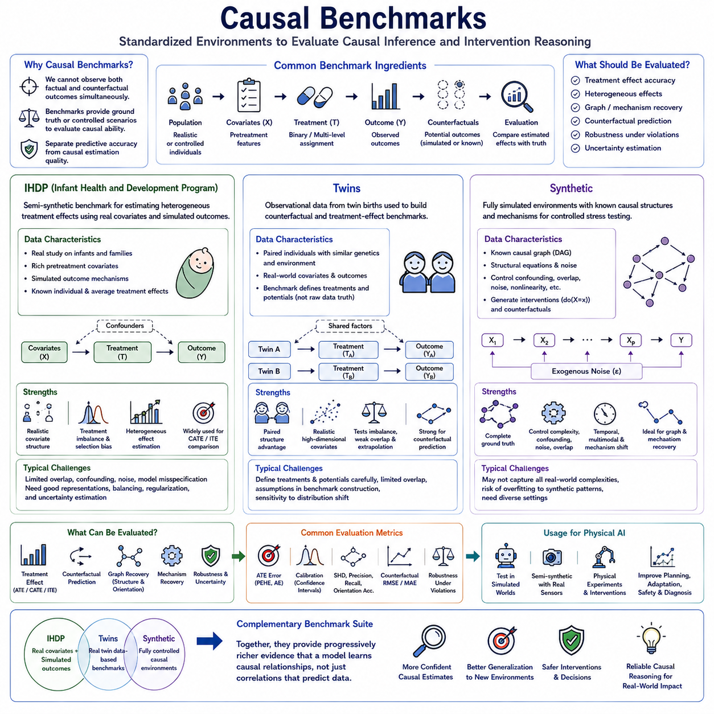
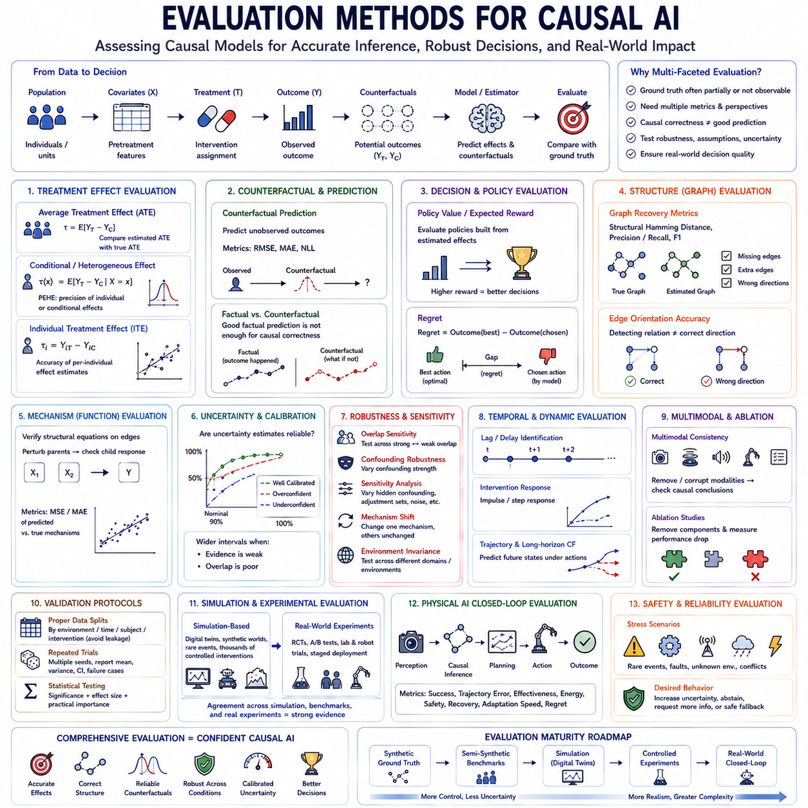
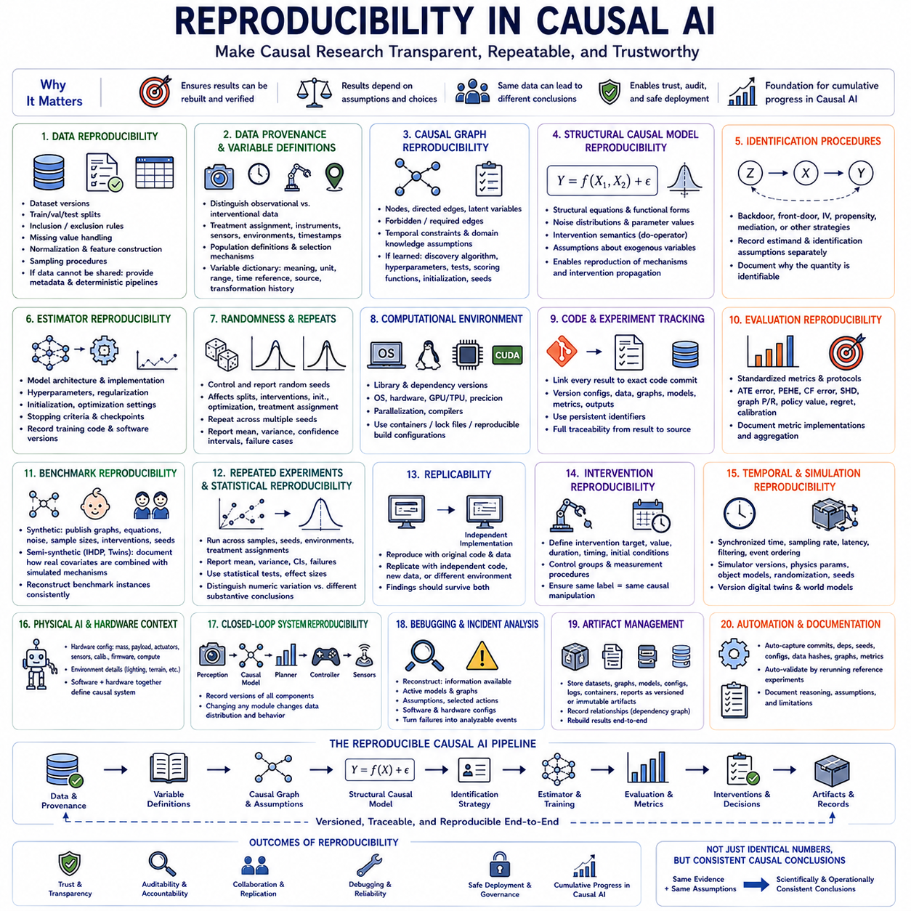
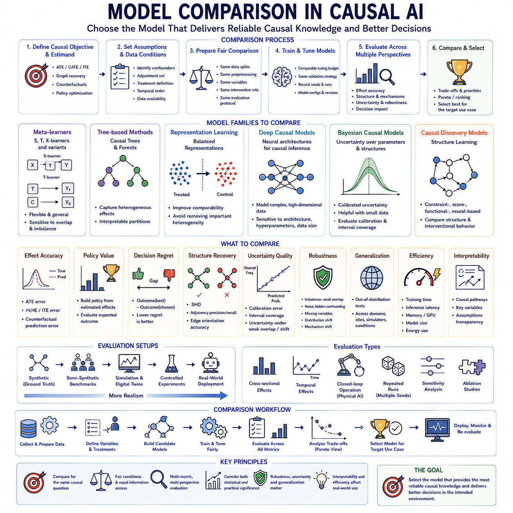

**Volume 46. Causality and Scientific AI**


# Chapter 08. Experiments and Benchmarks

##  

## 08.01. Causal Benchmarks

{width="7.268055555555556in" height="7.268055555555556in"}

Causal benchmarks provide standardized environments for evaluating whether algorithms can estimate treatment effects, recover causal relationships, and reason about interventions under controlled conditions. Unlike ordinary predictive benchmarks, they must address the fundamental difficulty that factual and counterfactual outcomes cannot normally be observed simultaneously. Benchmark design therefore determines how ground truth, treatment assignment, covariates, outcomes, and uncertainty can be evaluated in a reproducible manner.

A useful causal benchmark should separate predictive accuracy from causal estimation quality. A model may predict observed outcomes accurately while estimating intervention effects incorrectly because it relies on confounding correlations. Benchmark datasets therefore typically provide treatment indicators, observed outcomes, pretreatment covariates, and some mechanism for evaluating treatment effects. The strongest settings provide known or simulated counterfactual ground truth against which causal estimates can be directly compared.

IHDP, the Infant Health and Development Program dataset, is widely used as a benchmark for estimating heterogeneous treatment effects. It originates from a real study involving infants and contains realistic pretreatment covariates describing characteristics associated with children and their families. In causal machine learning benchmarks, these real covariates are commonly combined with simulated outcome mechanisms, creating a semi-synthetic environment where treatment-effect ground truth can be controlled.

The semi-synthetic nature of IHDP is important because real covariate distributions preserve dependencies and complexity that purely artificial datasets may fail to reproduce. At the same time, simulated potential outcomes make it possible to know quantities that would otherwise remain counterfactual and unobservable. This combination allows researchers to evaluate causal estimators under realistic covariate structure while retaining objective knowledge of the treatment effects used for benchmarking.

IHDP is particularly useful for studying individual and heterogeneous treatment effects. Instead of asking only whether a treatment has a positive average effect, models must estimate how the effect varies across individuals with different covariates. This makes the benchmark suitable for comparing meta-learners, representation-learning methods, Bayesian causal models, neural causal estimators, and other approaches designed to estimate conditional average treatment effects.

A common challenge in IHDP-style evaluation is treatment imbalance and selection bias. Treated and untreated populations can differ substantially in their covariate distributions, forcing models to distinguish genuine treatment effects from differences caused by treatment assignment. This makes representation balancing, propensity modeling, regularization, and uncertainty estimation relevant components of evaluation rather than merely measuring outcome prediction performance.

Performance on IHDP can be assessed through errors in treatment-effect estimation. Metrics may compare estimated individual treatment effects with known simulated effects or evaluate errors in average treatment effects. Precision in estimation of heterogeneous effects, commonly expressed through PEHE-related measures, is particularly useful because it evaluates whether a model captures variation in treatment response rather than only reproducing population-level averages.

However, IHDP should not be treated as a complete representation of real causal inference. Its outcome mechanism is simulated, and repeated benchmark configurations may reflect assumptions that favor particular model families. Strong performance therefore demonstrates effectiveness under a specific semi-synthetic causal setting rather than universal causal validity. Evaluation should ideally combine IHDP with benchmarks that contain different treatment mechanisms, dimensionality, overlap, noise, and confounding patterns.

The Twins benchmark provides another widely used environment for counterfactual and treatment-effect learning. It is based on observational information concerning twin births and exploits the unusual structure of paired individuals with closely related biological and contextual characteristics. Causal benchmarking variants construct treatment and outcome settings from these data so that algorithms can be tested under realistic covariate distributions and challenging treatment-assignment conditions.

Twins data are attractive because paired observations provide a structure that is uncommon in standard observational datasets. The similarity between twins can help construct benchmark scenarios in which outcomes under alternative conditions can be approximated or generated with more informative relationships than arbitrary synthetic samples. This makes the dataset useful for evaluating counterfactual prediction methods, treatment-effect estimators, and representation-learning approaches.

In common causal machine learning uses of Twins, researchers define treatment variables and potential outcomes according to a benchmark construction rather than assuming that the raw dataset directly reveals both potential outcomes for every individual. This distinction is essential. The value of Twins lies in the benchmark design built around real-world covariates and outcomes, while causal ground truth depends on the assumptions and transformations used to construct the evaluation task.

Twins can be used to test how models behave under treatment imbalance, nonlinear relationships, high-dimensional covariates, and varying degrees of overlap between treatment groups. Algorithms that rely heavily on interpolation may perform poorly when treated and control populations occupy different regions of the covariate space. The benchmark can therefore expose whether causal representations support reasonable generalization beyond the most densely observed combinations.

Counterfactual prediction is a central evaluation objective in Twins-based tasks. Given observed characteristics and one realized condition, a model attempts to estimate what would have occurred under the alternative condition. Errors can then be aggregated into treatment-effect metrics. This evaluation emphasizes the core causal problem of reasoning about unobserved alternatives rather than simply predicting the outcome that actually occurred.

Both IHDP and Twins demonstrate the value of semi-synthetic benchmarking. Real-world covariates preserve correlations, sparsity, imbalance, and population structure, while controlled causal mechanisms provide evaluable treatment effects. This compromise is often more informative than either fully observational data, where causal truth is unknown, or simple synthetic data, where the statistical structure may be unrealistically clean.

Synthetic causal benchmarks provide the highest level of control over the data-generating process. Researchers explicitly define causal graphs, structural equations, noise distributions, intervention mechanisms, treatment assignment, and potential outcomes. Because every component of the causal system is known, algorithms can be evaluated not only on treatment effects but also on graph discovery, edge orientation, mechanism recovery, counterfactual prediction, and intervention response.

A synthetic benchmark can begin with a structural causal model in which variables are connected through a directed acyclic graph. Each variable is generated from its causal parents and an exogenous noise term. Researchers can then sample observational data, apply interventions such as do(X=x), generate alternative outcomes, and retain the complete ground-truth graph. This produces a controlled laboratory for studying causal algorithms.

Graph complexity can be varied systematically in synthetic environments. Benchmarks may change the number of variables, graph density, causal depth, parent count, nonlinear relationships, interaction terms, and noise levels. Algorithms can therefore be evaluated as causal systems become progressively more difficult. Such controlled scaling is especially useful for understanding computational limitations and identifying where particular causal discovery methods begin to fail.

Confounding can also be manipulated explicitly. Synthetic generators can introduce observed confounders, hidden confounders, mediators, colliders, selection effects, and measurement noise. By varying the strength of these mechanisms, researchers can determine whether an algorithm remains accurate when assumptions are gradually violated. This is difficult with real datasets because the true magnitude and structure of hidden confounding are rarely known.

Treatment overlap is another controllable benchmark dimension. Researchers can generate environments with strong overlap, where similar individuals appear in both treatment groups, and weak overlap, where treatment assignment becomes highly dependent on covariates. Weak overlap forces estimators to extrapolate and increases uncertainty. Evaluating across this spectrum reveals whether a method remains appropriately cautious when causal effects are weakly supported by observed comparisons.

Synthetic benchmarks are particularly powerful for evaluating causal discovery because the true graph is available. Estimated graphs can be compared with ground truth using structural Hamming distance, adjacency precision and recall, orientation accuracy, or intervention-based metrics. Evaluation can distinguish whether a model merely identifies dependencies or correctly recovers causal directions and mechanisms needed for intervention reasoning.

Temporal synthetic benchmarks extend causal evaluation to dynamic systems. Variables evolve across time, causal effects may have delays, and feedback can occur between states and actions. Researchers can generate known temporal mechanisms and evaluate lag discovery, state-transition modeling, intervention propagation, and long-horizon counterfactual prediction. These settings are directly relevant to robotics, autonomous systems, industrial processes, and causal world models.

Multimodal synthetic benchmarks can further connect causal variables to images, language, audio, point clouds, or other high-dimensional observations. A latent causal process determines underlying objects and events, while rendering or generative mechanisms produce sensory observations. Algorithms must infer causal factors from perception before reasoning about interventions, making these benchmarks useful for causal representation learning and Physical AI.

Synthetic environments also allow mechanism shifts to be introduced intentionally. A structural equation can change between training and testing while unrelated mechanisms remain stable. This evaluates whether a model can identify which part of the causal system changed and adapt selectively rather than retraining everything. Such benchmarks provide a direct test of modularity, invariance, transfer, and causal generalization.

No single causal benchmark is sufficient for reliable comparison. IHDP emphasizes heterogeneous treatment-effect estimation using realistic covariates and simulated outcomes, while Twins offers another real-data-derived environment for counterfactual and treatment-effect evaluation. Synthetic benchmarks provide complete control over causal structure and permit systematic stress testing across assumptions that cannot be manipulated reliably in observational datasets.

A strong benchmark suite should therefore evaluate algorithms across complementary conditions rather than ranking them using one dataset. Models can first be tested in synthetic environments where causal truth is completely known, then in semi-synthetic environments such as IHDP and Twins where realistic data structure introduces additional complexity. Finally, controlled real-world experiments can determine whether improvements observed in benchmarks transfer to operational systems.

Benchmark protocols should preserve reproducibility through fixed data-generation settings, documented treatment mechanisms, standardized train-validation-test partitions, repeated random seeds, and clearly defined metrics. Reporting should include both average performance and variation across replications because causal estimation can be sensitive to sampling, overlap, initialization, and treatment imbalance. Uncertainty in benchmark performance is itself important evidence about algorithm robustness.

For Physical AI, the same benchmark philosophy can be extended from treatment datasets to interactive environments. Synthetic robotic worlds can provide exact dynamics and intervention ground truth, semi-synthetic environments can combine real sensor recordings with controlled causal modifications, and physical testbeds can provide repeated interventions. Evaluation can then measure whether learned causal mechanisms improve planning, adaptation, diagnosis, and safety.

The purpose of IHDP, Twins, and synthetic causal benchmarks is ultimately not to produce a single leaderboard score but to expose different dimensions of causal competence. Effective evaluation should reveal whether an AI system estimates intervention effects accurately, recognizes heterogeneous responses, handles confounding and weak overlap, represents uncertainty, recovers mechanisms, and generalizes when environments change. Together, these benchmarks provide progressively richer evidence that a model has learned relationships useful for causal reasoning rather than correlations that happen to predict observed data.

인과 벤치마크(causal benchmark)는 알고리즘이 통제된 조건에서 처치 효과(treatment effect)를 추정하고, 인과관계(causal relationship)를 복원하며, 개입(intervention)에 대해 추론할 수 있는지를 평가하기 위한 표준화된 환경을 제공한다. 일반적인 예측 벤치마크와 달리 인과 벤치마크는 사실적 결과(factual outcome)와 반사실적 결과(counterfactual outcome)를 일반적으로 동시에 관측할 수 없다는 근본적인 어려움을 다루어야 한다. 따라서 벤치마크 설계는 정답(ground truth), 처치 할당(treatment assignment), 공변량(covariate), 결과, 불확실성을 재현 가능한 방식으로 평가할 수 있도록 구성되어야 한다.

유용한 인과 벤치마크는 예측 정확도(predictive accuracy)와 인과 추정 품질(causal estimation quality)을 구분해야 한다. 모델은 교란된 상관관계(confounded correlation)에 의존하면서 관측 결과를 정확하게 예측하지만 개입 효과는 잘못 추정할 수 있다. 따라서 벤치마크 데이터셋은 일반적으로 처치 지표(treatment indicator), 관측된 결과, 처치 이전 공변량(pretreatment covariate), 처치 효과를 평가할 수 있는 방법을 제공한다. 가장 강력한 환경은 인과 추정값과 직접 비교할 수 있는 알려지거나 시뮬레이션된 반사실적 정답을 제공한다.

IHDP(Infant Health and Development Program) 데이터셋은 이질적 처치 효과(heterogeneous treatment effect)를 추정하기 위한 벤치마크로 널리 사용된다. 이는 영유아를 대상으로 한 실제 연구에서 유래했으며 아동과 가족의 특성을 설명하는 현실적인 처치 이전 공변량을 포함한다. 인과 머신러닝 벤치마크에서는 이러한 실제 공변량을 시뮬레이션된 결과 메커니즘(simulated outcome mechanism)과 결합하여 처치 효과의 정답을 통제할 수 있는 반합성 환경(semi-synthetic environment)을 구성하는 경우가 많다.

IHDP의 반합성적 특성(semi-synthetic nature)은 실제 공변량 분포가 순수한 인공 데이터셋에서 재현하기 어려운 의존성과 복잡성을 보존하기 때문에 중요하다. 동시에 시뮬레이션된 잠재 결과(potential outcome)를 이용하면 일반적인 상황에서는 반사실적이어서 관측할 수 없는 값을 알 수 있다. 이러한 결합을 통해 현실적인 공변량 구조에서 인과 추정기를 평가하면서 벤치마크에 사용되는 처치 효과에 대한 객관적인 정답을 유지할 수 있다.

IHDP는 특히 개별 처치 효과(individual treatment effect)와 이질적 처치 효과를 연구하는 데 유용하다. 단순히 처치가 평균적으로 긍정적인 효과를 가지는지를 묻는 대신 모델은 서로 다른 공변량을 가진 개인마다 효과가 어떻게 달라지는지를 추정해야 한다. 따라서 이 벤치마크는 메타 학습기(meta-learner), 표현 학습(representation learning), 베이지안 인과 모델(Bayesian causal model), 신경망 인과 추정기(neural causal estimator), 조건부 평균 처치 효과(Conditional Average Treatment Effect)를 추정하는 다양한 접근법을 비교하는 데 적합하다.

IHDP 형태의 평가에서 일반적인 과제는 처치 불균형(treatment imbalance)과 선택 편향(selection bias)이다. 처치 집단과 비처치 집단은 공변량 분포에서 상당한 차이를 보일 수 있으므로 모델은 실제 처치 효과와 처치 할당에 의해 발생한 집단 차이를 구분해야 한다. 따라서 표현 균형화(representation balancing), 성향 모델링(propensity modeling), 정규화(regularization), 불확실성 추정(uncertainty estimation)은 단순한 결과 예측 성능을 넘어 중요한 평가 요소가 된다.

IHDP의 성능은 처치 효과 추정 오차를 통해 평가할 수 있다. 평가 지표는 추정된 개별 처치 효과와 알려진 시뮬레이션 효과를 비교하거나 평균 처치 효과(Average Treatment Effect)의 오차를 평가할 수 있다. 특히 PEHE(Precision in Estimation of Heterogeneous Effect) 관련 척도는 모델이 모집단 수준의 평균만 재현하는 것이 아니라 개인별 처치 반응의 차이를 얼마나 정확하게 포착하는지를 평가하기 때문에 유용하다.

그러나 IHDP를 실제 인과 추론 전체를 대표하는 완전한 환경으로 간주해서는 안 된다. 결과 메커니즘은 시뮬레이션된 것이며, 반복적으로 사용되는 벤치마크 구성에는 특정 모델 계열에 유리한 가정이 포함될 수 있다. 따라서 높은 성능은 특정 반합성 인과 환경에서의 효과성을 보여주는 것이지 보편적인 인과적 타당성(causal validity)을 의미하지 않는다. 이상적인 평가에서는 IHDP를 서로 다른 처치 메커니즘, 차원, 오버랩(overlap), 잡음, 교란 패턴을 가진 다른 벤치마크와 함께 사용해야 한다.

쌍둥이 벤치마크(Twins benchmark)는 반사실적 학습(counterfactual learning)과 처치 효과 학습을 위해 널리 사용되는 또 다른 환경을 제공한다. 이는 쌍둥이 출생과 관련된 관측 정보를 기반으로 하며 생물학적 및 맥락적 특성이 밀접하게 관련된 쌍을 이룬 개인이라는 독특한 구조를 활용한다. 인과 벤치마크 변형에서는 이러한 데이터를 이용하여 처치와 결과 환경을 구성함으로써 현실적인 공변량 분포와 까다로운 처치 할당 조건에서 알고리즘을 평가할 수 있도록 한다.

쌍둥이 데이터(Twins data)는 쌍을 이루는 관측값이 일반적인 관측 데이터셋에서는 보기 어려운 구조를 제공하기 때문에 유용하다. 쌍둥이 사이의 유사성은 임의적인 합성 표본보다 대안적인 조건에서의 결과를 더욱 유용한 관계를 통해 근사하거나 생성할 수 있는 벤치마크 시나리오를 구성하는 데 도움을 줄 수 있다. 따라서 반사실적 예측 방법(counterfactual prediction method), 처치 효과 추정기, 표현 학습 접근법을 평가하는 데 유용하다.

쌍둥이 데이터가 인과 머신러닝에서 일반적으로 사용되는 경우 연구자는 원시 데이터셋 자체가 모든 개인에 대해 두 잠재 결과를 직접 제공한다고 가정하기보다 벤치마크 구성에 따라 처치 변수와 잠재 결과를 정의한다. 이러한 구분은 중요하다. 쌍둥이 벤치마크의 가치는 실제 세계의 공변량과 결과를 중심으로 구성된 벤치마크 설계에 있으며, 인과적 정답은 평가 과제를 구성하는 과정에서 사용된 가정과 변환에 의존한다.

쌍둥이 벤치마크는 처치 불균형, 비선형 관계(nonlinear relationship), 고차원 공변량(high-dimensional covariate), 처치 집단 사이의 다양한 수준의 오버랩을 가진 환경에서 모델의 동작을 평가하는 데 사용할 수 있다. 보간(interpolation)에 크게 의존하는 알고리즘은 처치 집단과 통제 집단이 공변량 공간의 서로 다른 영역을 차지할 경우 성능이 저하될 수 있다. 따라서 이 벤치마크는 인과 표현이 관측이 밀집된 조합을 넘어 합리적인 일반화를 지원하는지를 평가할 수 있다.

반사실적 예측(counterfactual prediction)은 쌍둥이 기반 과제의 핵심 평가 목표이다. 관측된 특성과 하나의 실제 조건이 주어졌을 때 모델은 대안적인 조건에서 어떤 결과가 발생했을지를 추정한다. 이후 이러한 오차를 종합하여 처치 효과 지표를 계산할 수 있다. 이러한 평가는 실제로 발생한 결과만을 예측하는 것이 아니라 관측되지 않은 대안에 대해 추론하는 인과 문제의 핵심을 강조한다.

IHDP와 쌍둥이 벤치마크는 모두 반합성 벤치마킹(semi-synthetic benchmarking)의 가치를 보여준다. 실제 세계의 공변량은 상관관계, 희소성(sparsity), 불균형, 모집단 구조를 보존하고, 통제된 인과 메커니즘은 평가 가능한 처치 효과를 제공한다. 이러한 절충 방식은 인과 정답을 알 수 없는 완전한 관측 데이터나 통계 구조가 비현실적으로 단순할 수 있는 합성 데이터보다 더 유용한 평가 환경을 제공하는 경우가 많다.

합성 인과 벤치마크(synthetic causal benchmark)는 데이터 생성 과정(data-generating process)을 가장 높은 수준으로 통제할 수 있다. 연구자는 인과 그래프, 구조 방정식(structural equation), 잡음 분포, 개입 메커니즘, 처치 할당, 잠재 결과를 명시적으로 정의한다. 인과 시스템의 모든 구성 요소를 알고 있기 때문에 알고리즘을 처치 효과뿐만 아니라 그래프 발견(graph discovery), 간선 방향(edge orientation), 메커니즘 복원(mechanism recovery), 반사실적 예측, 개입 반응에 대해서도 평가할 수 있다.

합성 벤치마크는 변수들이 방향성 비순환 그래프(Directed Acyclic Graph, DAG)를 통해 연결된 구조적 인과 모델(Structural Causal Model, SCM)에서 시작할 수 있다. 각각의 변수는 자신의 인과 부모(causal parent)와 외생 잡음 항(exogenous noise term)으로부터 생성된다. 이후 연구자는 관측 데이터를 샘플링하고, do(X=x)와 같은 개입을 적용하고, 대안적 결과를 생성하면서 전체 정답 인과 그래프를 보존할 수 있다. 이를 통해 인과 알고리즘을 연구하기 위한 통제된 실험 환경을 구성한다.

합성 환경에서는 그래프 복잡성(graph complexity)을 체계적으로 변화시킬 수 있다. 벤치마크는 변수의 수, 그래프 밀도, 인과 깊이(causal depth), 부모 노드 수, 비선형 관계, 상호작용 항(interaction term), 잡음 수준을 변화시킬 수 있다. 이를 통해 인과 시스템이 점차 복잡해질 때 알고리즘의 성능을 평가할 수 있다. 이러한 통제된 확장(controlled scaling)은 계산상의 한계를 이해하고 특정 인과 발견 방법이 어느 지점에서 실패하기 시작하는지를 식별하는 데 특히 유용하다.

교란(confounding) 역시 명시적으로 조절할 수 있다. 합성 생성기(synthetic generator)는 관측된 교란 요인, 숨겨진 교란 요인(hidden confounder), 매개 변수(mediator), 콜라이더(collider), 선택 효과(selection effect), 측정 잡음(measurement noise)을 도입할 수 있다. 이러한 메커니즘의 강도를 변화시키면서 알고리즘의 가정이 점차 위반될 때에도 정확성을 유지하는지를 평가할 수 있다. 실제 데이터에서는 숨겨진 교란의 실제 크기와 구조를 알기 어렵기 때문에 이러한 실험을 수행하기 어렵다.

처치 오버랩(treatment overlap) 역시 통제할 수 있는 벤치마크 차원이다. 연구자는 유사한 개체가 두 처치 집단 모두에 나타나는 강한 오버랩 환경과 처치 할당이 공변량에 크게 의존하는 약한 오버랩 환경을 생성할 수 있다. 약한 오버랩에서는 추정기가 외삽(extrapolation)을 수행해야 하며 불확실성이 증가한다. 이러한 조건을 단계적으로 평가하면 관측된 비교 자료가 부족한 상황에서 인과 효과에 대해 알고리즘이 적절하게 신중한 태도를 유지하는지를 판단할 수 있다.

합성 벤치마크는 실제 인과 그래프를 알고 있기 때문에 인과 발견을 평가하는 데 특히 강력하다. 추정된 그래프를 구조적 해밍 거리(Structural Hamming Distance), 인접 관계 정밀도 및 재현율(adjacency precision and recall), 방향 정확도(orientation accuracy), 개입 기반 지표(intervention-based metric)를 이용하여 정답과 비교할 수 있다. 이를 통해 모델이 단순히 의존관계를 발견하는 것인지, 아니면 개입 추론에 필요한 올바른 인과 방향과 메커니즘까지 복원하는지를 구분할 수 있다.

시간 합성 벤치마크(temporal synthetic benchmark)는 인과 평가를 동적 시스템(dynamic system)으로 확장한다. 변수는 시간에 따라 변화하고, 인과 효과에는 지연이 존재할 수 있으며, 상태와 행동 사이에 피드백(feedback)이 발생할 수 있다. 연구자는 알려진 시간적 메커니즘을 생성하여 지연 발견(lag discovery), 상태 전이 모델링(state-transition modeling), 개입 전파(intervention propagation), 장기 반사실적 예측(long-horizon counterfactual prediction)을 평가할 수 있다. 이러한 환경은 로보틱스, 자율 시스템, 산업 공정 및 인과 월드 모델(causal world model)과 직접적으로 관련된다.

다중 모달 합성 벤치마크(multimodal synthetic benchmark)는 인과 변수를 이미지, 언어, 오디오, 포인트 클라우드(point cloud) 또는 기타 고차원 관측과 연결할 수 있다. 잠재 인과 과정(latent causal process)이 기반 객체와 사건을 결정하고 렌더링(rendering) 또는 생성 메커니즘이 감각 관측을 생성한다. 알고리즘은 개입에 대해 추론하기 전에 지각 정보로부터 인과 요인을 추론해야 하므로 이러한 벤치마크는 인과 표현 학습(causal representation learning)과 피지컬 인공지능(Physical AI)에 유용하다.

합성 환경에서는 메커니즘 변화(mechanism shift)도 의도적으로 도입할 수 있다. 학습과 테스트 사이에서 하나의 구조 방정식을 변경하면서 관련 없는 다른 메커니즘은 안정적으로 유지할 수 있다. 이를 통해 모델이 인과 시스템에서 어떤 부분이 변화했는지를 식별하고 전체 시스템을 다시 학습하는 대신 선택적으로 적응할 수 있는지를 평가한다. 이러한 벤치마크는 모듈성(modularity), 불변성(invariance), 전이(transfer), 인과 일반화(causal generalization)를 직접적으로 검증할 수 있다.

신뢰할 수 있는 비교를 위해서는 하나의 인과 벤치마크만으로 충분하지 않다. IHDP는 현실적인 공변량과 시뮬레이션된 결과를 이용하여 이질적 처치 효과 추정을 강조하고, 쌍둥이 벤치마크는 반사실적 및 처치 효과 평가를 위한 또 다른 실제 데이터 기반 환경을 제공한다. 합성 벤치마크는 인과 구조를 완전히 통제할 수 있으며 관측 데이터에서는 신뢰성 있게 조작할 수 없는 다양한 가정을 체계적으로 스트레스 테스트(stress testing)할 수 있다.

따라서 강력한 벤치마크 제품군(benchmark suite)은 하나의 데이터셋으로 알고리즘 순위를 결정하기보다 상호 보완적인 조건에서 알고리즘을 평가해야 한다. 먼저 인과적 정답을 완전히 알고 있는 합성 환경에서 모델을 테스트하고, 이후 현실적인 데이터 구조가 추가적인 복잡성을 제공하는 IHDP와 쌍둥이 같은 반합성 환경에서 평가할 수 있다. 마지막으로 통제된 실제 환경 실험을 통해 벤치마크에서 관측된 개선이 운영 시스템으로 전이되는지를 검증할 수 있다.

벤치마크 프로토콜(benchmark protocol)은 고정된 데이터 생성 설정, 문서화된 처치 메커니즘, 표준화된 학습-검증-테스트 분할(train-validation-test partition), 반복적인 난수 시드(random seed), 명확하게 정의된 평가 지표를 통해 재현성(reproducibility)을 보장해야 한다. 인과 추정은 샘플링, 오버랩, 초기화(initialization), 처치 불균형에 민감할 수 있으므로 평균 성능뿐만 아니라 반복 실험에 따른 변동도 함께 보고해야 한다. 벤치마크 성능 자체의 불확실성도 알고리즘의 강건성(robustness)을 판단하는 중요한 증거이다.

피지컬 인공지능에서는 동일한 벤치마크 철학을 처치 데이터셋에서 상호작용 환경(interactive environment)으로 확장할 수 있다. 합성 로봇 세계(synthetic robotic world)는 정확한 동역학과 개입 정답을 제공하고, 반합성 환경은 실제 센서 기록과 통제된 인과적 변화를 결합하며, 물리적 테스트베드(physical testbed)는 반복적인 개입을 제공할 수 있다. 이를 통해 학습된 인과 메커니즘이 계획(planning), 적응(adaptation), 진단(diagnosis), 안전(safety)을 실제로 향상시키는지를 평가할 수 있다.

IHDP, 쌍둥이(Twins), 합성 인과 벤치마크의 목적은 궁극적으로 하나의 리더보드 점수(leaderboard score)를 만드는 것이 아니라 인과 능력(causal competence)의 서로 다른 차원을 드러내는 것이다. 효과적인 평가는 인공지능 시스템이 개입 효과를 정확하게 추정하고, 이질적인 반응을 인식하고, 교란과 약한 오버랩을 처리하고, 불확실성을 표현하고, 메커니즘을 복원하며, 환경이 변화할 때 일반화할 수 있는지를 보여주어야 한다. 이러한 벤치마크를 함께 사용하면 모델이 단순히 관측 데이터를 잘 예측하는 상관관계를 넘어 실제 인과 추론에 유용한 관계를 학습했다는 점에 대해 점진적으로 더 강력한 증거를 확보할 수 있다.

##  

## 08.02. Evaluation Methods

{width="7.268055555555556in" height="7.268055555555556in"}

Evaluation methods for causal AI determine whether a model has learned relationships that support reliable intervention, counterfactual reasoning, and decision making rather than merely reproducing statistical associations. Because causal ground truth is often partially or completely unobservable, evaluation cannot depend on a single accuracy score. Instead, multiple complementary methods are required to assess treatment effects, causal structure, mechanisms, robustness, uncertainty, and downstream utility.

Treatment-effect evaluation measures how accurately a model estimates the consequences of interventions. When true potential outcomes are known in synthetic or semi-synthetic benchmarks, estimated effects can be compared directly with ground truth. Evaluation may target the Average Treatment Effect, Conditional Average Treatment Effect, or Individual Treatment Effect, depending on whether the objective concerns population-level, subgroup-specific, or individual responses.

Error in Average Treatment Effect provides a simple measure of population-level causal estimation. The estimated difference between treatment and control outcomes is compared with the known or experimentally established effect. Although useful, this metric can hide substantial errors in heterogeneous responses because positive and negative individual errors may cancel. It should therefore be combined with measures that examine treatment effects at finer levels.

Precision in Estimation of Heterogeneous Effect, commonly represented through PEHE-related metrics, evaluates whether individual or conditional treatment effects are estimated correctly. It compares predicted differences between potential outcomes with known treatment-effect differences across samples. This is especially important for personalized interventions, adaptive policies, medical decision systems, and AI agents whose optimal actions depend on context.

Counterfactual prediction error evaluates the model\'s ability to estimate outcomes under actions or conditions that were not actually observed. Metrics such as RMSE or MAE can be used when counterfactual ground truth is available from simulation, semi-synthetic construction, or repeated controlled experiments. Good factual prediction alone is insufficient because a model may reproduce observed outcomes while generating inaccurate alternative futures.

Policy evaluation translates causal estimation quality into decision quality. Instead of asking only whether treatment effects are numerically accurate, it evaluates whether a policy constructed from those estimates selects useful interventions. Policy value, expected reward, success rate, or regret can quantify whether causal reasoning improves decisions. This is particularly important when small estimation errors can change which action is ultimately selected.

Regret measures the difference between the outcome produced by the model\'s chosen intervention and the outcome that would have been achieved by an optimal intervention. Low regret indicates that causal errors have limited practical consequences, while high regret reveals that apparently reasonable estimates lead to poor decisions. Regret therefore provides an important bridge between causal inference metrics and operational performance.

Causal discovery requires structural evaluation when the true graph is available. Estimated graphs can be compared with ground-truth causal structures using Structural Hamming Distance, adjacency precision and recall, F1 score, or related measures. These metrics quantify missing edges, extra edges, and incorrect orientations. Structural evaluation is especially valuable in synthetic benchmarks where the complete data-generating graph can be explicitly controlled.

Edge-orientation accuracy should be distinguished from adjacency accuracy. A model may correctly detect that two variables are related while reversing the direction of influence. Such an error can have limited impact on observational prediction but severe consequences for intervention reasoning. Evaluation should therefore report whether relationships were merely detected and whether their causal directions were correctly identified.

Interventional graph evaluation can provide stronger evidence than structural similarity alone. Two graphs may differ in topology yet produce similar predictions for relevant interventions, while structurally similar graphs can behave differently after intervention. Evaluators can therefore apply standardized interventions and compare predicted post-intervention distributions with ground truth, directly testing whether learned structure supports the intended causal use.

Mechanism recovery evaluates the functional relationships associated with causal edges. Even when graph topology is correct, inaccurate structural equations can produce incorrect intervention outcomes. Evaluators can perturb parent variables and compare predicted child responses with known mechanisms. This separates the ability to discover which variables influence one another from the ability to model how those influences actually operate.

Calibration evaluates whether uncertainty estimates correspond to observed causal errors. Confidence intervals should contain true treatment effects at approximately their intended coverage rate, while posterior distributions should widen when evidence is weak or treatment overlap is poor. Calibration is essential because causal decisions often involve regions where direct comparisons are limited and models must communicate uncertainty rather than provide unjustified certainty.

Overlap-aware evaluation examines performance across different levels of treatment support. When treated and control populations occupy similar covariate regions, causal estimation is relatively well supported. Under weak overlap, models must extrapolate and uncertainty should increase. Reporting performance as overlap decreases reveals whether an estimator remains reliable and appropriately cautious when observational evidence becomes sparse.

Confounding robustness evaluates how estimates respond to variables that influence both treatment and outcome. Synthetic benchmarks can systematically increase confounding strength, while semi-synthetic studies can manipulate treatment-assignment mechanisms. Performance degradation across these settings reveals how strongly a method depends on ideal assumptions and whether adjustment, balancing, or representation-learning techniques successfully reduce confounding bias.

Sensitivity analysis extends robustness evaluation to assumptions that cannot be verified directly. Evaluators can vary hidden-confounding strength, adjustment sets, graph constraints, noise assumptions, model classes, and measurement error. If causal conclusions change dramatically under small plausible modifications, they should be considered fragile. Stable conclusions across reasonable assumptions provide stronger evidence for practical use.

Environmental invariance tests whether learned mechanisms remain valid across different domains. Models can be trained in one set of environments and evaluated in others with different populations, sensors, sites, workloads, object distributions, or operating conditions. If the underlying causal mechanism remains unchanged, a robust causal model should preserve intervention accuracy despite changes in superficial statistical correlations.

Mechanism-shift evaluation deliberately changes part of the causal system. Instead of testing only ordinary distribution shift, one structural equation, causal edge, or physical relationship can be modified while other mechanisms remain unchanged. Evaluation then measures whether the model detects the changed mechanism, preserves stable components, and adapts selectively. This directly assesses modularity and causal generalization.

Temporal evaluation is required when causal effects unfold over time. Metrics can assess causal lag identification, transition accuracy, intervention-response trajectories, impulse responses, accumulated effects, and long-horizon counterfactual predictions. A model that identifies the correct causal variables but predicts effects at the wrong time may still produce poor planning or control decisions in dynamic systems.

Repeated-intervention evaluation provides stronger evidence for temporal and dynamic causal models. The same or comparable interventions can be executed under controlled initial conditions, allowing predicted trajectories to be compared with actual trajectories. Repetition also reveals variance caused by stochastic dynamics and helps distinguish systematic model errors from ordinary environmental randomness.

Multimodal causal evaluation examines whether causal conclusions remain consistent across sensing modalities. Vision, LiDAR, audio, force, proprioception, and language may provide different observations of the same underlying event. Evaluators can remove, corrupt, delay, or replace selected modalities and measure whether the model preserves a coherent causal state rather than changing conclusions because one statistical input channel has shifted.

Ablation studies identify which components contribute to causal performance. Researchers can remove causal regularization, representation balancing, graph constraints, intervention data, uncertainty modeling, or domain knowledge and measure the resulting degradation. Ablation does not by itself prove causal correctness, but it clarifies whether claimed architectural innovations actually contribute to intervention estimation, robustness, or generalization.

Cross-validation requires special care in causal evaluation. Randomly splitting individual observations may leak environmental, temporal, subject-specific, or treatment-related information across training and testing sets. Stronger protocols can split by environment, individual, intervention, time period, site, or mechanism. Such partitions provide a more realistic test of whether causal knowledge transfers beyond conditions encountered during training.

Repeated trials and multiple random seeds are necessary because causal estimators can be sensitive to treatment imbalance, initialization, sample selection, and stochastic optimization. Reporting only the best run can substantially exaggerate performance. Evaluation should report mean results, variance, confidence intervals, and failure cases across repeated experiments to characterize both expected performance and reliability.

Statistical hypothesis testing can determine whether observed performance differences between causal methods are likely to reflect systematic improvement rather than sampling variation. However, statistical significance should be interpreted alongside effect size and operational relevance. A small improvement on a large benchmark may be statistically significant while providing little practical benefit for intervention selection or deployment.

Simulation-based evaluation is especially useful when physical interventions are expensive or dangerous. Synthetic environments, digital twins, and causal world models can expose systems to rare failures, extreme conditions, sensor degradation, and unusual action combinations. Simulation allows thousands of controlled interventions to be executed, providing broad coverage before a causal model is tested on real hardware.

Real-world experimental evaluation remains essential because simulation may omit important mechanisms. Randomized trials, A/B tests, laboratory experiments, controlled robotic trials, and staged deployments can compare predicted causal effects with actual intervention outcomes. Agreement between simulation, benchmark, and physical experiments provides stronger evidence than success within any single evaluation environment.

For Physical AI, closed-loop evaluation should measure the entire sequence from perception to causal inference, planning, action, and observed consequence. Metrics may include task success, trajectory error, intervention effectiveness, energy consumption, recovery behavior, safety violations, adaptation speed, and decision regret. This reveals whether causal knowledge actually improves autonomous behavior rather than merely producing accurate offline estimates.

Safety evaluation should specifically examine conditions where causal errors could generate hazardous interventions. Rare events, actuator faults, sensor failures, unstable states, unknown environments, and conflicting observations should be included. A trustworthy system should increase uncertainty, abstain, request additional evidence, or activate a safe fallback when causal assumptions are unsupported instead of confidently extrapolating beyond validated conditions.

No individual evaluation method can establish complete causal competence. Treatment-effect metrics measure estimation, graph metrics measure structure, counterfactual metrics test alternative outcomes, robustness tests challenge assumptions, calibration evaluates uncertainty, and policy metrics measure decision consequences. Their combination provides a multidimensional view of whether an AI system has learned causal knowledge that remains useful beyond its training data.

A mature evaluation framework therefore progresses from controlled synthetic ground truth through semi-synthetic benchmarks, simulation, controlled experiments, and finally real-world closed-loop operation. Each stage removes some artificial assumptions while introducing greater uncertainty and complexity. Together, these evaluation methods provide increasingly strong evidence that causal AI can reason about interventions, adapt to changing environments, and support reliable decisions in operational systems.

인과 인공지능의 평가 방법(Evaluation Methods for Causal AI)은 모델이 단순히 통계적 연관성(statistical association)을 재현하는 것이 아니라 신뢰할 수 있는 개입(intervention), 반사실적 추론(counterfactual reasoning), 의사결정(decision making)을 지원하는 관계를 학습했는지를 판단한다. 인과적 정답(causal ground truth)은 부분적으로 또는 완전히 관측할 수 없는 경우가 많기 때문에 하나의 정확도 점수에만 의존하여 평가할 수 없다. 대신 처치 효과(treatment effect), 인과 구조(causal structure), 메커니즘, 강건성(robustness), 불확실성(uncertainty), 후속 활용 가치(downstream utility)를 평가하는 여러 상호 보완적인 방법이 필요하다.

처치 효과 평가(treatment-effect evaluation)는 모델이 개입의 결과를 얼마나 정확하게 추정하는지를 측정한다. 합성 또는 반합성 벤치마크(synthetic or semi-synthetic benchmark)에서 실제 잠재 결과(potential outcome)를 알고 있다면 추정된 효과를 정답과 직접 비교할 수 있다. 평가 목적이 모집단 수준, 하위 집단별 또는 개인별 반응 가운데 무엇을 대상으로 하는지에 따라 평균 처치 효과(Average Treatment Effect), 조건부 평균 처치 효과(Conditional Average Treatment Effect), 개별 처치 효과(Individual Treatment Effect)를 평가할 수 있다.

평균 처치 효과 오차(Error in Average Treatment Effect)는 모집단 수준의 인과 추정을 측정하는 간단한 방법을 제공한다. 처치 집단과 통제 집단 결과 사이에서 추정된 차이를 알려져 있거나 실험적으로 확립된 효과와 비교한다. 그러나 개인별 양의 오차와 음의 오차가 서로 상쇄될 수 있기 때문에 이 지표는 이질적인 반응(heterogeneous response)에서 발생하는 상당한 오류를 숨길 수 있다. 따라서 보다 세밀한 수준에서 처치 효과를 평가하는 지표와 함께 사용해야 한다.

이질적 효과 추정 정밀도(Precision in Estimation of Heterogeneous Effect, PEHE) 관련 지표는 개별 또는 조건부 처치 효과가 올바르게 추정되는지를 평가한다. 이는 표본별로 예측된 잠재 결과 사이의 차이를 알려진 처치 효과 차이와 비교한다. 이러한 평가는 최적 행동이 상황에 따라 달라지는 개인화 개입(personalized intervention), 적응형 정책(adaptive policy), 의료 의사결정 시스템, 인공지능 에이전트(AI agent)에서 특히 중요하다.

반사실적 예측 오차(counterfactual prediction error)는 실제로 관측되지 않은 행동이나 조건에서 발생했을 결과를 모델이 얼마나 정확하게 추정하는지를 평가한다. 시뮬레이션, 반합성 구성 또는 반복적인 통제 실험을 통해 반사실적 정답을 확보할 수 있다면 평균제곱근오차(Root Mean Squared Error, RMSE)나 평균절대오차(Mean Absolute Error, MAE) 같은 지표를 사용할 수 있다. 모델이 관측 결과를 정확하게 재현하면서도 대안적 미래를 부정확하게 생성할 수 있기 때문에 사실적 예측 성능만으로는 충분하지 않다.

정책 평가(policy evaluation)는 인과 추정 품질을 의사결정 품질로 변환하여 평가한다. 단순히 처치 효과의 수치적 정확성을 묻는 대신 이러한 추정값을 기반으로 구성된 정책이 유용한 개입을 선택하는지를 평가한다. 정책 가치(policy value), 기대 보상(expected reward), 성공률(success rate), 후회(regret)를 통해 인과 추론이 실제 의사결정을 개선하는지를 정량화할 수 있다. 작은 추정 오차가 최종적으로 선택되는 행동을 변경할 수 있는 경우 특히 중요하다.

후회(regret)는 모델이 선택한 개입으로 발생한 결과와 최적의 개입을 선택했을 경우 달성할 수 있었던 결과 사이의 차이를 측정한다. 낮은 후회는 인과적 오류가 실제 운영 결과에 미치는 영향이 제한적이라는 것을 의미하고, 높은 후회는 겉으로 합리적으로 보이는 추정이 잘못된 의사결정으로 이어졌음을 보여준다. 따라서 후회는 인과 추론 지표와 실제 운영 성능을 연결하는 중요한 평가 기준이다.

인과 발견(causal discovery)은 실제 그래프를 알고 있는 경우 구조적 평가(structural evaluation)를 필요로 한다. 추정된 그래프는 구조적 해밍 거리(Structural Hamming Distance), 인접 관계 정밀도 및 재현율(adjacency precision and recall), F1 점수(F1 score) 등의 지표를 이용하여 정답 인과 구조와 비교할 수 있다. 이러한 지표는 누락된 간선, 불필요하게 추가된 간선, 잘못된 방향을 정량화하며, 전체 데이터 생성 그래프를 명시적으로 통제할 수 있는 합성 벤치마크에서 특히 유용하다.

간선 방향 정확도(edge-orientation accuracy)는 인접 관계 정확도(adjacency accuracy)와 구분해야 한다. 모델은 두 변수가 서로 관련되어 있다는 사실은 정확하게 탐지하면서 영향의 방향을 반대로 추정할 수 있다. 이러한 오류는 관측 예측에는 제한적인 영향을 줄 수 있지만 개입 추론에는 심각한 문제를 발생시킬 수 있다. 따라서 관계 자체를 발견했는지뿐만 아니라 인과 방향까지 올바르게 식별했는지를 평가해야 한다.

개입 기반 그래프 평가(interventional graph evaluation)는 구조적 유사성만을 비교하는 것보다 강한 증거를 제공할 수 있다. 두 그래프는 토폴로지(topology)가 다르더라도 중요한 개입에 대해 비슷한 예측을 생성할 수 있고, 반대로 구조적으로 유사한 그래프가 개입 이후에는 서로 다른 동작을 보일 수도 있다. 따라서 표준화된 개입을 적용하고 예측된 개입 후 분포(post-intervention distribution)를 정답과 비교하여 학습된 구조가 실제 인과적 활용을 지원하는지를 직접 검증할 수 있다.

메커니즘 복원(mechanism recovery)은 인과 간선과 연결된 함수적 관계(functional relationship)를 평가한다. 그래프 토폴로지가 정확하더라도 구조 방정식(structural equation)이 부정확하면 잘못된 개입 결과를 생성할 수 있다. 평가자는 부모 변수(parent variable)를 변화시키고 예측된 자식 변수(child variable)의 반응을 알려진 메커니즘과 비교할 수 있다. 이를 통해 어떤 변수가 서로 영향을 주는지를 발견하는 능력과 그 영향이 실제로 어떻게 작동하는지를 모델링하는 능력을 구분할 수 있다.

보정(calibration)은 불확실성 추정값이 실제 인과적 오류와 일치하는지를 평가한다. 신뢰 구간(confidence interval)은 의도한 포함률(coverage rate)에 근접한 비율로 실제 처치 효과를 포함해야 하며, 증거가 부족하거나 처치 오버랩(treatment overlap)이 낮은 경우 사후 분포(posterior distribution)가 넓어져야 한다. 직접적인 비교가 제한된 영역에서는 모델이 근거 없는 확신을 제공하기보다 불확실성을 전달해야 하므로 보정은 매우 중요하다.

오버랩 인식 평가(overlap-aware evaluation)는 서로 다른 수준의 처치 지원(treatment support)에서 성능을 검토한다. 처치 집단과 통제 집단이 유사한 공변량 영역을 차지하면 인과 추정은 상대적으로 강한 근거를 가진다. 반면 오버랩이 약하면 모델은 외삽(extrapolation)을 수행해야 하며 불확실성이 증가해야 한다. 오버랩이 감소함에 따른 성능을 보고하면 관측 증거가 희소해질 때 추정기가 얼마나 신뢰성을 유지하고 적절하게 신중해지는지를 평가할 수 있다.

교란 강건성(confounding robustness)은 처치와 결과 모두에 영향을 미치는 변수에 대해 추정값이 어떻게 반응하는지를 평가한다. 합성 벤치마크에서는 교란 강도를 체계적으로 증가시킬 수 있고, 반합성 연구에서는 처치 할당 메커니즘(treatment-assignment mechanism)을 조작할 수 있다. 이러한 조건에서 성능이 어떻게 저하되는지를 평가하면 모델이 이상적인 가정에 얼마나 의존하는지, 그리고 조정(adjustment), 균형화(balancing), 표현 학습 기법이 교란 편향(confounding bias)을 효과적으로 감소시키는지를 판단할 수 있다.

민감도 분석(sensitivity analysis)은 직접적으로 검증할 수 없는 가정까지 강건성 평가를 확장한다. 평가자는 숨겨진 교란(hidden confounding)의 강도, 조정 집합(adjustment set), 그래프 제약(graph constraint), 잡음 가정, 모델 클래스, 측정 오류를 변화시킬 수 있다. 작은 수준의 합리적인 변화에도 인과적 결론이 크게 달라진다면 해당 결론은 취약한 것으로 판단해야 한다. 반대로 합리적인 가정 범위에서 안정적으로 유지되는 결론은 실제 활용에 대한 더 강력한 근거를 제공한다.

환경 불변성(environmental invariance)은 학습된 메커니즘이 서로 다른 도메인(domain)에서도 유지되는지를 검증한다. 모델을 특정 환경 집합에서 학습한 후 모집단, 센서, 장소, 작업 부하, 객체 분포 또는 운영 조건이 다른 환경에서 평가할 수 있다. 기반 인과 메커니즘이 동일하게 유지된다면 강건한 인과 모델은 표면적인 통계적 상관관계가 변화하더라도 개입 정확도를 유지해야 한다.

메커니즘 변화 평가(mechanism-shift evaluation)는 인과 시스템의 일부를 의도적으로 변경한다. 일반적인 분포 변화(distribution shift)만 평가하는 대신 하나의 구조 방정식, 인과 간선 또는 물리적 관계를 변경하면서 다른 메커니즘은 그대로 유지할 수 있다. 이후 모델이 변경된 메커니즘을 탐지하고, 안정적인 구성 요소는 유지하며, 변화된 부분에 선택적으로 적응하는지를 측정한다. 이는 모듈성(modularity)과 인과 일반화(causal generalization)를 직접 평가한다.

시간적 평가(temporal evaluation)는 인과 효과가 시간에 따라 전개되는 경우 필요하다. 평가 지표는 인과 지연(causal lag)의 식별, 상태 전이 정확도, 개입 반응 궤적(intervention-response trajectory), 임펄스 응답(impulse response), 누적 효과(accumulated effect), 장기 반사실적 예측을 평가할 수 있다. 올바른 인과 변수를 식별하더라도 효과가 발생하는 시점을 잘못 예측하면 동적 시스템의 계획이나 제어에서 좋지 않은 의사결정으로 이어질 수 있다.

반복 개입 평가(repeated-intervention evaluation)는 시간적 및 동적 인과 모델에 대해 더욱 강력한 증거를 제공한다. 동일하거나 비교 가능한 개입을 통제된 초기 조건에서 반복적으로 실행하여 예측된 궤적과 실제 궤적을 비교할 수 있다. 반복 실험은 확률적 동역학(stochastic dynamics)으로 발생하는 분산을 보여주며 체계적인 모델 오류와 일반적인 환경의 무작위성을 구분하는 데에도 도움을 준다.

다중 모달 인과 평가(multimodal causal evaluation)는 서로 다른 센싱 모달리티(sensing modality)에서도 인과적 결론이 일관되게 유지되는지를 검토한다. 비전, 라이다(LiDAR), 오디오, 힘, 고유수용감각(proprioception), 언어는 동일한 기반 사건에 대한 서로 다른 관측을 제공할 수 있다. 평가자는 선택된 모달리티를 제거하거나 손상시키거나 지연시키거나 교체하여 하나의 통계적 입력 채널이 변화하더라도 모델이 일관된 인과 상태(causal state)를 유지하는지를 평가할 수 있다.

절제 연구(ablation study)는 어떤 구성 요소가 인과 성능에 기여하는지를 식별한다. 연구자는 인과 정규화(causal regularization), 표현 균형화(representation balancing), 그래프 제약, 개입 데이터, 불확실성 모델링, 도메인 지식(domain knowledge)을 제거한 후 발생하는 성능 저하를 측정할 수 있다. 절제 연구 자체가 인과적 정확성을 증명하지는 않지만 제안된 아키텍처의 혁신 요소가 실제로 개입 추정, 강건성 또는 일반화에 기여하는지를 명확하게 보여줄 수 있다.

교차 검증(cross-validation)은 인과 평가에서 특별한 주의가 필요하다. 개별 관측값을 무작위로 분할하면 환경, 시간, 피험자, 처치 관련 정보가 학습 집합과 테스트 집합 사이에 누출될 수 있다. 보다 강력한 프로토콜은 환경, 개인, 개입, 시간 구간, 장소 또는 메커니즘을 기준으로 데이터를 분할할 수 있다. 이러한 분할은 인과 지식이 학습에서 경험한 조건을 넘어 전이되는지를 보다 현실적으로 평가한다.

인과 추정기는 처치 불균형, 초기화, 표본 선택, 확률적 최적화(stochastic optimization)에 민감할 수 있기 때문에 반복 실험(repeated trial)과 여러 난수 시드(random seed)가 필요하다. 가장 좋은 하나의 실행 결과만 보고하면 성능을 상당히 과대평가할 수 있다. 따라서 반복 실험의 평균 결과, 분산(variance), 신뢰 구간, 실패 사례를 함께 보고하여 기대 성능뿐만 아니라 신뢰성까지 평가해야 한다.

통계적 가설 검정(statistical hypothesis testing)은 인과 방법 사이에서 관측된 성능 차이가 표본 변동이 아니라 체계적인 개선을 반영할 가능성이 있는지를 판단할 수 있다. 그러나 통계적 유의성(statistical significance)은 효과 크기(effect size)와 실제 운영상의 중요성과 함께 해석해야 한다. 대규모 벤치마크에서는 매우 작은 개선도 통계적으로 유의할 수 있지만 개입 선택이나 실제 배포에서는 실질적인 이점을 제공하지 못할 수 있다.

시뮬레이션 기반 평가(simulation-based evaluation)는 물리적인 개입이 비용이 많이 들거나 위험한 경우 특히 유용하다. 합성 환경, 디지털 트윈(digital twin), 인과 월드 모델(causal world model)은 시스템을 희귀 고장, 극단적인 조건, 센서 성능 저하, 특이한 행동 조합에 노출시킬 수 있다. 시뮬레이션에서는 수천 번의 통제된 개입을 실행할 수 있으므로 인과 모델을 실제 하드웨어에서 평가하기 전에 폭넓은 조건을 검증할 수 있다.

실제 환경 실험 평가(real-world experimental evaluation)는 시뮬레이션에서 중요한 메커니즘이 누락될 수 있기 때문에 여전히 필수적이다. 무작위 시험(randomized trial), A/B 테스트(A/B test), 실험실 실험, 통제된 로봇 시험, 단계적 배포(staged deployment)를 통해 예측된 인과 효과와 실제 개입 결과를 비교할 수 있다. 시뮬레이션, 벤치마크, 물리적 실험에서 일관된 결과를 확보하면 하나의 평가 환경에서 성공하는 것보다 훨씬 강력한 증거를 얻을 수 있다.

피지컬 인공지능(Physical AI)에서는 폐루프 평가(closed-loop evaluation)를 통해 지각(perception), 인과 추론, 계획(planning), 행동(action), 관측된 결과까지의 전체 시퀀스를 평가해야 한다. 평가 지표에는 작업 성공률, 궤적 오차, 개입 효과, 에너지 소비, 복구 행동(recovery behavior), 안전 위반, 적응 속도, 의사결정 후회(decision regret)가 포함될 수 있다. 이를 통해 인과 지식이 단순히 오프라인 추정 정확도를 높이는 것을 넘어 실제 자율 행동을 개선하는지를 판단할 수 있다.

안전 평가(safety evaluation)는 인과 오류가 위험한 개입을 발생시킬 수 있는 조건을 구체적으로 검토해야 한다. 희귀 사건, 액추에이터 고장, 센서 오류, 불안정 상태, 알려지지 않은 환경, 서로 충돌하는 관측 등을 포함해야 한다. 신뢰할 수 있는 시스템은 인과적 가정이 충분한 근거를 가지지 못할 경우 검증된 영역을 넘어 확신을 가지고 외삽하기보다 불확실성을 증가시키고, 행동을 보류하거나, 추가 증거를 요청하거나, 안전 대체 동작(safe fallback)을 활성화해야 한다.

하나의 평가 방법만으로 완전한 인과 능력(causal competence)을 입증할 수는 없다. 처치 효과 지표는 추정 성능을 측정하고, 그래프 지표는 구조를 평가하며, 반사실적 지표는 대안적 결과를 검증하고, 강건성 평가는 가정을 시험하며, 보정은 불확실성을 평가하고, 정책 지표는 의사결정 결과를 측정한다. 이러한 평가 방법을 결합하면 인공지능 시스템이 학습 데이터 밖에서도 유용하게 유지되는 인과 지식을 학습했는지를 다차원적으로 평가할 수 있다.

성숙한 평가 프레임워크(mature evaluation framework)는 따라서 통제된 합성 정답(synthetic ground truth)에서 시작하여 반합성 벤치마크, 시뮬레이션, 통제 실험(controlled experiment), 최종적으로 실제 환경의 폐루프 운영(real-world closed-loop operation)으로 발전한다. 각 단계에서는 일부 인공적인 가정이 제거되는 동시에 더 높은 불확실성과 복잡성이 추가된다. 이러한 평가 방법을 종합적으로 적용함으로써 인과 인공지능이 개입에 대해 추론하고, 변화하는 환경에 적응하며, 실제 운영 시스템에서 신뢰할 수 있는 의사결정을 지원할 수 있다는 점에 대해 점진적으로 더욱 강력한 증거를 확보할 수 있다.

##  

## 08.03. Reproducibility [w/Code]

{width="7.268055555555556in" height="7.268055555555556in"}

Reproducibility in causal AI means that another researcher, engineer, or operational team can reconstruct a causal analysis and obtain results that are consistent with the original findings. This requires more than preserving trained model weights. The complete chain from data generation and preprocessing to causal assumptions, graph construction, estimation, evaluation, and intervention decisions must be documented and recoverable.

Reproducibility is especially important in causal inference because results depend on assumptions that may not be directly visible in the final model. Choices about confounders, adjustment sets, treatment definitions, temporal ordering, graph constraints, and identification strategies can substantially change estimated causal effects. Two teams using the same dataset may therefore reach different conclusions if these assumptions are not explicitly recorded.

Data reproducibility begins with preserving the exact datasets used in an experiment. Dataset versions, train-validation-test partitions, inclusion and exclusion rules, missing-value handling, normalization, feature construction, and sampling procedures should be recorded. When data cannot be redistributed because of privacy or licensing restrictions, metadata and deterministic preparation procedures should still make the original experimental conditions reconstructable.

Data provenance describes where observations originated and how they were produced. For causal analysis, provenance should distinguish observational records from interventional or experimental records because they provide different types of evidence. Treatment assignment procedures, measurement instruments, sensor configurations, collection environments, timestamps, population definitions, and known selection mechanisms should accompany the data whenever they affect causal interpretation.

Variable definitions must also be reproducible. A variable called treatment, exposure, state, reward, or outcome can have different meanings across experiments. Each variable should therefore have a documented semantic definition, unit, valid range, temporal reference, source, and transformation history. Stable variable dictionaries prevent apparently identical experiments from silently using different interpretations of the causal system.

Causal graph reproducibility requires preserving the exact graph used for analysis. Nodes, directed edges, latent variables, forbidden edges, required edges, temporal constraints, and domain-knowledge assumptions should be versioned. If the graph was learned automatically, the discovery algorithm, hyperparameters, independence tests, scoring functions, initialization, and random seeds should also be recorded so that the discovered structure can be reconstructed.

Structural causal models require additional documentation because graph topology alone does not define the complete causal mechanism. Structural equations, functional forms, noise distributions, parameter values, intervention semantics, and assumptions about exogenous variables should be preserved. This allows researchers to reproduce not only which variables influence one another but also how interventions propagate through the modeled system.

Identification procedures must be documented independently from estimation. Before estimating a causal quantity, an analysis determines whether that quantity can be identified from available data and assumptions. Backdoor adjustment, front-door adjustment, instrumental variables, propensity-based approaches, mediation assumptions, or other identification strategies should therefore be explicitly recorded rather than being hidden inside implementation code.

Estimator reproducibility requires preserving model architecture, optimization settings, hyperparameters, regularization, initialization, stopping criteria, and software implementation. Neural causal models can be particularly sensitive to random initialization and stochastic optimization. Recording one final checkpoint is insufficient if the training process cannot be recreated or if different runs produce substantially different treatment-effect estimates.

Randomness should be controlled and reported rather than eliminated conceptually. Random seeds can influence dataset partitions, simulated interventions, initialization, minibatch ordering, treatment assignment, and optimization. Repeating experiments across multiple seeds provides a better characterization of model behavior. Reproducible research should therefore report distributions of results rather than presenting one favorable random run as representative.

Computational environments are another source of variation. Library versions, compiler settings, operating systems, GPU architectures, numerical precision, hardware accelerators, and parallelization strategies can influence results. Environment specifications, dependency lock files, containers, or reproducible build configurations help ensure that an experiment can be recreated after the original software environment has changed.

Code versioning should connect every experimental result with the exact implementation that generated it. Source code commits, configuration files, data versions, model checkpoints, and evaluation outputs should share persistent identifiers. A result should ideally be traceable from a published table or deployment report back through the evaluation pipeline to the exact training configuration and source code revision.

Experiment tracking provides the operational infrastructure for this traceability. Each run can record dataset versions, graph versions, model parameters, metrics, artifacts, execution time, random seeds, hardware, and software dependencies. For causal AI, experiment trackers should additionally record treatment definitions, estimands, adjustment sets, causal assumptions, intervention specifications, and uncertainty methods.

Evaluation reproducibility requires standardized metrics and clearly defined protocols. Metrics such as Average Treatment Effect error, PEHE, counterfactual prediction error, Structural Hamming Distance, graph precision and recall, policy value, regret, and calibration should be computed using documented implementations. Small differences in metric definitions or aggregation procedures can otherwise produce misleading comparisons between causal methods.

Benchmark reproducibility depends on preserving data-generation procedures and benchmark configurations. Synthetic benchmarks should publish causal graphs, structural equations, noise distributions, sample sizes, intervention procedures, and generation seeds. Semi-synthetic benchmarks such as IHDP or Twins should document how real covariates are combined with simulated treatment or outcome mechanisms so that benchmark instances can be reconstructed consistently.

Repeated experiments are essential for distinguishing reproducibility from accidental numerical agreement. A method should be executed across multiple samples, seeds, environments, and treatment assignments when possible. Mean performance, variance, confidence intervals, and failure cases provide a more reliable description than a single number. High variability itself is important evidence about the stability of a causal method.

Statistical reproducibility concerns whether reported conclusions remain supported when an experiment is repeated. Confidence intervals, hypothesis tests, effect sizes, and uncertainty estimates should be generated through documented procedures. Researchers should distinguish a failure to reproduce an exact numerical value from a failure to reproduce the substantive causal conclusion, since stochastic methods may vary numerically while supporting the same interpretation.

Replicability extends the concept by asking whether an independent implementation can recover similar conclusions. Reproducibility may use the original code and data, whereas replication can involve independently written software, newly collected data, or another environment. Strong causal evidence should ideally survive both processes, demonstrating that findings are not artifacts of one implementation or one particular dataset.

Intervention reproducibility is especially important because causal claims concern what happens when something is changed. Experimental protocols should define intervention targets, values, duration, timing, initialization conditions, control groups, and measurement procedures. Without precise intervention specifications, two experiments described using the same treatment label may actually implement different causal manipulations and produce incomparable outcomes.

Temporal systems require synchronized records of state and intervention timing. Sampling rates, clock synchronization, latency, filtering, event ordering, and delay assumptions can alter inferred causal relationships. This is particularly important in robotics, industrial control, and autonomous systems where milliseconds or seconds can determine whether one event is interpreted as the cause or consequence of another.

Simulation reproducibility requires preserving simulator versions, environment configurations, physics parameters, object models, randomization ranges, initial states, and intervention scripts. Digital twins and learned world models should also be versioned because updates can change predicted intervention outcomes. A causal algorithm evaluated against two different simulator versions should not be treated as having experienced identical experimental conditions.

For Physical AI, hardware configuration becomes part of the reproducibility record. Robot mass, payload, wheel or leg configuration, actuator parameters, sensor placement, calibration, battery condition, controller firmware, compute hardware, and environmental characteristics may affect causal mechanisms. Software alone cannot reproduce an experiment if the physical configuration that generated the observations is unknown.

Closed-loop experiments require preserving the complete dependency chain. Perception models generate state estimates, causal models predict intervention effects, planners select actions, controllers execute them, and sensors observe the consequences. The version of every component should be recorded because changing even one module can alter the data distribution and resulting behavior of the entire autonomous system.

Reproducibility also supports debugging and incident analysis. When a deployed causal system produces an unexpected intervention outcome, engineers need to reconstruct what information was available, which graph and model were active, what assumptions were applied, which action was selected, and what software and hardware configurations were operating. Reproducible records transform unexplained failures into analyzable engineering events.

Artifact management provides a practical mechanism for preserving these dependencies. Datasets, causal graphs, model checkpoints, experiment configurations, evaluation reports, intervention logs, containers, and deployment manifests can be stored as immutable or versioned artifacts. Relationships among artifacts should be recorded so that a causal result can be reconstructed as a dependency graph rather than as an isolated model file.

Automation can reduce human error in reproducibility workflows. Pipelines can automatically capture source commits, dependency versions, seeds, configurations, data hashes, graph versions, metrics, and generated artifacts whenever an experiment runs. Automated validation can then rerun selected reference experiments and compare results against expected ranges before changes are accepted into a production causal AI system.

Documentation remains necessary even with extensive automation because many causal assumptions are conceptual rather than computational. Researchers should explain why variables were included or excluded, why certain edges were constrained, which confounders were assumed observable, and where identification assumptions may fail. Machine-readable configurations preserve implementation details, while human-readable documentation preserves the reasoning behind them.

A mature reproducibility framework therefore connects data lineage, causal assumptions, graphs, estimators, software environments, experiments, evaluation metrics, deployment versions, and intervention outcomes into one traceable record. The objective is not to guarantee that every run produces identical floating-point values, but to ensure that the same evidence and assumptions lead to scientifically and operationally consistent causal conclusions.

Reproducibility ultimately provides the foundation for trustworthy cumulative progress in causal AI. Without it, improvements cannot be distinguished reliably from changes in data, assumptions, software, or experimental procedure. With reproducible pipelines, causal models can be compared, audited, replicated, debugged, and safely evolved, allowing causal knowledge to become a durable engineering asset rather than a result that exists only within one experiment.

인과 인공지능에서의 재현성(Reproducibility in Causal AI)은 다른 연구자, 엔지니어 또는 운영팀이 인과 분석(causal analysis)을 다시 구성하고 원래의 연구 결과와 일관된 결과를 얻을 수 있음을 의미한다. 이를 위해서는 학습된 모델 가중치(model weight)를 보존하는 것만으로는 충분하지 않다. 데이터 생성과 전처리부터 인과적 가정(causal assumption), 그래프 구성, 추정(estimation), 평가, 개입 의사결정(intervention decision)에 이르는 전체 과정이 문서화되고 복원 가능해야 한다.

재현성은 인과 추론(causal inference)에서 특히 중요하다. 결과가 최종 모델에서는 직접 드러나지 않을 수 있는 여러 가정에 의존하기 때문이다. 교란 요인(confounder), 조정 집합(adjustment set), 처치 정의(treatment definition), 시간적 순서(temporal ordering), 그래프 제약(graph constraint), 식별 전략(identification strategy)에 대한 선택은 추정된 인과 효과를 크게 변화시킬 수 있다. 따라서 이러한 가정을 명시적으로 기록하지 않으면 동일한 데이터셋을 사용하는 두 팀도 서로 다른 결론에 도달할 수 있다.

데이터 재현성(data reproducibility)은 실험에 사용된 정확한 데이터셋을 보존하는 것에서 시작한다. 데이터셋 버전, 학습-검증-테스트 분할(train-validation-test partition), 포함 및 제외 규칙, 결측값 처리, 정규화(normalization), 특징 생성(feature construction), 샘플링 절차를 기록해야 한다. 개인정보 보호나 라이선스 제한 때문에 데이터를 재배포할 수 없는 경우에도 메타데이터와 결정론적 준비 절차(deterministic preparation procedure)를 통해 원래의 실험 조건을 재구성할 수 있어야 한다.

데이터 출처 추적(data provenance)은 관측이 어디에서 유래했고 어떻게 생성되었는지를 설명한다. 인과 분석에서는 서로 다른 유형의 증거를 제공하기 때문에 관측 기록(observational record)과 개입 또는 실험 기록(interventional or experimental record)을 구분해야 한다. 처치 할당 절차, 측정 장비, 센서 구성, 데이터 수집 환경, 타임스탬프(timestamp), 모집단 정의, 알려진 선택 메커니즘(selection mechanism)이 인과 해석에 영향을 준다면 이러한 정보도 데이터와 함께 보존해야 한다.

변수 정의(variable definition) 역시 재현 가능해야 한다. 처치(treatment), 노출(exposure), 상태(state), 보상(reward), 결과(outcome)라고 명명된 변수도 실험에 따라 서로 다른 의미를 가질 수 있다. 따라서 각 변수에 대해 의미적 정의(semantic definition), 단위, 유효 범위, 시간적 기준, 출처, 변환 이력(transformation history)을 문서화해야 한다. 안정적인 변수 사전(variable dictionary)은 겉으로 동일해 보이는 실험이 실제로는 서로 다른 인과 시스템 해석을 사용하는 문제를 방지한다.

인과 그래프 재현성(causal graph reproducibility)을 위해서는 분석에 사용된 정확한 그래프를 보존해야 한다. 노드(node), 방향성 간선(directed edge), 잠재 변수(latent variable), 금지된 간선(forbidden edge), 필수 간선(required edge), 시간적 제약, 도메인 지식 가정을 버전 관리해야 한다. 그래프가 자동으로 학습되었다면 인과 발견 알고리즘(causal discovery algorithm), 하이퍼파라미터(hyperparameter), 독립성 검정(independence test), 점수 함수(scoring function), 초기화, 난수 시드(random seed)도 기록하여 발견된 구조를 다시 구성할 수 있어야 한다.

구조적 인과 모델(Structural Causal Model, SCM)은 그래프 토폴로지(graph topology)만으로 전체 인과 메커니즘을 정의할 수 없기 때문에 추가적인 문서화가 필요하다. 구조 방정식(structural equation), 함수 형태(functional form), 잡음 분포, 매개변수 값, 개입 의미(intervention semantics), 외생 변수(exogenous variable)에 관한 가정을 보존해야 한다. 이를 통해 어떤 변수가 다른 변수에 영향을 미치는지뿐만 아니라 개입이 모델링된 시스템을 통해 어떻게 전파되는지도 재현할 수 있다.

식별 절차(identification procedure)는 추정 과정과 독립적으로 문서화해야 한다. 인과량(causal quantity)을 추정하기 전에 해당 분석에서는 이용 가능한 데이터와 가정으로 그 인과량을 식별할 수 있는지를 판단한다. 따라서 백도어 조정(backdoor adjustment), 프런트도어 조정(front-door adjustment), 도구 변수(instrumental variable), 성향 기반 접근법(propensity-based approach), 매개 효과 가정(mediation assumption) 또는 기타 식별 전략을 구현 코드 내부에 숨겨두지 말고 명시적으로 기록해야 한다.

추정기 재현성(estimator reproducibility)을 위해서는 모델 아키텍처, 최적화 설정, 하이퍼파라미터, 정규화(regularization), 초기화, 종료 기준(stopping criterion), 소프트웨어 구현을 보존해야 한다. 신경망 인과 모델(neural causal model)은 특히 무작위 초기화와 확률적 최적화(stochastic optimization)에 민감할 수 있다. 학습 과정을 재구성할 수 없거나 실행마다 처치 효과 추정값이 크게 달라진다면 최종 체크포인트(checkpoint) 하나만 기록하는 것으로는 충분하지 않다.

무작위성(randomness)은 개념적으로 제거하기보다 통제하고 보고해야 한다. 난수 시드는 데이터셋 분할, 시뮬레이션된 개입, 초기화, 미니배치 순서(minibatch ordering), 처치 할당, 최적화에 영향을 줄 수 있다. 여러 시드에서 실험을 반복하면 모델의 동작을 더욱 정확하게 특성화할 수 있다. 따라서 재현 가능한 연구는 하나의 유리한 무작위 실행을 대표 결과로 제시하기보다 여러 실행에서 얻어진 결과의 분포를 보고해야 한다.

계산 환경(computational environment) 역시 결과 변동의 원인이 된다. 라이브러리 버전, 컴파일러 설정, 운영체제, GPU 아키텍처, 수치 정밀도(numerical precision), 하드웨어 가속기, 병렬화 전략(parallelization strategy)이 결과에 영향을 줄 수 있다. 환경 명세(environment specification), 의존성 잠금 파일(dependency lock file), 컨테이너(container), 재현 가능한 빌드 설정을 활용하면 원래의 소프트웨어 환경이 변경된 이후에도 실험을 다시 구성할 수 있다.

코드 버전 관리(code versioning)는 모든 실험 결과를 해당 결과를 생성한 정확한 구현과 연결해야 한다. 소스 코드 커밋(source code commit), 구성 파일(configuration file), 데이터 버전, 모델 체크포인트, 평가 출력은 지속적인 식별자(persistent identifier)를 공유해야 한다. 이상적으로는 논문 표나 배포 보고서에 제시된 하나의 결과에서 시작하여 평가 파이프라인을 거슬러 정확한 학습 설정과 소스 코드 버전까지 추적할 수 있어야 한다.

실험 추적(experiment tracking)은 이러한 추적성을 제공하는 운영 인프라이다. 각 실행에서 데이터셋 버전, 그래프 버전, 모델 매개변수, 평가 지표, 산출물(artifact), 실행 시간, 난수 시드, 하드웨어, 소프트웨어 의존성을 기록할 수 있다. 인과 인공지능에서는 여기에 처치 정의, 추정 대상(estimand), 조정 집합, 인과적 가정, 개입 명세, 불확실성 추정 방법도 추가로 기록해야 한다.

평가 재현성(evaluation reproducibility)을 위해서는 표준화된 지표와 명확하게 정의된 프로토콜이 필요하다. 평균 처치 효과(Average Treatment Effect) 오차, 이질적 효과 추정 정밀도(Precision in Estimation of Heterogeneous Effect, PEHE), 반사실적 예측 오차, 구조적 해밍 거리(Structural Hamming Distance), 그래프 정밀도와 재현율, 정책 가치(policy value), 후회(regret), 보정(calibration) 등의 지표를 문서화된 구현으로 계산해야 한다. 지표 정의나 집계 절차의 작은 차이도 인과 방법 사이의 비교를 왜곡할 수 있다.

벤치마크 재현성(benchmark reproducibility)은 데이터 생성 절차와 벤치마크 구성을 보존하는 것에 의존한다. 합성 벤치마크(synthetic benchmark)는 인과 그래프, 구조 방정식, 잡음 분포, 표본 크기, 개입 절차, 생성 시드를 공개해야 한다. IHDP 또는 쌍둥이(Twins)와 같은 반합성 벤치마크(semi-synthetic benchmark)는 실제 공변량(real covariate)이 시뮬레이션된 처치 또는 결과 메커니즘과 어떻게 결합되는지를 문서화하여 벤치마크 인스턴스를 일관되게 재구성할 수 있도록 해야 한다.

반복 실험(repeated experiment)은 재현성과 우연한 수치적 일치(accidental numerical agreement)를 구분하는 데 필수적이다. 가능한 경우 하나의 방법을 여러 표본, 시드, 환경, 처치 할당에 걸쳐 실행해야 한다. 평균 성능, 분산(variance), 신뢰 구간(confidence interval), 실패 사례(failure case)는 하나의 숫자보다 훨씬 신뢰할 수 있는 설명을 제공한다. 높은 변동성 자체도 인과 방법의 안정성을 판단하는 중요한 증거이다.

통계적 재현성(statistical reproducibility)은 실험을 반복했을 때 보고된 결론이 계속 통계적으로 지지되는지를 의미한다. 신뢰 구간, 가설 검정(hypothesis test), 효과 크기(effect size), 불확실성 추정은 문서화된 절차를 통해 생성되어야 한다. 확률적 방법은 수치적으로 다소 다른 결과를 생성하면서도 동일한 해석을 지지할 수 있으므로 정확한 수치값을 재현하지 못한 경우와 실질적인 인과 결론 자체를 재현하지 못한 경우를 구별해야 한다.

복제 가능성(replicability)은 독립적인 구현을 통해 유사한 결론을 다시 얻을 수 있는지를 질문함으로써 재현성의 개념을 확장한다. 재현성은 원래의 코드와 데이터를 사용할 수 있지만, 복제는 독립적으로 작성된 소프트웨어, 새롭게 수집된 데이터 또는 다른 환경을 사용할 수 있다. 강력한 인과적 증거는 이상적으로 두 과정을 모두 통과해야 하며, 이를 통해 연구 결과가 하나의 구현이나 특정 데이터셋에 의한 인공적인 결과가 아님을 보여줄 수 있다.

개입 재현성(intervention reproducibility)은 인과적 주장이 어떤 요소를 변화시켰을 때 무엇이 발생하는지를 다루기 때문에 특히 중요하다. 실험 프로토콜은 개입 대상, 값, 지속 시간, 시점, 초기 조건(initialization condition), 통제 집단(control group), 측정 절차를 정의해야 한다. 정확한 개입 명세가 없다면 동일한 처치 이름을 사용하는 두 실험이 실제로는 서로 다른 인과적 조작을 수행하여 비교할 수 없는 결과를 생성할 수 있다.

시간 시스템(temporal system)에서는 상태와 개입 시점에 대한 동기화된 기록이 필요하다. 샘플링 속도(sampling rate), 시계 동기화(clock synchronization), 지연 시간(latency), 필터링, 사건 순서(event ordering), 지연 가정(delay assumption)은 추론되는 인과관계를 변화시킬 수 있다. 이는 수 밀리초 또는 수 초의 차이로 하나의 사건이 다른 사건의 원인인지 결과인지에 대한 해석이 달라질 수 있는 로보틱스, 산업 제어, 자율 시스템에서 특히 중요하다.

시뮬레이션 재현성(simulation reproducibility)을 위해서는 시뮬레이터 버전, 환경 구성, 물리 매개변수, 객체 모델, 무작위화 범위(randomization range), 초기 상태, 개입 스크립트(intervention script)를 보존해야 한다. 디지털 트윈(digital twin)과 학습된 월드 모델(world model)도 업데이트에 따라 예측되는 개입 결과가 변화할 수 있으므로 버전 관리해야 한다. 서로 다른 시뮬레이터 버전에서 평가된 인과 알고리즘을 동일한 실험 조건에서 평가된 것으로 간주해서는 안 된다.

피지컬 인공지능(Physical AI)에서는 하드웨어 구성이 재현성 기록의 일부가 된다. 로봇 질량, 페이로드(payload), 휠 또는 다리 구성, 액추에이터 매개변수, 센서 배치, 캘리브레이션(calibration), 배터리 상태, 컨트롤러 펌웨어(controller firmware), 컴퓨팅 하드웨어, 환경 특성이 인과 메커니즘에 영향을 미칠 수 있다. 관측을 생성한 물리적 구성을 알 수 없다면 소프트웨어만으로는 실험을 재현할 수 없다.

폐루프 실험(closed-loop experiment)은 전체 의존성 체인(dependency chain)을 보존해야 한다. 지각 모델(perception model)은 상태를 추정하고, 인과 모델은 개입 효과를 예측하며, 플래너(planner)는 행동을 선택하고, 컨트롤러(controller)는 이를 실행하며, 센서는 그 결과를 관측한다. 하나의 모듈만 변경되어도 전체 자율 시스템의 데이터 분포와 동작이 변화할 수 있으므로 모든 구성 요소의 버전을 기록해야 한다.

재현성은 디버깅(debugging)과 사고 분석(incident analysis)도 지원한다. 배포된 인과 시스템에서 예상하지 못한 개입 결과가 발생하면 엔지니어는 당시 어떤 정보를 사용할 수 있었는지, 어떤 그래프와 모델이 활성화되어 있었는지, 어떤 가정이 적용되었는지, 어떤 행동이 선택되었는지, 어떤 소프트웨어와 하드웨어 구성이 동작하고 있었는지를 재구성해야 한다. 재현 가능한 기록은 설명하기 어려운 실패를 분석 가능한 엔지니어링 사건으로 전환한다.

산출물 관리(artifact management)는 이러한 의존성을 보존하기 위한 실용적인 메커니즘을 제공한다. 데이터셋, 인과 그래프, 모델 체크포인트, 실험 설정, 평가 보고서, 개입 로그(intervention log), 컨테이너, 배포 매니페스트(deployment manifest)를 변경 불가능하거나 버전 관리되는 산출물로 저장할 수 있다. 산출물 사이의 관계를 기록하여 인과 결과를 고립된 하나의 모델 파일이 아니라 의존성 그래프(dependency graph) 형태로 재구성할 수 있어야 한다.

자동화(automation)는 재현성 워크플로(reproducibility workflow)에서 발생하는 인간의 오류를 줄일 수 있다. 파이프라인은 실험이 실행될 때마다 소스 커밋, 의존성 버전, 시드, 구성, 데이터 해시(data hash), 그래프 버전, 평가 지표, 생성된 산출물을 자동으로 기록할 수 있다. 이후 자동 검증(automated validation)은 선택된 기준 실험(reference experiment)을 다시 실행하고 결과를 예상 범위와 비교한 후 변경 사항을 실제 인과 인공지능 시스템에 반영할지를 결정할 수 있다.

광범위한 자동화를 적용하더라도 많은 인과적 가정은 계산적인 것이 아니라 개념적인 것이기 때문에 문서화(documentation)는 여전히 필요하다. 연구자는 특정 변수를 포함하거나 제외한 이유, 특정 간선을 제약한 이유, 어떤 교란 요인을 관측 가능하다고 가정했는지, 식별 가정이 어디에서 실패할 가능성이 있는지를 설명해야 한다. 기계 판독 가능 구성(machine-readable configuration)은 구현 세부사항을 보존하고, 사람이 읽을 수 있는 문서는 그 뒤에 존재하는 추론과 판단을 보존한다.

성숙한 재현성 프레임워크(mature reproducibility framework)는 데이터 계보(data lineage), 인과적 가정, 그래프, 추정기, 소프트웨어 환경, 실험, 평가 지표, 배포 버전, 개입 결과를 하나의 추적 가능한 기록으로 연결한다. 목표는 모든 실행에서 완전히 동일한 부동소수점 값(floating-point value)이 생성되는 것을 보장하는 것이 아니라 동일한 증거와 가정이 과학적 및 운영적으로 일관된 인과 결론으로 이어지도록 보장하는 것이다.

궁극적으로 재현성(Reproducibility)은 인과 인공지능에서 신뢰할 수 있는 누적 발전(cumulative progress)을 위한 기반을 제공한다. 재현성이 없다면 관측된 개선이 데이터, 가정, 소프트웨어 또는 실험 절차의 변화 때문인지 실제 알고리즘의 발전 때문인지를 신뢰성 있게 구분할 수 없다. 재현 가능한 파이프라인을 구축하면 인과 모델을 비교하고, 감사(audit)하고, 복제하고, 디버깅하고, 안전하게 발전시킬 수 있으며, 인과 지식을 하나의 실험에만 존재하는 결과가 아니라 지속적으로 활용 가능한 엔지니어링 자산(engineering asset)으로 전환할 수 있다.

##  

## 08.04. Model Comparison

{width="7.268055555555556in" height="7.268055555555556in"}

Model comparison in causal AI is fundamentally different from ordinary predictive model comparison because the best predictive model is not necessarily the best causal model. A system may achieve excellent accuracy on observed outcomes while estimating intervention effects incorrectly. Comparison must therefore examine whether competing models recover causal effects, mechanisms, counterfactual outcomes, uncertainty, and decision consequences under comparable experimental conditions.

A rigorous comparison begins by defining the causal objective before selecting models. Depending on the application, the target may be Average Treatment Effect, Conditional Average Treatment Effect, Individual Treatment Effect, causal graph recovery, intervention prediction, counterfactual reasoning, or policy optimization. Models should be compared according to the same estimand and assumptions rather than using metrics that represent different causal questions.

Baseline selection is essential for meaningful evaluation. Simple statistical estimators, regression adjustment, propensity-score methods, matching, inverse probability weighting, doubly robust estimators, and conventional machine learning models can provide reference points for more sophisticated causal approaches. A complex neural causal model should demonstrate measurable benefits over simpler methods rather than being judged only against other high-capacity architectures.

Causal meta-learners provide an important model family for treatment-effect comparison. S-learners model treatment together with covariates in a single outcome function, while T-learners construct separate models for treated and control populations. X-learners and related approaches attempt to improve heterogeneous effect estimation, particularly when treatment groups are imbalanced. Their relative performance depends strongly on sample size, overlap, and treatment assignment.

Tree-based causal methods offer another useful comparison class. Causal trees and causal forests partition populations according to differences in treatment response rather than ordinary predictive error alone. They can capture nonlinear heterogeneous effects while retaining a degree of interpretability. Comparison with neural methods helps determine whether high-dimensional representation learning provides advantages beyond structured partitioning of covariate space.

Representation-learning methods attempt to construct latent spaces in which treated and control populations become more comparable while retaining information relevant to outcomes. Balancing representations can reduce bias caused by covariate imbalance, but excessive balancing may remove variables important for treatment-effect heterogeneity. Model comparison should therefore evaluate both factual prediction and causal effect estimation rather than assuming that stronger representation alignment is always beneficial.

Deep causal models can capture nonlinear relationships and high-dimensional observations that are difficult for conventional estimators. Neural architectures may jointly learn representations, outcome models, propensity mechanisms, or latent confounders. Their flexibility can improve performance in complex environments, but it also introduces sensitivity to architecture, initialization, regularization, hyperparameters, and dataset size, making repeated evaluation especially important.

Bayesian causal models provide a different tradeoff by explicitly representing uncertainty over parameters, functions, or causal structures. They can be valuable when datasets are small or intervention decisions require calibrated uncertainty. Comparison with deterministic models should therefore consider not only point-estimation accuracy but also posterior calibration, interval coverage, robustness under limited evidence, and the quality of decisions made under uncertainty.

Causal discovery models require comparison at both structural and functional levels. Constraint-based approaches use conditional independence relationships, score-based methods search for structures that optimize graph criteria, and functional causal models exploit assumptions about data-generating mechanisms. More recent differentiable and neural methods formulate graph discovery as continuous optimization. No single family dominates across all assumptions and data regimes.

Structural Hamming Distance, adjacency precision and recall, and edge-orientation accuracy provide common measures for comparing discovered graphs when ground truth is available. However, structural similarity alone does not establish equivalent causal behavior. Models should also be compared using standardized interventions to determine whether different learned structures generate correct post-intervention distributions and downstream decisions.

Treatment-effect models should be compared using multiple levels of aggregation. Average Treatment Effect error evaluates population-level accuracy, while PEHE-related metrics evaluate heterogeneous effects across individuals. Counterfactual prediction error provides another perspective when potential outcomes are known. A model that performs well on average effects may still fail badly when treatment responses differ substantially across individuals or contexts.

Policy value provides an operational comparison between causal models. Each model can be used to construct a policy that selects interventions according to estimated effects, and the resulting expected outcome can then be evaluated. This comparison is often more meaningful than small differences in treatment-effect error because it directly measures whether one model leads to better decisions than another.

Decision regret complements policy value by measuring the difference between outcomes produced by model-selected actions and those produced by optimal actions. Two models with similar estimation error may have very different regret if their errors occur near important decision boundaries. Comparing regret therefore reveals whether causal inaccuracies actually alter actions in ways that matter operationally.

Fair comparison requires identical data conditions. Competing models should use the same training, validation, and test partitions, preprocessing procedures, treatment definitions, covariates, outcomes, and available intervention information. Giving one model access to additional variables or experimental data can invalidate conclusions unless the comparison explicitly evaluates the value of that additional information.

Hyperparameter tuning must also be comparable across models. A sophisticated method receiving extensive optimization should not be compared against a baseline using arbitrary default settings. Comparable tuning budgets, validation procedures, search spaces, stopping criteria, and computational resources help separate genuine algorithmic improvements from advantages produced by unequal experimental effort.

Repeated runs are particularly important for neural and stochastic causal models. Random initialization, minibatch ordering, treatment imbalance, and optimization noise can generate substantial performance variation. Reporting means, standard deviations, confidence intervals, and failure rates across multiple seeds provides a more reliable comparison than selecting the best checkpoint from a single favorable run.

Sample efficiency should be evaluated because causal data can be expensive to obtain. Interventional observations may require experiments, clinical procedures, robotic actions, or industrial trials. Learning curves that measure performance as observational and interventional sample sizes increase reveal whether one model achieves useful causal accuracy with substantially less evidence than another.

Computational efficiency introduces another comparison dimension. Training time, inference latency, memory consumption, GPU requirements, energy use, and model size may determine whether a causal method can be deployed in practice. A slightly more accurate model may be unsuitable for real-time applications if its computational requirements exceed available edge or embedded resources.

Robustness comparisons should evaluate models under progressively more difficult causal conditions. Treatment imbalance, weak overlap, measurement noise, hidden confounding, missing variables, sensor corruption, and distribution shift can be introduced systematically. Performance curves across these conditions provide more information than one benchmark score because they reveal where each model\'s assumptions begin to fail.

Out-of-distribution evaluation examines whether causal models generalize across environments. Models can be trained in one population, site, simulator, operating condition, or domain and evaluated in another. Causal approaches are often expected to generalize better when stable mechanisms persist despite changes in correlations, but this expectation should be demonstrated experimentally rather than assumed from the model\'s causal design.

Mechanism-shift tests provide an even stronger comparison. Selected causal mechanisms can be modified while others remain unchanged, allowing evaluators to measure whether models detect the change and adapt selectively. Models that encode modular causal structure may preserve stable components more effectively than monolithic predictors, providing an important advantage for continually changing systems.

Uncertainty quality should be compared alongside accuracy. Models can be evaluated through interval coverage, calibration error, posterior predictive checks, or uncertainty behavior under weak overlap and unfamiliar environments. A model that becomes appropriately uncertain outside its validated domain may be safer than one that produces slightly more accurate average estimates while remaining overconfident under unsupported conditions.

Interpretability can also influence model selection. Graphical models and structured estimators may expose causal pathways, adjustment variables, and mechanism assumptions directly, while complex neural architectures can be more difficult to inspect. Comparison should consider whether engineers or domain experts can understand why an intervention was recommended and identify which assumptions support the decision.

Sensitivity analysis provides a method for comparing dependence on assumptions. Competing models can be evaluated while varying hidden-confounding strength, graph constraints, adjustment sets, noise distributions, or treatment-assignment mechanisms. A model whose conclusions remain stable across plausible alternatives may be preferable to one with slightly better nominal accuracy but severe sensitivity to small assumption changes.

Ablation studies help determine why one causal model outperforms another. Components such as balancing losses, graph priors, intervention data, temporal constraints, uncertainty modules, or domain knowledge can be removed individually. Comparing these variants reveals whether performance improvements come from the claimed causal mechanism or simply from increased model capacity and additional optimization.

For temporal causal models, comparison should include both immediate and long-horizon intervention effects. Models can be evaluated on causal lag identification, state-transition accuracy, intervention-response trajectories, accumulated effects, and counterfactual rollouts. Short-term accuracy may hide compounding errors that make a model unsuitable for planning over longer horizons.

Physical AI requires model comparison under closed-loop operation. Alternative causal models can be integrated into the same perception, planning, and control architecture and tested under identical scenarios. Task success, intervention effectiveness, trajectory quality, adaptation speed, energy consumption, recovery behavior, safety violations, and regret can then reveal whether better offline causal estimates translate into better autonomous behavior.

Simulation and digital twins provide scalable environments for such comparisons. Thousands of standardized interventions can be executed under controlled initial conditions while varying terrain, payload, sensor quality, dynamics, failures, and environmental parameters. Promising models can then progress to controlled physical experiments, reducing the cost and risk of testing every candidate directly on real systems.

Statistical significance should be combined with practical significance when comparing models. Small differences can become statistically significant across large benchmark repetitions without producing meaningful operational improvements. Effect sizes, confidence intervals, computational costs, robustness, and decision consequences should therefore accompany significance tests when selecting a model for deployment.

Model ranking should not necessarily collapse all criteria into one score. A model may offer the best treatment-effect accuracy while another provides superior uncertainty, interpretability, robustness, or computational efficiency. Pareto-style comparison can expose these tradeoffs and allow model selection to reflect application requirements rather than assuming that one universally optimal causal model exists.

A mature comparison framework therefore evaluates causal models across estimation accuracy, graph recovery, counterfactual prediction, policy value, regret, uncertainty, robustness, generalization, efficiency, interpretability, and reproducibility. Comparisons should progress from synthetic ground truth through semi-synthetic benchmarks, simulations, controlled experiments, and eventually real-world operation.

The purpose of causal model comparison is ultimately not to identify the model with the highest benchmark number, but to determine which approach produces the most reliable causal knowledge for a particular decision environment. The preferred model should estimate relevant interventions accurately, recognize uncertainty, remain stable under plausible changes, operate within computational constraints, and improve real decisions when integrated into the complete AI system.

인과 인공지능에서의 모델 비교(model comparison)는 일반적인 예측 모델 비교와 근본적으로 다르다. 가장 우수한 예측 모델이 반드시 가장 우수한 인과 모델(causal model)은 아니기 때문이다. 시스템은 관측된 결과에 대해 매우 높은 정확도를 달성하면서도 개입 효과(intervention effect)를 잘못 추정할 수 있다. 따라서 모델 비교에서는 동일한 실험 조건에서 경쟁 모델들이 인과 효과, 메커니즘, 반사실적 결과(counterfactual outcome), 불확실성(uncertainty), 의사결정 결과를 얼마나 정확하게 복원하는지를 평가해야 한다.

엄격한 비교는 모델을 선택하기 전에 인과적 목표(causal objective)를 정의하는 것에서 시작한다. 응용 분야에 따라 목표는 평균 처치 효과(Average Treatment Effect), 조건부 평균 처치 효과(Conditional Average Treatment Effect), 개별 처치 효과(Individual Treatment Effect), 인과 그래프 복원(causal graph recovery), 개입 예측(intervention prediction), 반사실적 추론(counterfactual reasoning), 정책 최적화(policy optimization)가 될 수 있다. 서로 다른 인과적 질문을 나타내는 평가 지표를 사용하는 대신 동일한 추정 대상(estimand)과 가정을 기준으로 모델을 비교해야 한다.

기준 모델 선택(baseline selection)은 의미 있는 평가를 위해 필수적이다. 단순한 통계적 추정기, 회귀 조정(regression adjustment), 성향 점수 방법(propensity-score method), 매칭(matching), 역확률 가중치(inverse probability weighting), 이중 강건 추정기(doubly robust estimator), 일반적인 머신러닝 모델은 보다 정교한 인과 접근법을 평가하기 위한 기준점을 제공할 수 있다. 복잡한 신경망 인과 모델은 다른 고용량 아키텍처와만 비교되는 것이 아니라 보다 단순한 방법보다 측정 가능한 이점을 보여주어야 한다.

인과 메타 학습기(causal meta-learner)는 처치 효과를 비교하기 위한 중요한 모델 계열이다. S-학습기(S-learner)는 하나의 결과 함수에서 처치와 공변량(covariate)을 함께 모델링하는 반면, T-학습기(T-learner)는 처치 집단과 통제 집단을 위한 별도의 모델을 구성한다. X-학습기(X-learner)와 관련 접근법은 특히 처치 집단이 불균형한 경우 이질적 효과 추정(heterogeneous effect estimation)을 개선하려고 한다. 이들의 상대적 성능은 표본 크기, 오버랩(overlap), 처치 할당(treatment assignment)에 크게 의존한다.

트리 기반 인과 방법(tree-based causal method)은 또 다른 유용한 비교 모델 계열이다. 인과 트리(causal tree)와 인과 포리스트(causal forest)는 일반적인 예측 오차만을 기준으로 모집단을 분할하는 대신 처치 반응의 차이에 따라 모집단을 분할한다. 이들은 일정 수준의 해석 가능성(interpretability)을 유지하면서 비선형적인 이질적 효과를 포착할 수 있다. 신경망 방법과의 비교를 통해 고차원 표현 학습(high-dimensional representation learning)이 공변량 공간의 구조적 분할 이상의 이점을 제공하는지를 평가할 수 있다.

표현 학습 방법(representation-learning method)은 결과와 관련된 정보를 유지하면서 처치 집단과 통제 집단을 더욱 비교 가능한 잠재 공간(latent space)으로 구성하려고 한다. 균형 표현(balancing representation)은 공변량 불균형으로 인한 편향을 줄일 수 있지만, 지나친 균형화는 처치 효과의 이질성을 설명하는 데 중요한 변수를 제거할 수도 있다. 따라서 더 강한 표현 정렬(representation alignment)이 항상 유리하다고 가정하지 말고 사실적 예측(factual prediction)과 인과 효과 추정을 모두 평가해야 한다.

심층 인과 모델(deep causal model)은 기존 추정기가 처리하기 어려운 비선형 관계와 고차원 관측을 모델링할 수 있다. 신경망 아키텍처는 표현, 결과 모델, 성향 메커니즘(propensity mechanism), 잠재 교란 요인(latent confounder)을 공동으로 학습할 수 있다. 이러한 유연성은 복잡한 환경에서 성능을 향상시킬 수 있지만 아키텍처, 초기화, 정규화(regularization), 하이퍼파라미터, 데이터셋 크기에 대한 민감성도 증가시키므로 반복적인 평가가 특히 중요하다.

베이지안 인과 모델(Bayesian causal model)은 매개변수, 함수 또는 인과 구조에 대한 불확실성을 명시적으로 표현함으로써 다른 형태의 절충점을 제공한다. 데이터셋이 작거나 개입 의사결정에 보정된 불확실성(calibrated uncertainty)이 필요한 경우 특히 유용할 수 있다. 따라서 결정론적 모델(deterministic model)과 비교할 때 점 추정(point estimation)의 정확도뿐만 아니라 사후 분포 보정(posterior calibration), 구간 포함률(interval coverage), 제한된 증거에서의 강건성, 불확실성하에서의 의사결정 품질도 고려해야 한다.

인과 발견 모델(causal discovery model)은 구조적 수준과 함수적 수준 모두에서 비교해야 한다. 제약 기반 접근법(constraint-based approach)은 조건부 독립 관계(conditional independence relationship)를 이용하고, 점수 기반 방법(score-based method)은 그래프 기준을 최적화하는 구조를 탐색하며, 함수적 인과 모델(functional causal model)은 데이터 생성 메커니즘에 대한 가정을 활용한다. 최근의 미분 가능 방법(differentiable method)과 신경망 방법은 그래프 발견을 연속 최적화 문제로 구성한다. 모든 가정과 데이터 환경에서 하나의 모델 계열이 항상 우수한 것은 아니다.

구조적 해밍 거리(Structural Hamming Distance), 인접 관계 정밀도 및 재현율(adjacency precision and recall), 간선 방향 정확도(edge-orientation accuracy)는 정답 그래프가 존재할 때 발견된 그래프를 비교하는 일반적인 척도를 제공한다. 그러나 구조적 유사성만으로 동일한 인과적 동작을 보장할 수는 없다. 서로 다른 학습 구조가 올바른 개입 후 분포(post-intervention distribution)와 후속 의사결정을 생성하는지 확인하기 위해 표준화된 개입을 이용한 비교도 수행해야 한다.

처치 효과 모델은 여러 집계 수준에서 비교해야 한다. 평균 처치 효과 오차(Average Treatment Effect error)는 모집단 수준의 정확성을 평가하고, 이질적 효과 추정 정밀도(Precision in Estimation of Heterogeneous Effect, PEHE) 관련 지표는 개인별 이질적 효과를 평가한다. 잠재 결과를 알고 있는 경우 반사실적 예측 오차(counterfactual prediction error)도 추가적인 관점을 제공한다. 평균 효과에서 좋은 성능을 보이는 모델이라도 개인이나 상황에 따라 처치 반응이 크게 달라지는 경우에는 심각하게 실패할 수 있다.

정책 가치(policy value)는 인과 모델 사이의 운영적 비교를 제공한다. 각 모델을 이용하여 추정된 효과에 따라 개입을 선택하는 정책을 구성한 다음 그 결과로 얻어지는 기대 결과를 평가할 수 있다. 이러한 비교는 하나의 모델이 다른 모델보다 더 나은 의사결정을 유도하는지를 직접 평가하기 때문에 처치 효과 오차의 작은 차이를 비교하는 것보다 실제 응용에서 더 의미 있을 수 있다.

의사결정 후회(decision regret)는 정책 가치를 보완하여 모델이 선택한 행동으로 얻은 결과와 최적 행동으로 얻을 수 있었던 결과 사이의 차이를 측정한다. 추정 오차가 비슷한 두 모델도 중요한 의사결정 경계(decision boundary) 근처에서 오류가 발생하는 방식에 따라 후회 수준은 크게 달라질 수 있다. 따라서 후회 비교를 통해 인과적 부정확성이 실제 운영상 중요한 행동을 변경하는지를 확인할 수 있다.

공정한 비교를 위해서는 동일한 데이터 조건이 필요하다. 경쟁 모델들은 동일한 학습, 검증, 테스트 분할, 전처리 절차, 처치 정의, 공변량, 결과, 이용 가능한 개입 정보를 사용해야 한다. 하나의 모델에 추가 변수나 실험 데이터를 제공하면 해당 추가 정보 자체의 가치를 평가하는 비교가 아닌 이상 모델 간 비교 결과의 타당성을 훼손할 수 있다.

하이퍼파라미터 튜닝(hyperparameter tuning) 역시 모델 간에 비교 가능한 방식으로 수행해야 한다. 광범위한 최적화를 수행한 정교한 모델을 임의의 기본 설정만 사용한 기준 모델과 비교해서는 안 된다. 비교 가능한 튜닝 예산, 검증 절차, 탐색 공간(search space), 종료 기준, 계산 자원을 적용하면 실제 알고리즘 개선과 불균등한 실험 노력에서 발생한 성능 차이를 구분할 수 있다.

반복 실행(repeated run)은 신경망 및 확률적 인과 모델에서 특히 중요하다. 무작위 초기화, 미니배치 순서, 처치 불균형, 최적화 잡음은 상당한 성능 변동을 발생시킬 수 있다. 하나의 유리한 실행에서 최상의 체크포인트를 선택하는 것보다 여러 시드(seed)에 걸친 평균, 표준편차, 신뢰 구간, 실패율을 보고하는 것이 더욱 신뢰할 수 있는 비교를 제공한다.

인과 데이터는 획득 비용이 높을 수 있기 때문에 표본 효율성(sample efficiency)도 평가해야 한다. 개입 관측(interventional observation)을 얻으려면 실험, 임상 절차, 로봇 행동 또는 산업 시험이 필요할 수 있다. 관측 및 개입 표본의 수가 증가함에 따라 성능을 측정하는 학습 곡선(learning curve)을 사용하면 어떤 모델이 훨씬 적은 증거만으로도 유용한 인과 정확도를 달성하는지를 확인할 수 있다.

계산 효율성(computational efficiency)은 또 다른 비교 차원을 제공한다. 학습 시간, 추론 지연 시간(inference latency), 메모리 사용량, GPU 요구사항, 에너지 소비, 모델 크기는 인과 방법을 실제로 배포할 수 있는지를 결정할 수 있다. 정확도가 약간 더 높은 모델이라도 계산 요구사항이 사용 가능한 엣지(edge) 또는 임베디드(embedded) 자원을 초과한다면 실시간 응용에는 적합하지 않을 수 있다.

강건성 비교(robustness comparison)는 점차 어려워지는 인과 조건에서 모델을 평가해야 한다. 처치 불균형, 약한 오버랩, 측정 잡음, 숨겨진 교란(hidden confounding), 누락 변수, 센서 손상, 분포 변화(distribution shift)를 체계적으로 도입할 수 있다. 이러한 조건에서의 성능 곡선은 하나의 벤치마크 점수보다 훨씬 많은 정보를 제공하며 각 모델의 가정이 어느 지점부터 실패하기 시작하는지를 보여준다.

분포 외 평가(out-of-distribution evaluation)는 인과 모델이 서로 다른 환경에서 일반화되는지를 평가한다. 특정 모집단, 장소, 시뮬레이터, 운영 조건 또는 도메인에서 모델을 학습하고 다른 환경에서 평가할 수 있다. 안정적인 메커니즘이 유지되고 상관관계만 변화하는 경우 인과 접근법이 더 잘 일반화할 것으로 기대할 수 있지만, 이러한 기대는 모델이 인과적으로 설계되었다는 이유만으로 가정해서는 안 되며 실험적으로 입증해야 한다.

메커니즘 변화 테스트(mechanism-shift test)는 더욱 강력한 비교 방법을 제공한다. 선택된 인과 메커니즘을 변경하면서 다른 메커니즘을 유지하여 모델이 변화를 탐지하고 선택적으로 적응하는지를 측정할 수 있다. 모듈식 인과 구조(modular causal structure)를 표현하는 모델은 단일 구조의 예측기(monolithic predictor)보다 안정적인 구성 요소를 더 효과적으로 유지할 수 있으며, 이는 지속적으로 변화하는 시스템에서 중요한 장점이 될 수 있다.

불확실성 품질(uncertainty quality)은 정확도와 함께 비교해야 한다. 모델은 구간 포함률(interval coverage), 보정 오차(calibration error), 사후 예측 검사(posterior predictive check), 약한 오버랩 및 익숙하지 않은 환경에서의 불확실성 동작을 통해 평가할 수 있다. 검증된 영역 밖에서 적절하게 불확실성이 증가하는 모델은 평균적으로 약간 더 정확하지만 지원되지 않는 조건에서도 과도한 확신을 유지하는 모델보다 안전할 수 있다.

해석 가능성(interpretability) 역시 모델 선택에 영향을 줄 수 있다. 그래프 모델(graphical model)과 구조화된 추정기는 인과 경로(causal pathway), 조정 변수, 메커니즘 가정을 직접적으로 보여줄 수 있는 반면 복잡한 신경망 아키텍처는 내부 동작을 조사하기 어려울 수 있다. 따라서 엔지니어나 도메인 전문가가 특정 개입이 권장된 이유와 그 의사결정을 뒷받침하는 가정을 이해할 수 있는지도 비교해야 한다.

민감도 분석(sensitivity analysis)은 모델이 가정에 얼마나 의존하는지를 비교하는 방법을 제공한다. 숨겨진 교란의 강도, 그래프 제약, 조정 집합, 잡음 분포, 처치 할당 메커니즘을 변화시키면서 경쟁 모델을 평가할 수 있다. 명목상 정확도는 조금 더 높지만 작은 가정 변화에도 매우 민감한 모델보다 합리적인 대안적 가정에서도 결론이 안정적으로 유지되는 모델이 더 적합할 수 있다.

절제 연구(ablation study)는 하나의 인과 모델이 다른 모델보다 우수한 이유를 파악하는 데 도움을 준다. 균형 손실(balancing loss), 그래프 사전 지식(graph prior), 개입 데이터, 시간적 제약, 불확실성 모듈, 도메인 지식과 같은 구성 요소를 개별적으로 제거할 수 있다. 이러한 변형 모델을 비교하면 성능 향상이 주장된 인과 메커니즘에서 발생한 것인지 아니면 단순히 증가된 모델 용량과 추가 최적화에서 발생한 것인지를 파악할 수 있다.

시간적 인과 모델(temporal causal model)의 경우 비교에는 즉각적인 개입 효과와 장기적인 개입 효과가 모두 포함되어야 한다. 인과 지연(causal lag) 식별, 상태 전이 정확도, 개입 반응 궤적(intervention-response trajectory), 누적 효과, 반사실적 롤아웃(counterfactual rollout)을 평가할 수 있다. 단기적인 정확도만으로는 장기 계획에서 모델을 부적합하게 만드는 누적 오차(compounding error)를 발견하지 못할 수 있다.

피지컬 인공지능(Physical AI)은 폐루프 운영(closed-loop operation)에서 모델 비교가 필요하다. 서로 다른 인과 모델을 동일한 지각(perception), 계획(planning), 제어(control) 아키텍처에 통합하고 동일한 시나리오에서 시험할 수 있다. 작업 성공률, 개입 효과, 궤적 품질, 적응 속도, 에너지 소비, 복구 행동, 안전 위반, 후회를 비교하여 더 우수한 오프라인 인과 추정이 실제로 더 나은 자율 행동으로 이어지는지를 평가할 수 있다.

시뮬레이션(simulation)과 디지털 트윈(digital twin)은 이러한 비교를 확장할 수 있는 환경을 제공한다. 통제된 초기 조건에서 수천 번의 표준화된 개입을 실행하면서 지형, 페이로드(payload), 센서 품질, 동역학(dynamics), 고장, 환경 매개변수를 변화시킬 수 있다. 이후 성능이 우수한 모델만 통제된 물리 실험으로 진행하여 모든 후보 모델을 실제 시스템에서 직접 시험하는 데 필요한 비용과 위험을 줄일 수 있다.

모델을 비교할 때 통계적 유의성(statistical significance)은 실제적 유의성(practical significance)과 함께 고려해야 한다. 대규모 벤치마크 반복에서는 작은 성능 차이도 통계적으로 유의해질 수 있지만 실제 운영상의 개선을 제공하지 못할 수 있다. 따라서 배포 모델을 선택할 때 유의성 검정과 함께 효과 크기(effect size), 신뢰 구간, 계산 비용, 강건성, 의사결정 결과를 고려해야 한다.

모델 순위(model ranking)를 반드시 하나의 점수로 통합할 필요는 없다. 하나의 모델은 최고의 처치 효과 정확도를 제공하고 다른 모델은 더 우수한 불확실성, 해석 가능성, 강건성 또는 계산 효율성을 제공할 수 있다. 파레토 방식 비교(Pareto-style comparison)는 이러한 절충 관계(tradeoff)를 보여주고 보편적으로 최적인 하나의 인과 모델이 존재한다고 가정하는 대신 실제 응용 요구사항에 따라 모델을 선택할 수 있도록 한다.

성숙한 비교 프레임워크(mature comparison framework)는 인과 모델을 추정 정확도, 그래프 복원, 반사실적 예측, 정책 가치, 후회, 불확실성, 강건성, 일반화, 효율성, 해석 가능성, 재현성(reproducibility)의 관점에서 종합적으로 평가한다. 비교 과정은 합성 정답(synthetic ground truth)에서 시작하여 반합성 벤치마크(semi-synthetic benchmark), 시뮬레이션, 통제 실험(controlled experiment)을 거쳐 최종적으로 실제 환경의 운영으로 발전해야 한다.

인과 모델 비교의 궁극적인 목적은 가장 높은 벤치마크 수치를 기록한 모델을 찾는 것이 아니라 특정 의사결정 환경에서 가장 신뢰할 수 있는 인과 지식(causal knowledge)을 제공하는 접근법을 결정하는 것이다. 선호되는 모델은 중요한 개입을 정확하게 추정하고, 불확실성을 인식하며, 합리적인 환경 변화에서도 안정성을 유지하고, 사용 가능한 계산 자원의 제약 안에서 동작하며, 전체 인공지능 시스템에 통합되었을 때 실제 의사결정을 개선할 수 있어야 한다.
